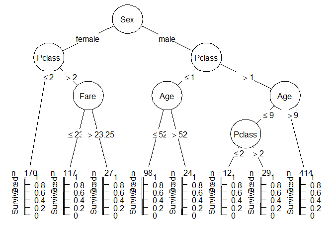

<style type="text/css"> 
body{
  font-size: 12pt;
}
code.r{
  font-size: 12pt;
}
</style>


<br/>
<br/>

# R ile Sınıflandırma Ağaçları
 
`R`'da ağaç tahmini için çok sayıda paket vardır. Bunlardan biri hem regresyon hem de sınıflama ağaçlarının tahminini yapan `tree` paketidir. Burada örnek olarak  `Carseats` veri setini kullanacağız. `Sales` değişkeni 8 değeri kullanılarak ikili kategorik değişkene dönüştürülmüştür: 

```r
library(tree)
library(ISLR)
attach(Carseats)
High <- ifelse(Sales<=8, "No", "Yes")
Carseats <- data.frame(Carseats, High)
```

`High` Satışlar 8'den büyükse "Yes" (1) değilse "No" (0) değerini almaktadır. 

`Sales` değişkenini dışlayarak diğer tüm değişkenlerle `High` için bir ağaç tahmin edelim: 

```r
tree.carseats <- tree(High ~ . -Sales, data = Carseats)
summary(tree.carseats) 
```

```
## 
## Classification tree:
## tree(formula = High ~ . - Sales, data = Carseats)
## Variables actually used in tree construction:
## [1] "ShelveLoc"   "Price"       "Income"      "CompPrice"   "Population" 
## [6] "Advertising" "Age"         "US"         
## Number of terminal nodes:  27 
## Residual mean deviance:  0.4575 = 170.7 / 373 
## Misclassification error rate: 0.09 = 36 / 400
```

Eğitim hata oranı %9 olarak bulunmuştur (misclassification error rate).

Tahmin edilen ağacın yaprak sayısı 27'dir (terminal node): 

```r
plot(tree.carseats)
text(tree.carseats, pretty=0)
```

<!-- -->

Satışların yüksekliğni etkileyen en önemli değişken raf yeridir (`ShelveLoc`, **B**ad, **G**ood, **M**edium). İlk düğümde Kötü ve Orta kalitedeki raf lokasyonları İyi raf lokasyonundan ayrılmaktadır. 

Ağacın tüm detayları: 

```r
tree.carseats
```

```
## node), split, n, deviance, yval, (yprob)
##       * denotes terminal node
## 
##   1) root 400 541.500 No ( 0.59000 0.41000 )  
##     2) ShelveLoc: Bad,Medium 315 390.600 No ( 0.68889 0.31111 )  
##       4) Price < 92.5 46  56.530 Yes ( 0.30435 0.69565 )  
##         8) Income < 57 10  12.220 No ( 0.70000 0.30000 )  
##          16) CompPrice < 110.5 5   0.000 No ( 1.00000 0.00000 ) *
##          17) CompPrice > 110.5 5   6.730 Yes ( 0.40000 0.60000 ) *
##         9) Income > 57 36  35.470 Yes ( 0.19444 0.80556 )  
##          18) Population < 207.5 16  21.170 Yes ( 0.37500 0.62500 ) *
##          19) Population > 207.5 20   7.941 Yes ( 0.05000 0.95000 ) *
##       5) Price > 92.5 269 299.800 No ( 0.75465 0.24535 )  
##        10) Advertising < 13.5 224 213.200 No ( 0.81696 0.18304 )  
##          20) CompPrice < 124.5 96  44.890 No ( 0.93750 0.06250 )  
##            40) Price < 106.5 38  33.150 No ( 0.84211 0.15789 )  
##              80) Population < 177 12  16.300 No ( 0.58333 0.41667 )  
##               160) Income < 60.5 6   0.000 No ( 1.00000 0.00000 ) *
##               161) Income > 60.5 6   5.407 Yes ( 0.16667 0.83333 ) *
##              81) Population > 177 26   8.477 No ( 0.96154 0.03846 ) *
##            41) Price > 106.5 58   0.000 No ( 1.00000 0.00000 ) *
##          21) CompPrice > 124.5 128 150.200 No ( 0.72656 0.27344 )  
##            42) Price < 122.5 51  70.680 Yes ( 0.49020 0.50980 )  
##              84) ShelveLoc: Bad 11   6.702 No ( 0.90909 0.09091 ) *
##              85) ShelveLoc: Medium 40  52.930 Yes ( 0.37500 0.62500 )  
##               170) Price < 109.5 16   7.481 Yes ( 0.06250 0.93750 ) *
##               171) Price > 109.5 24  32.600 No ( 0.58333 0.41667 )  
##                 342) Age < 49.5 13  16.050 Yes ( 0.30769 0.69231 ) *
##                 343) Age > 49.5 11   6.702 No ( 0.90909 0.09091 ) *
##            43) Price > 122.5 77  55.540 No ( 0.88312 0.11688 )  
##              86) CompPrice < 147.5 58  17.400 No ( 0.96552 0.03448 ) *
##              87) CompPrice > 147.5 19  25.010 No ( 0.63158 0.36842 )  
##               174) Price < 147 12  16.300 Yes ( 0.41667 0.58333 )  
##                 348) CompPrice < 152.5 7   5.742 Yes ( 0.14286 0.85714 ) *
##                 349) CompPrice > 152.5 5   5.004 No ( 0.80000 0.20000 ) *
##               175) Price > 147 7   0.000 No ( 1.00000 0.00000 ) *
##        11) Advertising > 13.5 45  61.830 Yes ( 0.44444 0.55556 )  
##          22) Age < 54.5 25  25.020 Yes ( 0.20000 0.80000 )  
##            44) CompPrice < 130.5 14  18.250 Yes ( 0.35714 0.64286 )  
##              88) Income < 100 9  12.370 No ( 0.55556 0.44444 ) *
##              89) Income > 100 5   0.000 Yes ( 0.00000 1.00000 ) *
##            45) CompPrice > 130.5 11   0.000 Yes ( 0.00000 1.00000 ) *
##          23) Age > 54.5 20  22.490 No ( 0.75000 0.25000 )  
##            46) CompPrice < 122.5 10   0.000 No ( 1.00000 0.00000 ) *
##            47) CompPrice > 122.5 10  13.860 No ( 0.50000 0.50000 )  
##              94) Price < 125 5   0.000 Yes ( 0.00000 1.00000 ) *
##              95) Price > 125 5   0.000 No ( 1.00000 0.00000 ) *
##     3) ShelveLoc: Good 85  90.330 Yes ( 0.22353 0.77647 )  
##       6) Price < 135 68  49.260 Yes ( 0.11765 0.88235 )  
##        12) US: No 17  22.070 Yes ( 0.35294 0.64706 )  
##          24) Price < 109 8   0.000 Yes ( 0.00000 1.00000 ) *
##          25) Price > 109 9  11.460 No ( 0.66667 0.33333 ) *
##        13) US: Yes 51  16.880 Yes ( 0.03922 0.96078 ) *
##       7) Price > 135 17  22.070 No ( 0.64706 0.35294 )  
##        14) Income < 46 6   0.000 No ( 1.00000 0.00000 ) *
##        15) Income > 46 11  15.160 Yes ( 0.45455 0.54545 ) *
```


Test hata oranı: 

```r
set.seed(2)
train <- sample(1:nrow(Carseats), 200)
Carseats.test <- Carseats[-train,]
High.test <- High[-train]
tree.carseats <- tree(High ~ . -Sales, Carseats, subset = train)
tree.pred <- predict(tree.carseats, Carseats.test, type="class")
table(tree.pred, High.test)
```

```
##          High.test
## tree.pred  No Yes
##       No  104  33
##       Yes  13  50
```


```r
# correct prediction rate
(104+50)/200
```

```
## [1] 0.77
```

Ağacın çapraz geçerleme ile budanması,  `cv.tree()` fonksiyonu: 

```r
set.seed(11)
cv.carseats <- cv.tree(tree.carseats, FUN=prune.misclass)
names(cv.carseats)
```

```
## [1] "size"   "dev"    "k"      "method"
```

```r
cv.carseats
```

```
## $size
## [1] 21 19 14  9  8  5  3  2  1
## 
## $dev
## [1] 79 79 77 76 74 75 79 76 82
## 
## $k
## [1] -Inf  0.0  1.0  1.4  2.0  3.0  4.0  9.0 18.0
## 
## $method
## [1] "misclass"
## 
## attr(,"class")
## [1] "prune"         "tree.sequence"
```

Yukarıdaki çıktıda, `dev` çapraz geçerleme hatasını, `k` ayarlama parametresi $\alpha$'yı ve `size` ağacın büyüklüğünü (terminal düğüm sayısı) göstermektedir. En küçük çapraz geçerleme hatası 74'dür ve yaprak sayısı 8 olan bir ağaca karşılık gelmektedir.  

Ağaç büyüklüğü ve k (cost-complexity parameter)'ye göre hata oranının grafikleri: 

```r
par(mfrow=c(1,2))
plot(cv.carseats$size, cv.carseats$dev, type="b")
plot(cv.carseats$k, cv.carseats$dev, type="b")
```

<!-- -->

Şimde `prune.misclass()` fonksiyonunu kullanarak ağacı budayabiliriz: 

```r
prune.carseats <- prune.misclass(tree.carseats, best=8)
plot(prune.carseats)
text(prune.carseats, pretty=0)
```

<!-- -->

Not: kitapta 9 yapraklı bir ağaç tahmin edilmiştir: 

```r
prune.carseats <- prune.misclass(tree.carseats, best=9)
plot(prune.carseats)
text(prune.carseats,pretty=0)
```

<!-- -->

Budanmış ağacın kestirim performansı nasıldır? `predict()` fonksiyonuyla sınıflandırma hatasını tahmin edelim:

```r
tree.pred <- predict(prune.carseats, Carseats.test, type="class")
table(tree.pred, High.test)
```

```
##          High.test
## tree.pred No Yes
##       No  97  25
##       Yes 20  58
```

```r
(97+58)/200
```

```
## [1] 0.775
```

<br/>

# R ile Regresyon Ağaçları

Örnek olarak `MASS` paketinde yer alan `Boston` ev fiyatları verisini kullanacağız. Bağımlı değişken medyan ev fiyatları (`medv`). Eğitim verilerinde ağaç tahmini: 

```r
library(MASS)
set.seed(81)
train <- sample(1:nrow(Boston), nrow(Boston)/2)
tree.boston <- tree(medv ~ ., Boston, subset = train)
summary(tree.boston)
```

```
## 
## Regression tree:
## tree(formula = medv ~ ., data = Boston, subset = train)
## Variables actually used in tree construction:
## [1] "lstat" "rm"    "age"   "nox"   "crim" 
## Number of terminal nodes:  8 
## Residual mean deviance:  14.56 = 3568 / 245 
## Distribution of residuals:
##     Min.  1st Qu.   Median     Mean  3rd Qu.     Max. 
## -14.5300  -1.7920  -0.1923   0.0000   1.9080  12.1700
```

Yukarıdaki çıktıya göre ağaçta 4 değişken year alıyor: "rm"    "lstat" "crim"  "age"  


```r
plot(tree.boston)
text(tree.boston, pretty=0)
```

<!-- -->

`lstat`: sosyoekonomik statüsü düşük olan hanelerin oranı. Bu değişkenin düşük olduğu yerlerde evler daha pahalıdır. 


Ağacın budanması: 

```r
cv.boston <- cv.tree(tree.boston)
plot(cv.boston$size, cv.boston$dev, type='b')
```

<!-- -->

Çapraz geçerleme en karmaşık ağacı seçti. Yine de ağacı budamak istersek `prune.tree()` fonksiyonunu kullanabiliriz:

```r
prune.boston <- prune.tree(tree.boston, best=5)
plot(prune.boston)
text(prune.boston, pretty=0)
```

<!-- -->

Budanmamış ağaç üzerinden test hatasının tahmini: 

```r
yhat <- predict(tree.boston, newdata = Boston[-train,])
boston.test <- Boston[-train, "medv"]
plot(yhat,boston.test)
abline(0,1)
```

<!-- -->

```r
mean((yhat-boston.test)^2)
```

```
## [1] 18.92867
```
Test MSE = 18.93.  


<br/>

# Bagging ve Rassal Ormanlar 

Örnek veri seti = `Boston`. Bagging ve rassal ormanlar için R `randomForest` 
paketi kullanılabilir. Bagging rassal ormanların özel bir haliydi (m = p). Bagging tahmini: 

```r
library(randomForest)
```

```
## randomForest 4.6-14
```

```
## Type rfNews() to see new features/changes/bug fixes.
```

```r
set.seed(1)
bag.boston <- randomForest(medv ~ ., data = Boston, subset=train, mtry=13, importance=TRUE)
bag.boston
```

```
## 
## Call:
##  randomForest(formula = medv ~ ., data = Boston, mtry = 13, importance = TRUE,      subset = train) 
##                Type of random forest: regression
##                      Number of trees: 500
## No. of variables tried at each split: 13
## 
##           Mean of squared residuals: 12.05315
##                     % Var explained: 85.87
```

`mtry=13` opsiyonu: 13 değişkenin tamamı her ayırımda dikkate alınacak (bagging). Modelin test setindeki performansı: 

```r
yhat.bag <- predict(bag.boston, newdata = Boston[-train,])
plot(yhat.bag, boston.test)
abline(0,1)
```

<!-- -->

```r
mean((yhat.bag-boston.test)^2)
```

```
## [1] 10.13872
```

Test MSE = 10.13872. 

`randomForest()` fonksiyonunda `ntree` opsiyonu ile ağacın büyüklüğünü değiştirebiliriz:

```r
bag.boston <- randomForest(medv ~ ., data = Boston, subset = train, mtry=13, ntree=25)
yhat.bag <- predict(bag.boston, newdata=Boston[-train,])
mean((yhat.bag-boston.test)^2)
```

```
## [1] 10.39242
```

Rassal orman tahmini de benzer adımalara sahiptir. Ancak bu durumda daha küçük bir `mtry` değeri kullanırız. Default olarak `randomForest()` fonksiyonu $p/3$ değişkeni kullanır (sınıflama için 
$\sqrt{p}$). Aşağıda `mtry = 6` kullanılmıştır: 

```r
set.seed(1)
rf.boston <- randomForest(medv ~ ., data=Boston, subset=train, mtry=6, importance=TRUE)
yhat.rf <- predict(rf.boston, newdata=Boston[-train,])
mean((yhat.rf-boston.test)^2)
```

```
## [1] 10.09993
```

Rassal ormanlar küçük de olsa daha iyi bir test başarısı sergiledi. 

`importance()` fonksiyonunu kullanarak her bir değişkenin önem düzeyini görebiliriz:

```r
importance(rf.boston)
```

```
##           %IncMSE IncNodePurity
## crim    12.369627    1181.71107
## zn       1.989412      39.94276
## indus    8.207374     647.08437
## chas     1.969458      94.36769
## nox     16.087308     970.88334
## rm      32.320815    6515.37020
## age      9.266499     512.38643
## dis     15.564389    1630.27794
## rad      5.241457     131.56836
## tax      8.947064     546.01280
## ptratio 10.734024     997.05756
## black    6.323236     352.36805
## lstat   28.364019    7465.77705
```


```r
varImpPlot(rf.boston)
```

<!-- -->

Sonuçlara göre bölgenin refah düzeyi (`lstat`) ve ev büyüklüğü (`rm`) en önemli değişkenlerdir. 

<br/>

# Boosting 

Boosting (takviye) yöntemi için `gbm` paketindeki `gbm()` fonksiyonu kullanılabilir. Örnek olarak `Boston` veri seti için bir takviyeli ağaç tahmin edelim. Bunun için  `gbm()` fonksiyonunu `distribution="gaussian"` opsiyonu ile çalıştıracağız (regresyon problemi olduğu için). İkili sınıflama problemleri için `distribution="bernoulli"` kullanılabilir. `n.trees=5000` opsiyonu 5000 ağaç oluşturulacağını, `interaction.depth=4` her ağacın derinliğini belirtmektedir.  

```r
library(gbm)
```

```
## Loaded gbm 2.1.5
```

```r
set.seed(1)
boost.boston <- gbm(medv ~ ., data = Boston[train,], distribution = "gaussian",
                    n.trees = 5000, interaction.depth=4)
summary(boost.boston)
```

<!-- -->

```
##             var    rel.inf
## lstat     lstat 42.9729659
## rm           rm 22.0225424
## dis         dis 13.1314477
## crim       crim  6.2420764
## black     black  3.9156354
## nox         nox  3.5390219
## age         age  2.6260975
## tax         tax  1.8299595
## ptratio ptratio  1.4497597
## chas       chas  0.8610829
## indus     indus  0.7704732
## rad         rad  0.5056271
## zn           zn  0.1333104
```

Yukarıda `summary()` fonksiyonu her bir değişken için göreceli etki istatistiklerini ve grafiğini vermektedir. Buna göre, önceki sonuçlarla uyumlu olarak, `lstat` ve `rm` en önemli değişkenlerdir. 

Buna ek olarak değişkenlerin kısmi etkilerini de görselleştirebiliriz:

```r
par(mfrow=c(1,2))
plot(boost.boston,i="rm")
```

<!-- -->

```r
plot(boost.boston,i="lstat")
```

<!-- -->

Kısmi bağımlılık grafikleri diğer değişkenlerin etkisi arındırıldıktan sonra bir değişkenin çıktı üzerindeki marjinal etkisini göstermektedir. Buna göre medyan ev fiyatları `rm`'ye göre artarken, `lstat` değişkenine göre azalmaktadır. 

Şimdi takviyeli (boosted) ağaç modeline göre `medv` değişkenini test verisinde tahmin edelim

```r
yhat.boost <- predict(boost.boston, newdata=Boston[-train,], n.trees=5000)
mean((yhat.boost-boston.test)^2)
```

```
## [1] 11.04542
```

Yukarıda default $\lambda = 0.001$ (küçültme, shrinkage) parametresi kullanıldı. $\lambda=0.2$ için yeniden tahmin edelim: 

```r
boost.boston <- gbm(medv ~ ., data = Boston[train,],
                    distribution = "gaussian", n.trees=5000,
                    interaction.depth = 4, shrinkage = 0.2, verbose=F)
yhat.boost <- predict(boost.boston, newdata=Boston[-train,], n.trees=5000)
mean((yhat.boost-boston.test)^2)
```

```
## [1] 12.10757
```

Bu durumda MSE daha yüksek çıkmıştır. 

<br/>

# Örnek: Titanic 

Bu örnekte Titanic kazasında hayatını kaybedenler için bir sınıflandırma ağacı oluşturmaya çalışacağız (detaylar için bkz. [RMS Titanic](https://en.wikipedia.org/wiki/RMS_Titanic) ). Bu trajik kaza çok fazla kişinin ölümü ile sonuçlanmıştır. Böyle kazaların tekrar yaşanmaması için çok sayıda güvenlik tedbirlerinin alınmasında ve yasal düzenleme yapılmasında etkili olmuştur. 

Sorular: acaba bu kadar kişinin ölümünün ardındaki nedenler nelerdir? Hangi değişkenler bireyin hayatta kalma olasılığı üzerinde önemli bir etkiye sahiptir?

Önce verileri `R`'a tanıtalım: 

```r
library(tidyverse)
```

```
## Registered S3 method overwritten by 'cli':
##   method     from
##   print.tree tree
```

```
## -- Attaching packages ----------------------------------------------- tidyverse 1.3.0 --
```

```
## <U+221A> ggplot2 3.3.0     <U+221A> purrr   0.3.3
## <U+221A> tibble  3.0.1     <U+221A> dplyr   0.8.5
## <U+221A> tidyr   1.0.0     <U+221A> stringr 1.4.0
## <U+221A> readr   1.3.1     <U+221A> forcats 0.4.0
```

```
## -- Conflicts -------------------------------------------------- tidyverse_conflicts() --
## x dplyr::combine()  masks randomForest::combine()
## x dplyr::filter()   masks stats::filter()
## x dplyr::lag()      masks stats::lag()
## x ggplot2::margin() masks randomForest::margin()
## x dplyr::select()   masks MASS::select()
```

```r
library(modelr)
library(broom)
```

```
## 
## Attaching package: 'broom'
```

```
## The following object is masked from 'package:modelr':
## 
##     bootstrap
```

```r
set.seed(1234)

theme_set(theme_minimal())

library(titanic)
# use the training data 
titanic <- titanic_train %>%
  as_tibble()

titanic %>%
  head() %>%
  knitr::kable()
```


 PassengerId   Survived   Pclass  Name                                                  Sex       Age   SibSp   Parch  Ticket                 Fare  Cabin   Embarked 
------------  ---------  -------  ----------------------------------------------------  -------  ----  ------  ------  -----------------  --------  ------  ---------
           1          0        3  Braund, Mr. Owen Harris                               male       22       1       0  A/5 21171            7.2500          S        
           2          1        1  Cumings, Mrs. John Bradley (Florence Briggs Thayer)   female     38       1       0  PC 17599            71.2833  C85     C        
           3          1        3  Heikkinen, Miss. Laina                                female     26       0       0  STON/O2. 3101282     7.9250          S        
           4          1        1  Futrelle, Mrs. Jacques Heath (Lily May Peel)          female     35       1       0  113803              53.1000  C123    S        
           5          0        3  Allen, Mr. William Henry                              male       35       0       0  373450               8.0500          S        
           6          0        3  Moran, Mr. James                                      male       NA       0       0  330877               8.4583          Q        


Çıktı değişkenini oluştur: 

```r
titanic_tree_data <- titanic %>%
  mutate(Survived = if_else(Survived == 1, "Survived", "Died"),
         Survived = as.factor(Survived),
         Sex = as.factor(Sex))
titanic_tree_data
```

```
## # A tibble: 891 x 12
##    PassengerId Survived Pclass Name  Sex     Age SibSp Parch Ticket  Fare Cabin
##          <int> <fct>     <int> <chr> <fct> <dbl> <int> <int> <chr>  <dbl> <chr>
##  1           1 Died          3 Brau~ male     22     1     0 A/5 2~  7.25 ""   
##  2           2 Survived      1 Cumi~ fema~    38     1     0 PC 17~ 71.3  "C85"
##  3           3 Survived      3 Heik~ fema~    26     0     0 STON/~  7.92 ""   
##  4           4 Survived      1 Futr~ fema~    35     1     0 113803 53.1  "C12~
##  5           5 Died          3 Alle~ male     35     0     0 373450  8.05 ""   
##  6           6 Died          3 Mora~ male     NA     0     0 330877  8.46 ""   
##  7           7 Died          1 McCa~ male     54     0     0 17463  51.9  "E46"
##  8           8 Died          3 Pals~ male      2     3     1 349909 21.1  ""   
##  9           9 Survived      3 John~ fema~    27     0     2 347742 11.1  ""   
## 10          10 Survived      2 Nass~ fema~    14     1     0 237736 30.1  ""   
## # ... with 881 more rows, and 1 more variable: Embarked <chr>
```

```r
table(titanic_tree_data$Survived)
```

```
## 
##     Died Survived 
##      549      342
```

Sadece  `age` ve `sex` özniteliklerini kullanarak küçük bir ağaç tahmin edelim. Bunun için `partykit` paketini kullanacağız: 

```r
library(partykit)
```

```
## Loading required package: grid
```

```
## Loading required package: libcoin
```

```
## Loading required package: mvtnorm
```

```r
titanic_tree <- ctree(Survived ~ Age + Sex, data = titanic_tree_data)
titanic_tree
```

```
## 
## Model formula:
## Survived ~ Age + Sex
## 
## Fitted party:
## [1] root
## |   [2] Sex in female: Survived (n = 314, err = 25.8%)
## |   [3] Sex in male
## |   |   [4] Age <= 6: Survived (n = 35, err = 48.6%)
## |   |   [5] Age > 6: Died (n = 542, err = 16.8%)
## 
## Number of inner nodes:    2
## Number of terminal nodes: 3
```

Oluşturduğumuz ağaç 3 son düğüme (yaprak) ve 2 iç düğüme sahiptir. Ağacın görselleştirilmesi: 

```r
plot(titanic_tree)
```

<!-- -->

Sınıflandırma hatası: 

```r
# compute predicted values
pred1 <- predict(titanic_tree) 
# true classifications
predsuccess1 <- (pred1 == titanic_tree_data$Survived)
# wrong classifications
prederror1 <- !predsuccess1
# average misclassification rate: 
mean(prederror1, na.rm = TRUE)
```

```
## [1] 0.2121212
```

```r
# or just in one line: 
# 1 - mean(predict(titanic_tree) == titanic_tree_data$Survived, na.rm = TRUE)
```

Bu basit ağaçla bile hata oranı yaklaşık % 21. 

Veri setinde yer alan diğer öznitelikleri de kullanarak daha karmaşık bir ağaç tahmin edelim. Önce karakter değişkenleri faktör değişkenine dönüştürelim: 

```r
titanic_tree_full_data <- titanic %>%
  mutate(Survived = if_else(Survived == 1, "Survived",
                            if_else(Survived == 0, "Died", NA_character_))) %>%
  mutate_if(is.character, as.factor)
```

Ağacı tahmin et:  

```r
titanic_tree_full <- ctree(Survived ~ Pclass + Sex + Age + SibSp +
                             Parch + Fare + Embarked,
                           data = titanic_tree_full_data)
titanic_tree_full
```

```
## 
## Model formula:
## Survived ~ Pclass + Sex + Age + SibSp + Parch + Fare + Embarked
## 
## Fitted party:
## [1] root
## |   [2] Sex in female
## |   |   [3] Pclass <= 2: Survived (n = 170, err = 5.3%)
## |   |   [4] Pclass > 2
## |   |   |   [5] Fare <= 23.25: Survived (n = 117, err = 41.0%)
## |   |   |   [6] Fare > 23.25: Died (n = 27, err = 11.1%)
## |   [7] Sex in male
## |   |   [8] Pclass <= 1
## |   |   |   [9] Age <= 52: Died (n = 98, err = 41.8%)
## |   |   |   [10] Age > 52: Died (n = 24, err = 16.7%)
## |   |   [11] Pclass > 1
## |   |   |   [12] Age <= 9
## |   |   |   |   [13] Pclass <= 2: Survived (n = 12, err = 25.0%)
## |   |   |   |   [14] Pclass > 2: Died (n = 29, err = 31.0%)
## |   |   |   [15] Age > 9: Died (n = 414, err = 11.1%)
## 
## Number of inner nodes:    7
## Number of terminal nodes: 8
```


```r
plot(titanic_tree_full,  ip_args = list(pval = FALSE, id = FALSE),
     tp_args = list( id = FALSE) )
```

<!-- -->

Hata oranı: 

```r
# error rate
1 - mean(predict(titanic_tree_full) == titanic_tree_data$Survived,
         na.rm = TRUE)
```

```
## [1] 0.1829405
```

Hata oranı daha da düştü, %18.3. 


Şimdi `caret` paketini kullanarak bir rassal orman tahmin edelim. Bunun için  `caret::train()` fonksiyonunu kullanacağız:  

```r
# drop the NA obs.
titanic_rf_data <- titanic_tree_full_data %>%
  select(Survived, Pclass, Sex, Age, SibSp, Parch, Fare, Embarked) %>%
  drop_na()
titanic_rf_data
```

```
## # A tibble: 714 x 8
##    Survived Pclass Sex      Age SibSp Parch  Fare Embarked
##    <fct>     <int> <fct>  <dbl> <int> <int> <dbl> <fct>   
##  1 Died          3 male      22     1     0  7.25 S       
##  2 Survived      1 female    38     1     0 71.3  C       
##  3 Survived      3 female    26     0     0  7.92 S       
##  4 Survived      1 female    35     1     0 53.1  S       
##  5 Died          3 male      35     0     0  8.05 S       
##  6 Died          1 male      54     0     0 51.9  S       
##  7 Died          3 male       2     3     1 21.1  S       
##  8 Survived      3 female    27     0     2 11.1  S       
##  9 Survived      2 female    14     1     0 30.1  C       
## 10 Survived      3 female     4     1     1 16.7  S       
## # ... with 704 more rows
```


```r
# build a random forest with ntree=200
library(caret)
```

```
## Loading required package: lattice
```

```
## 
## Attaching package: 'caret'
```

```
## The following object is masked from 'package:purrr':
## 
##     lift
```

```r
titanic_rf <- train(Survived ~ ., data = titanic_rf_data,
                    method = "rf",
                    ntree = 200,
                    trControl = trainControl(method = "oob"))
titanic_rf
```

```
## Random Forest 
## 
## 714 samples
##   7 predictor
##   2 classes: 'Died', 'Survived' 
## 
## No pre-processing
## Resampling results across tuning parameters:
## 
##   mtry  Accuracy   Kappa    
##   2     0.8123249  0.5968889
##   5     0.8053221  0.5926564
##   9     0.7927171  0.5679450
## 
## Accuracy was used to select the optimal model using the largest value.
## The final value used for the model was mtry = 2.
```


```r
str(titanic_rf, max.level = 1)
# Info on the final model: 
titanic_rf$finalModel
```

```
## List of 24
##  $ method      : chr "rf"
##  $ modelInfo   :List of 15
##  $ modelType   : chr "Classification"
##  $ results     :'data.frame':	3 obs. of  3 variables:
##  $ pred        : NULL
##  $ bestTune    :'data.frame':	1 obs. of  1 variable:
##  $ call        : language train.formula(form = Survived ~ ., data = titanic_rf_data, method = "rf",      ntree = 200, trControl = trainCont| __truncated__
##  $ dots        :List of 1
##  $ metric      : chr "Accuracy"
##  $ control     :List of 26
##  $ finalModel  :List of 23
##   ..- attr(*, "class")= chr "randomForest"
##  $ preProcess  : NULL
##  $ trainingData: tibble [714 x 8] (S3: tbl_df/tbl/data.frame)
##  $ resample    : NULL
##  $ resampledCM : NULL
##  $ perfNames   : chr [1:2] "Accuracy" "Kappa"
##  $ maximize    : logi TRUE
##  $ yLimits     : NULL
##  $ times       :List of 3
##  $ levels      : chr [1:2] "Died" "Survived"
##   ..- attr(*, "ordered")= logi FALSE
##  $ terms       :Classes 'terms', 'formula'  language Survived ~ Pclass + Sex + Age + SibSp + Parch + Fare + Embarked
##   .. ..- attr(*, "variables")= language list(Survived, Pclass, Sex, Age, SibSp, Parch, Fare, Embarked)
##   .. ..- attr(*, "factors")= int [1:8, 1:7] 0 1 0 0 0 0 0 0 0 0 ...
##   .. .. ..- attr(*, "dimnames")=List of 2
##   .. ..- attr(*, "term.labels")= chr [1:7] "Pclass" "Sex" "Age" "SibSp" ...
##   .. ..- attr(*, "order")= int [1:7] 1 1 1 1 1 1 1
##   .. ..- attr(*, "intercept")= int 1
##   .. ..- attr(*, "response")= int 1
##   .. ..- attr(*, ".Environment")=<environment: R_GlobalEnv> 
##   .. ..- attr(*, "predvars")= language list(Survived, Pclass, Sex, Age, SibSp, Parch, Fare, Embarked)
##   .. ..- attr(*, "dataClasses")= Named chr [1:8] "factor" "numeric" "factor" "numeric" ...
##   .. .. ..- attr(*, "names")= chr [1:8] "Survived" "Pclass" "Sex" "Age" ...
##  $ coefnames   : chr [1:9] "Pclass" "Sexmale" "Age" "SibSp" ...
##  $ contrasts   :List of 2
##  $ xlevels     :List of 2
##  - attr(*, "class")= chr [1:2] "train" "train.formula"
## 
## Call:
##  randomForest(x = x, y = y, ntree = 200, mtry = param$mtry) 
##                Type of random forest: classification
##                      Number of trees: 200
## No. of variables tried at each split: 2
## 
##         OOB estimate of  error rate: 18.21%
## Confusion matrix:
##          Died Survived class.error
## Died      390       34  0.08018868
## Survived   96      194  0.33103448
```


```r
# confusion table 
knitr::kable(titanic_rf$finalModel$confusion)
```

            Died   Survived   class.error
---------  -----  ---------  ------------
Died         390         34     0.0801887
Survived      96        194     0.3310345


```r
# look at an individual tree
randomForest::getTree(titanic_rf$finalModel, labelVar = TRUE)
```

```
##    left daughter right daughter split var split point status prediction
## 1              2              3 EmbarkedS     0.50000      1       <NA>
## 2              4              5   Sexmale     0.50000      1       <NA>
## 3              6              7   Sexmale     0.50000      1       <NA>
## 4              8              9 EmbarkedQ     0.50000      1       <NA>
## 5             10             11    Pclass     1.50000      1       <NA>
## 6             12             13    Pclass     2.50000      1       <NA>
## 7             14             15    Pclass     1.50000      1       <NA>
## 8              0              0      <NA>     0.00000     -1   Survived
## 9             16             17    Pclass     2.50000      1       <NA>
## 10            18             19      Fare    28.12500      1       <NA>
## 11            20             21       Age     1.50000      1       <NA>
## 12             0              0      <NA>     0.00000     -1   Survived
## 13            22             23     SibSp     0.50000      1       <NA>
## 14            24             25     SibSp     2.00000      1       <NA>
## 15            26             27       Age     9.50000      1       <NA>
## 16             0              0      <NA>     0.00000     -1   Survived
## 17            28             29      Fare    11.76460      1       <NA>
## 18             0              0      <NA>     0.00000     -1   Survived
## 19            30             31     Parch     1.50000      1       <NA>
## 20             0              0      <NA>     0.00000     -1   Survived
## 21            32             33 EmbarkedC     0.50000      1       <NA>
## 22            34             35     Parch     3.50000      1       <NA>
## 23            36             37     Parch     1.50000      1       <NA>
## 24            38             39       Age    28.50000      1       <NA>
## 25             0              0      <NA>     0.00000     -1       Died
## 26            40             41     SibSp     2.50000      1       <NA>
## 27            42             43       Age    17.50000      1       <NA>
## 28             0              0      <NA>     0.00000     -1   Survived
## 29             0              0      <NA>     0.00000     -1       Died
## 30            44             45     SibSp     0.50000      1       <NA>
## 31            46             47      Fare   161.19165      1       <NA>
## 32             0              0      <NA>     0.00000     -1       Died
## 33            48             49     SibSp     0.50000      1       <NA>
## 34            50             51       Age    27.50000      1       <NA>
## 35             0              0      <NA>     0.00000     -1       Died
## 36            52             53     Parch     0.50000      1       <NA>
## 37            54             55      Fare    31.33125      1       <NA>
## 38             0              0      <NA>     0.00000     -1   Survived
## 39             0              0      <NA>     0.00000     -1       Died
## 40             0              0      <NA>     0.00000     -1   Survived
## 41             0              0      <NA>     0.00000     -1       Died
## 42             0              0      <NA>     0.00000     -1       Died
## 43             0              0      <NA>     0.00000     -1       Died
## 44            56             57       Age    45.50000      1       <NA>
## 45            58             59       Age    55.00000      1       <NA>
## 46             0              0      <NA>     0.00000     -1   Survived
## 47             0              0      <NA>     0.00000     -1       Died
## 48             0              0      <NA>     0.00000     -1       Died
## 49             0              0      <NA>     0.00000     -1       Died
## 50             0              0      <NA>     0.00000     -1   Survived
## 51             0              0      <NA>     0.00000     -1       Died
## 52            60             61     SibSp     2.50000      1       <NA>
## 53            62             63       Age     4.50000      1       <NA>
## 54             0              0      <NA>     0.00000     -1       Died
## 55            64             65      Fare    32.88125      1       <NA>
## 56             0              0      <NA>     0.00000     -1   Survived
## 57             0              0      <NA>     0.00000     -1       Died
## 58            66             67       Age    21.50000      1       <NA>
## 59             0              0      <NA>     0.00000     -1   Survived
## 60             0              0      <NA>     0.00000     -1       Died
## 61             0              0      <NA>     0.00000     -1   Survived
## 62             0              0      <NA>     0.00000     -1   Survived
## 63             0              0      <NA>     0.00000     -1       Died
## 64             0              0      <NA>     0.00000     -1   Survived
## 65             0              0      <NA>     0.00000     -1       Died
## 66             0              0      <NA>     0.00000     -1       Died
## 67             0              0      <NA>     0.00000     -1       Died
```


```r
# var importance plot 
randomForest::varImpPlot(titanic_rf$finalModel)
```

<!-- -->


