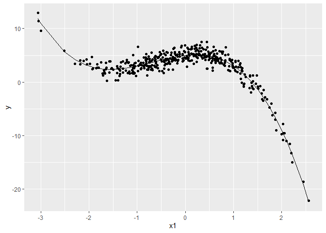

<style type="text/css"> 
body{
  font-size: 12pt;
}
code.r{
  font-size: 12pt;
}
</style>


<br/>
<br/>


# Ridge Regresyonu 

`glmnet` paketiyle Ridge ve LASSO modelleri tahmin edilebilir. Bu paketteki temel fonksiyon olan  `glmnet()` sadece vektör ve matrisleri girdi olarak kabul etmektedir. Bu nedenle şimdiye kadar kullandığımız `y ~ x` regresyon modeli yapısını kullanmayacağız. Önce çıktı değişkenini içeren bir `y` vektörü ve kestirim değişkenlerini içeren bir `x` matrisi oluşturacağız. Verilerde eğer varsa kayıp gözlemler silinmelidir. `x` ve `y`'nin oluşturulmasında `model.matrix()` fonksiyonu kullanılabilir. Örnek olarak `Credit` verilerinde `Balance` değişkeni için bir doğrusal regresyon modeli kurmak istediğimizi düşünelim:  

```r
library(ISLR)
```

```
## Warning: package 'ISLR' was built under R version 3.6.3
```

```r
x <- model.matrix(Balance ~ . -ID, Credit)[,-1]
y <- Credit$Balance 
```


`x` matrisi birler sütununu içermez:  

```r
head(x) 
```

```
##    Income Limit Rating Cards Age Education GenderFemale StudentYes
## 1  14.891  3606    283     2  34        11            0          0
## 2 106.025  6645    483     3  82        15            1          1
## 3 104.593  7075    514     4  71        11            0          0
## 4 148.924  9504    681     3  36        11            1          0
## 5  55.882  4897    357     2  68        16            0          0
## 6  80.180  8047    569     4  77        10            0          0
##   MarriedYes EthnicityAsian EthnicityCaucasian
## 1          1              0                  1
## 2          1              1                  0
## 3          0              1                  0
## 4          0              1                  0
## 5          1              0                  1
## 6          0              0                  1
```

`model.matrix()` fonksiyonu kategorik değişkenleri otomatik olarak kukla değişkenlere dönüştürmektedir. `glmnet()` sadece nicel değişkenleri girdi olarak kabul eder. 

`glmnet()` fonksiyonunun üçünca girdisi, `alpha`, hangi modelin tahmin edileceğini belirler. Ridge regresyonu için `alpha=0`, LASSO için `alpha=1` değeri girilmelidir. 

Ridge modelini tahmin edelim:

```r
library(glmnet)
```

```
## Loading required package: Matrix
```

```
## Loaded glmnet 4.0-2
```

```r
grid <- 10^seq(10,-2,length=100)
ridge.mod <- glmnet(x, y, alpha=0, lambda=grid)
```

Ayarlama parametresi $\lambda$ $\lambda=10^{10}$ ile  
$\lambda=10^{-2}$ arasında değerler almaktadır (isenirse default değerler de kullanılabilir). Bu grid değerleri tüm olanaklı modelleri kapsamaktadır. `glmnet()` değişkenleri otomatik olarak standardize eder. 

Her bir $\lambda$ değeri için elimizde bir katsayı kümesi vardır: 

```r
dim(coef(ridge.mod)) 
```

```
## [1]  12 100
```

Örneğimizde her bir değişkene karşılık gelen 11 model ve hiç bir değişken içermeyen 1 model vardır (toplamda 12 model). Belirli bir `lambda` değerine karşılık gelen katsayıları görmek için

```r
ridge.mod$lambda[50]
```

```
## [1] 11497.57
```

```r
coef(ridge.mod)[,50] 
```

```
##        (Intercept)             Income              Limit 
##      443.882328225        0.207297549        0.006255511 
##             Rating              Cards                Age 
##        0.093529429        1.094782827       -0.007423108 
##          Education       GenderFemale         StudentYes 
##       -0.036491175        0.727221775       15.224286108 
##         MarriedYes     EthnicityAsian EthnicityCaucasian 
##       -0.273927934       -0.323636288       -0.088984490
```

Yukarıda $\lambda = 11497.57$ değerine karşılık gelen katsayılar listelendi. Bunu daha küçük bir `lambda` değeriyle karşılaştıralım: 


```r
ridge.mod$lambda[60]
```

```
## [1] 705.4802
```

```r
coef(ridge.mod)[,60] 
```

```
##        (Intercept)             Income              Limit 
##        11.21325341         0.47047426         0.04709688 
##             Rating              Cards                Age 
##         0.70328171        10.00746444        -0.54061006 
##          Education       GenderFemale         StudentYes 
##         0.01398463         4.61657214       156.68825813 
##         MarriedYes     EthnicityAsian EthnicityCaucasian 
##        -6.12237541         0.62039885         1.43859125
```

Katsayıların mutlak olarak daha büyük olduğuna dikkat ediniz. 

Ridge tahmininden sonra `predict()` komutunu kullanarak verilmiş bir `\lambda` için katsayıları görebilir ve kestirimleri oluşturabiliriz. Örneğin $\lambda=5$ için katsayılar:  

```r
predict(ridge.mod, s=5, type = "coefficients")
```

```
## 12 x 1 sparse Matrix of class "dgCMatrix"
##                               1
## (Intercept)        -482.0908534
## Income               -7.3786800
## Limit                 0.1394724
## Rating                1.8078713
## Cards                14.6369432
## Age                  -0.6828495
## Education            -0.8464725
## GenderFemale         -9.7286964
## StudentYes          417.5009710
## MarriedYes          -10.5373764
## EthnicityAsian       17.2728709
## EthnicityCaucasian   10.1168219
```

$\lambda=0$ için katsayılar: 

```r
predict(ridge.mod, s=0, type = "coefficients")
```

```
## 12 x 1 sparse Matrix of class "dgCMatrix"
##                               1
## (Intercept)        -484.5793031
## Income               -7.8000494
## Limit                 0.1762025
## Rating                1.3552800
## Cards                16.6658896
## Age                  -0.6161868
## Education            -1.0432920
## GenderFemale        -10.6556451
## StudentYes          425.0180442
## MarriedYes           -9.0413285
## EthnicityAsian       17.1847593
## EthnicityCaucasian   10.1487876
```

Bunu OLS ile kıyaslayınız: 

```r
coefficients(lm(Balance ~ . -ID, data=Credit))
```

```
##        (Intercept)             Income              Limit 
##       -479.2078706         -7.8031018          0.1909067 
##             Rating              Cards                Age 
##          1.1365265         17.7244836         -0.6139088 
##          Education       GenderFemale         StudentYes 
##         -1.0988553        -10.6532477        425.7473595 
##         MarriedYes     EthnicityAsian EthnicityCaucasian 
##         -8.5339006         16.8041792         10.1070252
```


Şimdi verileri eğitim ve test olmak üzere ikiye ayıralım ve ridge regresyonunun test hatasını tahmin edelim.  

```r
# eğitim ve test kümeleri
set.seed(1)
train <- sample(1:nrow(x), nrow(x)/2)
test <- (-train)
y.test <- y[test] 
```

Sadece eğitim verilerini kullanarak ridge regresyonunu tahmin edelim. 
Test kestirimlerini $\lambda=5$ için hesaplayacağız. `predict()` fonksiyonunda `type="coefficients"` yerine `newx` girdisini kullanacağız: 

```r
ridge.mod <- glmnet(x[train,], y[train], alpha=0, lambda=grid, thresh=1e-12)
ridge.pred <- predict(ridge.mod, s=5, newx=x[test,])
mean((ridge.pred - y.test)^2) 
```

```
## [1] 10364.53
```

Test MSE 10364.53 olarak tahmin edildi. Kıyaslamak için hiç `x` değişkeninin olmadığı (yani en iyi kestirimin `y`'nin aritmetik ortalaması olduğu) bir model için MSE değerini hesaplayalım: 

```r
mean((mean(y[train]) - y.test)^2) 
```

```
## [1] 194031
```

`lambda` için çok büyük değer kullansaydık aynı değeri elde ederdik: 

```r
ridge.pred <- predict(ridge.mod, s=1e10, newx=x[test,])
mean((ridge.pred-y.test)^2) 
```

```
## [1] 194030.9
```

$\lambda=5$ ile tahmin ettiğimiz model sadece sabitin olduğu boş modele göre daha düşük bir test MSE değeri verdi. Acaba OLS tahminine kıyasla ridge regresyonu kurmanın bir avantajı var mı?  $\lambda=0$ değerinin OLS sonucunu vereceğini biliyoruz: 

```r
ridge.pred <- predict(ridge.mod, s=0, newx=x[test,], exact=T, x=x[train,], y=y[train])
mean((ridge.pred - y.test)^2) 
```

```
## [1] 10690.72
```

Bu sonuca göre ridge test hatası daha düşüktür. Katsayıları karşılaştıralım: : 

```r
lm(y~x, subset=train)
```

```
## 
## Call:
## lm(formula = y ~ x, subset = train)
## 
## Coefficients:
##         (Intercept)              xIncome               xLimit  
##           -442.7079              -7.6232               0.2617  
##             xRating               xCards                 xAge  
##              0.1148              20.8071              -1.1848  
##          xEducation        xGenderFemale          xStudentYes  
##             -0.1258             -10.8190             426.2268  
##         xMarriedYes      xEthnicityAsian  xEthnicityCaucasian  
##             -8.5852              -2.0410              -3.8183
```

```r
predict(ridge.mod,s=0,exact=T,type="coefficients",x=x[train,],y=y[train])[1:12,] 
```

```
##        (Intercept)             Income              Limit 
##       -442.7301801         -7.6232170          0.2616904 
##             Rating              Cards                Age 
##          0.1156010         20.8029874         -1.1848037 
##          Education       GenderFemale         StudentYes 
##         -0.1256060        -10.8190972        426.2232453 
##         MarriedYes     EthnicityAsian EthnicityCaucasian 
##         -8.5865463         -2.0374014         -3.8166763
```


Yukarıdaki hesaplamalarda keyfi bir $\lambda$ değeri kullandık. Bu ayarlama parametresinin optimal seçiminde çapraz geçerleme yöntemini kullanabiliriz. Daha önce gördüğümüz `cv.glmnet()` fonksiyonunu bu amaçla kullanabiliriz. (default K=10)  


```r
set.seed(1)
cv.out <- cv.glmnet(x[train,], y[train], alpha=0, lambda=grid)
plot(cv.out)
```

<!-- -->

```r
bestlam <- cv.out$lambda.min
bestlam 
```

```
## [1] 0.01
```

En küçük çapraz geçerleme test hatasını veren değer $\lambda=0.01$. Buna karşılık gelen test MSE değeri: 

```r
ridge.pred <- predict(ridge.mod, s=bestlam, newx=x[test,])
mean((ridge.pred - y.test)^2) 
```

```
## [1] 10679.98
```


Tercih edilen model: 

```r
out <- glmnet(x, y, alpha=0)
predict(out, type="coefficients", s=bestlam)[1:12,] 
```

```
##        (Intercept)             Income              Limit 
##       -400.8600617         -5.1751854          0.1144898 
##             Rating              Cards                Age 
##          1.6607396         15.8061272         -0.9565674 
##          Education       GenderFemale         StudentYes 
##         -0.4740526         -4.8551984        381.6895970 
##         MarriedYes     EthnicityAsian EthnicityCaucasian 
##        -12.0976162         13.1298333          9.1146561
```

Dikkat edilirse hiç bir katsayı tam olarak 0 değildir. Ridge regresyonu değişken seçimi yapmaz. 
Bu amaçla LASSO kullanılabilir. 

# LASSO 

`glmnet()` fonksiyonunda `alpha=1` opsiyonu LASSO tahmini yapar: 

```r
lasso.mod <- glmnet(x[train,], y[train], alpha=1, lambda=grid) 
#  plot(lasso.mod) 
```


Çapraz geçerleme ile `lambda` seçimi:  

```r
set.seed(1)
cv.out <- cv.glmnet(x[train,], y[train], alpha=1, lambda=grid)
plot(cv.out)
```

<!-- -->

```r
bestlam <- cv.out$lambda.min
bestlam
lasso.pred <- predict(lasso.mod, s=bestlam, newx=x[test,])
mean((lasso.pred - y.test)^2) 
```

```
## [1] 1.519911
## [1] 10518.35
```


En iyi `lambda` ile kurulan model: 

```r
# out <- glmnet(x,y,alpha=1,lambda=grid)
out <- glmnet(x,y,alpha=1)
lasso.coef <- predict(out, type="coefficients", s=bestlam)[1:12,]
lasso.coef 
```

```
##        (Intercept)             Income              Limit 
##       -483.4343080         -7.6007750          0.1711165 
##             Rating              Cards                Age 
##          1.3839377         15.6017715         -0.5638059 
##          Education       GenderFemale         StudentYes 
##         -0.5551434         -7.1021432        419.0895716 
##         MarriedYes     EthnicityAsian EthnicityCaucasian 
##         -5.6051725          8.3482838          2.7633677
```


LASSO modelinde de (bu veri seti için) hiç bir katsayı tam olarak 0 değil. 

```r
lasso.coef[lasso.coef!=0] 
```

```
##        (Intercept)             Income              Limit 
##       -483.4343080         -7.6007750          0.1711165 
##             Rating              Cards                Age 
##          1.3839377         15.6017715         -0.5638059 
##          Education       GenderFemale         StudentYes 
##         -0.5551434         -7.1021432        419.0895716 
##         MarriedYes     EthnicityAsian EthnicityCaucasian 
##         -5.6051725          8.3482838          2.7633677
```

Yeterince büyük `lambda` değerleri bazı katsayıların 0 olmasıyla sonuçlanır. Örneğin:  

```r
out <- glmnet(x, y, alpha = 1)
lasso.coef <- predict(out, type="coefficients", s=10)[1:12,]
lasso.coef  
```

```
##        (Intercept)             Income              Limit 
##       -469.8929099         -6.4884298          0.1278235 
##             Rating              Cards                Age 
##          1.7706408          8.1430126         -0.2372500 
##          Education       GenderFemale         StudentYes 
##          0.0000000          0.0000000        386.3920701 
##         MarriedYes     EthnicityAsian EthnicityCaucasian 
##          0.0000000          0.0000000          0.0000000
```

Bu durumda son model evlilik ve etnik köken kuklalarını dışlar: 

```r
lasso.coef[lasso.coef!=0] 
```

```
##  (Intercept)       Income        Limit       Rating        Cards 
## -469.8929099   -6.4884298    0.1278235    1.7706408    8.1430126 
##          Age   StudentYes 
##   -0.2372500  386.3920701
```


# Örnek 

Bu örnek kısmi olarak ISLR ders kitabındak 8. alıştırmaya (s.262) dayanmaktadır. 
Önce doğru modelin 3. derece bir polinom olduğu bir veri seti oluşturacağız. Yani doğru model 3 değişken içerecek. Ancak veri setinde 10 değişken olacak. Hangilerinin modele girmesi gerektiğini bilmediğimizi varsayacağız. 

## Veri setinin simülasyonu


```r
set.seed(99) # for replication
n   <- 400
x   <- rnorm(n, mean=0, sd=1)
eps <- rnorm(n, mean=0, sd=1)
f   <- 5  +1*x - 2*x^2 - 1*x^3  
y   <- f + eps
df <- data.frame(y, x1=x, x2=x^2, x3=x^3, x4=x^4, x5=x^5, x6=x^6,
            x7=x^7, x8=x^8, x9=x^9, x10=x^10)

# df <- data.frame(y, x1=x, x2=x^2, x3=x^3, x4=x^4, x5=x^5, x6=rnorm(n),
#              x7=rnorm(n), x8=rnorm(n), x9=rnorm(n), x10=rnorm(n),
#              x11=runif(n), x12=runif(n), x13=runif(n), x14=runif(n),
#              x15=runif(n))
head(df) 

library(ggplot2)
ggplot(df, aes(x=x1,y=y))+
  geom_point() +
  geom_line(aes(x1,f))
```

<!-- -->

```
##          y         x1          x2            x3           x4            x5
## 1 5.817430  0.2139625 0.045779952  0.0097951932 2.095804e-03  4.484235e-04
## 2 5.643896  0.4796581 0.230071926  0.1103558709 5.293309e-02  2.538979e-02
## 3 4.927971  0.0878287 0.007713881  0.0006775002 5.950397e-05  5.226156e-06
## 4 7.489333  0.4438585 0.197010375  0.0874447309 3.881309e-02  1.722752e-02
## 5 4.195846 -0.3628379 0.131651357 -0.0477681045 1.733208e-02 -6.288736e-03
## 6 6.260835  0.1226740 0.015048918  0.0018461114 2.264699e-04  2.778198e-05
##             x6            x7           x8            x9          x10
## 1 9.594581e-05  2.052881e-05 4.392395e-06  9.398077e-07 2.010836e-07
## 2 1.217842e-02  5.841477e-03 2.801912e-03  1.343960e-03 6.446413e-04
## 3 4.590065e-07  4.031395e-08 3.540722e-09  3.109770e-10 2.731271e-11
## 4 7.646581e-03  3.394000e-03 1.506456e-03  6.686532e-04 2.967874e-04
## 5 2.281792e-03 -8.279206e-04 3.004010e-04 -1.089969e-04 3.954820e-05
## 6 3.408127e-06  4.180887e-07 5.128862e-08  6.291782e-09 7.718383e-10
```

## En iyi altküme seçimi (Best subset selection)


```r
library(leaps)
regfit.full <- regsubsets(y ~ ., data = df, nvmax = 10)
#summary(regfit.full) 
```

Veri-bazlı bilgi ölçütleri (Akaike, BIC, Cp, Adj.R2, RSS)

```r
reg.summary <- summary(regfit.full)

# 2x2 plot grid
par(mfrow=c(2,2))
# plot RSS
plot(reg.summary$rss, xlab="Number of Variables", xaxt="n", ylab="RSS", type="o")
axis(1, at = seq(1, 10, by = 1),las=2)

# plot Adj.R2
plot(reg.summary$adjr2, xlab="Number of Variables", xaxt="n", ylab="Adjusted RSq",type="o")
axis(1, at = seq(1, 10, by = 1),las=2)
# find the model with max Adj.R2
best <- which.max(reg.summary$adjr2)
# put red dot on the graph that marks the best according to Adj.R2 
points(best, reg.summary$adjr2[best], col="red", cex=2, pch=20)

# plot Cp
plot(reg.summary$cp, xlab="Number of Variables", xaxt="n", ylab="Cp",type='o')
axis(1, at = seq(1, 10, by = 1),las=2)
# find the best according to Cp
bestCp <- which.min(reg.summary$cp)
points(bestCp, reg.summary$cp[bestCp], col="red", cex=2, pch=20)

# plot BICs
plot(reg.summary$bic, xlab="Number of Variables", xaxt="n", ylab="BIC", type='o')
bestBIC <- which.min(reg.summary$bic)
points(bestBIC, reg.summary$bic[bestBIC], col="red", cex=2, pch=20) 
axis(1, at = seq(1, 10, by = 1),las=2)
```

<!-- -->


```r
regfit.fwd <- regsubsets(y ~ ., data = df, nvmax=10, method="forward")
reg.fwd.summary <- summary(regfit.fwd)
reg.fwd.summary
```

```
## Subset selection object
## Call: regsubsets.formula(y ~ ., data = df, nvmax = 10, method = "forward")
## 10 Variables  (and intercept)
##     Forced in Forced out
## x1      FALSE      FALSE
## x2      FALSE      FALSE
## x3      FALSE      FALSE
## x4      FALSE      FALSE
## x5      FALSE      FALSE
## x6      FALSE      FALSE
## x7      FALSE      FALSE
## x8      FALSE      FALSE
## x9      FALSE      FALSE
## x10     FALSE      FALSE
## 1 subsets of each size up to 10
## Selection Algorithm: forward
##           x1  x2  x3  x4  x5  x6  x7  x8  x9  x10
## 1  ( 1 )  " " " " "*" " " " " " " " " " " " " " "
## 2  ( 1 )  " " "*" "*" " " " " " " " " " " " " " "
## 3  ( 1 )  "*" "*" "*" " " " " " " " " " " " " " "
## 4  ( 1 )  "*" "*" "*" " " "*" " " " " " " " " " "
## 5  ( 1 )  "*" "*" "*" " " "*" " " " " " " "*" " "
## 6  ( 1 )  "*" "*" "*" " " "*" " " "*" " " "*" " "
## 7  ( 1 )  "*" "*" "*" "*" "*" " " "*" " " "*" " "
## 8  ( 1 )  "*" "*" "*" "*" "*" "*" "*" " " "*" " "
## 9  ( 1 )  "*" "*" "*" "*" "*" "*" "*" " " "*" "*"
## 10  ( 1 ) "*" "*" "*" "*" "*" "*" "*" "*" "*" "*"
```


```r
regfit.bwd <- regsubsets(y ~ ., data = df, nvmax=10, method="backward")
reg.bwd.summary <- summary(regfit.bwd)
reg.bwd.summary
```

```
## Subset selection object
## Call: regsubsets.formula(y ~ ., data = df, nvmax = 10, method = "backward")
## 10 Variables  (and intercept)
##     Forced in Forced out
## x1      FALSE      FALSE
## x2      FALSE      FALSE
## x3      FALSE      FALSE
## x4      FALSE      FALSE
## x5      FALSE      FALSE
## x6      FALSE      FALSE
## x7      FALSE      FALSE
## x8      FALSE      FALSE
## x9      FALSE      FALSE
## x10     FALSE      FALSE
## 1 subsets of each size up to 10
## Selection Algorithm: backward
##           x1  x2  x3  x4  x5  x6  x7  x8  x9  x10
## 1  ( 1 )  " " " " "*" " " " " " " " " " " " " " "
## 2  ( 1 )  " " "*" "*" " " " " " " " " " " " " " "
## 3  ( 1 )  "*" "*" "*" " " " " " " " " " " " " " "
## 4  ( 1 )  "*" "*" "*" " " " " " " " " " " "*" " "
## 5  ( 1 )  "*" "*" "*" " " " " " " " " " " "*" "*"
## 6  ( 1 )  "*" "*" "*" " " " " " " " " "*" "*" "*"
## 7  ( 1 )  "*" "*" "*" " " " " "*" " " "*" "*" "*"
## 8  ( 1 )  "*" "*" "*" " " " " "*" "*" "*" "*" "*"
## 9  ( 1 )  "*" "*" "*" " " "*" "*" "*" "*" "*" "*"
## 10  ( 1 ) "*" "*" "*" "*" "*" "*" "*" "*" "*" "*"
```


```r
coef(regfit.full, 3)
coef(regfit.fwd, 3)  
coef(regfit.bwd, 3)
```

```
## (Intercept)          x1          x2          x3 
##    5.007799    1.051778   -1.996604   -1.008776 
## (Intercept)          x1          x2          x3 
##    5.007799    1.051778   -1.996604   -1.008776 
## (Intercept)          x1          x2          x3 
##    5.007799    1.051778   -1.996604   -1.008776
```

Cp ölçütüne göre en iyi model: 

```r
coef(regfit.full, which.min(reg.summary$cp))
coef(regfit.fwd, which.min(reg.fwd.summary$cp)) 
coef(regfit.bwd, which.min(reg.bwd.summary$cp))
```

```
## (Intercept)          x1          x2          x3 
##    5.007799    1.051778   -1.996604   -1.008776 
## (Intercept)          x1          x2          x3 
##    5.007799    1.051778   -1.996604   -1.008776 
## (Intercept)          x1          x2          x3 
##    5.007799    1.051778   -1.996604   -1.008776
```

BIC ölçütüne göre en iyi model:  

```r
coef(regfit.full, which.min(reg.summary$bic))
coef(regfit.fwd, which.min(reg.fwd.summary$bic)) 
coef(regfit.bwd, which.min(reg.bwd.summary$bic))
```

```
## (Intercept)          x1          x2          x3 
##    5.007799    1.051778   -1.996604   -1.008776 
## (Intercept)          x1          x2          x3 
##    5.007799    1.051778   -1.996604   -1.008776 
## (Intercept)          x1          x2          x3 
##    5.007799    1.051778   -1.996604   -1.008776
```

Adj. R2 ölçütüne göre en iyi model: 

```r
coef(regfit.full, which.max(reg.summary$adjr2))
coef(regfit.fwd, which.max(reg.fwd.summary$adjr2)) 
coef(regfit.bwd, which.max(reg.bwd.summary$adjr2))
```

```
## (Intercept)          x1          x2          x3 
##    5.007799    1.051778   -1.996604   -1.008776 
## (Intercept)          x1          x2          x3 
##    5.007799    1.051778   -1.996604   -1.008776 
## (Intercept)          x1          x2          x3 
##    5.007799    1.051778   -1.996604   -1.008776
```

## LASSO ve çapraz geçerleme


```r
x <- model.matrix(y ~ ., df)[,-1]
y <- df$y 
```


```r
set.seed(666)
train <- sample(1:nrow(x), nrow(x)/2)
test <- (-train)
y.test <- y[test] 
```


```r
library(glmnet)
lasso.mod <- glmnet(x[train,], y[train], alpha=1)
plot(lasso.mod) 
```

<!-- -->

`lambda` için çapraz geçerleme: 

```r
set.seed(1)
cv.out <- cv.glmnet(x[train,], y[train], alpha=1)
plot(cv.out)
```

<!-- -->

```r
bestlam <- cv.out$lambda.min
bestlam
lasso.pred <- predict(lasso.mod, s=bestlam, newx=x[test,])
mean((lasso.pred - y.test)^2) 
```

```
## [1] 0.00817102
## [1] 0.9984801
```
The variables x4-x10 are all zeros: 

```r
out <- glmnet(x,y,alpha=1)
lasso.coef <- predict(out, type="coefficients", s=bestlam)[1:11,]
lasso.coef 
```

```
## (Intercept)          x1          x2          x3          x4          x5 
##   4.9951622   1.0081146  -1.9844867  -0.9959831   0.0000000   0.0000000 
##          x6          x7          x8          x9         x10 
##   0.0000000   0.0000000   0.0000000   0.0000000   0.0000000
```


```r
# sprintf("%.5f",lasso.coef[lasso.coef!=0])
lasso.coef[abs(lasso.coef)>0.0001]
```

```
## (Intercept)          x1          x2          x3 
##   4.9951622   1.0081146  -1.9844867  -0.9959831
```


