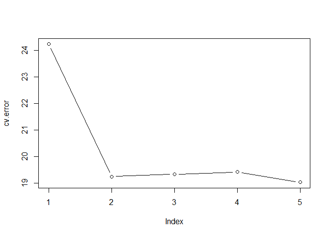
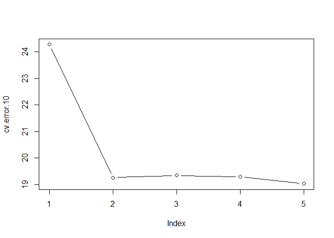
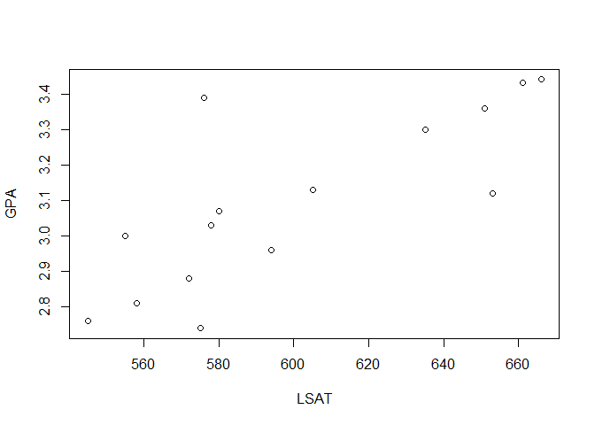
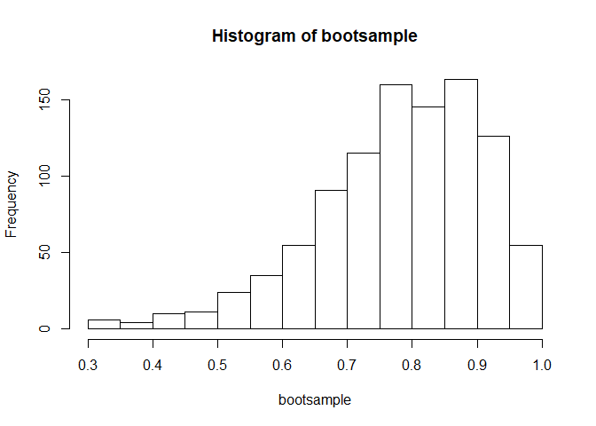

<style type="text/css"> 
body{
  font-size: 12pt;
}
code.r{
  font-size: 12pt;
}
</style>


<br/>
<br/>


# Geçerleme Kümesi Yaklaşımı 

`auto` veri kümesinden hareketle aşağıdaki modeli tahmin etmek istiyoruz: 
$$mpg = \beta_0 + \beta_1 horsepower + \epsilon$$

Eğitim veri kümesini rassal olarak belirliyoruz: 

```r
library(ISLR)
# rassal sayı üretecinin başlangıç değeri: 
set.seed(1)
# eğitim verileri (gözlem numaraları) 
# sample() ile n=392 içinden yerine koymadan 196 sayı çekiyoruz: 
train <- sample(392, 196)
```


```r
# modeli sadece eğitimi verileriyle tahmin et: 
lmfit <- lm(mpg ~ horsepower,data = Auto, subset = train)
lmfit
```

```
## 
## Call:
## lm(formula = mpg ~ horsepower, data = Auto, subset = train)
## 
## Coefficients:
## (Intercept)   horsepower  
##     41.2835      -0.1697
```

Modelimizi `lmfit` nesnesine kaydettik. Şimdi sadece test verileriyle kestirimleri oluşturalım: 


```r
# eğitim ve test verilerini oluştur
train_auto <- Auto[train,]
test_auto <- Auto[-train,]
# eğitim verilerindeki kestirim
train_predict <- predict(lmfit, train_auto)
# Test veri setinde kestirimleri hesapla 
test_predict <- predict(lmfit, test_auto)
# Test kestirim hatasını hesapla
test_error <- test_auto$mpg - test_predict
# Ortalama hata karesi (MSE)
mean(test_error^2)
```

```
## [1] 23.26601
```

```r
#
# sadece tek satırda yapmak istersek: 
# mean((Auto$mpg-predict(lmfit,Auto))[-train]^2)
```

Alternatif olarak karesel ve kübik modelleri düşünelim: 
$$mpg = \beta_0 + \beta_1 horsepower+ \beta_2 horsepower^2 + \epsilon$$


$$mpg = \beta_0 + \beta_1 horsepower+ \beta_2 horsepower^2 + \beta_3 horsepower^3+ \epsilon$$


Karesel model için MSE: 

```r
lm.fit2 <- lm(mpg~poly(horsepower,2), data = Auto, subset=train)
mean((Auto$mpg-predict(lm.fit2,Auto))[-train]^2)
```

```
## [1] 18.71646
```

Kübik model için MSE: 

```r
lm.fit3 <- lm(mpg~poly(horsepower,3), data = Auto, subset = train)
mean((Auto$mpg-predict(lm.fit3,Auto))[-train]^2)
```

```
## [1] 18.79401
```

Bu sonçlara göre en düşük test kestirim hatasını veren model karesel modeldir. Acaba sonuçlar geçerleme kümesine ne kadar duyarlı? 


Yeni bir geçerleme veri kümesi oluşturup test MSE hesaplayalım: 

```r
set.seed(2)
train <- sample(392, 196)
lm.fit <- lm(mpg ~ horsepower, data = Auto, subset = train)
mean((Auto$mpg-predict(lm.fit,Auto))[-train]^2)
```

```
## [1] 25.72651
```

Karesel model: 

```r
lm.fit2 <- lm(mpg ~ poly(horsepower,2), data = Auto, subset = train)
mean((Auto$mpg-predict(lm.fit2,Auto))[-train]^2)
```

```
## [1] 20.43036
```

Kübik model: 

```r
lm.fit3 <- lm(mpg ~ poly(horsepower,3), data = Auto, subset = train)
mean((Auto$mpg-predict(lm.fit3,Auto))[-train]^2)
```

```
## [1] 20.38533
```

# Biri-Hariç Çapraz Geçerleme (LOOCV)

Biri-hariç çapraz geçerlemede (LOOCV - Leave-one-out Cross Validation) modeli bir gözlemi dışarıda bırakarak tahmin ediyoruz. Dışarıda bırakılan gözlemi kestirim yapmak için kullanıyoruz. Bunun için `boot` paketindeki `cv.glm()` fonksiyonunu `glm()` ile birlikte kullanabiliriz. 

`glm()` fonksiyonu `lm()`'e benzer:  

```r
# modeli glm ile tahmin et: 
glm.fit <- glm(mpg ~ horsepower, data = Auto)
coef(glm.fit)
```

```
## (Intercept)  horsepower 
##  39.9358610  -0.1578447
```

```r
# lm ile tahmin: 
lm.fit <- lm(mpg ~ horsepower, data = Auto)
coef(lm.fit)
```

```
## (Intercept)  horsepower 
##  39.9358610  -0.1578447
```

`cv.glm()` fonksiyonunun kullanımı:

```r
library(boot)
glm.fit <- glm(mpg ~ horsepower, data = Auto)
cv.err <- cv.glm(Auto, glm.fit)
cv.err$delta
```

```
## [1] 24.23151 24.23114
```

`cv.err$delta` çapraz geçerleme ortalama hatasını vermektedir (ilk değer denklem (5.1), ikinci değer ise düzeltilmiş kestirim hatasıdır, burada LOOCV kullanıldığı için her iki değer birbirine çok yakındır). `cv.glm()` default olarak LOOCV uygular. K-katlı çapraz geçerleme için de kullanılabilir. 


LOOCV yaklaşımını biraz daha karmaşık modellere uygulayalım ve sonuçları karşılaştıralım. Beşinci dereceye kadar polinom modeller tahmin edeceğiz. Bunu bir döngü içinde yapmak daha pratiktir: 

```r
# 5 elemanlı sıfır vektörü; döngü içinde güncellenecek
cv.error <- rep(0,5)
#
for (i in 1:5){
  glm.fit <- glm(mpg ~ poly(horsepower,i), data = Auto)
  cv.error[i] <- cv.glm(Auto, glm.fit)$delta[1]
}
cv.error
```

```
## [1] 24.23151 19.24821 19.33498 19.42443 19.03321
```


```r
plot(cv.error, type = "b")
```

<!-- -->


# $k$-katlı Çapraz Geçerleme

Bunun için `cv.glm()` fonksiyonunu kullanabiliriz. Örneğin, $k=10$ için doğrusal modelde çapraz geçerleme test hatası: 

```r
set.seed(12345)
glm.fit <- glm(mpg ~ horsepower, data = Auto)
cv_lin_error_10 <- cv.glm(Auto, glm.fit, K=10)$delta[1]
cv_lin_error_10
```

```
## [1] 24.31806
```

5. dereceye kadar polinom değerler için 10-katlı çapraz geçerleme test hata tahminleri: 

```r
# ISLR aynı sonuçlar için seed değeri: 
set.seed(17)
cv.error.10 <- rep(0,5)
for (i in 1:5){
  glm.fit <- glm(mpg ~ poly(horsepower,i), data = Auto)
  cv.error.10[i] <- cv.glm(Auto, glm.fit, K=10)$delta[1]
}
cv.error.10
```

```
## [1] 24.27207 19.26909 19.34805 19.29496 19.03198
```


```r
plot(cv.error.10, type = "b")
```

<!-- -->

# Bootstrap 

Bootstrap tekniğinin uygulanması oldukça basittir. Bunun için ilgilendiğimiz istatistik ya da tahminciyi hesaplayan bir fonksiyona ve elimizdeki verilerden yerine koymalı örnekleme yapabilen ayrı bir fonksiyona ihtiyacımız vardır.  

Örnek olarak Efron, B. ve R. Tibshrani'nin makalelerinde kullandıkları verileri ele alalım (bkz. "Bootstrap Methods for Standard Errors, Confidence Intervals and Other measures of Statisical Accuracy." Statistical Science, 1(1986): 54-77).

Bu veri setinde ABD'deki 15 hukuk fakültesinin 1973 yılı ortalama LSAT puanları ile GPA değerleri yer almaktadır:  

```r
LSAT <- c(576, 635, 558, 578, 666, 580, 555, 661, 651, 605, 653, 575, 545, 572, 594)
GPA <- c(3.39, 3.30, 2.81, 3.03, 3.44, 3.07, 3.00, 3.43, 3.36, 3.13, 
        3.12, 2.74, 2.76, 2.88, 2.96)
data <- data.frame(LSAT,GPA)
plot(LSAT,GPA)
```

<!-- -->

Amacımız korelasyon katsayısının standart hatasını "bootstrap" tekniği ile tahmin etmek. Örneklem korelasyon katsayısı:

```r
cor(LSAT, GPA)
```

```
## [1] 0.7763745
```

Bootstrap standart hatasını bulmak için verilerden rassal olarak ve yerine koyarak $n$ boyutlu örneklemler çekip her örneklem için korelasyon katsayısını hesaplayacağız ve kaydedeceğiz. Amacımız korelasyon katsayısının örnekleme dağılımını tahmin etmektir. Bu amaçla  `sample(n, n, replace=TRUE)` komutunu $B=1000$ yinelemeli olarak kullanabiliriz: 

```r
set.seed(111)
B <- 1000 
bootsample <- rep(0,B)
for (i in 1:B){
  index <- sample(15,15,replace = TRUE)
  bootsample[i] <- cor(LSAT[index], GPA[index])
}
hist(bootsample)
```

<!-- -->


```r
sqrt(var(bootsample))
```

```
## [1] 0.127539
```

```r
summary(bootsample)
```

```
##    Min. 1st Qu.  Median    Mean 3rd Qu.    Max. 
##  0.3128  0.7049  0.7955  0.7803  0.8772  0.9972
```

Bootstrap standart hatası 0.1275 olarak tahmin edilmiştir (yukarıda referansını verdiğimiz makaledeki sonuçla pratik olarak aynıdır). Bootstrap ortalamasının, 0.7803, örneklem korelasyon katsayısı, 0.776, ile örtüştüğüne dikkat ediniz. 


`R` `boot()` fonksiyonu yukarıdaki hesaplamayı otomatikleştirir. Ancak bunun için öncelikle bir fonksiyon yazmalıyız. Aşağıdaki örnekte `corboot()` fonksiyonu örneklem korelasyon katsayısını, gözlem numaralarını içeren `index` kümesini kullanarak hesaplar ve çıktı olarak verir. Daha fazla detay için `boot()` Help dosyasına bakılabilir.

```r
# örneklem istatistiğini hesaplayan jenerik fonksiyon
corboot <- function(data, index){
  X <- data[index,1]
  Y <- data[index,2]
  return(cor(X,Y))
}
# boot fonksiyonunun kullanımı
library(boot)
set.seed(111)
boot(data = data, statistic = corboot, R=1000)
```

```
## 
## ORDINARY NONPARAMETRIC BOOTSTRAP
## 
## 
## Call:
## boot(data = data, statistic = corboot, R = 1000)
## 
## 
## Bootstrap Statistics :
##      original       bias    std. error
## t1* 0.7763745 0.0009153723   0.1311586
```

Bootstrap standart hatası 0.131 olarak tahmin edilmiştir. 

## Regresyon Modelinde Bootstrap Standart Hataları

Bootstrap tekniği bir makine öğrenmesi yönteminin katsayı tahminlerindeki değişkenliğin ölçülmesinde kullanılabilir. Örneğin doğrusal regresyon modelinde katsayı tahminlerinin standart hataları bootstrap yaklaşımı ile hesaplanabilir. Kesit veri setinin ilgili anakütleden iid örnekleme ile çekildiği varsayımını yapıyoruz. Bu yaklaşım ölçümler arasında bağımlılığın olduğu zaman serilerine burada ele aldığımız yalın haliyle uygulanamaz. Zaman serileri için geliştirilmiş daha karmaşık bootstrap yöntemleri vardır (burada değinmeyeceğiz). 

Sıradan en küçük kareler (OLS) tahmincilerinin standart hata formülleri incelenirse bu formüllerin bazı varsayımlar altında geçerli olduğu kolayca görülebilir. Bunlardan en önemlisi hata teriminin varyansının, $\sigma^2$, sabit olmasıdır. Değişen varyans (heteroskedasticity) durumunda veya modelde dikkate alınmamış doğrusal olmayan ilişkiler varsa bu standart hata formülleri geçerli olmaz. Bootstrap yöntemi ise bu varsayımlara dayanmaz. Yani değişen varyans altında da geçerlidir.  

Bootstrap standart hatalarını hesaplamak için önce `boot.fn()` isimli bir fonksiyon yazalım. Bu fonksiyon iki girdiye sahiptir, `data` ve `index`. İkinci girdi gözlemlerin numaralarını içermektedir. Böylece farklı bootstrap örneklemleri için OLS tahmini yinelenebilir. Kolaylık amacıyla sadece `mpg` modeli için geçerli olacak şekilde yazılmıştır:  

```r
boot.fn <- function(data, index)
  return(coef(lm(mpg ~ horsepower, data = data, subset = index)))
# örnek: tüm gözlemleri kullan
boot.fn(Auto,1:392)
```

```
## (Intercept)  horsepower 
##  39.9358610  -0.1578447
```

Yerine koymalı boostrap örnekleri: 

```r
set.seed(1)
# 1. bootstrap 
boot.fn(Auto, sample(392, 392, replace=T))
```

```
## (Intercept)  horsepower 
##  40.3404517  -0.1634868
```

```r
# 2. bootstrap
boot.fn(Auto, sample(392, 392, replace=T))
```

```
## (Intercept)  horsepower 
##  40.1186906  -0.1577063
```

Şimdi `boot()` fonksiyonunu çağırabiliriz:

```r
boot(Auto, boot.fn, 1000) 
```

```
## 
## ORDINARY NONPARAMETRIC BOOTSTRAP
## 
## 
## Call:
## boot(data = Auto, statistic = boot.fn, R = 1000)
## 
## 
## Bootstrap Statistics :
##       original        bias    std. error
## t1* 39.9358610  0.0544513229 0.841289790
## t2* -0.1578447 -0.0006170901 0.007343073
```

1000 replikasyonu sonucu tahmin edilen katsayı standart hataları sabit için 0.845, eğim katsayısı için 0.0073'dür. OLS ile kıyaslayalım:  

```r
summary(lm(mpg ~ horsepower, data=Auto))$coef
```

```
##               Estimate  Std. Error   t value      Pr(>|t|)
## (Intercept) 39.9358610 0.717498656  55.65984 1.220362e-187
## horsepower  -0.1578447 0.006445501 -24.48914  7.031989e-81
```

OLS standart hataları daha düşüktür. Ancak doğrusal modelin iyi bir uyum sergilemediği düşünülürse bootstrap standart hatalarının daha sapmasız bir standart hata tahmini verdiğini söyleyebiliriz. 

`mpg` için karesel model daha başarılı bir uyum göstermişti. Bu model için bootstrap stanart hataları hesaplayalım: 

```r
boot.fn2 <- function(data, index)
  coefficients(lm(mpg ~ horsepower + I(horsepower^2), data = data, subset=index))
set.seed(1)
boot(Auto, boot.fn2, 1000)
```

```
## 
## ORDINARY NONPARAMETRIC BOOTSTRAP
## 
## 
## Call:
## boot(data = Auto, statistic = boot.fn2, R = 1000)
## 
## 
## Bootstrap Statistics :
##         original        bias     std. error
## t1* 56.900099702  3.511640e-02 2.0300222526
## t2* -0.466189630 -7.080834e-04 0.0324241984
## t3*  0.001230536  2.840324e-06 0.0001172164
```

OLS sonuçları ile kıyaslayınız: 

```r
summary(lm(mpg~horsepower+I(horsepower^2),data=Auto))$coef
```

```
##                     Estimate   Std. Error   t value      Pr(>|t|)
## (Intercept)     56.900099702 1.8004268063  31.60367 1.740911e-109
## horsepower      -0.466189630 0.0311246171 -14.97816  2.289429e-40
## I(horsepower^2)  0.001230536 0.0001220759  10.08009  2.196340e-21
```


