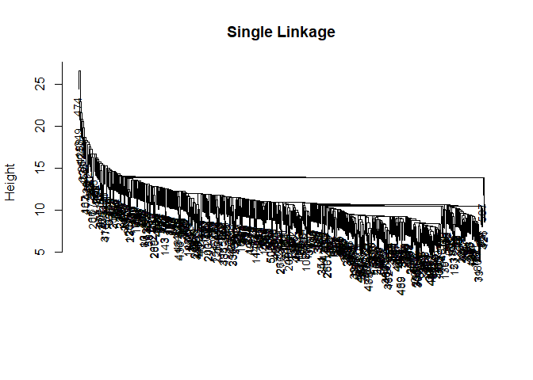

<style type="text/css"> 
body{
  font-size: 12pt;
}
code.r{
  font-size: 12pt;
}
</style>


<br/>
<br/>


# Temel Bileşenler

## Örnek: USArrests 

Örnek olarak ders kitabındaki (James vd, ISLR) örneğin replikasyonunu yapacağız. Bu örnek base `R`'ın bir parçası olan `USArrests`  veri kümesini kullanmaktadır. 

```r
library(ISLR)
states <- row.names(USArrests) 
names(USArrests)
```

```
## [1] "Murder"   "Assault"  "UrbanPop" "Rape"
```

Veri kümesinde 4 değişken vardır. Örneklem ortalamaları ve varyansları: 

```r
apply(USArrests, 2, mean)
```

```
##   Murder  Assault UrbanPop     Rape 
##    7.788  170.760   65.540   21.232
```


```r
apply(USArrests, 2, var) 
```

```
##     Murder    Assault   UrbanPop       Rape 
##   18.97047 6945.16571  209.51878   87.72916
```

`R`'da Temel bileşenler analizi (PCA) için alternatif paketler mevcuttur (`prcomp`, `princomp`, vb.). 

`prcomp` paketini `scale=TRUE` opsiyonuyla kullanalım: 

```r
pr.out <- prcomp(USArrests, scale=TRUE)
names(pr.out) 
```

```
## [1] "sdev"     "rotation" "center"   "scale"    "x"
```

Çıktı listesi `pr.out` içinde beş nesne bulunur. `center` ve `scale` değişkenlerin ortalama ve standart sapmalarını içerir (bunlar kullanılarak standardizasyon yapıldı). 

```r
pr.out$center
```

```
##   Murder  Assault UrbanPop     Rape 
##    7.788  170.760   65.540   21.232
```


```r
pr.out$scale
```

```
##    Murder   Assault  UrbanPop      Rape 
##  4.355510 83.337661 14.474763  9.366385
```

`rotation` matrisi temel bileşen katsayılarını içermektedir. `pr.out$rotation` matrisinin her bir sütunu temel bileşen ağırlıklarına karşılık gelir:  

```r
pr.out$rotation
```

```
##                 PC1        PC2        PC3         PC4
## Murder   -0.5358995  0.4181809 -0.3412327  0.64922780
## Assault  -0.5831836  0.1879856 -0.2681484 -0.74340748
## UrbanPop -0.2781909 -0.8728062 -0.3780158  0.13387773
## Rape     -0.5434321 -0.1673186  0.8177779  0.08902432
```

`x` temel bileşen skor vektörlerini içeren bir matristir: 

```r
dim(pr.out$x)  
head(pr.out$x)
```

```
## [1] 50  4
##                   PC1        PC2         PC3          PC4
## Alabama    -0.9756604  1.1220012 -0.43980366  0.154696581
## Alaska     -1.9305379  1.0624269  2.01950027 -0.434175454
## Arizona    -1.7454429 -0.7384595  0.05423025 -0.826264240
## Arkansas    0.1399989  1.1085423  0.11342217 -0.180973554
## California -2.4986128 -1.5274267  0.59254100 -0.338559240
## Colorado   -1.4993407 -0.9776297  1.08400162  0.001450164
```

İlk iki temel bileşenin grafiği (biplot): 

```r
biplot(pr.out, scale=0, cex=0.6)
```

<!-- -->

`scale=0` opsiyonu ile okların temel bileşen katsayılarını temsil etmesi sağlanır. Yukarıdaki grafik kitaptaki grafiğin (Figure 10.1) aynadaki yansımasıdır. Bu grafiği çizmek için işaret edğişimi yapabiliriz: 

```r
pr.out$rotation <- -pr.out$rotation
pr.out$x <- -pr.out$x
biplot(pr.out, scale=0, cex=0.6)
```

<!-- -->

Temel bileşenlerin önemi:  

```r
summary(pr.out)
```

```
## Importance of components:
##                           PC1    PC2     PC3     PC4
## Standard deviation     1.5749 0.9949 0.59713 0.41645
## Proportion of Variance 0.6201 0.2474 0.08914 0.04336
## Cumulative Proportion  0.6201 0.8675 0.95664 1.00000
```

Bu sonuca göre ilk temel bileşen varyansın %62'sini, ikinci temel bileşen ise %24.7'sini açıklamaktadır. İlk iki temel bileşen birlikte varyansın yaklaşık %87'sini açıklar. 

Screeplot: 

```r
screeplot(pr.out, type="lines") 
```

<!-- -->


```r
pr.out$sdev
pr.var <- pr.out$sdev^2
pr.var
pve <- pr.var/sum(pr.var)
pve
plot(pve, xlab="Principal Component", ylab="Proportion of Variance Explained", ylim=c(0,1),type='b')
```

<!-- -->

```r
plot(cumsum(pve), xlab="Principal Component", ylab="Cumulative Proportion of Variance Explained", ylim=c(0,1),type='b')
```

<!-- -->

```
## [1] 1.5748783 0.9948694 0.5971291 0.4164494
## [1] 2.4802416 0.9897652 0.3565632 0.1734301
## [1] 0.62006039 0.24744129 0.08914080 0.04335752
```
## Örnek: Body Data 

Vücut ölçümleri veri seti (detaylar için bkz. [http://users.stat.umn.edu/~sandy/courses/8053/Data/Bodymeasurements/datasets.heinz.html](http://users.stat.umn.edu/~sandy/courses/8053/Data/Bodymeasurements/datasets.heinz.html)): 

```r
load("Data/body.RData") 
bodydata <- subset(body, select = -c(age, gender, gender_dummy)) 
str(bodydata)
```

```
## Classes 'spec_tbl_df', 'tbl_df', 'tbl' and 'data.frame':	507 obs. of  23 variables:
##  $ biacromial_diameter    : num  42.9 43.7 40.1 44.3 42.5 43.3 43.5 44.4 43.5 42 ...
##  $ biiliac_diameter       : num  26 28.5 28.2 29.9 29.9 27 30 29.8 26.5 28 ...
##  $ bitrochanteric_diameter: num  31.5 33.5 33.3 34 34 31.5 34 33.2 32.1 34 ...
##  $ chest_depth            : num  17.7 16.9 20.9 18.4 21.5 19.6 21.9 21.8 15.5 22.5 ...
##  $ chest_diameter         : num  28 30.8 31.7 28.2 29.4 31.3 31.7 28.8 27.5 28 ...
##  $ elbow_diameter         : num  13.1 14 13.9 13.9 15.2 14 16.1 15.1 14.1 15.6 ...
##  $ wrist_diameter         : num  10.4 11.8 10.9 11.2 11.6 11.5 12.5 11.9 11.2 12 ...
##  $ knee_diameter          : num  18.8 20.6 19.7 20.9 20.7 18.8 20.8 21 18.9 21.1 ...
##  $ ankle_diameter         : num  14.1 15.1 14.1 15 14.9 13.9 15.6 14.6 13.2 15 ...
##  $ shoulder_girth         : num  106 110 115 104 108 ...
##  $ chest_girth            : num  89.5 97 97.5 97 97.5 ...
##  $ waist_girth            : num  71.5 79 83.2 77.8 80 82.5 82 76.8 68.5 77.5 ...
##  $ abdominal_girth        : num  74.5 86.5 82.9 78.8 82.5 80.1 84 80.5 69 81.5 ...
##  $ hip_girth              : num  93.5 94.8 95 94 98.5 95.3 101 98 89.5 99.8 ...
##  $ thigh_girth            : num  51.5 51.5 57.3 53 55.4 57.5 60.9 56 50 59.8 ...
##  $ bicep_girth            : num  32.5 34.4 33.4 31 32 33 42.4 34.1 33 36.5 ...
##  $ forearm_girth          : num  26 28 28.8 26.2 28.4 28 32.3 28 26 29.2 ...
##  $ knee_girth             : num  34.5 36.5 37 37 37.7 36.6 40.1 39.2 35.5 38.3 ...
##  $ calf_girth             : num  36.5 37.5 37.3 34.8 38.6 36.1 40.3 36.7 35 38.6 ...
##  $ ankle_girth            : num  23.5 24.5 21.9 23 24.4 23.5 23.6 22.5 22 22.2 ...
##  $ wrist_girth            : num  16.5 17 16.9 16.6 18 16.9 18.8 18 16.5 16.9 ...
##  $ weight                 : num  65.6 71.8 80.7 72.6 78.8 74.8 86.4 78.4 62 81.6 ...
##  $ height                 : num  174 175 194 186 187 ...
```

Korelasyon matrisi bu ölçümlerin birbirleriyle yüksek derecede ilişkili olduğunu gösteriyor:  

```r
library(ggcorrplot)
```

```
## Loading required package: ggplot2
```

```r
cormat <- round(cor(bodydata), 2)
ggcorrplot(cormat, hc.order = TRUE, type = "lower", outline.color = "white")
```

<!-- -->

Body verileri için temel bileşenler: 

```r
pr.out <- prcomp(bodydata, scale=TRUE)
summary(pr.out)  
```

```
## Importance of components:
##                           PC1    PC2     PC3     PC4     PC5     PC6
## Standard deviation     3.8644 1.5758 1.03211 0.95475 0.69342 0.65851
## Proportion of Variance 0.6493 0.1080 0.04632 0.03963 0.02091 0.01885
## Cumulative Proportion  0.6493 0.7572 0.80357 0.84320 0.86410 0.88296
##                            PC7    PC8     PC9    PC10    PC11    PC12
## Standard deviation     0.58162 0.5674 0.52727 0.52186 0.49794 0.45082
## Proportion of Variance 0.01471 0.0140 0.01209 0.01184 0.01078 0.00884
## Cumulative Proportion  0.89767 0.9117 0.92375 0.93559 0.94637 0.95521
##                           PC13    PC14    PC15   PC16    PC17    PC18
## Standard deviation     0.42002 0.39670 0.38094 0.3490 0.32002 0.29400
## Proportion of Variance 0.00767 0.00684 0.00631 0.0053 0.00445 0.00376
## Cumulative Proportion  0.96288 0.96972 0.97603 0.9813 0.98578 0.98954
##                          PC19    PC20    PC21    PC22   PC23
## Standard deviation     0.2835 0.23619 0.21552 0.19313 0.1437
## Proportion of Variance 0.0035 0.00243 0.00202 0.00162 0.0009
## Cumulative Proportion  0.9930 0.99546 0.99748 0.99910 1.0000
```

```r
# change the signs of factor loadings
pr.out$rotation <- -pr.out$rotation
pr.out$x <- -pr.out$x
biplot(pr.out, scale=0, cex=0.6)
```

<!-- -->


```r
pr.var <- pr.out$sdev^2 
pve <- pr.var/sum(pr.var)
pve
plot(pve, xlab="Principal Component", ylab="Proportion of Variance Explained", ylim=c(0,1),type='b')
```

<!-- -->

```r
plot(cumsum(pve), xlab="Principal Component", ylab="Cumulative Proportion of Variance Explained", ylim=c(0,1),type='b')
```

<!-- -->

```
##  [1] 0.6492846086 0.1079652790 0.0463153491 0.0396329172 0.0209057316
##  [6] 0.0188539644 0.0147079693 0.0139999780 0.0120875732 0.0118406532
## [11] 0.0107802578 0.0088363210 0.0076704395 0.0068423027 0.0063093336
## [16] 0.0052965553 0.0044528583 0.0037581598 0.0034951865 0.0024254119
## [21] 0.0020194249 0.0016217326 0.0008979928
```

İlk 4 temel bileşen verilerdeki değişkenliğin yaklaşık %84'ünü açıklamaktadır.  


# K-Ortalamalar 

## Örnek: yapay veriler 

`kmeans()` fonksiyonuyla K-ortalamalar tahmini yapılabilir. Örnek olarak bir yapay veri seti oluşturalım. Bu yapay veri setinde gerçekte iki küme olsun: 

```r
set.seed(2)
x <- matrix(rnorm(50*2), ncol=2)
x[1:25,1]=x[1:25,1]+3
x[1:25,2]=x[1:25,2]-4
km.out <- kmeans(x,2,nstart=20)
km.out$cluster
```

```
##  [1] 1 1 1 1 1 1 1 1 1 1 1 1 1 1 1 1 1 1 1 1 1 1 1 1 1 2 2 2 2 2 2 2 2 2 2
## [36] 2 2 2 2 2 2 2 2 2 2 2 2 2 2 2
```

```r
plot(x, col=(km.out$cluster+1), main="K-Means Clustering Results with K=2", xlab="", ylab="", pch=20, cex=2) 
```

<!-- -->

Burada gerçek küme sayısının iki olduğunu biliyoruz. Pratikte bunu genellikle bilmeyiz. Diyelim ki bunu bilmiyoruz ve K=3 için sınıflama yapıyoruz: 

```r
set.seed(4)
km.out <- kmeans(x, 3, nstart=20)
km.out
```

```
## K-means clustering with 3 clusters of sizes 17, 23, 10
## 
## Cluster means:
##         [,1]        [,2]
## 1  3.7789567 -4.56200798
## 2 -0.3820397 -0.08740753
## 3  2.3001545 -2.69622023
## 
## Clustering vector:
##  [1] 1 3 1 3 1 1 1 3 1 3 1 3 1 3 1 3 1 1 1 1 1 3 1 1 1 2 2 2 2 2 2 2 2 2 2
## [36] 2 2 2 2 2 2 2 2 3 2 3 2 2 2 2
## 
## Within cluster sum of squares by cluster:
## [1] 25.74089 52.67700 19.56137
##  (between_SS / total_SS =  79.3 %)
## 
## Available components:
## 
## [1] "cluster"      "centers"      "totss"        "withinss"    
## [5] "tot.withinss" "betweenss"    "size"         "iter"        
## [9] "ifault"
```

```r
plot(x, col=(km.out$cluster+1), main="K-Means Clustering Results with K=3", xlab="", ylab="", pch=20, cex=2)
```

<!-- -->

K = 3 olduğu için K-ortalamalar algoritması verileri 3 öbeğe ayırdı. Yukarıdaki grafikte de görülebileceği gibi mavi renkte yeni bir grup oluşturuldu. 

K-ortalamalar algoritmasında yerel optimumdan kaçınmak için başlangıç değeri `nstart` için 20 ya da 50 gibi büyük bir değer kullanılabilir:

```r
set.seed(3)
km.out <- kmeans(x, 3, nstart=1)
km.out$tot.withinss
```

```
## [1] 97.97927
```

```r
km.out <- kmeans(x, 3, nstart=20)
km.out$tot.withinss
```

```
## [1] 97.97927
```

## Örnek: Vücut ölçümleri (Body data)


```r
km.out <- kmeans(bodydata, 2, nstart=20)
plot(bodydata[,1:3],col=(km.out$cluster),cex=2)
```

<!-- -->

Kümelemeyi ağırlık (weight) ve boy (height) değişkenlerine göre görselleştirelim ve cinsiyet ile karşılaştıralım: 

```r
# Large blank circles are the resulting clusters
plot(bodydata[,22:23],col=(km.out$cluster),cex=2)
# put dots inside circles representing observed gender
# red = men, black = women
points(body[,23:24], col=c(1,2)[body$gender], pch=19, cex=1)
```

<!-- -->

```r
observed_class <- c(1,2)[body$gender]
km_cluster <- km.out$cluster
ratio <- sum(observed_class == km_cluster)/nrow(bodydata)
ratio
```

```
## [1] 0.8402367
```

Buna göre verilerin %84'ü doğru bir şekilde kümelenmiştir. Ancak bunu saptayabilmemizi sağlayan verilerde cinsiyet (gender) değişkeninin yer almasıdır (aslında etiketler mevcut). Bu açıdan bir sınıflandırma problemi olarak düşünülebilir. Bu örnek sadece gösterim amaçlıdır. Eğer çıktı değişkenini biliyorsak gözetimli öğrenme tekniklerini kullanmalıyız. 


# Hiyerarşik Kümeleme

## Örnek: Yapay veriler

`R`'da hiyerarşik kümeleme analizi için `hclust()` fonksiyonu kullanılabilir: 

```r
hc.complete <- hclust(dist(x), method="complete")
hc.average <- hclust(dist(x), method="average")
hc.single <- hclust(dist(x), method="single")
par(mfrow=c(1,3))
plot(hc.complete,main="Complete Linkage", xlab="", sub="", cex=.9)
plot(hc.average, main="Average Linkage", xlab="", sub="", cex=.9)
plot(hc.single, main="Single Linkage", xlab="", sub="", cex=.9)
```

<!-- -->


```r
cutree(hc.complete, 2)
```

```
##  [1] 1 1 1 1 1 1 1 1 1 1 1 1 1 1 1 1 1 1 1 1 1 1 1 1 1 2 2 2 2 2 2 2 2 2 2
## [36] 2 2 2 2 2 2 2 2 2 2 2 2 2 2 2
```


```r
cutree(hc.average, 2)
```

```
##  [1] 1 1 1 1 1 1 1 1 1 1 1 1 1 1 1 1 1 1 1 1 1 1 1 1 1 2 2 2 2 2 2 2 1 2 2
## [36] 2 2 2 2 2 2 2 2 1 2 1 2 2 2 2
```


```r
cutree(hc.single, 2)
```

```
##  [1] 1 1 1 1 1 1 1 1 1 1 1 1 1 1 1 2 1 1 1 1 1 1 1 1 1 1 1 1 1 1 1 1 1 1 1
## [36] 1 1 1 1 1 1 1 1 1 1 1 1 1 1 1
```


```r
cutree(hc.single, 4)
```

```
##  [1] 1 1 1 1 1 1 1 1 1 1 1 1 1 1 1 2 1 1 1 1 1 1 1 1 1 3 3 3 3 3 3 3 3 3 3
## [36] 3 3 3 3 3 3 4 3 3 3 3 3 3 3 3
```

Değişkenleri standardize etmek için `scale()` fonksiyonu kullanılabilir: 

```r
xsc=scale(x)
plot(hclust(dist(xsc), method="complete"), main="Hierarchical Clustering with Scaled Features")
```

<!-- -->


## Örnek: Body data 


```r
# exclude gender variables
body1 <- dplyr::select(body, -c(25,26)) 
# H.Cluster
hcbody.complete <- hclust(dist(body1), method="complete")
hcbody.average <- hclust(dist(body1), method="average")
hcbody.single <- hclust(dist(body1), method="single")
```

Dendrogramlar:

```r
plot(hcbody.complete,main="Complete Linkage", xlab="", sub="", cex=.9)
```

<!-- -->


```r
plot(hcbody.average, main="Average Linkage", xlab="", sub="", cex=.9)
```

<!-- -->


```r
plot(hcbody.single, main="Single Linkage", xlab="", sub="", cex=.9)
```

<!-- -->


