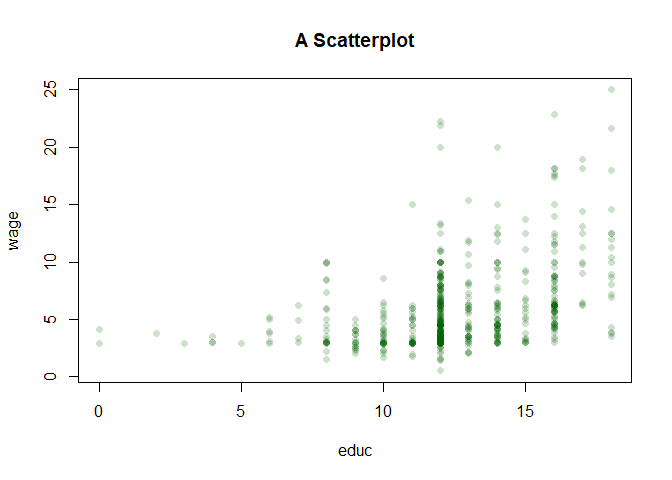

<style type="text/css"> 
body{
  font-size: 12pt;
}
code.r{
  font-size: 12pt;
}
</style>


<br/>
<br/>

# R ve RStudio 

## Kurulum 

`R` ve `RStudio` bilgisayarınızda yüklü değilse aşağıdaki adımları takip ederek yükleyebilirsiniz: 

<br/> 

1. Önce [The Comprehensive R Archive Network](https://cran.r-project.org/) adresinden `R`'ın sisteminize uygun en son versiyonunu indirerek kurunuz. 

 

Bu aşamada temel R fonksiyonlarını kullanmaya başlayabilirsiniz. Örneğin, 


Ancak standart R arayüzü ile kod yazmak, proje hazırlamak ve yönetmek kolay değildir. Bu işleri kolaylaştırmak için yaygın olarak kullanılan bir arayüz  `RStudio` programıdır. 

<br/>


2. [RStudio](https://rstudio.com/) sitesine giderek sisteminize en uygun programı kurunuz. 


<br/>
Her iki program da özgür (free) programdır. `RStudio` sadece bir arayüzden daha fazlasını sunmaktadır. 

<br/>

`RStudio` ile bir `R script` dosyası oluşturarak yazdığınız kodları kaydedebilir ve daha sonra kullanabilirsiniz. Bunun için şu adımları takip ediniz:  `File > New File > R script`. New file altında çok sayıda dosya biçimi dikkatinizi çekmiştir. Örneğin bu metin `R Markdown` dosya biçimi ile oluşturulmuştur.   

Alt solda yer alan pencere `R Console` penceresidir. Burada doğrudan komutlarınızı çalıştırabilirsiniz. Kısa komutlar için pratik olsa da ciddi analizler için bir R Script dosyası tutmanız daha sağlıklı olacaktır.  

<br/>

## R Komut Satırı (Console)  

Console üzerinde aşağıdaki komutları çalıştırınız: 

```r
2 + 2
```

```
## [1] 4
```

```r
pi
```

```
## [1] 3.141593
```

ve


```r
log(exp(-5))
```

```
## [1] -5
```

```r
e <- exp(1)
print(e, digits = 3)
```

```
## [1] 2.72
```

```r
e <- exp(1)
print(e, digits = 17)
```

```
## [1] 2.7182818284590451
```

Elimizde gelişmiş bir hesap makinesi var. Şimdi başka bir işlem yapalım ve $a = (9\times 8.1) + 8.1$ ve işlemini R'da yazalım. Sonucu biliyoruz, tam olarak 
$10\times 8.1 = 81$. Çarpma işlemi her zaman toplamadan önce geldiği için (eğer parantez yoksa) işlemi aşağıdaki gibi yazabiliriz:

```r
a <- 9*8.1 + 8.1
print(a)
```

```
## [1] 81
```

Çok güzel. Hata yok gibi. Sıfırdan sonraki basamaklara daha yakından bakalım: 

```r
print(a, digits = 17)
```

```
## [1] 80.999999999999986
```

81 olarak bulduğumuz sonuç tam olarak 81 değil. Ama nasıl olur? Bilgisayar neden bize tam sonuç vermiyor? Bunun nedeni 81 sayısının (aslında tüm sayıların) ikili sistem kullanan bilgisayarlarda tam olarak temsil edilememesidir.  81'in temmsilindeki hata: 

```r
print(81-a, digits = 17)
```

```
## [1] 1.4210854715202004e-14
```
Hata = $1.4210854715202004\times 10^{-14}$,  ya da 

```r
format(81-a, scientific = FALSE)
```

```
## [1] "0.00000000000001421085"
```

Bu yaptığınız hesaplamanın amacına bağlı olarak sorun yaratabilir. Örneğin yazdığınız programda bir aritmetik işlemin sonucunu başka bir sonuçla karşılaştırmak istediğinizi düşünelim. Bunun için mantıksal işlemcileri kullanabilirsiniz. Örneğin

```r
81 == a
```

```
## [1] FALSE
```

Bildiğimiz tam sonuç (81) ile aritmetik işlemin sonucu (a) eşit değil. Aslında eşit olduklarını biliyoruz. Ancak bilgisayar temsilinde (floating point arithmetic) yaklaşık olarak eşittirler:  

```r
all.equal(81,a)
```

```
## [1] TRUE
```

Burada default tolerans düzeyi $0.000000015$ kullanıldı. Yani aritmetik çözüm ile tam sonuç arasındaki fark tolerans düzeyinden küçüktür. R'da machine precision $\epsilon$) 

```r
print(.Machine$double.eps, digits=22)
```

```
## [1] 2.2204460492503131e-16
```

**Alıştırma:** Bilgisayarda temsil edilebilen 1'den küçük olan en büyük sayıyı bulunuz. 


Diğer aritmetik işlemler de sorun yaratabilir. Örneğin 10.2'den 10.1'i çıkaralım: 

```r
b <- 10.2 - 10.1
print(b, digits = 17)
```

```
## [1] 0.099999999999999645
```

Bu tam sonuç $0.10$ ile aynı değildir. 

**Alıştırma** 81 sayısının ikili sistemde gösteriminin $(1010001)$ olduğunu, yani, $(81)_{10} = (1010001)_2$ olduğunu gösteriniz. Ayrıca $0.10$'in ikili gösterimini bulunuz. 


## R Paketleri

`R` kurulumuyla gelen temel paketler aşağıda listelenmiştir: 

```r
rownames(installed.packages(priority="base"))
```

```
##  [1] "base"      "compiler"  "datasets"  "graphics"  "grDevices" "grid"     
##  [7] "methods"   "parallel"  "splines"   "stats"     "stats4"    "tcltk"    
## [13] "tools"     "utils"
```

`R` programının güçlü yanlarından biri kullanıcılar tarafından yazılmış paketlerin yüklenmesiyle fonksiyonelliğinin arttırılabilmesidir. Bu derste kullandığımız İstatistiksel öğrenme kitabının (James et al. An Introduction to Statistical Learning) veri setlerini yükleme için aşağıdaki komutu kullanabiliriz: 

```r
install.packages("ISLR", repos='http://cran.us.r-project.org')
```

Alternatif olarak aynı işlem RStudio menüsünden de yapılabilir: `Tools>InstallPackages` ilgili pencerede "ISLR" paket ismini yazmamız gerekir. Paketi kullanabilmek için önce yüklememiz daha sonra ise aktif hale getirmemiz gerekir:

```r
library(ISLR)
```


## Dosya isimleri ve güncel dizin

`getwd()` komutu ile güncel dizini görebiliriz: 

```r
getwd()
```

Bunu değiştirmek istersek `setwd("/tam/adres/")` komutunu kullanabiliriz. Dizin adresinde `\` yerine `/` kullanıldığına dikkat ediniz: 

```r
setwd("C:/Users/Folder/Another-Folder/makine-ogrenmesi")
```


# `R`'da Nesneler  

`R` nesneler (objects) üzerinden çalışır. Büyük-küçük harf ayırımı yapar, yani `x` ve `X` farklı nesnelerdir. Bir nesnenin içeriği `=` ya da  `<-` ile belirlenebilir. Örneğin:

```r
x <- 5 
y <- 2 
z <- x^y 
z 
```

```
## [1] 25
```

Hafızadaki tüm nesneleri görmek için 

```r
ls()
```

```
## [1] "a" "b" "e" "x" "y" "z"
```

`RStudio`'da sağ üst pencered `Environment` altında tüm nesneler görülebilir. 

`rm(x)` komutu `x` nesnesini hafızadan siler. Tüm nesneleri silmek istersek

```r
rm(list=ls())
ls()
```

```
## character(0)
```

## Vektörler 

Bir `R` vektörü (ya da bir atomik vektör) bir değer ya da bilgi topluluğudur. Sayısal ya da sayısal olmayan elemanlar içerebilir. Ancak sadece bir türde değer içerebilir: reel sayılar (doubles), tamsayılar (integers), karakterler (characters), mantıksal (logicals) ve kompleks sayılar. 

Bir `R` vektörü çeşitli biçimlerde oluşturulabilir. Örneğin, aşağıdaki örnekte olduğu gibi `c()` fonksiyonuyla `a` ve `b` vektörlerini oluşturabiliriz:  

```r
a <- c(1,2,3,4,5)
a
```

```
## [1] 1 2 3 4 5
```

```r
b <- c(1,1,1,1,1)
a+b
```

```
## [1] 2 3 4 5 6
```

```r
tam <- c(10L, 20L)
typeof(a)
```

```
## [1] "double"
```

```r
typeof(tam)
```

```
## [1] "integer"
```


```r
karakter <- c("iyi", "orta", "kötü")
karakter
```

```
## [1] "iyi"  "orta" "kötü"
```

```r
typeof(karakter)
```

```
## [1] "character"
```


Örnek: `skor` vektörü bir ürün için 100 üzerinden değerlendirmeleri göstersin:

```r
score <- c(80, 65, 78, 94, 100, NA, 55, 85, 88, 75)
print(score)
```

```
##  [1]  80  65  78  94 100  NA  55  85  88  75
```

```r
NROW(score)
```

```
## [1] 10
```

```r
length(score)
```

```
## [1] 10
```


Yaygın kullanılan vektör fonksiyonları: 

```r
# vektörün eleman sayısı 
length(a)
```

```
## [1] 5
```

```r
# sırala
sort(score)
```

```
## [1]  55  65  75  78  80  85  88  94 100
```

```r
# maximum 
max(a)
```

```
## [1] 5
```

```r
# minimum
min(a)
```

```
## [1] 1
```

```r
# elemanların toplamı
sum(a)
```

```
## [1] 15
```

```r
# elemanların çarpımı
prod(a)
```

```
## [1] 120
```

```r
# n uzunluklu 0 vektörü
numeric(5)
```

```
## [1] 0 0 0 0 0
```

```r
# Tüm elemanları a olan n-vektör: rep(a, n)
rep(1,10)
```

```
##  [1] 1 1 1 1 1 1 1 1 1 1
```

```r
# seq(T): 1'den  T'ye tamsayı dizisi
seq(10)
```

```
##  [1]  1  2  3  4  5  6  7  8  9 10
```

```r
# seq(t,T) t'den T'ye tamsayı dizisi
seq(5,10)
```

```
## [1]  5  6  7  8  9 10
```

```r
# seq(t,T,s) t'den T'ye s artışla tamsayı dizisi
seq(1,10,2)
```

```
## [1] 1 3 5 7 9
```

Bir vektörün elemanlarına ulaşmak çok kolaydır: 

```r
# 1nci eleman
score[1]
```

```
## [1] 80
```

```r
# ilk 3 eleman
score[1:3]
```

```
## [1] 80 65 78
```

```r
# son eleman
n <- length(score)
score[n]
```

```
## [1] 75
```

```r
# son 3 eleman
score[(n-3):n]
```

```
## [1] 55 85 88 75
```

**Alıştırma** `score[(n-3):n]` yerine  `score[n-3:n]` kullanınız. Sonucu tartışınız. 

```r
score[n-3:n]
```

```
## [1]  55  NA 100  94  78  65  80
```


**Alıştırma** `score` vektöründe kayıp değerleri `NA` bulunuz ve yeni bir vektör yaratarak bu değerleri siliniz. 

**Çösül** Bunun en basit yolu temel R'da yer alan `which()` ve `is.na()` fonksiyonlarını kullanmaktır. `is.na()` fonksiyonu `NA` elemanlar için mantıksal değer `TRUE` olmayanlar için `FALSE` değerini içeren bir mantıksal vektör oluşturur.  

```r
# is an element NA ?
is.na(score)
```

```
##  [1] FALSE FALSE FALSE FALSE FALSE  TRUE FALSE FALSE FALSE FALSE
```

`which()` ise `NA` olan elemanların pozisyonunu (indeks bilgisini) verir.

```r
# what's the position of NA 
which(is.na(score))
```

```
## [1] 6
```

Ya da `NA` olmayan elemanların indeks bilgisini oluşturmak istersek:  

```r
# indices of numeric elements (excluding NAs)
which(!is.na(score))
```

```
## [1]  1  2  3  4  5  7  8  9 10
```

Burada `!is.na()` kayıp olmayan elemanları seçer (`!` olumsuzlama operatörüdür). Şimdi `NA` olan elemanı dışlayıp yeni bir vektör içinde kaydedelim: 

```r
score2 <- score[which(!is.na(score))]
score2
```

```
## [1]  80  65  78  94 100  55  85  88  75
```

Aslında `which()` bu örnekte gereksizdir (ara adımları istemiyorsak): 

```r
score2 <- score[!is.na(score)]
score2
```

```
## [1]  80  65  78  94 100  55  85  88  75
```


Kayıp gözlemleri silmek için tasarlanmış olan `na.omit()` fonksiyonu da kullanılabilir.

<br>

 **Mantıksal vektörler**: 

```r
logic1 <- c(TRUE, FALSE, TRUE)
print(logic1) 
```

```
## [1]  TRUE FALSE  TRUE
```

`TRUE` ve `FALSE` `R`'da rezerve ifadelerdir. Değişken isimlendirme de kullanılmamalıdır. Mantıksal vektörün nümerik temsili: 

```r
logic1
```

```
## [1]  TRUE FALSE  TRUE
```

```r
as.numeric(logic1) 
```

```
## [1] 1 0 1
```

Mantıksal işlemciler, `==`, `>`, `<`, `>=`, `<=` ,`!=`, kullanarak yeni vektörler yaratabiliriz. Örneğin,  

```r
score_less_than70 <- (score < 70)
score_less_than70
```

```
##  [1] FALSE  TRUE FALSE FALSE FALSE    NA  TRUE FALSE FALSE FALSE
```

Değerlendirme notu 70'den küçük olanları bulmak istersek mantıksal ifadeleri vektör elemanlarına ulaşmakta kullanabiliriz (logical subscripting). Yukarıda oluşturduğumuz mantıksal vektörden hareketle: 

```r
score
```

```
##  [1]  80  65  78  94 100  NA  55  85  88  75
```

```r
score[score_less_than70]
```

```
## [1] 65 NA 55
```


## Matrisler 

`R`'da matris oluşturmanın en kolay yolu `matrix()` fonksiyonudur. Score vektöründen hareketle $10\times 1$ matris oluşturalım:  

```r
A <- matrix(data=score, nrow=10, ncol=1, byrow=FALSE, dimnames=NULL)
print(A)
dim(A)
```

```
##       [,1]
##  [1,]   80
##  [2,]   65
##  [3,]   78
##  [4,]   94
##  [5,]  100
##  [6,]   NA
##  [7,]   55
##  [8,]   85
##  [9,]   88
## [10,]   75
## [1] 10  1
```

Matrisin boyutlarını değiştirebiliriz: 

```r
B <- matrix(data=score, nrow=5, ncol=2, byrow=FALSE, dimnames=NULL)
print(B)
```

```
##      [,1] [,2]
## [1,]   80   NA
## [2,]   65   55
## [3,]   78   85
## [4,]   94   88
## [5,]  100   75
```

 

`t()` fonksiyonu ile matrisin devriği (transpose) bulunabilir: 

```r
t(B)
```

```
##      [,1] [,2] [,3] [,4] [,5]
## [1,]   80   65   78   94  100
## [2,]   NA   55   85   88   75
```

Oluşturduğumuz B matrisinde NA'nın pozisyonu?

```r
is.na(B)
```

```
##       [,1]  [,2]
## [1,] FALSE  TRUE
## [2,] FALSE FALSE
## [3,] FALSE FALSE
## [4,] FALSE FALSE
## [5,] FALSE FALSE
```

```r
# the position of NA
which(is.na(B))
```

```
## [1] 6
```

Pozisyonun sütun bazında belirlendiğine (yani matris sütun bazında vektörize edilse 6. sırada) dikkat ediniz. Örneğin, B'nin devriğindeki NA pozisyonu:  

```r
C <- t(B)
is.na(C)
```

```
##       [,1]  [,2]  [,3]  [,4]  [,5]
## [1,] FALSE FALSE FALSE FALSE FALSE
## [2,]  TRUE FALSE FALSE FALSE FALSE
```

```r
# the position of NA
which(is.na(C))
```

```
## [1] 2
```


Bazen boş ya da tüm değerleri 0 olan bir matris yaratmak isteriz. Bunun için

```r
zeros <- matrix(data = 0, nrow = 5, ncol = 5)
zeros
```

```
##      [,1] [,2] [,3] [,4] [,5]
## [1,]    0    0    0    0    0
## [2,]    0    0    0    0    0
## [3,]    0    0    0    0    0
## [4,]    0    0    0    0    0
## [5,]    0    0    0    0    0
```

Matris oluşturmanın başka bir yolu da mevcut vektörlerin birleştirilmesidir. Bunun için `cbind` ve `rbind` kullanılabilir. Örneğin,

```r
x <- cbind(b,a)
x
# also check out the following
cbind(1,1:5)
```

```
##      b a
## [1,] 1 1
## [2,] 1 2
## [3,] 1 3
## [4,] 1 4
## [5,] 1 5
##      [,1] [,2]
## [1,]    1    1
## [2,]    1    2
## [3,]    1    3
## [4,]    1    4
## [5,]    1    5
```

Bireylerin cinsiyetini içeren bir karakter vektörü oluşturalım: 

```r
gender <- c("Female", "Male", "Female", "Female", "Male", "Female", "Male", "Male", "Female", "Female")
print(gender) 
table(gender)
```

```
##  [1] "Female" "Male"   "Female" "Female" "Male"   "Female" "Male"   "Male"  
##  [9] "Female" "Female"
## gender
## Female   Male 
##      6      4
```

Burada `gender` bir kategorik (ya da kesikli) değişkendir. Şimdi score ve gender bilgisini bir araya getirelim ve buna `x` ismini verelim: 

```r
x<- cbind(score,gender)
x
```

```
##       score gender  
##  [1,] "80"  "Female"
##  [2,] "65"  "Male"  
##  [3,] "78"  "Female"
##  [4,] "94"  "Female"
##  [5,] "100" "Male"  
##  [6,] NA    "Female"
##  [7,] "55"  "Male"  
##  [8,] "85"  "Male"  
##  [9,] "88"  "Female"
## [10,] "75"  "Female"
```

Yukarıda `x`'in tüm elemanları karakter tipine zorlandı. Bunun nedeni R'da vektör ve matrislerin sadece tek tip (sayısal, karakter, mantıksal, vs.) değere sahip olabilmesidir

Oluşturduğumuz nesneleri daha sonra kullanmak amacıyla `.RData` uzantısıyla saklayabiliriz. 

```r
save(score, gender, B, b, x, file = "verilerim1.RData")
```

Yeniden kullanmak istediğimizde:  

```r
load("verilerim1.RData")
```

`R`'da en temel nesnelerden biri `data frame`'dir. Aynı uzunlukta ve farklı tipte vektörleri bir araya getirmemize olanak tanır. Örneğin

```r
mydata<- data.frame(score,gender)
mydata
names(mydata)
str(mydata)
summary(mydata)
```

```
##    score gender
## 1     80 Female
## 2     65   Male
## 3     78 Female
## 4     94 Female
## 5    100   Male
## 6     NA Female
## 7     55   Male
## 8     85   Male
## 9     88 Female
## 10    75 Female
## [1] "score"  "gender"
## 'data.frame':	10 obs. of  2 variables:
##  $ score : num  80 65 78 94 100 NA 55 85 88 75
##  $ gender: Factor w/ 2 levels "Female","Male": 1 2 1 1 2 1 2 2 1 1
##      score        gender 
##  Min.   : 55   Female:6  
##  1st Qu.: 75   Male  :4  
##  Median : 80             
##  Mean   : 80             
##  3rd Qu.: 88             
##  Max.   :100             
##  NA's   :1
```


## Mantıksal vektörler

Yukarıda belirttiğimiz gibi, `TRUE` ve `FALSE` rezerve kelimelerdir. Arka planda bu kelimelerin karşılığı nümerik olarak  `TRUE` (T) için 1 `FALSE` (F) için 0'dır. Örneğin, 

```r
# logical operators, ==, !=, >, <, >=, <=
0 == 0
```

```
## [1] TRUE
```

```r
0 == 1
```

```
## [1] FALSE
```

```r
a >= 3
```

```
## [1] FALSE FALSE  TRUE  TRUE  TRUE
```

```r
# note what happens if you type 
1-(a<=3)
```

```
## [1] 0 0 0 1 1
```

Mantıksal vektörleri `logical()` fonksiyonuyla ya da koşullu ifade ve işlemcilerle oluşturabiliriz. Örneğin, 

```r
# logical creates a vector in which each element is zero
logical(5)
```

```
## [1] FALSE FALSE FALSE FALSE FALSE
```

```r
# Which observations are Male
gender=="Male"
```

```
##  [1] FALSE  TRUE FALSE FALSE  TRUE FALSE  TRUE  TRUE FALSE FALSE
```

```r
# indicate scores higher than or equal to 75
ind <- (score>=75)
cbind(score, ind)
```

```
##       score ind
##  [1,]    80   1
##  [2,]    65   0
##  [3,]    78   1
##  [4,]    94   1
##  [5,]   100   1
##  [6,]    NA  NA
##  [7,]    55   0
##  [8,]    85   1
##  [9,]    88   1
## [10,]    75   1
```


## Listeler 

Bir `R` listesi farklı türlerde, uzunluk ve boyutlarda nesneleri içerebilen bir nesneler topluluğudur.   

```r
# Generate a list object:
mylist <- list( A=seq(8,36,4), this="that", idm = diag(3))
# Print the list: 
mylist
```

```
## $A
## [1]  8 12 16 20 24 28 32 36
## 
## $this
## [1] "that"
## 
## $idm
##      [,1] [,2] [,3]
## [1,]    1    0    0
## [2,]    0    1    0
## [3,]    0    0    1
```

Liste içindeki nesnelerin isimleri için `names()` komutu kullanılabilir: 

```r
names(mylist)
```

```
## [1] "A"    "this" "idm"
```

Bir listenin belirli bir bileşenine `list_name$component_name` ile ulaşılabilir.

```r
# Print component "A":
mylist$A
```

```
## [1]  8 12 16 20 24 28 32 36
```

```r
mylist$A[1]
```

```
## [1] 8
```

# Görselleştirme 

## Eğri çizimi

Temel R'da bunun için `curve()` kullanılabilir. Yardım dosyasına ulaşmak için

```r
?curve
```

Örnekler: 

```r
# a linear function
curve(1+2*x, from=-2, to=2, xlab="x", ylab="" )
# add a quadratic function
curve(1+2*x-2*x^2, add = TRUE, col = "red" )
# cubic
curve(1+2*x-2*x^2+3*x^3, add = TRUE, col = "blue" )
```

<!-- -->

Kendi cebirsel fonksiyonlarımızı `function()` ile oluşturup  `curve()` ya da `plot()` yardımıyla çizebiliriz:  

```r
# fonksiyonu tanımla
fun1 <- function(x) 2*sin(x)+cos(x)
# eğriyi çiz
curve(fun1, -pi, pi, n = 100) 
```

<!-- -->

```r
# focus on the interval -2 < x < 2
plot(fun1, -2, 2)
```

<!-- -->


## Histogram  

Verilerin görselleştirilmesinde kullanabileceğimiz en temel araçlardan biri histogramdır. Sürekli değerler alan verilere uygulanabilir. Örnek olarak `wooldridge` veri setinde yer alan ücret verilerini kullanacağız. Bunun için önce `wooldridge` paketini yüklemeniz ve daha sonra `library()` ile aktif hale getirmeniz gerekir: 

```r
library(wooldridge)
data(wage1)
# View(wage1)
```


```r
wage <- wage1$wage
hist(wage) 
```

<!-- -->

Ücret dağılımı sağa çarpıktır (sağ kuyruk daha uzun). Doğal logaritması alınmış ücretlerin histogramı:  

```r
hist(log(wage))
```

<!-- -->

Ham verilere kıyasla `log(wage)` daha simetrik bir dağılıma sahiptir. 

Eğitimin histogramı: 

```r
educ <- wage1$educ
hist(educ) 
```

<!-- -->

Düzleştirilmiş histogram:  

```r
hist(wage, freq = FALSE, ylim = c(0, 0.25), xlim = c(0,20))
lines(density(wage))
```

<!-- -->

Temel R grafiklerine bir çok alternatif mevcuttur. Bunlardan en önemlisi `ggplot2` paketidir. Bunu baz alan bir başka paket`ggpubr` paketidir. Örnek: 

```r
library(ggpubr)
```

```
## Warning: package 'ggpubr' was built under R version 3.6.3
```

```
## Loading required package: ggplot2
```

```
## Warning: package 'ggplot2' was built under R version 3.6.3
```

```r
gghistogram(log(wage), add = "mean")
```

```
## Warning: Using `bins = 30` by default. Pick better value with the argument
## `bins`.
```

```
## Warning: geom_vline(): Ignoring `mapping` because `xintercept` was provided.
```

```
## Warning: geom_vline(): Ignoring `data` because `xintercept` was provided.
```

<!-- -->


## Kutu çizimi (Box plot)


```r
boxplot(wage, horizontal=TRUE)
```

<!-- -->


Tukey'nin 5-sayı özeti ile birlikte yorumlanmalıdır:  

```r
# min Q1 median Q3 max
fivenum(wage)
```

```
## [1]  0.53  3.33  4.65  6.88 24.98
```

```r
summary(wage)
```

```
##    Min. 1st Qu.  Median    Mean 3rd Qu.    Max. 
##   0.530   3.330   4.650   5.896   6.880  24.980
```

Cinsiyete göre kutu çizimleri (1=female, 0=male)

```r
attach(wage1)
```

```
## The following objects are masked _by_ .GlobalEnv:
## 
##     educ, wage
```

```r
boxplot(wage ~ female, horizontal=TRUE)
```

<!-- -->

Aynı grafiğin logaritmik versiyonu:  

```r
boxplot(log(wage) ~ female, horizontal=TRUE)
```

<!-- -->

## Örneklem birikimli yoğunluk fonksiyonu
ECDF (empirical cumulative density function) belirli bir değerden daha küçük gözlemlerin oranını verir. Bunun grafiğini çizmek için `plot(ecdf())` kullanılabilir. Örneğin, ücretlerin ECDF grafiği:
<!-- -->
 
## Serpilme çizimi (Scatter Plot)

Ücret ve eğitim düzeyinin serpilme çizimi:  

```r
plot(educ, wage) 
```

<!-- -->

Aynı grafiğin başka bir versiyonu:  

```r
plot(educ,wage, main="A Scatterplot", col=rgb(0,100,0,50,maxColorValue=255), pch=16)
```

<!-- -->


İki değişken arasındaki korelasyon katsayısı:  

```r
cor(wage,educ)
```

```
## [1] 0.4059033
```


## Kategorik değişkenlerin görselleştirilmesi

Kategorik değişkenleri özetlemenin ilk adımı frekans dağılımlarının oluşturulmasıdır. Bu amaçla `table()` ve `prop.table(table())` fonksiyonları kullanılabilir: 

```r
## Load affairs data from Wooldridge package.
data(affairs)
head(affairs)
```

```
##   id male age yrsmarr kids relig educ occup ratemarr naffairs affair vryhap
## 1  4    1  37    10.0    0     3   18     7        4        0      0      0
## 2  5    0  27     4.0    0     4   14     6        4        0      0      0
## 3  6    1  27     1.5    0     3   18     4        4        3      1      0
## 4 11    0  32    15.0    1     1   12     1        4        0      0      0
## 5 12    0  27     4.0    1     3   17     1        5        3      1      1
## 6 16    1  57    15.0    1     5   18     6        5        0      0      1
##   hapavg avgmarr unhap vryrel smerel slghtrel notrel
## 1      1       0     0      0      0        1      0
## 2      1       0     0      0      1        0      0
## 3      1       0     0      0      0        1      0
## 4      1       0     0      0      0        0      0
## 5      0       0     0      0      0        1      0
## 6      0       0     0      1      0        0      0
```

```r
table(affairs$kids)
```

```
## 
##   0   1 
## 171 430
```

```r
prop.table(table(affairs$kids))
```

```
## 
##         0         1 
## 0.2845258 0.7154742
```

`kids` değişkeni çocuğu olanlar için 1 olmayanlar için 0 değerini almaktadır. Veri setinde gözlemlerin %71.5'inin çocuğu vardır. Yukarıdaki tablolarda 0/1 değerlerinin hangi kategorilere karşılık geldiğinin bilinmesi gerekir.

`R`'da kategorik değişkenlere verilen bir başka isim faktör değişkenleridir. Bunları aşağıdaki gibi tanımlayabiliriz: 

```r
## Label factor variables "kids" and "ratemarr".
kidslab <- c("no", "yes")
marrlab <- c("very unhappy", "unhappy", "average", "happy", "very happy")

haskid <- factor(affairs$kids, labels = kidslab)
marriage <- factor(affairs$ratemarr, labels = marrlab)
```


```r
## Frequencies for having kids.
table(haskid)
```

```
## haskid
##  no yes 
## 171 430
```


```r
## Share of marriage ratings.
prop.table(table(marriage))
```

```
## marriage
## very unhappy      unhappy      average        happy   very happy 
##    0.0266223    0.1098170    0.1547421    0.3227953    0.3860233
```


### Çubuk grafiği (Bar plot)


```r
## Bar plot of marriage rating 
barplot(table(marriage))
```

<!-- -->


```r
## Bar plot of marriage rating by kids
barplot(table(haskid, marriage))
```

<!-- -->


```r
## Bar plot of marriage rating by kids.
barplot(table(haskid, marriage), horiz = TRUE, las=1, legend=TRUE, cex.names=0.55,
        cex.axis = 0.55, args.legend =list(x="right", cex=0.5), col = blues9,
        main = "Happiness by kids")
```

<!-- -->

### Pasta grafiği 


```r
## Pie chart of marriage rating.
pie(table(marriage), col = blues9)
```

<!-- -->
