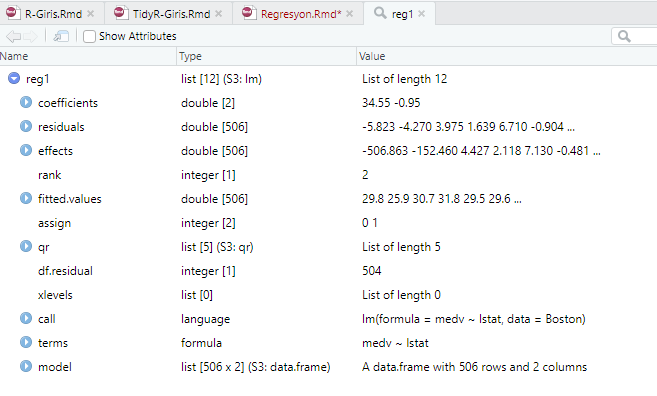

<style type="text/css"> 
body{
  font-size: 12pt;
}
code.r{
  font-size: 12pt;
}
</style>

```{r setup, include=FALSE}
# knitr::opts_chunk$set(echo = TRUE, results = 'asis', fig.show = 'asis')
knitr::opts_chunk$set(echo = TRUE)
``` 

<br/>
<br/>

# R ile Regresyon analizi


## `lm()` fonksiyonu

Base R ile birlikte gelen `lm()` fonksiyonu ile regresyon modellerini tahmin edebilir ve kestirimleri hesaplayabiliriz. Örnek olarak ders kitabında incelediğimiz Boston ev fiyatları veri setini yükleyelim: 
```{r, echo=TRUE, results="hold"}
library(MASS)
library(ISLR)
library(tidyverse)

# Simple Linear Regression
# Boston house data set
names(Boston) 
# see the explanation of the variables
# ?Boston
```

Run the regression of medv (median house value in \$1000) on lower income status

Medyan ev fiyatlarının (medv, 1000\$) düşük gelir (lstat) üzerine basit regresyonunu kuralım: 
```{r}
reg1 <- lm(formula = medv ~ lstat, data=Boston) 
```

`R` regresyon çıktılarının yer aldığı `reg1` isimli bir liste oluşturdu. RStudio-Environment altında `reg1` nesnesine tıklayarak bu listenin içinde nelerin yer altığını görebilirsiniz:
```{r}
names(reg1)
```




Regresyon çıktısının bir özetini görmek için: 
```{r}
summary(reg1)
```

`reg1` listesi içinde yer alan bileşenlere ayrı ayrı ulaşılabilir. Örneğin, katsayıları görmek için 
```{r}
coef(reg1)
```

ya da 
```{r}
reg1$coefficients
```

Denklem formunda yazalım: 
$$\widehat{medv} = 34.55 - 0.950~lstat$$


Regresyon çıktısını tablolaştırmak için çok sayıda başka araçlar geliştirilmiştir. Dilerseniz `broom` paketinde yer alan `tidy()`, `glance()` ve `augment()` fonksiyonlarını kullanabilirsiniz:  
```{r, warning=FALSE}
library(broom)
tidy(reg1)
```
```{r} 
glance(reg1)
```

`broom::augment()` fonksiyonu gözlenen ve tahmin edilen değerleri içeren bir data frame oluşturur: 
```{r} 
augment(reg1)
```


  

Regresyon katsayıları için %95 güven aralığı
```{r}
# 95% confidence interval 
confint(reg1)
```


Verilmiş bir $x$ değerleri için (örneğimizde lstat=(5,10,15)) ortalama değer kestirimi: 
```{r, echo=TRUE, results="hold"}
# reg1 modeliyle kestirimler 
predict(reg1, data.frame(lstat=(c(5,10,15))), interval="confidence")
```

Bir gözlem için kestirimler:  
```{r, echo=TRUE, results="hold"}
# predictions from the model reg1 
# for a single observation
predict(reg1, data.frame(lstat=(c(5,10,15))), interval="prediction")
```

Dikkat edilirse kestirimler hem ortalama için hem de tek bir gözlem için aynı. Ancık Tekil gözlem kestirimlerinin standart hatası daha büyük olduğundan güven aralığı daha geniştir. 

Örneklem-içi fit değerlerinin grafiği  
```{r, echo=TRUE, results="hold"}
plot(Boston$lstat, Boston$medv) 
abline(reg1,lwd=3)
```

Alternatif olarak: 
```{r, echo=TRUE, results="hold"}
# create a new data frame and call it Boston1
# I don't want to modify the original data set
Boston1 <- Boston
Boston1$yhat1 <- predict(reg1, Boston1)

Boston1 %>% ggplot(aes(lstat, medv)) + 
  geom_point() + 
  geom_line(aes(lstat, yhat1, color="red")) +
  theme(legend.position = "none") 
```

Ya da `broom` paketini kullanarak: 
```{r, echo=TRUE, results="hold"}
augment(reg1) %>% 
  ggplot(mapping = aes(x = lstat)) +
  geom_point(mapping = aes(y = medv)) +
  geom_line(mapping = aes(y = .fitted), color = "red")
```  

Bu grafiklerden de görüldüğü gibi bu iki değişken arasında doğrusal olmayan bir ilişki mevcut. Doğrusal regresyon bu ilişkiyi yakalayamıyor gibi görünüyor. Bunu daha net görmek için kalıntıları oluşturup fit edilen değerlere göre grafiğini çizelim: 
```{r, echo=TRUE, results="hold"}
# Residuals vs Fitted values plot
Boston1$resid1 <- residuals(reg1)

Boston1 %>% ggplot(aes(yhat1, resid1)) + 
  geom_point() 
```


Eğer iyi bir uyum olsaydı kalıntıların 0 çevresinde rassal bir şekilde dağılması gerekirdi. Yukarıdaki şekildeyse böyle olmadığını görüyoruz.  

`lm()` tahmininden sonra regresyondaki problemlerin teşhisi için bazı diagnostik grafikler çizilebilir: 
```{r, echo=TRUE, results="hold"}
par(mfrow=c(2,2))
plot(reg1)
```

İlk grafikte daha önce çizdiğimiz residual-fitted serpilme çizimini görüyoruz. Doğrusal olmayan ilişkilerin varlığına işaret ediyordu. 

İkinci grafik normal dağılımdan sapmaları gösteren Q-Q grafiğidir. Standardize edilmiş kalıntılar eğer normal dağılırsa aşağı yukarı kesikli çizginin üzerinde olmalı. Ancak özellikle kuyruklarda normallikten bazı sapmaların olduğunu görüyoruz. Daha fazla kanıt için normallik testleri yapılabilir.

Üçüncü grafik (alt sol) kalıntı ve fit değerlerinin scale-location grafiğini görüyoruz. Dikey eksend standardize edilmiş kalıntıların mutlak değerinin kare kökü yer alıyor. Yine bu grafikte de sıfır çevresinde rassal bir dağılım bekliyoruz. Eğer belirgin bir örüntü varsa bu kalıntıların varyansının sabit olmadığına işaret eder (heteroskedasticity). Yukarıdaki grafik kalıntı varyansının aşağı yukarı sabit olduğunu söylüyor.  

Dördüncü (alt sağ) grafik yüksek etkili gözlemlerin (influential observations) saptanmasında kullanılabilir. Bu gözlemler regresyonu önemli ölçüde etkileyen uç değerlerdir. Grafikte kırmızı kesitli çizgi ile Cook's distance değerleri gösterilmiştir. Bu kırmızı kesikli çizginin dışına düşen değerler yüksek etkili gözlemler olarak düşünülebilir. Grafiğe göre yüksek etkili gözlem yoktur.  


Here is a simulated simple regression together with diagnostic pictures. 
```{r, echo=TRUE, results="hold"}
set.seed(1) # for replication
n   <- 200
x1  <- rnorm(n, mean=0, sd=1) 
y   <- 1 + 2*x1 + rnorm(n, mean=0, sd=1)
df1 <- tibble(id=1:n, y, x1)
reg_df1 <- lm(y ~ x1, data = df1)
# diagnostic plots
par(mfrow=c(2,2))
plot(reg_df1)
```

An alternative diagnostic plot tool that uses `ggplot`: 
```{r, echo=TRUE, results="hold"}
# diagnostics using lindia package 
library(lindia)
reg_df1 %>% gg_diagnose(plot.all=TRUE)
```

# Çok Değişkenli Doğrusal Regresyon 

Boston veri setinde yer alan değişkenlerle bir ev fiyatı modeli oluşturalım. Veri setindeki tüm değişkenleri eklemek için aşağıdaki komutu kullanabiliriz: 
```{r}
reg2 <- lm(medv ~ . , data = Boston)
summary(reg2)
```

Açıklayıcı değişkenlerden birini, diyelim ki `age` değişkenini, dışlamak istersek: 
```{r}
reg3 <- lm(medv ~ . -age, data = Boston)
summary(reg3)
```

`age` ve `indus` değişkenlerini birlikte dışlayalım: 
```{r}
reg4 <- lm(medv ~ . -age -indus, data = Boston)
summary(reg4)
```

Bu model için diagnostik grafikler:  
```{r, echo=TRUE, results="hold"}
par(mfrow=c(2,2))
plot(reg4)
```

 

## Etkileşim Değişkenleri 

`lstat` ve `age` arasındaki etkileşimi (interaction) modele eklemek için: 
```{r}
reg5 <- lm(medv ~ lstat * age, data = Boston)
summary(reg5)
```

Alternatif olarak: 
```{r, echo=TRUE, results="hold"}
reg6 <- lm(medv ~ lstat + age + lstat:age, data = Boston)
summary(reg6)
```

## Doğrusal olmayan dönüştürmeler 

Modele değişkenlerin logaritma, kare, küp, ters, kare kök vb doğrusal olmayan dönüştürmelerini eklemek çok kolaydır. Örneğin,  
```{r, echo=TRUE, results="hold"}
reg7 <- lm(medv ~ lstat + I(lstat^2), data = Boston)
summary(reg7)
```

Karesel terim istatistik bakımından anlamlıdır. Karesel modeli doğrusal modelle karşılaştırmak için `anova` fonksiyonunu kullanabiliriz:  
```{r, echo=TRUE, results="hold"}
anova(reg1, reg7)
```

`reg1` modeli `reg7` modeli içinde yuvalanmıştır (nested). Yukarıdaki ANOVA tablosu ile standart F testi yapmış olduk. Sonuca göre ikinci model (reg7) tercih edilir. 

Bu modelin kalıntılarını tekrar inceleyelim:  
```{r, echo=TRUE, results="hold"}
par(mfrow=c(2,2))
plot(reg7)
```


Yüksek dereceden polinom terimlerini modele eklemek için `poly()` fonksiyonunu kullanabiliriz. Örneğin, `lstat` değişkeninin 5. dereceden polinomu: 
```{r, echo=TRUE, results="hold"}
reg8 <- lm(medv ~ poly(lstat,5), data = Boston)
summary(reg8)
```

## Nitel Değişkenler

Nitel ya da kukla değişkenleri modele kolayca ekleyebiliriz. Örnek olarak ISLR'daki Carseats veri setinden hareketle bir satış modeli kuralım: 
```{r}
library(ISLR)
names(Carseats)
fit1 <- lm(Sales~ . + Income:Advertising + Price:Age, data=Carseats)
summary(fit1)
```

`ShelveLoc` ürünün mağazada raflardaki yerinin kalitesine ilişkin bir kategorik değişkendir. Kötü, orta, ve iyi olmak üzere (bad, medium, good) 3 gruba sahiptir. Eğer bir faktör değişkeni olarak tanımlanmışsa, R otomatik olarak kukla değişkenleri yaratır ve modele ekler. Gruplardan biri baz grup olarak seçilir (modelden dışlanır). 
```{r, echo=TRUE, results="hold"}
contrasts(Carseats$ShelveLoc)
```

# Eğitim ve Test Verilerinde Performans Karşılaştırması

Boston veri setini kullanarak doğrusal ve karesel modellerin kestirim performanslarını karşılaştıralım. Öncelikle verileri rassal olarak eğitim (training) ve test olmak üzere iki parçaya ayırmamız gerekir. Bu amaçla `sample()` fonksiyonunu kullanabiliriz:  
```{r, echo=TRUE, results="hold"}
set.seed(1)
train <- sample(506, 253)
```

Her seferinde aynı sonucu elde etmek için en başta `set.seed()` komutunu da çalıştırmamız gerekir. Aksi takdirde sonuçlar farklılaşacaktır. Veri setinde $n=506$ gözlem vardır. Bunun yarısı rassal olarak modelin eğitiminde diğer yarısı ise performans karşılaştırmasında kullanılacaktır. 

Yukarıda `train` vektörü eğitim setine seçilen gözlemlerin sıra numaralarını içermektedir. Veri setlerini açık olarak belirlemek için: 
```{r, echo=TRUE, results="hold"}
train_Boston <- Boston[train,]
test_Boston <- Boston[-train,]
```

Burada `-train` eğitim veri setinde olmayan gözlemleri seçer. Şimdi eğitim veri setiyle modelleri tahmin edebiliriz:  
```{r, echo=TRUE, results="hold"}
lfit <- lm(medv ~ lstat, data = train_Boston)
qfit <- lm(medv ~ lstat + I(lstat^2), data = train_Boston) 
```

Şimdi kestirimleri sadece test verileriyle yaparak her iki model için Ortalama Hata Karesini (Mean Squared Error - MSE) hesaplayalım: 
```{r, echo=TRUE, results="hold"}
lin_predict <- predict(lfit, test_Boston)
lin_error <- test_Boston$medv - lin_predict
MSE_lfit <- mean(lin_error^2)
MSE_lfit
```

Benzer şekilde karesel model için: 
```{r, echo=TRUE, results="hold"}
qu_predict <- predict(qfit, test_Boston)
qu_error <- test_Boston$medv - qu_predict
MSE_qfit <- mean(qu_error^2)
MSE_qfit
```

Bu sonuçlara göre karesel modelin kestirim performansı daha iyidir.  

# Sapma-Varyans Ödünümü Üzerine

Modelin karmaşıklığı arttıkça sapmanın azaldığını ancak varyansın yükseldiğini biliyoruz. Test kestirim performansı da varyanstaki artışa bağlı olarak kötüleşiyordu. Bunu nümerik olarak göstermek için bir simülasyon deneyi tasarlayalım. Bu deneyde gerçek modeli biliyoruz. Ancak bilmediğimizi farzederek farklı karmaşıklık düzeylerine sahip modeller ile kestirim yapıyoruz. 
Gerçek modelimiz 3. derece polinomdur: 
```{r, echo=TRUE, results="hold"}
set.seed(1) # for replication
n   <- 100
x1  <- runif(n,-2,5)
f   <- -x1^3 + 5*x1^2 -x1 +5 
y   <- f + rnorm(n, mean=0, sd=3)
df <- tibble(id=1:n, y, x1)
head(df) 

df %>% ggplot(aes(x=x1,y=y))+
  geom_point() +
  geom_line(aes(x1,f))
```

Eğitim ve test verilerini belirleyelim:  
```{r, echo=TRUE, results="hold"}
set.seed(1)
train_df <- sample(n,n/2)
# train_df gözlem numaralarıdır 
train_data <- df[train_df,]
test_data <- df[-train_df,]
```

6. dereceye kadar polinom regresyonları tahmin ediyoruz ve MSE değerlerini hesaplıyoruz:   
```{r, echo=TRUE, results="hold"}
maxd = 6
trMSE = rep(0,maxd)
teMSE = rep(0,maxd)

for (i in 1:maxd) {
  trainfit <- lm(y ~ poly(x1, i), data=train_data)
  teMSE[i] <- mean((test_data$y - predict(trainfit, test_data) )^2)
  trMSE[i] <- mean(resid(trainfit)^2)
}
```


```{r, echo=TRUE, results="hold"}
MSE <- tibble(model=rep(1:maxd,2), 
              MSEsubset=rep(c("train","test"), each = maxd), 
              MSE=c(trMSE,teMSE))
MSE
```

MSE grafiği:  
```{r, echo=TRUE, results="hold"}
MSE %>% ggplot(aes(model,MSE, color=MSEsubset))+
  geom_point() + 
  geom_line() 
```

Grafikten görüldüğü gibi, model karmaşıklığı arttıkça eğitim MSE azalmaya devam ediyor. Diğer taraftan test MSE ise 3. derecede en küçük değerini alıyor ve daha sonra artmaya başlıyor.
