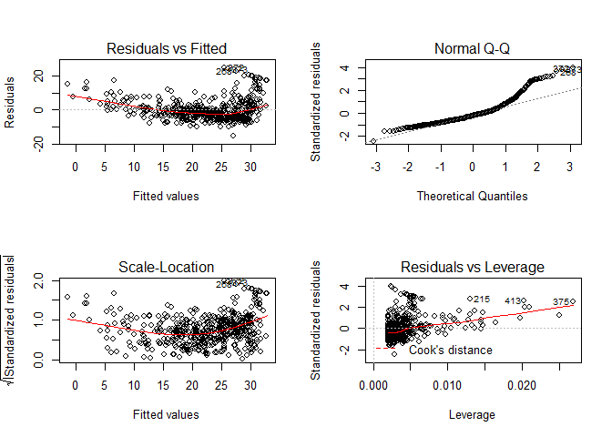

<style type="text/css"> 
body{
  font-size: 12pt;
}
code.r{
  font-size: 12pt;
}
</style>


<br/>
<br/>

# R ile Regresyon analizi


## `lm()` fonksiyonu

Base R ile birlikte gelen `lm()` fonksiyonu ile regresyon modellerini tahmin edebilir ve kestirimleri hesaplayabiliriz. Örnek olarak ders kitabında incelediğimiz Boston ev fiyatları veri setini yükleyelim: 

```r
library(MASS)
library(ISLR)
```

```
## Warning: package 'ISLR' was built under R version 3.6.3
```

```r
library(tidyverse)
```

```
## -- Attaching packages ----------------------------------------------------------- tidyverse 1.2.1 --
```

```
## v ggplot2 3.2.1     v purrr   0.3.3
## v tibble  2.1.3     v dplyr   0.8.3
## v tidyr   1.0.0     v stringr 1.4.0
## v readr   1.3.1     v forcats 0.4.0
```

```
## Warning: package 'purrr' was built under R version 3.6.3
```

```
## -- Conflicts -------------------------------------------------------------- tidyverse_conflicts() --
## x dplyr::filter() masks stats::filter()
## x dplyr::lag()    masks stats::lag()
## x dplyr::select() masks MASS::select()
```

```r
# Simple Linear Regression
# Boston house data set
names(Boston) 
# see the explanation of the variables
# ?Boston
```

```
##  [1] "crim"    "zn"      "indus"   "chas"    "nox"     "rm"      "age"    
##  [8] "dis"     "rad"     "tax"     "ptratio" "black"   "lstat"   "medv"
```

<br>

Medyan ev fiyatlarının (medv, 1000\$) düşük gelir (lstat) üzerine basit regresyonunu kuralım: 

```r
reg1 <- lm(formula = medv ~ lstat, data=Boston) 
```

`R` regresyon çıktılarının yer aldığı `reg1` isimli bir liste oluşturdu. RStudio-Environment altında `reg1` nesnesine tıklayarak bu listenin içinde nelerin yer altığını görebilirsiniz:

```r
names(reg1)
```

```
##  [1] "coefficients"  "residuals"     "effects"       "rank"         
##  [5] "fitted.values" "assign"        "qr"            "df.residual"  
##  [9] "xlevels"       "call"          "terms"         "model"
```


Regresyon çıktısının bir özetini görmek için: 

```r
summary(reg1)
```

```
## 
## Call:
## lm(formula = medv ~ lstat, data = Boston)
## 
## Residuals:
##     Min      1Q  Median      3Q     Max 
## -15.168  -3.990  -1.318   2.034  24.500 
## 
## Coefficients:
##             Estimate Std. Error t value Pr(>|t|)    
## (Intercept) 34.55384    0.56263   61.41   <2e-16 ***
## lstat       -0.95005    0.03873  -24.53   <2e-16 ***
## ---
## Signif. codes:  0 '***' 0.001 '**' 0.01 '*' 0.05 '.' 0.1 ' ' 1
## 
## Residual standard error: 6.216 on 504 degrees of freedom
## Multiple R-squared:  0.5441,	Adjusted R-squared:  0.5432 
## F-statistic: 601.6 on 1 and 504 DF,  p-value: < 2.2e-16
```

`reg1` listesi içinde yer alan bileşenlere ayrı ayrı ulaşılabilir. Örneğin, katsayıları görmek için 

```r
coef(reg1)
```

```
## (Intercept)       lstat 
##  34.5538409  -0.9500494
```

ya da 

```r
reg1$coefficients
```

```
## (Intercept)       lstat 
##  34.5538409  -0.9500494
```

<br>

Denklem formunda yazalım: 
$$\widehat{medv} = 34.55 - 0.950~lstat$$


Regresyon sonuçlarını tablolaştırmak için çok sayıda araç geliştirilmiştir. Örneğin, `broom` paketinde yer alan `tidy()`, `glance()` ve `augment()` fonksiyonlarını kullanabilirsiniz:  

```r
library(broom)
tidy(reg1)
```

```
## # A tibble: 2 x 5
##   term        estimate std.error statistic   p.value
##   <chr>          <dbl>     <dbl>     <dbl>     <dbl>
## 1 (Intercept)   34.6      0.563       61.4 3.74e-236
## 2 lstat         -0.950    0.0387     -24.5 5.08e- 88
```

```r
glance(reg1)
```

```
## # A tibble: 1 x 11
##   r.squared adj.r.squared sigma statistic  p.value    df logLik   AIC   BIC
##       <dbl>         <dbl> <dbl>     <dbl>    <dbl> <int>  <dbl> <dbl> <dbl>
## 1     0.544         0.543  6.22      602. 5.08e-88     2 -1641. 3289. 3302.
## # ... with 2 more variables: deviance <dbl>, df.residual <int>
```

`broom::augment()` fonksiyonu gözlenen ve tahmin edilen değerleri içeren bir data frame oluşturur: 

```r
augment(reg1)
```

```
## # A tibble: 506 x 9
##     medv lstat .fitted .se.fit .resid    .hat .sigma     .cooksd .std.resid
##    <dbl> <dbl>   <dbl>   <dbl>  <dbl>   <dbl>  <dbl>       <dbl>      <dbl>
##  1  24    4.98   29.8    0.406 -5.82  0.00426   6.22 0.00189        -0.939 
##  2  21.6  9.14   25.9    0.308 -4.27  0.00246   6.22 0.000582       -0.688 
##  3  34.7  4.03   30.7    0.433  3.97  0.00486   6.22 0.00100         0.641 
##  4  33.4  2.94   31.8    0.467  1.64  0.00564   6.22 0.000198        0.264 
##  5  36.2  5.33   29.5    0.396  6.71  0.00406   6.21 0.00238         1.08  
##  6  28.7  5.21   29.6    0.399 -0.904 0.00413   6.22 0.0000440      -0.146 
##  7  22.9 12.4    22.7    0.276  0.155 0.00198   6.22 0.000000620     0.0250
##  8  27.1 19.2    16.4    0.374 10.7   0.00362   6.20 0.00544         1.73  
##  9  16.5 29.9     6.12   0.724 10.4   0.0136    6.20 0.0194          1.68  
## 10  18.9 17.1    18.3    0.326  0.592 0.00274   6.22 0.0000125       0.0954
## # ... with 496 more rows
```


<br>  

Regresyon katsayıları için %95 güven aralığı: 

```r
# 95% confidence interval 
confint(reg1)
```

```
##                 2.5 %     97.5 %
## (Intercept) 33.448457 35.6592247
## lstat       -1.026148 -0.8739505
```


Verilmiş bir $x$ değerleri için (örneğimizde lstat=(5,10,15)) ortalama değer kestirimi: 

```r
# reg1 modeliyle kestirimler 
predict(reg1, data.frame(lstat=(c(5,10,15))), interval="confidence")
```

```
##        fit      lwr      upr
## 1 29.80359 29.00741 30.59978
## 2 25.05335 24.47413 25.63256
## 3 20.30310 19.73159 20.87461
```

Bir gözlem için kestirimler:  

```r
# predictions from the model reg1 
# for a single observation
predict(reg1, data.frame(lstat=(c(5,10,15))), interval="prediction")
```

```
##        fit       lwr      upr
## 1 29.80359 17.565675 42.04151
## 2 25.05335 12.827626 37.27907
## 3 20.30310  8.077742 32.52846
```

Dikkat edilirse kestirimler hem ortalama için hem de tek bir gözlem için aynıdır. Ancak tekil gözlem kestirimlerinin standart hatası, ortalama kestiriminin standart hatasına göre çok daha yüksektir. Bu nedenle güven aralığı daha geniştir. 

Örneklem-içi uyum değerlerinin (fitted values) grafiği  

```r
plot(Boston$lstat, Boston$medv) 
abline(reg1,lwd=3)
```

<!-- -->

Alternatif olarak: 

```r
# create a new data frame and call it Boston1
# I don't want to modify the original data set
Boston1 <- Boston
Boston1$yhat1 <- predict(reg1, Boston1)

Boston1 %>% ggplot(aes(lstat, medv)) + 
  geom_point() + 
  geom_line(aes(lstat, yhat1, color="red")) +
  theme(legend.position = "none") 
```

<!-- -->

Ya da `broom` paketini kullanarak: 

```r
augment(reg1) %>% 
  ggplot(mapping = aes(x = lstat)) +
  geom_point(mapping = aes(y = medv)) +
  geom_line(mapping = aes(y = .fitted), color = "red")
```

<!-- -->

Bu grafiklerden de görüldüğü gibi bu iki değişken arasında doğrusal olmayan bir ilişki mevcuttur. Tahmin edilen regresyon modeli bu ilişkiyi tam  yakalayamıyor. Bunu daha net görmek için kalıntıları oluşturup örneklem-içi tahmin edilen değerlere göre grafiğini çizelim: 

```r
# Residuals vs Fitted values plot
Boston1$resid1 <- residuals(reg1)

Boston1 %>% ggplot(aes(yhat1, resid1)) + 
  geom_point() 
```

<!-- -->


Eğer iyi bir uyum olsaydı kalıntıların $0$ çevresinde rassal bir şekilde dağılması gerekirdi. Yukarıdaki şekildeyse böyle olmadığını görüyoruz.  

<br>

`lm()` tahmininden sonra regresyondaki problemlerin teşhisi için bazı diagnostik grafikler çizilebilir: 

```r
par(mfrow=c(2,2))
plot(reg1)
```

<!-- -->

İlk grafikte daha önce çizdiğimiz residual-fitted serpilme çizimini görüyoruz. Doğrusal olmayan ilişkilerin varlığına işaret ediyordu. 

İkinci grafik normal dağılımdan sapmaları gösteren Q-Q grafiğidir. Standardize edilmiş kalıntılar eğer normal dağılırsa aşağı yukarı kesikli çizginin üzerinde olmalı. Ancak özellikle kuyruklarda normallikten bazı sapmaların olduğunu görüyoruz. Daha fazla kanıt için normallik testleri yapılabilir.

Üçüncü grafik (alt sol) kalıntı ve fit değerlerinin scale-location grafiğini görüyoruz. Dikey eksende standardize edilmiş kalıntıların mutlak değerinin kare kökü yer alıyor. Yine bu grafikte de sıfır çevresinde rassal bir dağılım bekliyoruz. Eğer belirgin bir örüntü varsa bu kalıntıların varyansının sabit olmadığına işaret eder (heteroskedasticity). Yukarıdaki grafik kalıntı varyansının aşağı yukarı sabit olduğunu söylüyor.  

Dördüncü (alt sağ) grafik yüksek etkili gözlemlerin (influential observations) saptanmasında kullanılabilir. Bu gözlemler regresyonu önemli ölçüde etkileyen uç değerlerdir. Grafikte kırmızı kesitli çizgi ile Cook's distance değerleri gösterilmiştir. Bu kırmızı kesikli çizginin dışına düşen değerler yüksek etkili gözlemler olarak düşünülebilir. Grafiğe göre yüksek etkili gözlem yoktur.  

<br>
**Örnek**: Simülasyonla bir veri seti türeterek regresyon modeli tahmin edelim ve tanısal grafikleri çizelim. 

```r
set.seed(1) # aynı sonuçları elde etmek için 
n   <- 200
x1  <- rnorm(n, mean=0, sd=1) 
y   <- 1 + 2*x1 + rnorm(n, mean=0, sd=1)  # popülasyon regresyon modeli biliniyor
df1 <- tibble(id=1:n, y, x1)
reg_df1 <- lm(y ~ x1, data = df1)
# diagnostic plots
par(mfrow=c(2,2))
plot(reg_df1)
```

<!-- -->

`ggplot` ile alternatif tanısal grafikler: 

```r
# lindia paketi yüklenmeli 
library(lindia)
```

```
## Warning: package 'lindia' was built under R version 3.6.2
```

```r
reg_df1 %>% gg_diagnose(plot.all=TRUE)
```

```
## `stat_bin()` using `bins = 30`. Pick better value with `binwidth`.
```

<!-- -->


<br>
<br>
# Çok Değişkenli Doğrusal Regresyon 

Boston veri setinde yer alan değişkenlerle bir ev fiyatı modeli oluşturalım. Veri setindeki tüm değişkenleri eklemek için aşağıdaki komutu kullanabiliriz: 

```r
reg2 <- lm(medv ~ . , data = Boston)
summary(reg2)
```

```
## 
## Call:
## lm(formula = medv ~ ., data = Boston)
## 
## Residuals:
##     Min      1Q  Median      3Q     Max 
## -15.595  -2.730  -0.518   1.777  26.199 
## 
## Coefficients:
##               Estimate Std. Error t value Pr(>|t|)    
## (Intercept)  3.646e+01  5.103e+00   7.144 3.28e-12 ***
## crim        -1.080e-01  3.286e-02  -3.287 0.001087 ** 
## zn           4.642e-02  1.373e-02   3.382 0.000778 ***
## indus        2.056e-02  6.150e-02   0.334 0.738288    
## chas         2.687e+00  8.616e-01   3.118 0.001925 ** 
## nox         -1.777e+01  3.820e+00  -4.651 4.25e-06 ***
## rm           3.810e+00  4.179e-01   9.116  < 2e-16 ***
## age          6.922e-04  1.321e-02   0.052 0.958229    
## dis         -1.476e+00  1.995e-01  -7.398 6.01e-13 ***
## rad          3.060e-01  6.635e-02   4.613 5.07e-06 ***
## tax         -1.233e-02  3.760e-03  -3.280 0.001112 ** 
## ptratio     -9.527e-01  1.308e-01  -7.283 1.31e-12 ***
## black        9.312e-03  2.686e-03   3.467 0.000573 ***
## lstat       -5.248e-01  5.072e-02 -10.347  < 2e-16 ***
## ---
## Signif. codes:  0 '***' 0.001 '**' 0.01 '*' 0.05 '.' 0.1 ' ' 1
## 
## Residual standard error: 4.745 on 492 degrees of freedom
## Multiple R-squared:  0.7406,	Adjusted R-squared:  0.7338 
## F-statistic: 108.1 on 13 and 492 DF,  p-value: < 2.2e-16
```

Açıklayıcı değişkenlerden birini, diyelim ki `age` değişkenini, dışlamak istersek: 

```r
reg3 <- lm(medv ~ . -age, data = Boston)
summary(reg3)
```

```
## 
## Call:
## lm(formula = medv ~ . - age, data = Boston)
## 
## Residuals:
##      Min       1Q   Median       3Q      Max 
## -15.6054  -2.7313  -0.5188   1.7601  26.2243 
## 
## Coefficients:
##               Estimate Std. Error t value Pr(>|t|)    
## (Intercept)  36.436927   5.080119   7.172 2.72e-12 ***
## crim         -0.108006   0.032832  -3.290 0.001075 ** 
## zn            0.046334   0.013613   3.404 0.000719 ***
## indus         0.020562   0.061433   0.335 0.737989    
## chas          2.689026   0.859598   3.128 0.001863 ** 
## nox         -17.713540   3.679308  -4.814 1.97e-06 ***
## rm            3.814394   0.408480   9.338  < 2e-16 ***
## dis          -1.478612   0.190611  -7.757 5.03e-14 ***
## rad           0.305786   0.066089   4.627 4.75e-06 ***
## tax          -0.012329   0.003755  -3.283 0.001099 ** 
## ptratio      -0.952211   0.130294  -7.308 1.10e-12 ***
## black         0.009321   0.002678   3.481 0.000544 ***
## lstat        -0.523852   0.047625 -10.999  < 2e-16 ***
## ---
## Signif. codes:  0 '***' 0.001 '**' 0.01 '*' 0.05 '.' 0.1 ' ' 1
## 
## Residual standard error: 4.74 on 493 degrees of freedom
## Multiple R-squared:  0.7406,	Adjusted R-squared:  0.7343 
## F-statistic: 117.3 on 12 and 493 DF,  p-value: < 2.2e-16
```

`age` ve `indus` değişkenlerini birlikte dışlayalım: 

```r
reg4 <- lm(medv ~ . -age -indus, data = Boston)
summary(reg4)
```

```
## 
## Call:
## lm(formula = medv ~ . - age - indus, data = Boston)
## 
## Residuals:
##      Min       1Q   Median       3Q      Max 
## -15.5984  -2.7386  -0.5046   1.7273  26.2373 
## 
## Coefficients:
##               Estimate Std. Error t value Pr(>|t|)    
## (Intercept)  36.341145   5.067492   7.171 2.73e-12 ***
## crim         -0.108413   0.032779  -3.307 0.001010 ** 
## zn            0.045845   0.013523   3.390 0.000754 ***
## chas          2.718716   0.854240   3.183 0.001551 ** 
## nox         -17.376023   3.535243  -4.915 1.21e-06 ***
## rm            3.801579   0.406316   9.356  < 2e-16 ***
## dis          -1.492711   0.185731  -8.037 6.84e-15 ***
## rad           0.299608   0.063402   4.726 3.00e-06 ***
## tax          -0.011778   0.003372  -3.493 0.000521 ***
## ptratio      -0.946525   0.129066  -7.334 9.24e-13 ***
## black         0.009291   0.002674   3.475 0.000557 ***
## lstat        -0.522553   0.047424 -11.019  < 2e-16 ***
## ---
## Signif. codes:  0 '***' 0.001 '**' 0.01 '*' 0.05 '.' 0.1 ' ' 1
## 
## Residual standard error: 4.736 on 494 degrees of freedom
## Multiple R-squared:  0.7406,	Adjusted R-squared:  0.7348 
## F-statistic: 128.2 on 11 and 494 DF,  p-value: < 2.2e-16
```

Bu model için diagnostik grafikler:  

```r
par(mfrow=c(2,2))
plot(reg4)
```

<!-- -->

 

## Etkileşim Değişkenleri 

`lstat` ve `age` arasındaki etkileşimi (interaction) modele eklemek için: 

```r
reg5 <- lm(medv ~ lstat * age, data = Boston)
summary(reg5)
```

```
## 
## Call:
## lm(formula = medv ~ lstat * age, data = Boston)
## 
## Residuals:
##     Min      1Q  Median      3Q     Max 
## -15.806  -4.045  -1.333   2.085  27.552 
## 
## Coefficients:
##               Estimate Std. Error t value Pr(>|t|)    
## (Intercept) 36.0885359  1.4698355  24.553  < 2e-16 ***
## lstat       -1.3921168  0.1674555  -8.313 8.78e-16 ***
## age         -0.0007209  0.0198792  -0.036   0.9711    
## lstat:age    0.0041560  0.0018518   2.244   0.0252 *  
## ---
## Signif. codes:  0 '***' 0.001 '**' 0.01 '*' 0.05 '.' 0.1 ' ' 1
## 
## Residual standard error: 6.149 on 502 degrees of freedom
## Multiple R-squared:  0.5557,	Adjusted R-squared:  0.5531 
## F-statistic: 209.3 on 3 and 502 DF,  p-value: < 2.2e-16
```

Alternatif olarak: 

```r
reg6 <- lm(medv ~ lstat + age + lstat:age, data = Boston)
summary(reg6)
```

```
## 
## Call:
## lm(formula = medv ~ lstat + age + lstat:age, data = Boston)
## 
## Residuals:
##     Min      1Q  Median      3Q     Max 
## -15.806  -4.045  -1.333   2.085  27.552 
## 
## Coefficients:
##               Estimate Std. Error t value Pr(>|t|)    
## (Intercept) 36.0885359  1.4698355  24.553  < 2e-16 ***
## lstat       -1.3921168  0.1674555  -8.313 8.78e-16 ***
## age         -0.0007209  0.0198792  -0.036   0.9711    
## lstat:age    0.0041560  0.0018518   2.244   0.0252 *  
## ---
## Signif. codes:  0 '***' 0.001 '**' 0.01 '*' 0.05 '.' 0.1 ' ' 1
## 
## Residual standard error: 6.149 on 502 degrees of freedom
## Multiple R-squared:  0.5557,	Adjusted R-squared:  0.5531 
## F-statistic: 209.3 on 3 and 502 DF,  p-value: < 2.2e-16
```

## Doğrusal olmayan dönüştürmeler 

Modele değişkenlerin logaritma, kare, küp, ters, kare kök vb doğrusal olmayan dönüştürmelerini eklemek çok kolaydır. Örneğin,  

```r
reg7 <- lm(medv ~ lstat + I(lstat^2), data = Boston)
summary(reg7)
```

```
## 
## Call:
## lm(formula = medv ~ lstat + I(lstat^2), data = Boston)
## 
## Residuals:
##      Min       1Q   Median       3Q      Max 
## -15.2834  -3.8313  -0.5295   2.3095  25.4148 
## 
## Coefficients:
##              Estimate Std. Error t value Pr(>|t|)    
## (Intercept) 42.862007   0.872084   49.15   <2e-16 ***
## lstat       -2.332821   0.123803  -18.84   <2e-16 ***
## I(lstat^2)   0.043547   0.003745   11.63   <2e-16 ***
## ---
## Signif. codes:  0 '***' 0.001 '**' 0.01 '*' 0.05 '.' 0.1 ' ' 1
## 
## Residual standard error: 5.524 on 503 degrees of freedom
## Multiple R-squared:  0.6407,	Adjusted R-squared:  0.6393 
## F-statistic: 448.5 on 2 and 503 DF,  p-value: < 2.2e-16
```

Karesel terim istatistik bakımından anlamlıdır. Karesel modeli doğrusal modelle karşılaştırmak için `anova` fonksiyonunu kullanabiliriz:  

```r
anova(reg1, reg7)
```

```
## Analysis of Variance Table
## 
## Model 1: medv ~ lstat
## Model 2: medv ~ lstat + I(lstat^2)
##   Res.Df   RSS Df Sum of Sq     F    Pr(>F)    
## 1    504 19472                                 
## 2    503 15347  1    4125.1 135.2 < 2.2e-16 ***
## ---
## Signif. codes:  0 '***' 0.001 '**' 0.01 '*' 0.05 '.' 0.1 ' ' 1
```

`reg1` modeli `reg7` modeli içinde yuvalanmıştır (nested). Yukarıdaki ANOVA tablosu ile standart F testi yapmış olduk. Sonuca göre ikinci model (reg7) tercih edilir. 

Bu modelin kalıntılarını tekrar inceleyelim:  

```r
par(mfrow=c(2,2))
plot(reg7)
```

<!-- -->


Yüksek dereceden polinom terimlerini modele eklemek için `poly()` fonksiyonunu kullanabiliriz. Örneğin, `lstat` değişkeninin 5. dereceden polinomu: 

```r
reg8 <- lm(medv ~ poly(lstat,5), data = Boston)
summary(reg8)
```

```
## 
## Call:
## lm(formula = medv ~ poly(lstat, 5), data = Boston)
## 
## Residuals:
##      Min       1Q   Median       3Q      Max 
## -13.5433  -3.1039  -0.7052   2.0844  27.1153 
## 
## Coefficients:
##                  Estimate Std. Error t value Pr(>|t|)    
## (Intercept)       22.5328     0.2318  97.197  < 2e-16 ***
## poly(lstat, 5)1 -152.4595     5.2148 -29.236  < 2e-16 ***
## poly(lstat, 5)2   64.2272     5.2148  12.316  < 2e-16 ***
## poly(lstat, 5)3  -27.0511     5.2148  -5.187 3.10e-07 ***
## poly(lstat, 5)4   25.4517     5.2148   4.881 1.42e-06 ***
## poly(lstat, 5)5  -19.2524     5.2148  -3.692 0.000247 ***
## ---
## Signif. codes:  0 '***' 0.001 '**' 0.01 '*' 0.05 '.' 0.1 ' ' 1
## 
## Residual standard error: 5.215 on 500 degrees of freedom
## Multiple R-squared:  0.6817,	Adjusted R-squared:  0.6785 
## F-statistic: 214.2 on 5 and 500 DF,  p-value: < 2.2e-16
```

## Nitel Değişkenler

Nitel ya da kukla değişkenleri modele kolayca ekleyebiliriz. Örnek olarak ISLR'daki Carseats veri setinden hareketle bir satış modeli kuralım: 

```r
library(ISLR)
names(Carseats)
```

```
##  [1] "Sales"       "CompPrice"   "Income"      "Advertising" "Population" 
##  [6] "Price"       "ShelveLoc"   "Age"         "Education"   "Urban"      
## [11] "US"
```

```r
fit1 <- lm(Sales~ . + Income:Advertising + Price:Age, data=Carseats)
summary(fit1)
```

```
## 
## Call:
## lm(formula = Sales ~ . + Income:Advertising + Price:Age, data = Carseats)
## 
## Residuals:
##     Min      1Q  Median      3Q     Max 
## -2.9208 -0.7503  0.0177  0.6754  3.3413 
## 
## Coefficients:
##                      Estimate Std. Error t value Pr(>|t|)    
## (Intercept)         6.5755654  1.0087470   6.519 2.22e-10 ***
## CompPrice           0.0929371  0.0041183  22.567  < 2e-16 ***
## Income              0.0108940  0.0026044   4.183 3.57e-05 ***
## Advertising         0.0702462  0.0226091   3.107 0.002030 ** 
## Population          0.0001592  0.0003679   0.433 0.665330    
## Price              -0.1008064  0.0074399 -13.549  < 2e-16 ***
## ShelveLocGood       4.8486762  0.1528378  31.724  < 2e-16 ***
## ShelveLocMedium     1.9532620  0.1257682  15.531  < 2e-16 ***
## Age                -0.0579466  0.0159506  -3.633 0.000318 ***
## Education          -0.0208525  0.0196131  -1.063 0.288361    
## UrbanYes            0.1401597  0.1124019   1.247 0.213171    
## USYes              -0.1575571  0.1489234  -1.058 0.290729    
## Income:Advertising  0.0007510  0.0002784   2.698 0.007290 ** 
## Price:Age           0.0001068  0.0001333   0.801 0.423812    
## ---
## Signif. codes:  0 '***' 0.001 '**' 0.01 '*' 0.05 '.' 0.1 ' ' 1
## 
## Residual standard error: 1.011 on 386 degrees of freedom
## Multiple R-squared:  0.8761,	Adjusted R-squared:  0.8719 
## F-statistic:   210 on 13 and 386 DF,  p-value: < 2.2e-16
```

`ShelveLoc` ürünün mağazada raflardaki yerinin kalitesine ilişkin bir kategorik değişkendir. Kötü, orta, ve iyi olmak üzere (bad, medium, good) 3 gruba sahiptir. Eğer bir faktör değişkeni olarak tanımlanmışsa, R otomatik olarak kukla değişkenleri yaratır ve modele ekler. Gruplardan biri baz grup olarak seçilir (modelden dışlanır). 

```r
contrasts(Carseats$ShelveLoc)
```

```
##        Good Medium
## Bad       0      0
## Good      1      0
## Medium    0      1
```

# Eğitim ve Test Verilerinde Performans Karşılaştırması

Boston veri setini kullanarak doğrusal ve karesel modellerin kestirim performanslarını karşılaştıralım. Öncelikle verileri rassal olarak eğitim (training) ve test olmak üzere iki parçaya ayırmamız gerekir. Bu amaçla `sample()` fonksiyonunu kullanabiliriz:  

```r
set.seed(1)
train <- sample(506, 253)
```

Her seferinde aynı sonucu elde etmek için en başta `set.seed()` komutunu da çalıştırmamız gerekir. Aksi takdirde sonuçlar farklılaşacaktır. Veri setinde $n=506$ gözlem vardır. Bunun yarısı rassal olarak modelin eğitiminde diğer yarısı ise performans karşılaştırmasında kullanılacaktır. 

Yukarıda `train` vektörü eğitim setine seçilen gözlemlerin sıra numaralarını içermektedir. Veri setlerini açık olarak belirlemek için: 

```r
train_Boston <- Boston[train,]
test_Boston <- Boston[-train,]
```

Burada `-train` eğitim veri setinde olmayan gözlemleri seçer. Şimdi eğitim veri setiyle modelleri tahmin edebiliriz:  

```r
lfit <- lm(medv ~ lstat, data = train_Boston)
qfit <- lm(medv ~ lstat + I(lstat^2), data = train_Boston) 
```

Şimdi kestirimleri sadece test verileriyle yaparak her iki model için Ortalama Hata Karesini (Mean Squared Error - MSE) hesaplayalım: 

```r
lin_predict <- predict(lfit, test_Boston)
lin_error <- test_Boston$medv - lin_predict
MSE_lfit <- mean(lin_error^2)
MSE_lfit
```

```
## [1] 43.34683
```

Benzer şekilde karesel model için: 

```r
qu_predict <- predict(qfit, test_Boston)
qu_error <- test_Boston$medv - qu_predict
MSE_qfit <- mean(qu_error^2)
MSE_qfit
```

```
## [1] 36.126
```

Bu sonuçlara göre karesel modelin kestirim performansı daha iyidir.  

# Sapma-Varyans Ödünümü Üzerine

Modelin karmaşıklığı arttıkça sapmanın azaldığını ancak varyansın yükseldiğini biliyoruz. Test kestirim performansı da varyanstaki artışa bağlı olarak kötüleşiyordu. Bunu nümerik olarak göstermek için bir simülasyon deneyi tasarlayalım. Bu deneyde gerçek modeli biliyoruz. Ancak bilmediğimizi farzederek farklı karmaşıklık düzeylerine sahip modeller ile kestirim yapıyoruz. 
Gerçek modelimiz 3. derece bir polinomdur: 

```r
set.seed(1) # for replication
n   <- 100
x1  <- runif(n,-2,5)
f   <- -x1^3 + 5*x1^2 -x1 +5 
y   <- f + rnorm(n, mean=0, sd=3)
df <- tibble(id=1:n, y, x1)
head(df) 

df %>% ggplot(aes(x=x1,y=y))+
  geom_point() +
  geom_line(aes(x1,f))
```

<!-- -->

```
## # A tibble: 6 x 3
##      id     y     x1
##   <int> <dbl>  <dbl>
## 1     1  6.44 -0.141
## 2     2  4.17  0.605
## 3     3 16.1   2.01 
## 4     4  9.45  4.36 
## 5     5 11.8  -0.588
## 6     6 19.7   4.29
```

Eğitim ve test verilerini belirleyelim:  

```r
set.seed(1)
train_df <- sample(n,n/2)
# train_df gözlem numaralarıdır 
train_data <- df[train_df,]
test_data <- df[-train_df,]
```

6. dereceye kadar polinom regresyonları tahmin ediyoruz ve MSE değerlerini hesaplıyoruz:   

```r
maxd = 6
trMSE = rep(0,maxd)
teMSE = rep(0,maxd)

for (i in 1:maxd) {
  trainfit <- lm(y ~ poly(x1, i), data=train_data)
  teMSE[i] <- mean((test_data$y - predict(trainfit, test_data) )^2)
  trMSE[i] <- mean(resid(trainfit)^2)
}
```


```r
MSE <- tibble(model=rep(1:maxd,2), 
              MSEsubset=rep(c("train","test"), each = maxd), 
              MSE=c(trMSE,teMSE))
MSE
```

```
## # A tibble: 12 x 3
##    model MSEsubset   MSE
##    <int> <chr>     <dbl>
##  1     1 train     44.1 
##  2     2 train     44.0 
##  3     3 train      7.08
##  4     4 train      5.76
##  5     5 train      5.65
##  6     6 train      5.65
##  7     1 test      45.1 
##  8     2 test      42.9 
##  9     3 test      10.1 
## 10     4 test      15.0 
## 11     5 test      17.3 
## 12     6 test      16.9
```

MSE grafiği:  

```r
MSE %>% ggplot(aes(model,MSE, color=MSEsubset))+
  geom_point() + 
  geom_line() 
```

<!-- -->

Grafikten görüldüğü gibi, model karmaşıklığı arttıkça eğitim MSE azalmaya devam ediyor. Diğer taraftan test MSE ise 3. derecede en küçük değerini alıyor ve daha sonra artmaya başlıyor.
