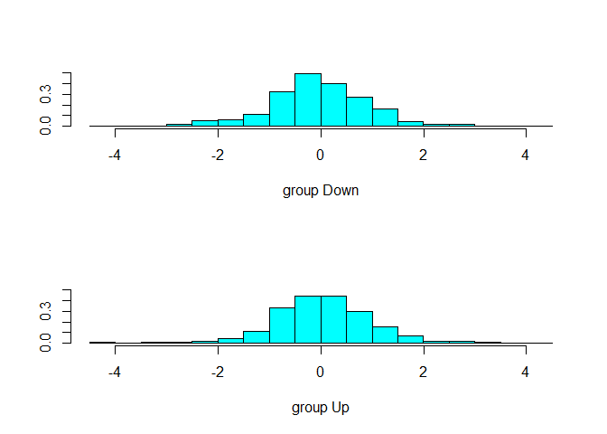

<style type="text/css"> 
body{
  font-size: 12pt;
}
code.r{
  font-size: 12pt;
}
</style>


<br/>
<br/>


# Lojistik Regresyon

## Örnek: Hisse senedi piyasasının yönünü tahmin etmek 

(Detaylar için bkz. James et al., ISLR, p.154)

```r
library(MASS)
library(ISLR)
library(tidyverse)
```

```
## -- Attaching packages ------------------------------------------------------------ tidyverse 1.2.1 --
```

```
## v ggplot2 3.2.1     v purrr   0.3.3
## v tibble  2.1.3     v dplyr   0.8.3
## v tidyr   1.0.0     v stringr 1.4.0
## v readr   1.3.1     v forcats 0.4.0
```

```
## -- Conflicts --------------------------------------------------------------- tidyverse_conflicts() --
## x dplyr::filter() masks stats::filter()
## x dplyr::lag()    masks stats::lag()
## x dplyr::select() masks MASS::select()
```

```r
head(Smarket) 
```

```
##   Year   Lag1   Lag2   Lag3   Lag4   Lag5 Volume  Today Direction
## 1 2001  0.381 -0.192 -2.624 -1.055  5.010 1.1913  0.959        Up
## 2 2001  0.959  0.381 -0.192 -2.624 -1.055 1.2965  1.032        Up
## 3 2001  1.032  0.959  0.381 -0.192 -2.624 1.4112 -0.623      Down
## 4 2001 -0.623  1.032  0.959  0.381 -0.192 1.2760  0.614        Up
## 5 2001  0.614 -0.623  1.032  0.959  0.381 1.2057  0.213        Up
## 6 2001  0.213  0.614 -0.623  1.032  0.959 1.3491  1.392        Up
```

ISLR paketinde yer alan `Smarket` veri seti S&P500 endeksinin 2001-2005 dönemine ait 1250 günlük getirilerini içermektedir. `Today` sütunu bugünkü getiriyi göstermektedir. Bu değişkenin işareti, yani piyasanın yönü ise, `Direction` isimli sütundadır. `Direction` iki kategoriye sahiptir: Up (positif getiri) - Down (negatif getiri). Veri setinde ayrıca getirinin 5-günlük gecikmeli değerleri ve piyasa hacmini içeren `Volume` değişkeni yer almaktadır.  

Günlük getiri grafiği: 

```r
Smarket %>% 
  mutate(day=1:nrow(Smarket)) %>% 
  ggplot(aes(x=day,y=Today)) + 
  geom_line()
```

<!-- -->

Kestirim sorusu: Geçmiş bilgiden hareketle piyasanın bugünkü yönünü (up ya da down) tahmin edebilir miyiz?

```r
n <- length(Smarket$Direction)
table(Smarket$Direction)/n
Smarket %>%  
  ggplot(aes(x=Today)) + 
  geom_histogram()
```

```
## `stat_bin()` using `bins = 30`. Pick better value with `binwidth`.
```

<!-- -->

```
## 
##   Down     Up 
## 0.4816 0.5184
```

##  `glm()` fonksiyonu

Lojistik regresyon modeli tahmin etmek için `glm()` fonksiyonunu `family = binomial` opsiyonu ile birlikte kullanabiliriz:

```r
# Logistic regression 
glm.fit <- glm(Direction ~ Lag1 + Lag2 + Lag3 +
                 Lag4 + Lag5 + Volume, data = Smarket, family = binomial)
summary(glm.fit) 
```

```
## 
## Call:
## glm(formula = Direction ~ Lag1 + Lag2 + Lag3 + Lag4 + Lag5 + 
##     Volume, family = binomial, data = Smarket)
## 
## Deviance Residuals: 
##    Min      1Q  Median      3Q     Max  
## -1.446  -1.203   1.065   1.145   1.326  
## 
## Coefficients:
##              Estimate Std. Error z value Pr(>|z|)
## (Intercept) -0.126000   0.240736  -0.523    0.601
## Lag1        -0.073074   0.050167  -1.457    0.145
## Lag2        -0.042301   0.050086  -0.845    0.398
## Lag3         0.011085   0.049939   0.222    0.824
## Lag4         0.009359   0.049974   0.187    0.851
## Lag5         0.010313   0.049511   0.208    0.835
## Volume       0.135441   0.158360   0.855    0.392
## 
## (Dispersion parameter for binomial family taken to be 1)
## 
##     Null deviance: 1731.2  on 1249  degrees of freedom
## Residual deviance: 1727.6  on 1243  degrees of freedom
## AIC: 1741.6
## 
## Number of Fisher Scoring iterations: 3
```

Yukarıdaki modelde tüm değişkenleri (5 gecikme ve piyasa hacmi) modele ekledik. 
Şimdi piyasanın yönünü `predict()` fonksiyonunu kullanarak kestirebiliriz: 

```r
glm.probs <- predict(glm.fit, type = "response")
glm.probs[1:10] 
```

```
##         1         2         3         4         5         6         7 
## 0.5070841 0.4814679 0.4811388 0.5152224 0.5107812 0.5069565 0.4926509 
##         8         9        10 
## 0.5092292 0.5176135 0.4888378
```

Yukarıdaki çıktıda ilk 10 gözleme ilişkin kestirim değerlerini (koşullu olasılık tahminlerini) yazdırdık. Bu koşullu olasılık tahminlerinin ait olduğu sınıfları görmek için `contrasts()` fonksiyonunu kullanabiliriz: 


```r
contrasts(Smarket$Direction)
```

```
##      Up
## Down  0
## Up    1
```

Görüldüğü gibi kukla (dummy) değişken Up sınıfı için 1 Down için 0 değerini almaktadır. 

Koşullu olasılıkları tahmin ettik. Ancak asıl amacımız sınıflandırma yapmaktı. Yani bugünkü piyasanın yönünü sınıflandırmaktı. Bunun için koşullu olasılıkları ikili kestirimlere (yukarı, aşağı) dönüştürmemiz gerekir. Derste gördüğümüz gibi 0.5 değerini aşan koşullu olasılıklar için Up, 0.5'den küçük değerler için Down kestirimi yapacağız: 

```r
# tüm elemanları "Down" olan bir n-vektör yarat
glm.pred <- rep("Down", n)
# 0.5 üzeri olasılıkları "Up" olarak sınıfla
glm.pred[glm.probs>.5] = "Up"
# kestirim ile gerçek çapraz tablo
table(glm.pred, Smarket$Direction)
```

```
##         
## glm.pred Down  Up
##     Down  145 141
##     Up    457 507
```

Modelce tahmin edilen yön ile gerçek yön arasındaki sınıflama performansını özetleyen hata matrisini (confusion matrix) de elde ettik. Buna göre ana köşegen doğru sınıflanan gözlem sayılarını, köşegen dışı elemanlar ise yanlış sınıflama sayılarını göstermektedir. Sonuçlara göre lojistik regresyon modeli 145 gün Down, 507 günü ise Up olarak doğru sınıflandırmıştır (toplam doğru sınıflanan gözlem sayısı 652). Doğru sınıflama başarı oranı ya da doğruluk oranı (accuracy rate) kolayca hesaplanabilir: 

```r
(507+145)/n
```

```
## [1] 0.5216
```

ya da 

```r
mean(glm.pred==Smarket$Direction)
```

```
## [1] 0.5216
```

Modelin doğruluk oranı yaklaşık %52.2'dir. Eğitim seti hata oranı ise 100-52.2 = %47.8'dir. 
Bu sonuçlara göre modelin başarısı yazı-tura ile tahmin yapmaktan biraz daha iyidir. Başka bir açıdan şöyle de bakılabilir: piyasanın hep yukarı yönlü hareket edeceğini öngörsek başarı oranımız kaç olurdu? Verilerden bunun yaklaşık %51.84 (= 100*648/1250) olduğunu görüyoruz.  

Ancak model performansını daha iyi değerlendirmek için kestirim hata oranını test veri setinde (verilerin eğitimde kullanılmayan kısmı) hesaplamamız gerekir. 

Sınıflandırma hata matrisini hesaplamanın bir çok yolu vardır. Bunlardan biri `caret` paketinde yer alan `confusionMatrix(predictions, actual)` fonksiyonunu kullanmaktır. Bu fonksiyonun ilk girdisi modelin kestirimleri, ikinci girdisi gerçek değerlerdir. Her iki değişken de faktör değişkeni olmalı ve aynı grup tanımlarına sahip olmalıdır. 

```r
library(caret) 
```

```
## Warning: package 'caret' was built under R version 3.6.3
```

```
## Loading required package: lattice
```

```
## 
## Attaching package: 'caret'
```

```
## The following object is masked from 'package:purrr':
## 
##     lift
```

```r
# 
glm.pred <- as.factor(glm.pred)
# Positive grup kuklanın = 1 değerini aldığı gruptur
confusionMatrix(glm.pred, Smarket$Direction, positive = "Up")
```

```
## Confusion Matrix and Statistics
## 
##           Reference
## Prediction Down  Up
##       Down  145 141
##       Up    457 507
##                                           
##                Accuracy : 0.5216          
##                  95% CI : (0.4935, 0.5496)
##     No Information Rate : 0.5184          
##     P-Value [Acc > NIR] : 0.4216          
##                                           
##                   Kappa : 0.0237          
##                                           
##  Mcnemar's Test P-Value : <2e-16          
##                                           
##             Sensitivity : 0.7824          
##             Specificity : 0.2409          
##          Pos Pred Value : 0.5259          
##          Neg Pred Value : 0.5070          
##              Prevalence : 0.5184          
##          Detection Rate : 0.4056          
##    Detection Prevalence : 0.7712          
##       Balanced Accuracy : 0.5116          
##                                           
##        'Positive' Class : Up              
## 
```

`confusionMatrix()` fonksiyonu hata matrisinin yanı sıra çok sayıda istatistik hesaplamaktadır. Ayrıca duyarlılık (sensitivity) ve belirlilik (specificity) gibi çeşitli ölçüleri de raporlamaktadır. Piyasa yön sınıflamasınnda duyarlılık gerçek yukarı yönlü (Up) sınıflandırılan hareketlerin oranıdır, yani 507/(141+507)= 0.7824, %78.24. Belirlilik ise aşağı yönlü hareketler içinde doğru sınıflananların oranıdır: 145/(145+457)= 0.2409, %24.09. 


Daha önce belirttiğimiz gibi lojistk model 457+141 = 598 günü yanlış sınıflamıştır (**eğitim hata oranı** =  % 47.8). Daha gerçekçi bir hata oranı hesaplamak için verilerin tahminde kullanılmayan kısmında hatalı sınıflama oranını hesaplamak gerekir.  

Bu amaçla, veri setinin 2001-2004 yıllarına ait kısmını eğitim veri seti, 2005 yılını ise test veri seti olarak ayıracağız. 

```r
# Eğitim veri seti indikatörü yarat
train <- (Smarket$Year<2005)
# test verileri 
Smarket.2005 <- Smarket[!train,]
dim(Smarket.2005)
```

```
## [1] 252   9
```

```r
# test verilerinde gözlemlenen piyasa yönü: 
Direction.2005 <- Smarket$Direction[!train]
```

Yukarıdaki kod parçasında `train`  `TRUE` veya `FALSE` elemanları olan bir mantıksal vektördür. Şimdi modelimizi eğitim veri setiyle tekrar tahmin ediyoruz: 

```r
# modeli eğitim verisiyle tahmin et 
glm.fit <- glm(Direction ~ Lag1 + Lag2 + Lag3 + Lag4 + Lag5 + Volume, data = Smarket,
               family = binomial, subset = train)
```

Yukarıda `glm()` fonksiyonu içinde eğitim setini gösteren `subset = train` opsiyonunu kullandığımıza dikkat ediniz. 

Şimdi test setinde kestirimleri yapalım: 

```r
# test verisinde tahmin edilen olasılıklar
glm.probs <- predict(glm.fit, Smarket.2005, type = "response")
```

Model ne kadar başarılı? Bunu sadece test verileri içinde ölçeceğiz:  

```r
glm.pred <- rep("Down", 252)
# classify probs>0.5 as up
glm.pred[glm.probs>.5] <- "Up"
# table: 
table(glm.pred,Direction.2005)
```

```
##         Direction.2005
## glm.pred Down Up
##     Down   77 97
##     Up     34 44
```


```r
# % correctly predicted
mean(glm.pred == Direction.2005)
```

```
## [1] 0.4801587
```

```r
# % incorrect -- error rate
mean(glm.pred != Direction.2005)
```

```
## [1] 0.5198413
```

Test hata oranı yaklaşık %52 olarak tahmi edildi. Açıktır ki bu tesadüfi tahminden daha kötüdür. Bu sonuçlara göre Etkin Piyasa Hipotezi geçerlidir diyebilir miyiz?

<br/>
<br/>
Yukadıra tahmin ettiğimiz model tüm değişkenleri içeriyordu. Şimdi en yakın 2 gecikmeyi içeren daha küçük bir model tahmin edelim:  

```r
glm.fit <- glm(Direction ~ Lag1 + Lag2, data=Smarket, family=binomial, subset=train)
glm.probs <- predict(glm.fit, Smarket.2005, type="response")
glm.pred <- rep("Down",252)
glm.pred[glm.probs>.5] <- "Up"
table(glm.pred, Direction.2005)
```

```
##         Direction.2005
## glm.pred Down  Up
##     Down   35  35
##     Up     76 106
```

```r
mean(glm.pred == Direction.2005) 
```

```
## [1] 0.5595238
```

Gözlemlerin %56'sı doğru olarak sınıflandırıldı. Ufak bir artış görülse de her gün için artış öngören naif sınıflandırma da  %56 başarı oranına sahiptir. 

Belirli değerler için öngörü hesaplamak için: 

```r
predict(glm.fit, newdata = data.frame(Lag1=c(1.2,1.5),Lag2=c(1.1,-0.8)), type="response")
```

```
##         1         2 
## 0.4791462 0.4960939
```

# Lineer Diskriminant Analizi (LDA) 

Derste gördüğümüz gibi doğrusal diskriminant analizi kategorik tepki değişkeni $Y$'yi her grupta ayrı ayrı modelliyor ve daha sonra koşullu olasılığı $Pr(Y|X)$ tahmin etmek için Bayes teoremini kullanıyordu. LDA analizi ile yapılan sınıflandırma ile doğrusal olasılık modeli ile yapılan sınıflama aynı sonucu vermektedir.  

## Örnek: Piyasanın yönünü öngörmek

Yukarıda lojistik regresyonda  kullandığımız örneği LDA için tekrarlayalım. `R`'da LDA tahmini için `lda()` fonksiyonunu kullanabiliriz. Modelde sadece iki gecikmeyi kullanacağız. Eğitim verisi için tahmin sonuçları:  

```r
library(MASS)
lda.fit <- lda(Direction ~ Lag1 + Lag2, data = Smarket, subset = train)
lda.fit
```

```
## Call:
## lda(Direction ~ Lag1 + Lag2, data = Smarket, subset = train)
## 
## Prior probabilities of groups:
##     Down       Up 
## 0.491984 0.508016 
## 
## Group means:
##             Lag1        Lag2
## Down  0.04279022  0.03389409
## Up   -0.03954635 -0.03132544
## 
## Coefficients of linear discriminants:
##             LD1
## Lag1 -0.6420190
## Lag2 -0.5135293
```

```r
plot(lda.fit)
```

<!-- -->

Eğitim setindeki öncül (prior) olasılıklar "Down" için 0.492, "Up" için ise 0.508'dir. Bu olasılıklar doğrudan verilerdeki sıklıklar üzerinden hesaplanmıştır. LDA çıktısında ayrıca her grup için kestirim değişkenlerinin (Lag1 ve Lag2) ortalamaları yer almaktadır. 

LDA diskriminant fonksiyonunu katsayılarından hareketle karar kuralı:  $-0.642\times Lag1-0.514\times Lag2$ büyükse LDA yukarı yönlü hareket tahmin eder, küçükse aşağı yönlü hareket tahmin eder. LDA tahmininden sonra `plot()` fonksiyonu bu doğrusal diskriminantların eğitim verilerinden hareketle grafiğini çizmektedir. 


Şimdi test verileri ile kestirimleri oluşturalım: 

```r
lda.pred <- predict(lda.fit, Smarket.2005)
names(lda.pred)
```

```
## [1] "class"     "posterior" "x"
```

LDA `predict()` fonksiyonu 3 elemanlı bir liste oluşturur. Birinci eleman, `class`, piyasa yönüne ilişkin LDA tahminlerini içerir. İkinci eleman,  `posterior`, ardıl olasılıkları içeren bir matristir. Üçüncü eleman, `x` ise lineer diskriminantları içerir. 


LDA kestirimlerinin hata matrisi: 

```r
lda.class <- lda.pred$class
table(lda.class, Direction.2005)
```

```
##          Direction.2005
## lda.class Down  Up
##      Down   35  35
##      Up     76 106
```

```r
mean(lda.class==Direction.2005)
```

```
## [1] 0.5595238
```

Bu sonuç lojistik regresyon ile aynıdır. 


# Karesel Diskriminant Analizi (QDA) 

 

## QDA Örnek: Piyasa yönünün tahmini

Karesel diskriminant tahmini için `qda()` fonksiyonu kullanılabilir: 

```r
qda.fit <- qda(Direction ~ Lag1 + Lag2, data = Smarket, subset = train)
qda.fit
```

```
## Call:
## qda(Direction ~ Lag1 + Lag2, data = Smarket, subset = train)
## 
## Prior probabilities of groups:
##     Down       Up 
## 0.491984 0.508016 
## 
## Group means:
##             Lag1        Lag2
## Down  0.04279022  0.03389409
## Up   -0.03954635 -0.03132544
```

Kestirimlerin hesaplanması için LDA analizindeki gibi `predict()` fonksiyonu kullanılabilir: 

```r
qda.class <- predict(qda.fit, Smarket.2005)$class
table(qda.class,Direction.2005)
```

```
##          Direction.2005
## qda.class Down  Up
##      Down   30  20
##      Up     81 121
```

```r
mean(qda.class==Direction.2005)
```

```
## [1] 0.5992063
```

QDA tahmininin başarı oranı yaklaşık %60'dır. Bu model diğer iki modele göre daha başarılı diyebilir miyiz? 


# K En Yakın Komşu (KNN)

## KNN Örnek: Piyasa yönü 

`class` paketinin bir parçası olan `knn()` fonksiyonu ile KNN kestirimleri oluşturulabilir: 

```r
library(class)
```

**Syntax**: 

```r
knn(train, test, cl, k = 1,...)
```

Girdiler: 

`train`: eğitim verilerini içeren matris ya da data frame 

`test`: test verilerini içeren matris ya da data frame. 

`cl`: eğitim setindeki gerçek sınıflandırmayı gösteren faktör değişkeni 

`k`: komşu sayısı (number of neighbours considered).

Daha detaylı açıklamalar için help dosaysına bakınız (`?knn`). 

<br/>
Önce eğitim ve test setindeki kestirim değişkenlerini içeren matrisleri oluşturalım. Ayrıca eğitim setindeki gerçek sınıflandırmayı gösterin değişkeni yaratalım (`train.Direction`) 

```r
train.X <- cbind(Smarket$Lag1, Smarket$Lag2)[train,]
test.X <- cbind(Smarket$Lag1, Smarket$Lag2)[!train,]
train.Direction <- Smarket$Direction[train]
```

Şimdi k=1 ile KNN tahmini yapalım:  

```r
set.seed(1)
knn.pred <- knn(train.X, test.X, train.Direction, k=1)
table(knn.pred, Direction.2005)
```

```
##         Direction.2005
## knn.pred Down Up
##     Down   43 58
##     Up     68 83
```

```r
(83+43)/252
```

```
## [1] 0.5
```

k=1 için doğruluk oranı %50.  k=3 için tekrar tahmin edelim:  

```r
knn.pred <- knn(train.X, test.X, train.Direction, k=3)
table(knn.pred, Direction.2005)
```

```
##         Direction.2005
## knn.pred Down Up
##     Down   48 54
##     Up     63 87
```

```r
mean(knn.pred==Direction.2005)
```

```
## [1] 0.5357143
```

Doğru tahmin oranı biraz artarak %53.6 oldu. 

k=5 için: 

```r
knn.pred <- knn(train.X, test.X, train.Direction, k=5)
table(knn.pred, Direction.2005)
```

```
##         Direction.2005
## knn.pred Down Up
##     Down   40 59
##     Up     71 82
```

```r
mean(knn.pred==Direction.2005)
```

```
## [1] 0.484127
```

Öncekine göre daha başarısız çıktı. Daha yüksek k değerleri için modelin başarısı değişiyor mu? Alıştırma olarak gösteriniz. 

# Alıştırma: Default veri seti 

Derst bazı kavramların açıklanmasında  `Default` veri setini kullandık. `Default` simülasyonla oluşturulmuş pedagojik amaçlı bir veri setidir. Kitaptaki adımları takip ederek  sonuçların replikasyonunu yapınız. Burada amaç bireylerin borç ödememe durumunun (default) (YES/NO) kestirilmesidir. Bu amaçla kullanılan modeller: lojistik regresyon, LDA, QDA, ve KNN (k=1,2,3 için). 


```r
library(ISLR)
data(Default)
contrasts(Default$default)
```

```
##     Yes
## No    0
## Yes   1
```

```r
summary(Default)
```

```
##  default    student       balance           income     
##  No :9667   No :7056   Min.   :   0.0   Min.   :  772  
##  Yes: 333   Yes:2944   1st Qu.: 481.7   1st Qu.:21340  
##                        Median : 823.6   Median :34553  
##                        Mean   : 835.4   Mean   :33517  
##                        3rd Qu.:1166.3   3rd Qu.:43808  
##                        Max.   :2654.3   Max.   :73554
```

Lojistik regresyon tahmini

```r
# Logistic regression 
logit.default <- glm(default ~ balance + income + student, data=Default, family=binomial)
summary(logit.default ) 
```

```
## 
## Call:
## glm(formula = default ~ balance + income + student, family = binomial, 
##     data = Default)
## 
## Deviance Residuals: 
##     Min       1Q   Median       3Q      Max  
## -2.4691  -0.1418  -0.0557  -0.0203   3.7383  
## 
## Coefficients:
##               Estimate Std. Error z value Pr(>|z|)    
## (Intercept) -1.087e+01  4.923e-01 -22.080  < 2e-16 ***
## balance      5.737e-03  2.319e-04  24.738  < 2e-16 ***
## income       3.033e-06  8.203e-06   0.370  0.71152    
## studentYes  -6.468e-01  2.363e-01  -2.738  0.00619 ** 
## ---
## Signif. codes:  0 '***' 0.001 '**' 0.01 '*' 0.05 '.' 0.1 ' ' 1
## 
## (Dispersion parameter for binomial family taken to be 1)
## 
##     Null deviance: 2920.6  on 9999  degrees of freedom
## Residual deviance: 1571.5  on 9996  degrees of freedom
## AIC: 1579.5
## 
## Number of Fisher Scoring iterations: 8
```

Şimdi kestirimleri oluşturarak hata matrisini tahmin ediniz:  

```r
# Kodlarınızı buraya yazabilirsiniz
```

LDA tahmini yaparak s.145 Table 4.4'ü oluşturunuz: 

```r
# Kodlarınızı buraya yazabilirsiniz
# Tablo 4.4 
```

<div class="tocify-extend-page" data-unique="tocify-extend-page" style="height: 0;"></div> 

