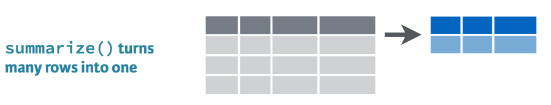

```{r setup, include=FALSE}
knitr::opts_chunk$set(echo = TRUE, results = 'hold', fig.show = 'asis')
``` 


# Tidy Yaklaşım


[Tidyverse](https://www.tidyverse.org/) modern veri analizi için geliştirilmiş R paketler topluluğuna verilen isimdir. Bu konuda temel kaynak Garret Grolemund ve Hadley Wickham tarafından yazılan [R for Data Science](https://r4ds.had.co.nz/) kitabıdır. Ayrıca bkz. [*Tidy Data*](https://vita.had.co.nz/papers/tidy-data.pdf) (Hadley Wickham, 2014 JSS), ve [Tidy data Vignette](https://cran.r-project.org/web/packages/tidyr/vignettes/tidy-data.html)  


```{r, echo=TRUE, warning=FALSE}
library(tidyverse)
```


`library(tidyverse)` komutu ile aşağıdaki R paketlerinin tamamı aktif hale gelir: 

* `ggplot2`, verilerin görselleştirilmesi

* `dplyr`, verilerin işlenmesi

* `tidyr`, verilerin "tidy" hale getirilmesi

* `readr`, verilerin okunması

* `purrr`, fonksiyonel programlama

* `tibble`, tibbles (R'da en temel nesnelerden biri olan `data.frame`'in modern versiyonu)

* `stringr`, karakterlerin işlenmesi

* `forcats`, faktör değişkenlerinin işlenmesi

<br/>
<br/>

**tidy** veri seti nedir? Bir tidy (düzenli) veri seti standart dikdörtgensel yapıya sahiptir. Sütunlar değişkenleri, satırlar ise gözlemleri gösterir. Her veri seti tidy formatta olmayabilir. Veri analizinden önce tidy hale getirilmesi gerekebilir. 

![Düzenli (tidy) bir veri setinin yapısı (kaynak: [R for Data Science]<https://r4ds.had.co.nz/tidy-data.html>)](img/tidy.png) 


Örnek olarak aşağıdaki veri setini düşünelim: 
```{r, warning=FALSE}
library(gapminder)
head(gapminder)
```

`gapminder` Tidyverse jargonunda bir **tibble**'dır. Tibble aslında bir `data frame`'dir. Ancak çeşitli açılardan `data frame` ile farklılık gösterir. `tibble` paketindeki `tibble::tibble()` fonksiyonunu kullanarak bir tidy veri seti yaratabiliriz: 
```{r, echo=TRUE, results="hold"}
tibble(
  x = 1:5, 
  y = 1, 
  z = x ^ 2 + y
)
```

Başka bir örnek:  
```{r, echo=TRUE, results="hold"}
df <- tibble(
  xvariable = runif(5),
  depvariable = 2+ 5*xvariable + rnorm(5)
)
df
```

Tıpkı temel R'daki `data.frame` fonksiyonunda olduğu gibi `tibble` içindeki değişkenlere çeşitli yollarla ulaşabiliriz:  
```{r}
# extract by column name
df$xvariable
```
```{r}
# extract by column name
df[["xvariable"]]
```
```{r}
# extract by column position
df[[1]]
```


# `dplyr` paketi ile verilerin işlenmesi 

## `filter()` 

İsminden de anlaşılacağı gibi `filter()` fonksiyonu ile belirli özelliklere sahip gözlemleri (satırları) seçebilir ve tablo ya da yeni bir veri seti (tibble, data frame) oluşturabiliriz. 


Örnek olarak `gapminder` veri setinde Türkiye'nin gözlemlerini almak istediğimizi düşünelim. Veri setini incelediğimizde Türkiye'nin 1573 ile 1584 satırları arasında yer aldığını görüyoruz. Bu bilgiden hareketle Türkiye veri setini aşağıdaki gibi oluşturabiliriz: 
```{r, echo=TRUE, results="hold"}
(turkey <- gapminder[1573:1584,])
```

Satır numaralarını kullanarak verileri çekmek hata olasılığını arttırdığı için etkin bir yaklaşım değildir. Bunun yerine `dplyr::filter()` fonksiyonunu kullanabiliriz. Bu fonksiyonun girdisi verilerin satırlarına uygulanan mantıksal ifadelerdir. Örneğin: 
```{r, echo=TRUE, results="hold"}
filter(gapminder, country == "Turkey")
```

Bu fonksiyonun kullanımı baz `R`'daki  `subset()` fonksiyonuna benzemektedir.  

Çoklu ifadelerin kullanılmasına izin verir. Örneğin, Türkiye'nin 2000 sonrası verileri için aşağıdaki komutu kullanabiliriz: 
```{r, echo=TRUE, results="hold"}
filter(gapminder, country == "Turkey", year>2000)
```

Örnek: Türkiye ve Brezilya'nın 2000 sonrası verilerini çek:  
```{r, echo=TRUE, results="hold"}
filter(gapminder, country %in% c("Turkey","Brazil"), year>2000)
```

## `select()` 


Sütunlardan (değişkenlerden) hareketle yeni bir alt küme oluşturmak istersek `dplyr::select()` fonksiyonunu kullanabiliriz.  
```{r, echo=TRUE, results="hold"}
select(gapminder, year, gdpPercap) %>% head(10)
```

Pipe (` %>% `) kullanımı:  
```{r, echo=TRUE, results="hold"}
gapminder %>% select(year, gdpPercap) %>% head(5)
```

`select()` ve `filter()` birlikte kullanılabilir. 

Örnek: Türkiye ve Brezilya için 2000 sonrasında kişi başına GDP değişkenini göster: 
```{r, echo=TRUE, results="hold"}
gapminder %>% filter(country %in% c("Turkey","Brazil"), year>2000) %>% select(year, gdpPercap)
```

Alıştırma: Önceki örnekteki tabloyu sadece baz R fonksiyonlarını kullanarak oluşturunuz. 

`R`'da bir görevi yerine getirmenin birden çok yolu olabilir. Benim çözümüm: 
```{r, echo=TRUE, results="hold"}
gapminder[gapminder$country  %in% c("Turkey", "Brazil") & gapminder$year>2000, c("year", "gdpPercap")]
```


## `mutate()` 


`dplyr::mutate()` fonksiyonu ile veri setine yeni değişkenler (sütunlar) ekleyebiliriz. 
`mutate()` içinde kullanılan hesaplama fonksiyonları vektörleştirilmiş olmalıdır; yani hem girdi hem de çıktı vektör olmalıdır. 

Örnek: Kişi başına GDP'nin doğal logaritması:   
```{r, echo=TRUE, results="hold"}
mutate(gapminder, lgdppc = log(gdpPercap)) %>% head(5)
```

Örnek: Toplam ülke GDP değerlerini oluştur
```{r, echo=TRUE, results="hold"}
mutate(gapminder, gdp = gdpPercap*pop ) %>%
  select(year,country,gdpPercap,pop,gdp) %>% head(5)
```

Mevcut değişkenlerin isimlerini değiştirmek istiyorsak `rename()` fonksiyonunu kullanabiliriz.  

## `arrange()`  


Veri setinin satırlarının (gözlemlerin) sıralanmasında  `dplyr::arrange()` fonksiyonu kullanılabilir. 

Örnek: Yılı artan, ülkeleri alfabetik olacak şekilde satırları yeniden düzenle: 
```{r, echo=TRUE}
arrange(gapminder, year, country) 
```

Ülkeler alfabetik, yıl artan:  
```{r}
arrange(gapminder, country, year) 
```

Default = ascending. Azalan sıralama yapmak istersek: 
```{r, echo=TRUE, results="hold"}
arrange(gapminder, country, desc(year)) %>% head(5)
```


`filter()` ve `arrange()` birlikte kullanılabilir. Örneğin: 
```{r, echo=TRUE, results="hold"}
gapminder %>% 
  filter(year==2007, continent=="Americas") %>% 
  arrange(lifeExp) 
```

Örenk: 2007 yılında Avrupa kıtasındaki ülkelerde yaşam beklentisinin büyükten küçüğe sıralanması
```{r}
gapminder %>% 
  filter(year==2007, continent=="Europe") %>% 
  arrange(desc(lifeExp)) 
```

## `group_by()`

Verilerin gruplandırılması amacıyla kullanılır. Verilerin görünümünü değiştirmez. `summarize()` gibi diğer fonksiyonlarla birlikte kullanılabilir.
```{r, echo=TRUE, results="hold"}
gapminder %>%  
  group_by(continent, year)  
```

## `summarize()`

 

Verilerin özet istatistiklerinin oluşturulmasında `dplyr::summarize()` kullanılabilir. Bu komut öncesinde `group_by()` ile veriler gruplandırılarak grup istatistikleri oluşturulabilir. 


Örnek: 2007 yılında her bir kıtada kaç ülke var?
```{r, echo=TRUE, results="hold"}
gapminder %>% 
  filter(year==2007) %>%
  group_by(continent) %>%
  summarize(n = n())
```

Örnek: 2007 yılında kıtalara göre ortalama yaşam beklentisini ve ortalama kişi başına GDP değerini bulun 
```{r}
gapminder %>% 
  filter(year==2007) %>%
  group_by(continent) %>%
  summarize(mean_life_exp = mean(lifeExp), mean_income = mean(gdpPercap))
```

Alternatif olarak, `summarize_at()` fonksiyonunu kullanarak çoklu değişkenlerin ortalamalarını hesaplayabiliriz: 
```{r}
gapminder %>% 
  filter(year==2007) %>%
  group_by(continent) %>%
  summarize_at(vars(lifeExp,gdpPercap), list(~mean(.)) )
```

Örnek: Önceki işlemi 1952 ve 2007 yılları için yapalım ve ortalamaları karşılaştıralım: 
```{r, echo=TRUE, results="hold"}
gapminder %>% 
  filter(year %in% c(1952,2007)) %>%
  group_by(continent, year) %>%
  summarize_at(vars(lifeExp,gdpPercap), list(~mean(.)) )
```

Önceki örnekte gruplamanın iki değişken üzerinden `group_by(continent, year)` yapıldığına dikkat ediniz.

Kullanılabilecek standart özet istatistikler: `mean()`, `median()`, `var()`, `sd()`, `mad()`, `IQR()`, `min()`, and `max()`.

**Örnek**: Avrupa'da her yıl için minimum ve maksimum yaşam beklentisini bulunuz.  
```{r, echo=TRUE, results="hold"}
gapminder %>% 
  filter(continent=="Europe") %>%
  group_by(year) %>%
  summarize(minlexp = min(lifeExp), maxlexp = max(lifeExp) )
```

**Örnek**:  `mutate()` ve `group_by()` fonksiyonlarının birlikte kullanımı: Her ülke için kişi başına GDP değişkeninin başlangıç yılındaki değerine oranını gösteren yeni bir değişken oluşturunuz. Yeni değişken başlangıç yılı olan 1952'de 1 değerini almalı, diğer yıllar için başlangıç yılına göre 1+büyüme oranı.   
```{r, echo=TRUE, results="hold"}
gapminder %>%  
  group_by(country) %>%
  select(country, year, gdpPercap) %>% 
  mutate(gdppc_to_first = gdpPercap/first(gdpPercap))
```


**Örnek**: Yıldan yıla büyüme oranlarını yüzde olarak gösteren yeni bir değişken oluşturunuz.
```{r}
gapminder %>%  
  group_by(country) %>%
  select(country, year, gdpPercap) %>% 
  mutate(gdppc_growth = 100*(gdpPercap-lag(gdpPercap))/lag(gdpPercap))
```

Örnekte kullanılan `lag()` fonksiyonu bir önceki dönemdeki (yılda) değere eşit olan birinci gecikmedir. Gecikmeyi açıkça veri setine ekleyelim: 

```{r}
gapminder %>%  
  group_by(country) %>%
  select(country, year, gdpPercap) %>% 
  mutate(lag_gdppc = lag(gdpPercap, 1, order_by = year), 
         gdppc_growth = 100*(gdpPercap-lag_gdppc)/lag_gdppc)
```


Yukarıda **pipe** operatörünü kullandık. Bunu kullanmadan aynı kodu çalıştırmak istersek:  
```{r, echo=TRUE, results="hold"}
mutate(select(group_by(gapminder,country), country, year, gdpPercap), gdppc_growth = 100*(gdpPercap-lag(gdpPercap))/lag(gdpPercap))
```

Bunu okumanın daha zor olduğu açıktır. 

**Örnek**: Avrupa'da en küçük ve en büyük yaşam beklentisini ülke bilgisiyle birlikte oluştur. Önce, yeni bir tibble yaratalım:   
```{r}
europe <- gapminder %>% 
  filter(continent=="Europe") %>%
  select(year, country, lifeExp) 
europe %>% head(10)
``` 

Daha sonra `min_rank()` ile yaşam beklentisini küçükten büyüğe doğru sıralayalım ve yeni bir değişken yaratarak sıralamaları kaydedelim. En düşük yaşam beklentisine sahip ilk iki ülkeyi listeleyelim:  
```{r}
europe %>% 
  group_by(year) %>% 
  mutate(le_rank = min_rank(lifeExp)) %>% 
  filter(le_rank < 3) %>% 
  arrange(year)
```

Aynısını en yüksek yaşam beklentisi için yapalım: 
```{r, echo=TRUE, results="hold"}
europe %>% group_by(year) %>% 
  mutate(le_desc_rank = min_rank(desc(lifeExp))) %>% 
  filter(le_desc_rank < 3) %>% 
  arrange(year)
```

**Alıştırma**: Minimum ve maksimum yaşam beklentisini birlikte gösteren bir tablo oluşturunuz.  


# `tidyr` ile verilerin düzenlenmesi

## Verilerin organizasyonuna ilişkin örnekler

```{r, echo=TRUE, results="hold"}
library(readxl)
trdata1 <- read_excel("Data/trdata1.xlsx") 
trdata1
```

`trdata1.xlsx` dosyasında Türkiye'de 3 il (İstanbul, İzmir, Ankara) ve üç yıl için (2005, 2010, 2015) nominal kişi başına GDP (GDPpc), reel kişi başına GDP (RGDPpc), Amerikan Doları cinsinden kişi başına GDP (GDPpc_USD) ve nüfus (population) bilgisi yer almaktadır.  

Bu veri setin düzenli (tidy) formata sahip değildir. Değişkenler satırlarda yer almaktadır. Yeniden düzenlenerek tidy formata getirilmesi gerekir. 
 

Grolemund ve Wickham aynı bilgiyi içeren ancak farklı şekillerde organize edilmiş veri seti örnekleri oluşturmuştur: 
```{r, echo=TRUE, results="hold"}
library(tidyverse)
library(gapminder)
table1
```
```{r, echo=TRUE, results="hold"}
table2 
```
```{r, echo=TRUE, results="hold"}
table3
```
```{r, echo=TRUE, results="hold"}
# Information spread to two tibbles:
# cases
table4a
# population
table4b
```

Bu veri setlerini nasıl tidy formata dönüştürebiliriz? Tidy formatta aşağıdaki kurallara uyulması gerekmektedir: 

1. Her değişken kendi sütununda olmalıdır.  
1. Her gözlem kendi satırında olmalıdır. 
1. Her değer kendi hücresinde olmalıdır. 

## `pivot_longer()`

Baz R'daki `reshape()` fonksiyonuna benzer şekilde verileri yeniden düzenleyebiliriz. Örnek veri setlerinde `table4a` ve  `table4b`'yi ele alalım. İlkinde `cases` değişkenini değerleri yer almaktadır: 
```{r, echo=TRUE, results="hold"}
pivot_longer(table4a, c(`1999`, `2000`), names_to = "year", values_to = "cases")
```

Pipe operatörü ile: 
```{r, echo=TRUE, results="hold"}
table4a %>% 
  pivot_longer(c(`1999`, `2000`), names_to = "year", values_to = "cases")
```

İkincisi, `table4b`, nüfus (population) değerlerini içeriyor: 
```{r, echo=TRUE, results="hold"}
table4b %>% 
  pivot_longer(c(`1999`, `2000`), names_to = "year", values_to = "population")
```

Elimizde `cases` ve `population` değerlerini içeren ülke ve yıl bilgisi aynı olan iki tidy veri seti var. Bunları nasıl birleştirebiliriz? 

Birleştirme için `dplyr::left_join()` fonksiyonunu kullanabiliriz: 
```{r, echo=TRUE, results="hold"}
tidy4a <- table4a %>% 
  pivot_longer(c(`1999`, `2000`), names_to = "year", values_to = "cases")
tidy4b <- table4b %>% 
  pivot_longer(c(`1999`, `2000`), names_to = "year", values_to = "population")
left_join(tidy4a, tidy4b)
```

**Örnek**
Yeni bir veri seti (`dfwide`) oluşturalım: 
```{r, echo=TRUE, results="hold"}
province = c("Istanbul", "Izmir", "Ankara")
plaka = c(34,35,6)
GDPpc2005=c(16749,12011,15392)
GDPpc2010=c(26253,18308,23997)
GDPpc2015=c(49773,34261,40679)
dfwide = data.frame(province,plaka,GDPpc2005,GDPpc2010,GDPpc2015)
dfwide
```

Sütunlarda yıllar var (wide format). Şimdi bunu `pivot_longer()` ile long formata dönüştürelim: 
```{r, echo=TRUE, results="hold"}
pivot_longer(dfwide, c(`GDPpc2005`, `GDPpc2010`, `GDPpc2015`), names_to = "year", values_to = "GDPpc", names_prefix = "GDPpc")
```

Yukarıda oluşturduğumuz `trdata1` veri seti de geniş (wide) formdaydı. Ancak bu veri setinde çok sayıda değişken olduğunu göz ardı etmememiz gerekir: 
```{r}
trdata1
trdata1_long <- pivot_longer(trdata1, c(`y2005`, `y2010`, `y2015`), names_to = "year", values_to = "values", names_prefix = "y")
trdata1_long
```

Ancak burada satırlarda değişkenler var. Bunları sütunlara aktarmalıyız. Bunun için `pivot_wider()` fonksiyonunu kullanabiliriz. 

## `pivot_wider()`

`pivot_wider()` long-form verileri wide-form'a dönüştürür. Örneğin, `table2` verilerini düşünelim:
```{r, echo=TRUE, results="hold"}
table2  
pivot_wider(table2, names_from = type, values_from = count)
```

**Örnek**: `trdata1` ve `trdata1_long` veri kümelerine geri dönelim: 
```{r, echo=TRUE, results="hold"}
trdata1_tidy <- pivot_wider(trdata1_long, names_from = variable, values_from = values)
trdata1_tidy
```


# `ggplot2` ile verilerin görselleştirilmesi

`ggplot2` verilerin görselleştirilmesinde **grafiklerin grameri** (grammar of graphics) yaklaşımını uygulayan, Hadley Wickham tarafından geliştirilmiş bir R paketidir. `ggplot2` hakkında daha fazla kaynak için bkz. 

* [Hadley Wickham ve Garret Grolemund, R for Data Science, Data Visualization with ggplot2](https://r4ds.had.co.nz/data-visualisation.html)

* [Hadley Wickham, ggplot2: Elegant Graphics for Data Analysis](https://ggplot2-book.org/) 

* [Winston Chang, R Graphics Cookbook: Practical Recipes for Visualizing Data](http://www.cookbook-r.com/Graphs/)

`ggplot2` Tidyverse meta-paketinin bir parçasıdır. Dolayısıyla `library(tidyverse)` komutuyla otomatik olarak aktif hale gelir. Eğer diğer bileşenlerini istemiyorsak `ggplot2` paketini bağımsız olarak da çağırabiliriz: 
```{r}
library(ggplot2)
```

`ggplot2` bir istatistiksel grafiği katmanlar halinde oluşturur. Paketteki temel komutu, `ggplot()`, boş olarak çalıştırdığımızda geometrik nesneler ve renk, şekil ve büyüklük gibi estetik bileşenlerle dolduracağımız bir kanvas elde ederiz:   
```{r}
ggplot()
```

Grafiği oluşturmak için veri setimizi, ne tür grafik istediğimizi ve diğer tüm detayları bildirmemiz gerekir. Örnek olarak `gapminder` veri setinde yaşam beklentisi ile kişi başına gelir arasındaki ilişkiyi görselleştirelim: 
```{r}
library(gapminder)
ggplot(data = gapminder, mapping = aes(x = gdpPercap, y = lifeExp))
```

Grafiğin eksenleri belirlendi. Ancak grafiğin türünün ne olduğu belirtilmediği için `ggplot()` boş bir grafik çizdi. `ggplot2` jargonunda `geom` ismi verilen grafik türlerinin eklenmesiyle grafik en yalın haliyle tamamlanır: 
```{r}
ggplot(data = gapminder, mapping = aes(x = gdpPercap, y = lifeExp)) +
  geom_point()
```

Grafiği aşağıdaki komut dizisiyle de çizebilirdik: 
```{r}
ggplot(data = gapminder) +
  geom_point(mapping = aes(x = gdpPercap, y = lifeExp))
```


## Çizgi grafiği

Örnek: Türkiye'nin kişi başına GDP değerlerinin zaman serisi grafiğini çiz. 
```{r}
library(gapminder)
# verileri oluştur
turkey <- gapminder %>% filter(country=="Turkey")
# grafiği çiz
ggplot(turkey, aes(x = year, y = gdpPercap)) +
  geom_line()  
```

Yatay ve dikey eksenlerin etiketlerini ve grafik başlığını ekleyelim. Ayrıca gözlem noktalarını da ekleyelim:  
```{r}
library(gapminder)
turkey <- gapminder %>% filter(country=="Turkey")
ggplot(turkey, aes(x = year, y = gdpPercap)) +
  geom_line() +
  geom_point() +
  xlab("") +
  ylab("GDP per capita") +
  ggtitle("Turkey")
```


Örnek: Düşük gelirli Avrupa ülkelerinde yaşam beklentisinin zaman serisi grafiğini çiz. Düşük gelir durumu: 2007 yılında gdpPercap<10000 ise düşük gelirli ülke; değilse yüksek gelirli ülke.
```{r}
# verileri oluştur
europe <- gapminder %>% 
  filter(continent == "Europe") 
clist <- filter(europe, gdpPercap<10000 & year==2007)
lowincome_europe <- filter(europe, country %in% clist$country)
# grafiği çiz
ggplot(lowincome_europe, aes(x = year, y = lifeExp, color = country)) +
  geom_line()
```

Aynı grafiğin siyah-beyaz versiyonu: 
```{r}
ggplot(lowincome_europe, aes(x = year, y = lifeExp, linetype = country)) +
  geom_line() + 
  theme_bw() + 
  scale_x_continuous(breaks=seq(1952,2007,5)) + 
  theme(axis.text.x = element_text(angle = 90, vjust = 0.5, hjust = 1)) +
  xlab("")
```


## Histogram

Sürekli değişkenlerin dağılımlarının görselleştirilmesinde en yaygın kullanılan araçlardan biri histogramdır. `geom_histogram()` fonksiyonu ile histogramı çizebiliriz. Örneğin: 

```{r}
y2007 <- filter(gapminder, year==2007)
ggplot(data = y2007 ) +
geom_histogram(mapping = aes(x = lifeExp))
```

Histogram çiziminde en önemli tercih sınıf sayısıdır (bin). Kullanıcı tarafından verilere uygun bin sayısının tercih edilmesi gerekir. Yukarıdaki histogramda çubuklar arasında boşluklar olduğunu görüyoruz. Sınıf sayısı gereğinden fazla gibi görünüyor. Default değer bins=30 yerine 15 ile yeniden çizelim: 
```{r} 
ggplot(data = y2007 ) +
  geom_histogram(mapping = aes(x = lifeExp), bins = 15)
```

Yaşam beklentisinin iki modlu bir dağılıma sahip olduğunu görüyoruz. 

Örnek: Tüm verileri kullanarak yaşam beklentisinin histogramını çizelim: 
```{r}
library(gapminder)
ggplot(data =gapminder ) +
  geom_histogram(mapping = aes(x = lifeExp), binwidth = 0.5)
```


Örnek: Simülasyon ile elde edilen bir veri setinde histogram ve yoğunluk grafiklerini çizelim. Önce 3 ders için notları türetelim: 
```{r} 
set.seed(1)
n <- 200
grades1 <- rnorm(n, mean = 50, sd = 10)
grades2 <- rnorm(n, mean = 60, sd = 15)
grades3 <- rnorm(n, mean = 70, sd = 12)
class <-  factor( rep(c("Econometrics-1","Econometrics-2","Machine-Learning"), each=n) )
gradedata <- data.frame(class, grades = c(grades1, grades2, grades3))
gradedata <- filter(gradedata, grades<=100 & grades>=0)
head(gradedata)
```

```{r}
ggplot(data = gradedata) +
  geom_histogram(mapping = aes(x = grades)) +
  facet_wrap(~ class)
```

## Kutu grafiği (Box Plot)

```{r, echo=TRUE}
ggplot(data = gradedata) +
  geom_boxplot(mapping = aes(x = class, y=grades))  
```

**Örnek:** Gapminder veri setinde yaşam beklentisinin kıtalara göre kutu çizimi.  
over continents

```{r} 
ggplot(data = gapminder, mapping = aes(x = continent, y = lifeExp)) + 
  geom_boxplot()
```


## Nokta grafiği (dot plot) 

Elimizde bir kategorik değişken ve bir nümerik değer varsa `geom_point()` kullanılabilir. 

Örnek: Avrupa'da 2007 yılındaki yaşam beklentisi küçükten büyüğe sıralayıp nokta grafiğini çiz.
```{r}
# önce verileri oluştur
europe2007 <- gapminder %>% 
  filter(year == 2007, continent == "Europe") 
# grafiği çiz
ggplot(europe2007, aes(x = lifeExp, y = fct_reorder(country, lifeExp))) +
  geom_point()
```

## Serpilme çizimi (Scatter plots)

**Örnek**: Gapminder veri setinde kişi başına gelir ve yaşam beklentisi: 
```{r}
library(gapminder)
ggplot(gapminder, aes(x=log(gdpPercap),y=lifeExp)) +
      geom_point()
```

**Örnek**: Kıta bilgisini renk estetiğni kullanarak ekleyelim: 
```{r}
splot1 <- ggplot(gapminder, aes(x=log(gdpPercap),y=lifeExp)) +
             geom_point(aes(color=continent))
splot1
```

**Örnek**: Önceki grafiğin temasını siyah-beyaz olarak değiştirelim. 
```{r}
ggplot(gapminder, aes(x=log(gdpPercap),y=lifeExp)) +
      geom_point(aes(color=continent)) +
      theme_bw()
```

ya da 
```{r}
splot1 + theme_bw()
```


**Alıştırma**: Önceki grafiği sadece 2002 yılı için çiziniz. 
```{r, echo=FALSE, eval=FALSE}
year2002<-filter(gapminder, year == 2002)
ggplot(year2002, aes(x=log(gdpPercap),y=lifeExp)) +
geom_point(aes(color=continent)) +
theme_bw()
```


**Örnek**: Alt grafiklerin oluşturlması (**facets**).
```{r}
ggplot(gapminder, aes(x=log(gdpPercap),y=lifeExp)) +
      geom_point() +
      facet_wrap(~ continent, nrow=2)
```


**Örnek**: Yılın facet değişkeni olarak kullanılması: 
```{r}
ggplot(gapminder, aes(x=log(gdpPercap),y=lifeExp)) +
      geom_point(aes(color=continent)) +
      facet_wrap(~ year, nrow=2)
```

**Örnek**: Katman olarak başka geom'lar da kullanılabilir. Örneğin 
```{r, echo=TRUE, fig.width = 4, fig.height = 3}
ggplot(gapminder, aes(x=log(gdpPercap),y=lifeExp)) +
      geom_point(aes(color=continent)) +
      geom_smooth() +
      theme_bw()
```


**Örnek**: Loess ile Avrupa ülkelerine uydurulmuş bir eğrinin eklenmesi
```{r, echo=TRUE, fig.width = 4, fig.height = 3}
ggplot(gapminder, aes(x=log(gdpPercap),y=lifeExp)) +
      geom_point(aes(color=continent)) +
      geom_smooth(data = filter(gapminder, continent == "Europe"), se=FALSE) +
      theme_bw()
```

# Örnek: Türkiye'de İllerde Yaşam İndeksi Göstergeleri (2015)


```{r}
library(tidyverse)
library(readxl)
url <- "http://tuik.gov.tr/PreIstatistikTablo.do?istab_id=2421"
destfile <- "PreIstatistikTablo.xls"
curl::curl_download(url, destfile)
veriler <- read_excel(destfile, range = "A6:BA88")
```

`View(veriler)` ile verileri incelediğimizde bazı gözlemlerin boş olduğunu (NA) ve değişken isimlerinin çok uzun olduğunu görüyoruz. Bunun dışında veriler düzenli (tidy) formattadır. 


Boş sütunları silelim: 
```{r}
# ismi "..." ile başlayan boş sütunları sil
veriler <- veriler %>% 
  dplyr::select(-contains('...'))
# note: select() may not work right if MASS is package is also loaded
```

Ayrıca ilk satırı sil: 
```{r} 
veriler <- veriler %>% drop_na()
```

Şimdi elimizde 81 il için 42 değişkenden oluşan bir veri seti var. Ancak değişken isimleri çok uzun. Bunları değiştirelim. 

```{r} 
# TR isimlendirme
# mevcut veri setindeki değişken isimlerini içeren karakter vektörü
isim_tanim <- names(veriler)
```

Bu karakter vektörünü bir kenarda tutalım. Sütunlardaki değişkenlerin tanımları daha sonra gerekebilir. İhtiyaç duyduğumuzda değişkenin tam tanımına bakabiliriz. Örneğin 42nci sütundaki değişkenin tanımı: 
```{r}
isim_tanim[42]
```
Şimdi değişkenlere daha kısa isimler verelim: 
```{r}
# bu karakter vektörünün elemanlarını değiştir: 
isimler <- isim_tanim
isimler[1] <- "il"
isimler[2] <- "oda"
isimler[3] <- "tuv"
isimler[4] <- "ev_kalite"
isimler[5] <- "istihdam"
isimler[6] <- "issizlik"
isimler[7] <- "ort_gun_kazanc"
isimler[8] <- "is_tatmin"
isimler[9] <- "tasarruf"
isimler[10] <- "orta_ust_gelir_gr"
isimler[11] <- "temel_iht_gr"
isimler[12] <- "bebek_mort"
isimler[13] <- "yasam_bek"
isimler[14] <- "doktor_basv"
isimler[15] <- "saglik_tatmin"
isimler[16] <- "kamu_saglik_tatmin"
isimler[17] <- "okullasma_3_5"
isimler[18] <- "TEOG"
isimler[19] <- "YGS"
isimler[20] <- "yuk_egit_orani"
isimler[21] <- "kamu_egit_tatmin"
isimler[22] <- "hava_kir"
isimler[23] <- "orman_alan"
isimler[24] <- "atik_hiz"
isimler[25] <- "gurultu_kir"
isimler[26] <- "bel_temiz_tatmin"
isimler[27] <- "cinayet"
isimler[28] <- "tra_kaza"
isimler[29] <- "gece_guv_yuru"
isimler[30] <- "kamu_guv_tatmin"
isimler[31] <- "oy_verme_belediye"
isimler[32] <- "uyelik_siy_parti"
isimler[33] <- "sendika"
isimler[34] <- "internet"
isimler[35] <- "kanalizasyon"
isimler[36] <- "havaalani"
isimler[37] <- "kamu_ulasim_tatmin"
isimler[38] <- "sin_tiyatro"
isimler[39] <- "avm"
isimler[40] <- "sosyal_ilis_tatmin"
isimler[41] <- "sosyal_hayat_tatmin"
isimler[42] <- "mutluluk"
```

Sütun isimlerini değiştirelim: 
```{r} 
colnames(veriler) <- isimler
# verilere göz at 
glimpse(veriler)
```

```{r, warning=FALSE} 
library(corrplot)
corrplot(cor(veriler[-1]), is.corr=TRUE, order = "FPC")
```

Verileri daha sonra kullanmak için `RData` formatında kaydedelim:  
```{r, echo=TRUE, results="hold"}
save(veriler, file = "Data/yasamveri2015.RData")
```

(Not: Yerel klasör adresini uygun şekilde değiştirebilirsiniz. Yukarıdaki kodda veri seti current dir içindeki Data klasörüne kaydedildi). 


Mutluluk göstergesinin özet istatistikleri ve histogramı:  
```{r}
summary(veriler$mutluluk)
```
```{r}
veriler %>% ggplot(mapping = aes(x = mutluluk)) +
  geom_histogram(bins = 6)
```

En mutlu iller hangileri? 
```{r}
# list top 10 happiest provinces
veriler %>% 
  select(il, mutluluk)  %>% 
  arrange(desc(mutluluk)) %>% 
  head(10) 
```

Bu tablonun (tüm iller için) grafiğini oluşturalım: 
```{r, echo=TRUE, results="hold"}
ggplot(veriler, aes(x = mutluluk, y = fct_reorder(il, mutluluk))) +
  geom_point()
```

Aşağıdaki iki grafiği yorumlayınız: 

```{r}
# Ortalama günlük kazanç (TL) vs. Mutluluk
ggplot(veriler, aes(x=ort_gun_kazanc, y=mutluluk)) +
      geom_point()
```

```{r} 
# Orta ve üstü gelir grubundaki hanelerin oranı (%) vs Mutluluk
ggplot(veriler, aes(x=orta_ust_gelir_gr, y=mutluluk)) +
      geom_point()
```

