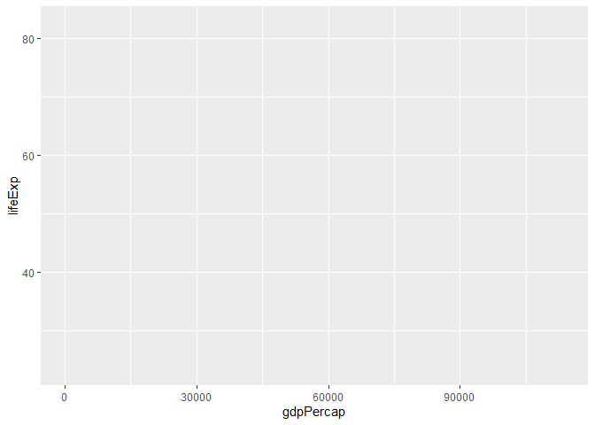
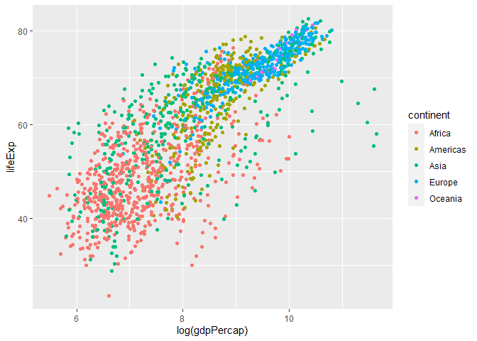

# Tidy Yaklaşım


[Tidyverse](https://www.tidyverse.org/) modern veri analizi için geliştirilmiş R paketler topluluğuna verilen isimdir. Bu konuda temel kaynak Garret Grolemund ve Hadley Wickham tarafından yazılan [R for Data Science](https://r4ds.had.co.nz/) kitabıdır. Ayrıca bkz. [*Tidy Data*](https://vita.had.co.nz/papers/tidy-data.pdf) (Hadley Wickham, 2014 JSS), ve [Tidy data Vignette](https://cran.r-project.org/web/packages/tidyr/vignettes/tidy-data.html)  


```r
library(tidyverse)
```

```
## -- Attaching packages ------------------------------------------------ tidyverse 1.3.0 --
```

```
## <U+221A> ggplot2 3.3.0     <U+221A> purrr   0.3.3
## <U+221A> tibble  3.0.1     <U+221A> dplyr   0.8.5
## <U+221A> tidyr   1.0.0     <U+221A> stringr 1.4.0
## <U+221A> readr   1.3.1     <U+221A> forcats 0.4.0
```

```
## -- Conflicts --------------------------------------------------- tidyverse_conflicts() --
## x dplyr::filter() masks stats::filter()
## x dplyr::lag()    masks stats::lag()
```


`library(tidyverse)` komutu ile aşağıdaki R paketlerinin tamamı aktif hale gelir: 

* `ggplot2`, verilerin görselleştirilmesi

* `dplyr`, verilerin işlenmesi

* `tidyr`, verilerin "tidy" hale getirilmesi

* `readr`, verilerin okunması

* `purrr`, fonksiyonel programlama

* `tibble`, tibbles (R'da en temel nesnelerden biri olan `data.frame`'in modern versiyonu)

* `stringr`, karakterlerin işlenmesi

* `forcats`, faktör değişkenlerinin işlenmesi

**tidy** veri seti nedir? Bir tidy (düzenli) veri seti standart dikdörtgensel yapıya sahiptir. Sütunlar değişkenleri, satırlar ise gözlemleri gösterir. Her veri seti tidy formatta olmayabilir. Veri analizinden önce tidy hale getirilmesi gerekebilir. 

![Düzenli (tidy) bir veri setinin yapısı (kaynak: [R for Data Science]<https://r4ds.had.co.nz/tidy-data.html>)](img/tidy.png) 


Örnek olarak aşağıdaki veri setini düşünelim: 

```r
library(gapminder)
head(gapminder)
```

```
## # A tibble: 6 x 6
##   country     continent  year lifeExp      pop gdpPercap
##   <fct>       <fct>     <int>   <dbl>    <int>     <dbl>
## 1 Afghanistan Asia       1952    28.8  8425333      779.
## 2 Afghanistan Asia       1957    30.3  9240934      821.
## 3 Afghanistan Asia       1962    32.0 10267083      853.
## 4 Afghanistan Asia       1967    34.0 11537966      836.
## 5 Afghanistan Asia       1972    36.1 13079460      740.
## 6 Afghanistan Asia       1977    38.4 14880372      786.
```

`gapminder` Tidyverse jargonunda bir **tibble**'dır. Tibble aslında bir `data frame`'dir. Ancak çeşitli açılardan `data frame` ile farklılık gösterir. `tibble` paketindeki `tibble::tibble()` fonksiyonunu kullanarak bir tidy veri seti yaratabiliriz: 

```r
tibble(
  x = 1:5, 
  y = 1, 
  z = x ^ 2 + y
)
```

```
## # A tibble: 5 x 3
##       x     y     z
##   <int> <dbl> <dbl>
## 1     1     1     2
## 2     2     1     5
## 3     3     1    10
## 4     4     1    17
## 5     5     1    26
```

Başka bir örnek:  

```r
df <- tibble(
  xvariable = runif(5),
  depvariable = 2+ 5*xvariable + rnorm(5)
)
df
```

```
## # A tibble: 5 x 2
##   xvariable depvariable
##       <dbl>       <dbl>
## 1     0.848        7.36
## 2     0.475        5.59
## 3     0.474        4.76
## 4     0.733        5.72
## 5     0.444        4.26
```

Tıpkı temel R'daki `data.frame` fonksiyonunda olduğu gibi `tibble` içindeki değişkenlere çeşitli yollarla ulaşabiliriz:  

```r
# extract by column name
df$xvariable
```

```
## [1] 0.8484843 0.4754926 0.4740781 0.7330964 0.4435646
```

```r
# extract by column name
df[["xvariable"]]
```

```
## [1] 0.8484843 0.4754926 0.4740781 0.7330964 0.4435646
```

```r
# extract by column position
df[[1]]
```

```
## [1] 0.8484843 0.4754926 0.4740781 0.7330964 0.4435646
```


# `dplyr` paketi ile verilerin işlenmesi 

## `filter()` 

İsminden de anlaşılacağı gibi `filter()` fonksiyonu ile belirli özelliklere sahip gözlemleri (satırları) seçebilir ve tablo ya da yeni bir ver seti (tibble, data frame) oluşturabiliriz. 


Örnek olarak `gapminder` veri setinde Türkiye'nin gözlemlerini almak istediğimizi düşünelim. Veri setini incelediğimiz Türkiye'nin 1573 ile 1584 satırları arasında yer aldığını görüyoruz. Bu bilgiden hareketl Türkiye veri setini aşağıdaki gibi oluşturabiliriz: 

```r
(turkey <- gapminder[1573:1584,])
```

```
## # A tibble: 12 x 6
##    country continent  year lifeExp      pop gdpPercap
##    <fct>   <fct>     <int>   <dbl>    <int>     <dbl>
##  1 Turkey  Europe     1952    43.6 22235677     1969.
##  2 Turkey  Europe     1957    48.1 25670939     2219.
##  3 Turkey  Europe     1962    52.1 29788695     2323.
##  4 Turkey  Europe     1967    54.3 33411317     2826.
##  5 Turkey  Europe     1972    57.0 37492953     3451.
##  6 Turkey  Europe     1977    59.5 42404033     4269.
##  7 Turkey  Europe     1982    61.0 47328791     4241.
##  8 Turkey  Europe     1987    63.1 52881328     5089.
##  9 Turkey  Europe     1992    66.1 58179144     5678.
## 10 Turkey  Europe     1997    68.8 63047647     6601.
## 11 Turkey  Europe     2002    70.8 67308928     6508.
## 12 Turkey  Europe     2007    71.8 71158647     8458.
```

Satır numaralarını kullanarak verileri çekmek hata olasılığını arttırdığı için etkin bir yaklaşım değildir. Bunun yerine `dplyr::filter()` fonksiyonunu kullanabiliriz. Bu fonksiyonun girdisi verilerin satırlarına uygulanan mantıksal ifadelerdir. Örneğin: 

```r
filter(gapminder, country == "Turkey")
```

```
## # A tibble: 12 x 6
##    country continent  year lifeExp      pop gdpPercap
##    <fct>   <fct>     <int>   <dbl>    <int>     <dbl>
##  1 Turkey  Europe     1952    43.6 22235677     1969.
##  2 Turkey  Europe     1957    48.1 25670939     2219.
##  3 Turkey  Europe     1962    52.1 29788695     2323.
##  4 Turkey  Europe     1967    54.3 33411317     2826.
##  5 Turkey  Europe     1972    57.0 37492953     3451.
##  6 Turkey  Europe     1977    59.5 42404033     4269.
##  7 Turkey  Europe     1982    61.0 47328791     4241.
##  8 Turkey  Europe     1987    63.1 52881328     5089.
##  9 Turkey  Europe     1992    66.1 58179144     5678.
## 10 Turkey  Europe     1997    68.8 63047647     6601.
## 11 Turkey  Europe     2002    70.8 67308928     6508.
## 12 Turkey  Europe     2007    71.8 71158647     8458.
```

Bu fonksiyonun kullanımı baz `R`'daki  `subset()` fonksiyonuna benzemektedir.  

Çoklu ifadelerin kullanılmasına izin verir. Örneğin, Türkiye'nin 2000 sonrası verileri için aşağıdaki komutu kullanabiliriz: 

```r
filter(gapminder, country == "Turkey", year>2000)
```

```
## # A tibble: 2 x 6
##   country continent  year lifeExp      pop gdpPercap
##   <fct>   <fct>     <int>   <dbl>    <int>     <dbl>
## 1 Turkey  Europe     2002    70.8 67308928     6508.
## 2 Turkey  Europe     2007    71.8 71158647     8458.
```

Örnek: Türkiye ve Brezilya'nın 2000 sonrası verilerini çek:  

```r
filter(gapminder, country %in% c("Turkey","Brazil"), year>2000)
```

```
## # A tibble: 4 x 6
##   country continent  year lifeExp       pop gdpPercap
##   <fct>   <fct>     <int>   <dbl>     <int>     <dbl>
## 1 Brazil  Americas   2002    71.0 179914212     8131.
## 2 Brazil  Americas   2007    72.4 190010647     9066.
## 3 Turkey  Europe     2002    70.8  67308928     6508.
## 4 Turkey  Europe     2007    71.8  71158647     8458.
```

## `select()` 


Sütunlardan (değişkenlerden) hareketle yeni bir alt küme oluşturmak istersek `dplyr::select()` fonksiyonunu kullanabiliriz.  

```r
select(gapminder, year, gdpPercap) %>% head(10)
```

```
## # A tibble: 10 x 2
##     year gdpPercap
##    <int>     <dbl>
##  1  1952      779.
##  2  1957      821.
##  3  1962      853.
##  4  1967      836.
##  5  1972      740.
##  6  1977      786.
##  7  1982      978.
##  8  1987      852.
##  9  1992      649.
## 10  1997      635.
```

Pipe (` %>% `) kullanımı:  

```r
gapminder %>% select(year, gdpPercap) %>% head(5)
```

```
## # A tibble: 5 x 2
##    year gdpPercap
##   <int>     <dbl>
## 1  1952      779.
## 2  1957      821.
## 3  1962      853.
## 4  1967      836.
## 5  1972      740.
```

`select()` ve `filter()` birlikte kullanılabilir. 

Örnek: Türkiye ve Brezilya için 2000 sonrasında kişi başına GDP değişkenini göster: 

```r
gapminder %>% filter(country %in% c("Turkey","Brazil"), year>2000) %>% select(year, gdpPercap)
```

```
## # A tibble: 4 x 2
##    year gdpPercap
##   <int>     <dbl>
## 1  2002     8131.
## 2  2007     9066.
## 3  2002     6508.
## 4  2007     8458.
```

Alıştırma: Önceki örnekteki tabloyu sadece baz R fonksiyonlarını kullanarak oluşturunuz. 

`R`'da bir görevi yerine getirmenin birden çok yolu olabilir. Benim çözümüm: 

```r
gapminder[gapminder$country  %in% c("Turkey", "Brazil") & gapminder$year>2000, c("year", "gdpPercap")]
```

```
## # A tibble: 4 x 2
##    year gdpPercap
##   <int>     <dbl>
## 1  2002     8131.
## 2  2007     9066.
## 3  2002     6508.
## 4  2007     8458.
```


## `mutate()` 


`dplyr::mutate()` fonksiyonu ile veri setine yeni değişkenler (sütunlar) ekleyebiliriz. 
`mutate()` içinde kullanılan hesaplama fonksiyonları vektörleştirilmiş olmalıdır; yani hem girdi hem de çıktı vektör olmalıdır. 

Örnek: Kişi başına GDP'nin doğal logaritması:   

```r
mutate(gapminder, lgdppc = log(gdpPercap)) %>% head(5)
```

```
## # A tibble: 5 x 7
##   country     continent  year lifeExp      pop gdpPercap lgdppc
##   <fct>       <fct>     <int>   <dbl>    <int>     <dbl>  <dbl>
## 1 Afghanistan Asia       1952    28.8  8425333      779.   6.66
## 2 Afghanistan Asia       1957    30.3  9240934      821.   6.71
## 3 Afghanistan Asia       1962    32.0 10267083      853.   6.75
## 4 Afghanistan Asia       1967    34.0 11537966      836.   6.73
## 5 Afghanistan Asia       1972    36.1 13079460      740.   6.61
```

Örnek: Toplam ülke GDP değerlerini oluştur

```r
mutate(gapminder, gdp = gdpPercap*pop ) %>%
  select(year,country,gdpPercap,pop,gdp) %>% head(5)
```

```
## # A tibble: 5 x 5
##    year country     gdpPercap      pop         gdp
##   <int> <fct>           <dbl>    <int>       <dbl>
## 1  1952 Afghanistan      779.  8425333 6567086330.
## 2  1957 Afghanistan      821.  9240934 7585448670.
## 3  1962 Afghanistan      853. 10267083 8758855797.
## 4  1967 Afghanistan      836. 11537966 9648014150.
## 5  1972 Afghanistan      740. 13079460 9678553274.
```

Mevcut değişkenlerin isimlerini değiştirmek istiyorsak `rename()` fonksiyonunu kullanabiliriz.  

## `arrange()`  


Veri setinin satırlarının (gözlemlerin) sıralanmasında  `dplyr::arrange()` fonksiyonu kullanılabilir. 

Örnek: Yılı artan, ülkeleri alfabetik olacak şekilde satırları yeniden düzenle: 

```r
arrange(gapminder, year, country) 
```

```
## # A tibble: 1,704 x 6
##    country     continent  year lifeExp      pop gdpPercap
##    <fct>       <fct>     <int>   <dbl>    <int>     <dbl>
##  1 Afghanistan Asia       1952    28.8  8425333      779.
##  2 Albania     Europe     1952    55.2  1282697     1601.
##  3 Algeria     Africa     1952    43.1  9279525     2449.
##  4 Angola      Africa     1952    30.0  4232095     3521.
##  5 Argentina   Americas   1952    62.5 17876956     5911.
##  6 Australia   Oceania    1952    69.1  8691212    10040.
##  7 Austria     Europe     1952    66.8  6927772     6137.
##  8 Bahrain     Asia       1952    50.9   120447     9867.
##  9 Bangladesh  Asia       1952    37.5 46886859      684.
## 10 Belgium     Europe     1952    68    8730405     8343.
## # ... with 1,694 more rows
```

Ülkeler alfabetik, yıl artan:  

```r
arrange(gapminder, country, year) 
```

```
## # A tibble: 1,704 x 6
##    country     continent  year lifeExp      pop gdpPercap
##    <fct>       <fct>     <int>   <dbl>    <int>     <dbl>
##  1 Afghanistan Asia       1952    28.8  8425333      779.
##  2 Afghanistan Asia       1957    30.3  9240934      821.
##  3 Afghanistan Asia       1962    32.0 10267083      853.
##  4 Afghanistan Asia       1967    34.0 11537966      836.
##  5 Afghanistan Asia       1972    36.1 13079460      740.
##  6 Afghanistan Asia       1977    38.4 14880372      786.
##  7 Afghanistan Asia       1982    39.9 12881816      978.
##  8 Afghanistan Asia       1987    40.8 13867957      852.
##  9 Afghanistan Asia       1992    41.7 16317921      649.
## 10 Afghanistan Asia       1997    41.8 22227415      635.
## # ... with 1,694 more rows
```

Default = ascending. Azalan sıralama yapmak istersek: 

```r
arrange(gapminder, country, desc(year)) %>% head(5)
```

```
## # A tibble: 5 x 6
##   country     continent  year lifeExp      pop gdpPercap
##   <fct>       <fct>     <int>   <dbl>    <int>     <dbl>
## 1 Afghanistan Asia       2007    43.8 31889923      975.
## 2 Afghanistan Asia       2002    42.1 25268405      727.
## 3 Afghanistan Asia       1997    41.8 22227415      635.
## 4 Afghanistan Asia       1992    41.7 16317921      649.
## 5 Afghanistan Asia       1987    40.8 13867957      852.
```


`filter()` ve `arrange()` birlikte kullanılabilir. Örneğin: 

```r
gapminder %>% 
  filter(year==2007, continent=="Americas") %>% 
  arrange(lifeExp) 
```

```
## # A tibble: 25 x 6
##    country             continent  year lifeExp       pop gdpPercap
##    <fct>               <fct>     <int>   <dbl>     <int>     <dbl>
##  1 Haiti               Americas   2007    60.9   8502814     1202.
##  2 Bolivia             Americas   2007    65.6   9119152     3822.
##  3 Trinidad and Tobago Americas   2007    69.8   1056608    18009.
##  4 Honduras            Americas   2007    70.2   7483763     3548.
##  5 Guatemala           Americas   2007    70.3  12572928     5186.
##  6 Peru                Americas   2007    71.4  28674757     7409.
##  7 Paraguay            Americas   2007    71.8   6667147     4173.
##  8 El Salvador         Americas   2007    71.9   6939688     5728.
##  9 Dominican Republic  Americas   2007    72.2   9319622     6025.
## 10 Brazil              Americas   2007    72.4 190010647     9066.
## # ... with 15 more rows
```

Örenk: 2007 yılında Avrupa kıtasındaki ülkelerde yaşam beklentisinin büyükten küçüğe sıralanması

```r
gapminder %>% 
  filter(year==2007, continent=="Europe") %>% 
  arrange(desc(lifeExp)) 
```

```
## # A tibble: 30 x 6
##    country     continent  year lifeExp      pop gdpPercap
##    <fct>       <fct>     <int>   <dbl>    <int>     <dbl>
##  1 Iceland     Europe     2007    81.8   301931    36181.
##  2 Switzerland Europe     2007    81.7  7554661    37506.
##  3 Spain       Europe     2007    80.9 40448191    28821.
##  4 Sweden      Europe     2007    80.9  9031088    33860.
##  5 France      Europe     2007    80.7 61083916    30470.
##  6 Italy       Europe     2007    80.5 58147733    28570.
##  7 Norway      Europe     2007    80.2  4627926    49357.
##  8 Austria     Europe     2007    79.8  8199783    36126.
##  9 Netherlands Europe     2007    79.8 16570613    36798.
## 10 Greece      Europe     2007    79.5 10706290    27538.
## # ... with 20 more rows
```

## `group_by()`

Verilerin gruplandırılması amacıyla kullanılır. Verilerin görünümünü değiştirmez. `summarize()` gibi diğer fonksiyonlarla birlikte kullanılabilir.

```r
gapminder %>%  
  group_by(continent, year)  
```

```
## # A tibble: 1,704 x 6
## # Groups:   continent, year [60]
##    country     continent  year lifeExp      pop gdpPercap
##    <fct>       <fct>     <int>   <dbl>    <int>     <dbl>
##  1 Afghanistan Asia       1952    28.8  8425333      779.
##  2 Afghanistan Asia       1957    30.3  9240934      821.
##  3 Afghanistan Asia       1962    32.0 10267083      853.
##  4 Afghanistan Asia       1967    34.0 11537966      836.
##  5 Afghanistan Asia       1972    36.1 13079460      740.
##  6 Afghanistan Asia       1977    38.4 14880372      786.
##  7 Afghanistan Asia       1982    39.9 12881816      978.
##  8 Afghanistan Asia       1987    40.8 13867957      852.
##  9 Afghanistan Asia       1992    41.7 16317921      649.
## 10 Afghanistan Asia       1997    41.8 22227415      635.
## # ... with 1,694 more rows
```

## `summarize()`

 

Verilerin özet istatistiklerinin oluşturulmasında `dplyr::summarize()` kullanılabilir. Bu komut öncesinde `group_by()` ile veriler gruplandırılarak grup istatistikleri oluşturulabilir. 


Örnek: 2007 yılında her bir kıtada kaç ülke var?

```r
gapminder %>% 
  filter(year==2007) %>%
  group_by(continent) %>%
  summarize(n = n())
```

```
## # A tibble: 5 x 2
##   continent     n
##   <fct>     <int>
## 1 Africa       52
## 2 Americas     25
## 3 Asia         33
## 4 Europe       30
## 5 Oceania       2
```

Örnek: 2007 yılında kıtalara göre ortalama yaşam beklentisini ve ortalama kişi başına GDP değerini bulun 

```r
gapminder %>% 
  filter(year==2007) %>%
  group_by(continent) %>%
  summarize(mean_life_exp = mean(lifeExp), mean_income = mean(gdpPercap))
```

```
## # A tibble: 5 x 3
##   continent mean_life_exp mean_income
##   <fct>             <dbl>       <dbl>
## 1 Africa             54.8       3089.
## 2 Americas           73.6      11003.
## 3 Asia               70.7      12473.
## 4 Europe             77.6      25054.
## 5 Oceania            80.7      29810.
```

Alternatif olarak, `summarize_at()` fonksiyonunu kullanarak çoklu değişkenlerin ortalamalarını hesaplayabiliriz: 

```r
gapminder %>% 
  filter(year==2007) %>%
  group_by(continent) %>%
  summarize_at(vars(lifeExp,gdpPercap), list(~mean(.)) )
```

```
## # A tibble: 5 x 3
##   continent lifeExp gdpPercap
##   <fct>       <dbl>     <dbl>
## 1 Africa       54.8     3089.
## 2 Americas     73.6    11003.
## 3 Asia         70.7    12473.
## 4 Europe       77.6    25054.
## 5 Oceania      80.7    29810.
```

Örnek: Önceki işlemi 1952 ve 2007 yılları için yapalım ve ortalamaları karşılaştıralım: 

```r
gapminder %>% 
  filter(year %in% c(1952,2007)) %>%
  group_by(continent, year) %>%
  summarize_at(vars(lifeExp,gdpPercap), list(~mean(.)) )
```

```
## # A tibble: 10 x 4
## # Groups:   continent [5]
##    continent  year lifeExp gdpPercap
##    <fct>     <int>   <dbl>     <dbl>
##  1 Africa     1952    39.1     1253.
##  2 Africa     2007    54.8     3089.
##  3 Americas   1952    53.3     4079.
##  4 Americas   2007    73.6    11003.
##  5 Asia       1952    46.3     5195.
##  6 Asia       2007    70.7    12473.
##  7 Europe     1952    64.4     5661.
##  8 Europe     2007    77.6    25054.
##  9 Oceania    1952    69.3    10298.
## 10 Oceania    2007    80.7    29810.
```

Önceki örnekte gruplamanın iki değişken üzerinden `group_by(continent, year)` yapıldığına dikkat ediniz.

Kullanılabilecek standart özet istatistikler: `mean()`, `median()`, `var()`, `sd()`, `mad()`, `IQR()`, `min()`, and `max()`.

**Örnek**: Avrupa'da her yıl için minimum ve maksimum yaşam beklentisini bulunuz.  

```r
gapminder %>% 
  filter(continent=="Europe") %>%
  group_by(year) %>%
  summarize(minlexp = min(lifeExp), maxlexp = max(lifeExp) )
```

```
## # A tibble: 12 x 3
##     year minlexp maxlexp
##    <int>   <dbl>   <dbl>
##  1  1952    43.6    72.7
##  2  1957    48.1    73.5
##  3  1962    52.1    73.7
##  4  1967    54.3    74.2
##  5  1972    57.0    74.7
##  6  1977    59.5    76.1
##  7  1982    61.0    77.0
##  8  1987    63.1    77.4
##  9  1992    66.1    78.8
## 10  1997    68.8    79.4
## 11  2002    70.8    80.6
## 12  2007    71.8    81.8
```

**Örnek**:  `mutate()` ve `group_by()` fonksiyonlarının birlikte kullanımı: Her ülke için kişi başına GDP değişkeninin başlangıç yılındaki değerine oranını gösteren yeni bir değişken oluşturunuz. Yeni değişken başlangıç yılı olan 1952'de 1 değerini almalı, diğer yıllar için başlangıç yılına göre 1+büyüme oranı.   

```r
gapminder %>%  
  group_by(country) %>%
  select(country, year, gdpPercap) %>% 
  mutate(gdppc_to_first = gdpPercap/first(gdpPercap))
```

```
## # A tibble: 1,704 x 4
## # Groups:   country [142]
##    country      year gdpPercap gdppc_to_first
##    <fct>       <int>     <dbl>          <dbl>
##  1 Afghanistan  1952      779.          1    
##  2 Afghanistan  1957      821.          1.05 
##  3 Afghanistan  1962      853.          1.09 
##  4 Afghanistan  1967      836.          1.07 
##  5 Afghanistan  1972      740.          0.949
##  6 Afghanistan  1977      786.          1.01 
##  7 Afghanistan  1982      978.          1.25 
##  8 Afghanistan  1987      852.          1.09 
##  9 Afghanistan  1992      649.          0.833
## 10 Afghanistan  1997      635.          0.815
## # ... with 1,694 more rows
```


**Örnek**: Yıldan yıla büyüme oranlarını yüzde olarak gösteren yeni bir değişken oluşturunuz.

```r
gapminder %>%  
  group_by(country) %>%
  select(country, year, gdpPercap) %>% 
  mutate(gdppc_growth = 100*(gdpPercap-lag(gdpPercap))/lag(gdpPercap))
```

```
## # A tibble: 1,704 x 4
## # Groups:   country [142]
##    country      year gdpPercap gdppc_growth
##    <fct>       <int>     <dbl>        <dbl>
##  1 Afghanistan  1952      779.        NA   
##  2 Afghanistan  1957      821.         5.31
##  3 Afghanistan  1962      853.         3.93
##  4 Afghanistan  1967      836.        -1.98
##  5 Afghanistan  1972      740.       -11.5 
##  6 Afghanistan  1977      786.         6.23
##  7 Afghanistan  1982      978.        24.4 
##  8 Afghanistan  1987      852.       -12.8 
##  9 Afghanistan  1992      649.       -23.8 
## 10 Afghanistan  1997      635.        -2.16
## # ... with 1,694 more rows
```

Örnekte kullanılan `lag()` fonksiyonu bir önceki dönemdeki (yılda) değere eşit olan birinci gecikmedir. Gecikmeyi açıkça veri setine ekleyelim: 


```r
gapminder %>%  
  group_by(country) %>%
  select(country, year, gdpPercap) %>% 
  mutate(lag_gdppc = lag(gdpPercap, 1, order_by = year), 
         gdppc_growth = 100*(gdpPercap-lag_gdppc)/lag_gdppc)
```

```
## # A tibble: 1,704 x 5
## # Groups:   country [142]
##    country      year gdpPercap lag_gdppc gdppc_growth
##    <fct>       <int>     <dbl>     <dbl>        <dbl>
##  1 Afghanistan  1952      779.       NA         NA   
##  2 Afghanistan  1957      821.      779.         5.31
##  3 Afghanistan  1962      853.      821.         3.93
##  4 Afghanistan  1967      836.      853.        -1.98
##  5 Afghanistan  1972      740.      836.       -11.5 
##  6 Afghanistan  1977      786.      740.         6.23
##  7 Afghanistan  1982      978.      786.        24.4 
##  8 Afghanistan  1987      852.      978.       -12.8 
##  9 Afghanistan  1992      649.      852.       -23.8 
## 10 Afghanistan  1997      635.      649.        -2.16
## # ... with 1,694 more rows
```


Yukarıda **pipe** operatörünü kullandık. Bunu kullanmadan aynı kodu çalıştırmak istersek:  

```r
mutate(select(group_by(gapminder,country), country, year, gdpPercap), gdppc_growth = 100*(gdpPercap-lag(gdpPercap))/lag(gdpPercap))
```

```
## # A tibble: 1,704 x 4
## # Groups:   country [142]
##    country      year gdpPercap gdppc_growth
##    <fct>       <int>     <dbl>        <dbl>
##  1 Afghanistan  1952      779.        NA   
##  2 Afghanistan  1957      821.         5.31
##  3 Afghanistan  1962      853.         3.93
##  4 Afghanistan  1967      836.        -1.98
##  5 Afghanistan  1972      740.       -11.5 
##  6 Afghanistan  1977      786.         6.23
##  7 Afghanistan  1982      978.        24.4 
##  8 Afghanistan  1987      852.       -12.8 
##  9 Afghanistan  1992      649.       -23.8 
## 10 Afghanistan  1997      635.        -2.16
## # ... with 1,694 more rows
```

Bunu okumanın daha zor olduğu açıktır. 

**Örnek**: Avrupa'da en küçük ve en büyük yaşam beklentisini ülke bilgisiyle birlikte oluştur. Önce, yeni bir tibble yaratalım:   

```r
europe <- gapminder %>% 
  filter(continent=="Europe") %>%
  select(year, country, lifeExp) 
europe %>% head(10)
```

```
## # A tibble: 10 x 3
##     year country lifeExp
##    <int> <fct>     <dbl>
##  1  1952 Albania    55.2
##  2  1957 Albania    59.3
##  3  1962 Albania    64.8
##  4  1967 Albania    66.2
##  5  1972 Albania    67.7
##  6  1977 Albania    68.9
##  7  1982 Albania    70.4
##  8  1987 Albania    72  
##  9  1992 Albania    71.6
## 10  1997 Albania    73.0
```

Daha sonra `min_rank()` ile yaşam beklentisini küçükten büyüğe doğru sıralayalım ve yeni bir değişken yaratarak sıralamaları kaydedelim. En düşük yaşam beklentisine sahip ilk iki ülkeyi listeleyelim:  

```r
europe %>% 
  group_by(year) %>% 
  mutate(le_rank = min_rank(lifeExp)) %>% 
  filter(le_rank < 3) %>% 
  arrange(year)
```

```
## # A tibble: 24 x 4
## # Groups:   year [12]
##     year country                lifeExp le_rank
##    <int> <fct>                    <dbl>   <int>
##  1  1952 Bosnia and Herzegovina    53.8       2
##  2  1952 Turkey                    43.6       1
##  3  1957 Bosnia and Herzegovina    58.4       2
##  4  1957 Turkey                    48.1       1
##  5  1962 Bosnia and Herzegovina    61.9       2
##  6  1962 Turkey                    52.1       1
##  7  1967 Bosnia and Herzegovina    64.8       2
##  8  1967 Turkey                    54.3       1
##  9  1972 Bosnia and Herzegovina    67.4       2
## 10  1972 Turkey                    57.0       1
## # ... with 14 more rows
```

Aynısını en yüksek yaşam beklentisi için yapalım: 

```r
europe %>% group_by(year) %>% 
  mutate(le_desc_rank = min_rank(desc(lifeExp))) %>% 
  filter(le_desc_rank < 3) %>% 
  arrange(year)
```

```
## # A tibble: 24 x 4
## # Groups:   year [12]
##     year country lifeExp le_desc_rank
##    <int> <fct>     <dbl>        <int>
##  1  1952 Iceland    72.5            2
##  2  1952 Norway     72.7            1
##  3  1957 Iceland    73.5            1
##  4  1957 Norway     73.4            2
##  5  1962 Iceland    73.7            1
##  6  1962 Norway     73.5            2
##  7  1967 Norway     74.1            2
##  8  1967 Sweden     74.2            1
##  9  1972 Iceland    74.5            2
## 10  1972 Sweden     74.7            1
## # ... with 14 more rows
```

**Alıştırma**: Minimum ve maksimum yaşam beklentisini birlikte gösteren bir tablo oluşturunuz.  


# `tidyr` ile verilerin düzenlenmesi

## Verilerin organizasyonuna ilişkin örnekler


```r
library(readxl)
trdata1 <- read_excel("Data/trdata1.xlsx") 
trdata1
```

```
## # A tibble: 12 x 6
##    province plaka variable       y2005     y2010     y2015
##    <chr>    <dbl> <chr>          <dbl>     <dbl>     <dbl>
##  1 Istanbul    34 GDPpc         16749     26253     49773 
##  2 Istanbul    34 RGDPpc        13986     14384     18602.
##  3 Istanbul    34 GDPpc_USD     12428     17480     18343 
##  4 Istanbul    34 population 12000000  13100000  14500000 
##  5 Izmir       35 GDPpc         12011     18308     34261 
##  6 Izmir       35 RGDPpc         9922.    10211.    12927.
##  7 Izmir       35 GDPpc_USD      8912     12190     12626 
##  8 Izmir       35 population  3626321   3908672   4140726 
##  9 Ankara       6 GDPpc         15392     23997     40679 
## 10 Ankara       6 RGDPpc        12910.    13019.    15029.
## 11 Ankara       6 GDPpc_USD     11420     15978     14992 
## 12 Ankara       6 population  4252588   4711187   5210297
```

`trdata1.xlsx` dosyasında Türkiye'de 3 il (İstanbul, İzmir, Ankara) ve üç yıl için (2005, 2010, 2015) nominal kişi başına GDP (GDPpc), reel kişi başına GDP (RGDPpc), Amerikan Doları cinsinden kişi başına GDP (GDPpc_USD) ve nüfus (population) bilgisi yer almaktadır.  

Bu veri setin düzenli (tidy) formata sahip değildir. Değişkenler satırlarda yer almaktadır. Yeniden düzenlenerek tidy formata getirilmesi gerekir. 
 

Grolemund ve Wickham aynı bilgiyi içeren ancak farklı şekillerde organize edilmiş veri seti örnekleri oluşturmuştur: 

```r
library(tidyverse)
library(gapminder)
table1
```

```
## # A tibble: 6 x 4
##   country      year  cases population
##   <chr>       <int>  <int>      <int>
## 1 Afghanistan  1999    745   19987071
## 2 Afghanistan  2000   2666   20595360
## 3 Brazil       1999  37737  172006362
## 4 Brazil       2000  80488  174504898
## 5 China        1999 212258 1272915272
## 6 China        2000 213766 1280428583
```

```r
table2 
```

```
## # A tibble: 12 x 4
##    country      year type            count
##    <chr>       <int> <chr>           <int>
##  1 Afghanistan  1999 cases             745
##  2 Afghanistan  1999 population   19987071
##  3 Afghanistan  2000 cases            2666
##  4 Afghanistan  2000 population   20595360
##  5 Brazil       1999 cases           37737
##  6 Brazil       1999 population  172006362
##  7 Brazil       2000 cases           80488
##  8 Brazil       2000 population  174504898
##  9 China        1999 cases          212258
## 10 China        1999 population 1272915272
## 11 China        2000 cases          213766
## 12 China        2000 population 1280428583
```

```r
table3
```

```
## # A tibble: 6 x 3
##   country      year rate             
## * <chr>       <int> <chr>            
## 1 Afghanistan  1999 745/19987071     
## 2 Afghanistan  2000 2666/20595360    
## 3 Brazil       1999 37737/172006362  
## 4 Brazil       2000 80488/174504898  
## 5 China        1999 212258/1272915272
## 6 China        2000 213766/1280428583
```

```r
# Information spread to two tibbles:
# cases
table4a
# population
table4b
```

```
## # A tibble: 3 x 3
##   country     `1999` `2000`
## * <chr>        <int>  <int>
## 1 Afghanistan    745   2666
## 2 Brazil       37737  80488
## 3 China       212258 213766
## # A tibble: 3 x 3
##   country         `1999`     `2000`
## * <chr>            <int>      <int>
## 1 Afghanistan   19987071   20595360
## 2 Brazil       172006362  174504898
## 3 China       1272915272 1280428583
```

Bu veri setlerini nasıl tidy formata dönüştürebiliriz? Tidy formatta aşağıdaki kurallara uyulması gerekmektedir: 

1. Her değişken kendi sütununda olmalıdır.  
1. Her gözlem kendi satırında olmalıdır. 
1. Her değer kendi hücresinde olmalıdır. 

## `pivot_longer()`

Baz R'daki `reshape()` fonksiyonuna benzer şekilde verileri yeniden düzenleyebiliriz. Örnek veri setlerinde `table4a` ve  `table4b`'yi ele alalım. İlkinde `cases` değişkenini değerleri yer almaktadır: 

```r
pivot_longer(table4a, c(`1999`, `2000`), names_to = "year", values_to = "cases")
```

```
## # A tibble: 6 x 3
##   country     year   cases
##   <chr>       <chr>  <int>
## 1 Afghanistan 1999     745
## 2 Afghanistan 2000    2666
## 3 Brazil      1999   37737
## 4 Brazil      2000   80488
## 5 China       1999  212258
## 6 China       2000  213766
```

Pipe operatörü ile: 

```r
table4a %>% 
  pivot_longer(c(`1999`, `2000`), names_to = "year", values_to = "cases")
```

```
## # A tibble: 6 x 3
##   country     year   cases
##   <chr>       <chr>  <int>
## 1 Afghanistan 1999     745
## 2 Afghanistan 2000    2666
## 3 Brazil      1999   37737
## 4 Brazil      2000   80488
## 5 China       1999  212258
## 6 China       2000  213766
```

İkincisi, `table4b`, nüfus (population) değerlerini içeriyor: 

```r
table4b %>% 
  pivot_longer(c(`1999`, `2000`), names_to = "year", values_to = "population")
```

```
## # A tibble: 6 x 3
##   country     year  population
##   <chr>       <chr>      <int>
## 1 Afghanistan 1999    19987071
## 2 Afghanistan 2000    20595360
## 3 Brazil      1999   172006362
## 4 Brazil      2000   174504898
## 5 China       1999  1272915272
## 6 China       2000  1280428583
```

Elimizde `cases` ve `population` değerlerini içeren ülke ve yıl bilgisi aynı olan iki tidy veri seti var. Bunları nasıl birleştirebiliriz? 

Birleştirme için `dplyr::left_join()` fonksiyonunu kullanabiliriz: 

```r
tidy4a <- table4a %>% 
  pivot_longer(c(`1999`, `2000`), names_to = "year", values_to = "cases")
tidy4b <- table4b %>% 
  pivot_longer(c(`1999`, `2000`), names_to = "year", values_to = "population")
left_join(tidy4a, tidy4b)
```

```
## Joining, by = c("country", "year")
```

```
## # A tibble: 6 x 4
##   country     year   cases population
##   <chr>       <chr>  <int>      <int>
## 1 Afghanistan 1999     745   19987071
## 2 Afghanistan 2000    2666   20595360
## 3 Brazil      1999   37737  172006362
## 4 Brazil      2000   80488  174504898
## 5 China       1999  212258 1272915272
## 6 China       2000  213766 1280428583
```

**Örnek**
Yeni bir veri seti (`dfwide`) oluşturalım: 

```r
province = c("Istanbul", "Izmir", "Ankara")
plaka = c(34,35,6)
GDPpc2005=c(16749,12011,15392)
GDPpc2010=c(26253,18308,23997)
GDPpc2015=c(49773,34261,40679)
dfwide = data.frame(province,plaka,GDPpc2005,GDPpc2010,GDPpc2015)
dfwide
```

```
##   province plaka GDPpc2005 GDPpc2010 GDPpc2015
## 1 Istanbul    34     16749     26253     49773
## 2    Izmir    35     12011     18308     34261
## 3   Ankara     6     15392     23997     40679
```

Sütunlarda yıllar var (wide format). Şimdi bunu `pivot_longer()` ile long formata dönüştürelim: 

```r
pivot_longer(dfwide, c(`GDPpc2005`, `GDPpc2010`, `GDPpc2015`), names_to = "year", values_to = "GDPpc", names_prefix = "GDPpc")
```

```
## # A tibble: 9 x 4
##   province plaka year  GDPpc
##   <fct>    <dbl> <chr> <dbl>
## 1 Istanbul    34 2005  16749
## 2 Istanbul    34 2010  26253
## 3 Istanbul    34 2015  49773
## 4 Izmir       35 2005  12011
## 5 Izmir       35 2010  18308
## 6 Izmir       35 2015  34261
## 7 Ankara       6 2005  15392
## 8 Ankara       6 2010  23997
## 9 Ankara       6 2015  40679
```

Yukarıda oluşturduğumuz `trdata1` veri seti de geniş (wide) formdaydı. Ancak bu veri setinde çok sayıda değişken olduğunu göz ardı etmememiz gerekir: 

```r
trdata1
trdata1_long <- pivot_longer(trdata1, c(`y2005`, `y2010`, `y2015`), names_to = "year", values_to = "values", names_prefix = "y")
trdata1_long
```

```
## # A tibble: 12 x 6
##    province plaka variable       y2005     y2010     y2015
##    <chr>    <dbl> <chr>          <dbl>     <dbl>     <dbl>
##  1 Istanbul    34 GDPpc         16749     26253     49773 
##  2 Istanbul    34 RGDPpc        13986     14384     18602.
##  3 Istanbul    34 GDPpc_USD     12428     17480     18343 
##  4 Istanbul    34 population 12000000  13100000  14500000 
##  5 Izmir       35 GDPpc         12011     18308     34261 
##  6 Izmir       35 RGDPpc         9922.    10211.    12927.
##  7 Izmir       35 GDPpc_USD      8912     12190     12626 
##  8 Izmir       35 population  3626321   3908672   4140726 
##  9 Ankara       6 GDPpc         15392     23997     40679 
## 10 Ankara       6 RGDPpc        12910.    13019.    15029.
## 11 Ankara       6 GDPpc_USD     11420     15978     14992 
## 12 Ankara       6 population  4252588   4711187   5210297 
## # A tibble: 36 x 5
##    province plaka variable   year     values
##    <chr>    <dbl> <chr>      <chr>     <dbl>
##  1 Istanbul    34 GDPpc      2005     16749 
##  2 Istanbul    34 GDPpc      2010     26253 
##  3 Istanbul    34 GDPpc      2015     49773 
##  4 Istanbul    34 RGDPpc     2005     13986 
##  5 Istanbul    34 RGDPpc     2010     14384 
##  6 Istanbul    34 RGDPpc     2015     18602.
##  7 Istanbul    34 GDPpc_USD  2005     12428 
##  8 Istanbul    34 GDPpc_USD  2010     17480 
##  9 Istanbul    34 GDPpc_USD  2015     18343 
## 10 Istanbul    34 population 2005  12000000 
## # ... with 26 more rows
```

Ancak burada satırlarda değişkenler var. Bunları sütunlara aktarmalıyız. Bunun için `pivot_wider()` fonksiyonunu kullanabiliriz. 

## `pivot_wider()`

`pivot_wider()` long-form verileri wide-form'a dönüştürür. Örneğin, `table2` verilerini düşünelim:

```r
table2  
pivot_wider(table2, names_from = type, values_from = count)
```

```
## # A tibble: 12 x 4
##    country      year type            count
##    <chr>       <int> <chr>           <int>
##  1 Afghanistan  1999 cases             745
##  2 Afghanistan  1999 population   19987071
##  3 Afghanistan  2000 cases            2666
##  4 Afghanistan  2000 population   20595360
##  5 Brazil       1999 cases           37737
##  6 Brazil       1999 population  172006362
##  7 Brazil       2000 cases           80488
##  8 Brazil       2000 population  174504898
##  9 China        1999 cases          212258
## 10 China        1999 population 1272915272
## 11 China        2000 cases          213766
## 12 China        2000 population 1280428583
## # A tibble: 6 x 4
##   country      year  cases population
##   <chr>       <int>  <int>      <int>
## 1 Afghanistan  1999    745   19987071
## 2 Afghanistan  2000   2666   20595360
## 3 Brazil       1999  37737  172006362
## 4 Brazil       2000  80488  174504898
## 5 China        1999 212258 1272915272
## 6 China        2000 213766 1280428583
```

**Örnek**: `trdata1` ve `trdata1_long` veri kümelerine geri dönelim: 

```r
trdata1_tidy <- pivot_wider(trdata1_long, names_from = variable, values_from = values)
trdata1_tidy
```

```
## # A tibble: 9 x 7
##   province plaka year  GDPpc RGDPpc GDPpc_USD population
##   <chr>    <dbl> <chr> <dbl>  <dbl>     <dbl>      <dbl>
## 1 Istanbul    34 2005  16749 13986      12428   12000000
## 2 Istanbul    34 2010  26253 14384      17480   13100000
## 3 Istanbul    34 2015  49773 18602.     18343   14500000
## 4 Izmir       35 2005  12011  9922.      8912    3626321
## 5 Izmir       35 2010  18308 10211.     12190    3908672
## 6 Izmir       35 2015  34261 12927.     12626    4140726
## 7 Ankara       6 2005  15392 12910.     11420    4252588
## 8 Ankara       6 2010  23997 13019.     15978    4711187
## 9 Ankara       6 2015  40679 15029.     14992    5210297
```


# `ggplot2` ile verilerin görselleştirilmesi

`ggplot2` verilerin görselleştirilmesinde **grafiklerin grameri** (grammar of graphics) yaklaşımını uygulayan Hadley Wickham tarafından geliştirilmiş bir R paketidir. `ggplot2` hakkında daha fazla kaynak için bkz. 

* [Hadley Wickham ve Garret Grolemund, R for Data Science, Data Visualization with ggplot2](https://r4ds.had.co.nz/data-visualisation.html)

* [Hadley Wickham, ggplot2: Elegant Graphics for Data Analysis](https://ggplot2-book.org/) 

* [Winston Chang, R Graphics Cookbook: Practical Recipes for Visualizing Data](http://www.cookbook-r.com/Graphs/)

`ggplot2` Tidyverse meta-paketinin bir parçasıdır. Dolayısıyla `library(tidyverse)` komutuyla otomatik olarak aktif hale gelir. Eğer diğer bileşenlerini istemiyorsak `ggplot2` paketini bağımsız olarak da çağırabiliriz: 

```r
library(ggplot2)
```

`ggplot2` bir istatistiksel grafiği katmanlar halinde oluşturur. Paketteki temel komutu, `ggplot()`, boş olarak çalıştırdığımızda geometrik nesneler ve renk, şekil ve büyüklük gibi estetik bileşenlerle dolduracağımız bir kanvas elde ederiz:   

```r
ggplot()
```

<!-- -->

Grafiği oluşturmak için veri setimizi, ne tür grafik istediğimizi ve diğer tüm detayları bildirmemiz gerekir. Örnek olarak `gapminder` veri setinde yaşam beklentisi ile kişi başına gelir arasındaki ilişkiyi görselleştirelim: 

```r
library(gapminder)
ggplot(data = gapminder, mapping = aes(x = gdpPercap, y = lifeExp))
```

<!-- -->

Grafiğin eksenleri belirlendi. Ancak grafiğin türünün ne olduğu belirtilmediği için `ggplot()` boş bir grafik çizdi. `ggplot2` jargonunda `geom` ismi verilen grafik türlerinin eklenmesiyle grafik en yalın haliyle tamamlanır: 

```r
ggplot(data = gapminder, mapping = aes(x = gdpPercap, y = lifeExp)) +
  geom_point()
```

<!-- -->

Grafiği aşağıdaki komut dizisiyle de çizebilirdik: 

```r
ggplot(data = gapminder) +
  geom_point(mapping = aes(x = gdpPercap, y = lifeExp))
```

<!-- -->


## Çizgi grafiği

Örnek: Türkiye'nin kişi başına GDP değerlerinin zaman serisi grafiğini çiz. 

```r
library(gapminder)
# verileri oluştur
turkey <- gapminder %>% filter(country=="Turkey")
# grafiği çiz
ggplot(turkey, aes(x = year, y = gdpPercap)) +
  geom_line()  
```

<!-- -->

Yatay ve dikey eksenlerin etiketlerini ve grafik başlığını ekleyelim. Ayrıca gözlem noktalarını da ekleyelim:  

```r
library(gapminder)
turkey <- gapminder %>% filter(country=="Turkey")
ggplot(turkey, aes(x = year, y = gdpPercap)) +
  geom_line() +
  geom_point() +
  xlab("") +
  ylab("GDP per capita") +
  ggtitle("Turkey")
```

<!-- -->


Örnek: Düşük gelirli Avrupa ülkelerinde yaşam beklentisinin zaman serisi grafiğini çiz. Düşük gelir durumu: 2007 yılında gdpPercap<10000 ise düşük gelirli ülke; değilse yüksek gelirli ülke.

```r
# verileri oluştur
europe <- gapminder %>% 
  filter(continent == "Europe") 
clist <- filter(europe, gdpPercap<10000 & year==2007)
lowincome_europe <- filter(europe, country %in% clist$country)
# grafiği çiz
ggplot(lowincome_europe, aes(x = year, y = lifeExp, color = country)) +
  geom_line()
```

<!-- -->

## Histogram

Sürekli değişkenlerin dağılımlarının görselleştirilmesinde en yaygın kullanılan araçlardan biri histogramdır. `geom_histogram()` fonksiyonu ile histogramı çizebiliriz. Örneğin: 


```r
y2007 <- filter(gapminder, year==2007)
ggplot(data = y2007 ) +
geom_histogram(mapping = aes(x = lifeExp))
```

```
## `stat_bin()` using `bins = 30`. Pick better value with `binwidth`.
```

<!-- -->

Histogram çiziminde en önemli tercih sınıf sayısıdır (bin). Kullanıcı tarafından verilere uygun bin sayısının tercih edilmesi gerekir. Yukarıdaki histogramda çubuklar arasında boşluklar olduğunu görüyoruz. Sınıf sayısı gereğinden fazla gibi görünüyor. Default değer bins=30 yerine 15 ile yeniden çizelim: 

```r
ggplot(data = y2007 ) +
  geom_histogram(mapping = aes(x = lifeExp), bins = 15)
```

<!-- -->

Yaşam beklentisinin iki modlu bir dağılıma sahip olduğunu görüyoruz. 

Örnek: Tüm verileri kullanarak yaşam beklentisinin histogramını çizelim: 

```r
library(gapminder)
ggplot(data =gapminder ) +
  geom_histogram(mapping = aes(x = lifeExp), binwidth = 0.5)
```

<!-- -->


Örnek: Simülasyon ile elde edilen bir veri setinde histogram ve yoğunluk grafiklerini çizelim. Önce 3 ders için notları türetelim: 

```r
set.seed(1)
n <- 200
grades1 <- rnorm(n, mean = 50, sd = 10)
grades2 <- rnorm(n, mean = 60, sd = 15)
grades3 <- rnorm(n, mean = 70, sd = 12)
class <-  factor( rep(c("Econometrics-1","Econometrics-2","Machine-Learning"), each=n) )
gradedata <- data.frame(class, grades = c(grades1, grades2, grades3))
gradedata <- filter(gradedata, grades<=100 & grades>=0)
head(gradedata)
```

```
##            class   grades
## 1 Econometrics-1 43.73546
## 2 Econometrics-1 51.83643
## 3 Econometrics-1 41.64371
## 4 Econometrics-1 65.95281
## 5 Econometrics-1 53.29508
## 6 Econometrics-1 41.79532
```


```r
ggplot(data = gradedata) +
  geom_histogram(mapping = aes(x = grades)) +
  facet_wrap(~ class)
```

```
## `stat_bin()` using `bins = 30`. Pick better value with `binwidth`.
```

<!-- -->

## Kutu grafiği (Box Plot)


```r
ggplot(data = gradedata) +
  geom_boxplot(mapping = aes(x = class, y=grades))  
```

<!-- -->

**Örnek:** Gapminder veri setinde yaşam beklentisinin kıtalara göre kutu çizimi.  
over continents


```r
ggplot(data = gapminder, mapping = aes(x = continent, y = lifeExp)) + 
  geom_boxplot()
```

<!-- -->


## Nokta grafiği (dot plot) 

Elimizde bir kategorik değişken ve bir nümerik değer varsa `geom_point()` kullanılabilir. 

Örnek: Avrupa'da 2007 yılındaki yaşam beklentisi küçükten büyüğe sıralayıp nokta grafiğini çiz.

```r
# önce verileri oluştur
europe2007 <- gapminder %>% 
  filter(year == 2007, continent == "Europe") 
# grafiği çiz
ggplot(europe2007, aes(x = lifeExp, y = fct_reorder(country, lifeExp))) +
  geom_point()
```

<!-- -->

## Serpilme çizimi (Scatter plots)

**Örnek**: Gapminder veri setinde kişi başına gelir ve yaşam beklentisi: 

```r
library(gapminder)
ggplot(gapminder, aes(x=log(gdpPercap),y=lifeExp)) +
      geom_point()
```

<!-- -->

**Örnek**: Kıta bilgisini renk estetiğni kullanarak ekleyelim: 

```r
splot1 <- ggplot(gapminder, aes(x=log(gdpPercap),y=lifeExp)) +
             geom_point(aes(color=continent))
splot1
```

<!-- -->

**Örnek**: Önceki grafiğin temasını siyah-beyaz olarak değiştirelim. 

```r
ggplot(gapminder, aes(x=log(gdpPercap),y=lifeExp)) +
      geom_point(aes(color=continent)) +
      theme_bw()
```

<!-- -->

ya da 

```r
splot1 + theme_bw()
```

<!-- -->


**Alıştırma**: Önceki grafiği sadece 2002 yılı için çiziniz. 


**Örnek**: Alt grafiklerin oluşturlması (**facets**).

```r
ggplot(gapminder, aes(x=log(gdpPercap),y=lifeExp)) +
      geom_point() +
      facet_wrap(~ continent, nrow=2)
```

<!-- -->


**Örnek**: Yılın facet değişkeni olarak kullanılması: 

```r
ggplot(gapminder, aes(x=log(gdpPercap),y=lifeExp)) +
      geom_point(aes(color=continent)) +
      facet_wrap(~ year, nrow=2)
```

<!-- -->

**Örnek**: Katman olarak başka geom'lar da kullanılabilir. Örneğin 

```r
ggplot(gapminder, aes(x=log(gdpPercap),y=lifeExp)) +
      geom_point(aes(color=continent)) +
      geom_smooth() +
      theme_bw()
```

```
## `geom_smooth()` using method = 'gam' and formula 'y ~ s(x, bs = "cs")'
```

<!-- -->


**Örnek**: Loess ile Avrupa ülkelerine uydurulmuş bir eğrinin eklenmesi

```r
ggplot(gapminder, aes(x=log(gdpPercap),y=lifeExp)) +
      geom_point(aes(color=continent)) +
      geom_smooth(data = filter(gapminder, continent == "Europe"), se=FALSE) +
      theme_bw()
```

```
## `geom_smooth()` using method = 'loess' and formula 'y ~ x'
```

<!-- -->

# Örnek: Türkiye'de İllerde Yaşam İndeksi Göstergeleri (2015)


```r
library(tidyverse)
library(readxl)
url <- "http://tuik.gov.tr/PreIstatistikTablo.do?istab_id=2421"
destfile <- "PreIstatistikTablo.xls"
curl::curl_download(url, destfile)
veriler <- read_excel(destfile, range = "A6:BA88")
```

```
## New names:
## * `` -> ...2
## * `` -> ...6
## * `` -> ...11
## * `` -> ...15
## * `` -> ...21
## * ...
```

`View(veriler)` ile verileri incelediğimizde bazı gözlemlerin boş olduğunu (NA) ve değişken isimlerinin çok uzun olduğunu görüyoruz. Bunun dışında veriler düzenli (tidy) formattadır. 


Boş sütunları silelim: 

```r
# ismi "..." ile başlayan boş sütunları sil
veriler <- veriler %>% 
  dplyr::select(-contains('...'))
# note: select() may not work right if MASS is package is also loaded
```

Ayrıca ilk satırı sil: 

```r
veriler <- veriler %>% drop_na()
```

Şimdi elimizde 81 il için 42 değişkenden oluşan bir veri seti var. Ancak değişken isimleri çok uzun. Bunları değiştirelim. 


```r
# TR isimlendirme
# mevcut veri setindeki değişken isimlerini içeren karakter vektörü
isim_tanim <- names(veriler)
```

Bu karakter vektörünü bir kenarda tutalım. Sütunlardaki değişkenlerin tanımları daha sonra gerekebilir. İhtiyaç duyduğumuzda değişkenin tam tanımına bakabiliriz. Örneğin 42nci sütundaki değişkenin tanımı: 

```r
isim_tanim[42]
```

```
## [1] "Mutluluk düzeyi \n(%) \nLevel of happiness \n(%)"
```
Şimdi değişkenlere daha kısa isimler verelim: 

```r
# bu karakter vektörünün elemanlarını değiştir: 
isimler <- isim_tanim
isimler[1] <- "il"
isimler[2] <- "oda"
isimler[3] <- "tuv"
isimler[4] <- "ev_kalite"
isimler[5] <- "istihdam"
isimler[6] <- "issizlik"
isimler[7] <- "ort_gun_kazanc"
isimler[8] <- "is_tatmin"
isimler[9] <- "tasarruf"
isimler[10] <- "orta_ust_gelir_gr"
isimler[11] <- "temel_iht_gr"
isimler[12] <- "bebek_mort"
isimler[13] <- "yasam_bek"
isimler[14] <- "doktor_basv"
isimler[15] <- "saglik_tatmin"
isimler[16] <- "kamu_saglik_tatmin"
isimler[17] <- "okullasma_3_5"
isimler[18] <- "TEOG"
isimler[19] <- "YGS"
isimler[20] <- "yuk_egit_orani"
isimler[21] <- "kamu_egit_tatmin"
isimler[22] <- "hava_kir"
isimler[23] <- "orman_alan"
isimler[24] <- "atik_hiz"
isimler[25] <- "gurultu_kir"
isimler[26] <- "bel_temiz_tatmin"
isimler[27] <- "cinayet"
isimler[28] <- "tra_kaza"
isimler[29] <- "gece_guv_yuru"
isimler[30] <- "kamu_guv_tatmin"
isimler[31] <- "oy_verme_belediye"
isimler[32] <- "uyelik_siy_parti"
isimler[33] <- "sendika"
isimler[34] <- "internet"
isimler[35] <- "kanalizasyon"
isimler[36] <- "havaalani"
isimler[37] <- "kamu_ulasim_tatmin"
isimler[38] <- "sin_tiyatro"
isimler[39] <- "avm"
isimler[40] <- "sosyal_ilis_tatmin"
isimler[41] <- "sosyal_hayat_tatmin"
isimler[42] <- "mutluluk"
```

Sütun isimlerini değiştirelim: 

```r
colnames(veriler) <- isimler
# verilere göz at 
glimpse(veriler)
```

```
## Rows: 81
## Columns: 42
## $ il                  <chr> "Adana", "Adıyaman", "Afyonkarahisar", "Ağrı", ...
## $ oda                 <dbl> 1.22, 0.93, 1.36, 0.84, 1.40, 1.57, 1.38, 1.62,...
## $ tuv                 <dbl> 86.34, 77.07, 90.20, 64.06, 95.03, 98.68, 96.65...
## $ ev_kalite           <dbl> 22.7300, 41.1200, 12.9475, 40.4750, 16.8550, 15...
## $ istihdam            <dbl> 43.3, 39.2, 51.1, 53.2, 47.4, 44.5, 52.9, 47.1,...
## $ issizlik            <dbl> 13.2, 9.1, 5.6, 6.8, 6.6, 10.2, 7.9, 7.1, 6.9, ...
## $ ort_gun_kazanc      <dbl> 59.06489, 53.24281, 53.91157, 56.10804, 53.7736...
## $ is_tatmin           <dbl> 73.32, 64.26, 85.34, 63.97, 88.73, 78.86, 78.62...
## $ tasarruf            <dbl> 5427.7249, 1542.6665, 4062.0552, 842.0468, 3120...
## $ orta_ust_gelir_gr   <dbl> 34.06, 16.27, 29.73, 22.56, 34.79, 58.91, 45.53...
## $ temel_iht_gr        <dbl> 59.77, 74.77, 44.08, 73.54, 43.75, 42.38, 48.66...
## $ bebek_mort          <dbl> 13.181440, 12.061484, 9.572374, 14.432990, 15.3...
## $ yasam_bek           <dbl> 77.39335, 79.54820, 76.99212, 75.62830, 77.7671...
## $ doktor_basv         <dbl> 5323.230, 7437.147, 5727.391, 6719.994, 8067.41...
## $ saglik_tatmin       <dbl> 68.47, 69.13, 80.07, 66.20, 74.16, 71.76, 68.45...
## $ kamu_saglik_tatmin  <dbl> 72.47, 74.62, 87.33, 63.31, 86.51, 68.11, 68.74...
## $ okullasma_3_5       <dbl> 28.42111, 29.97829, 31.80432, 25.43312, 47.1329...
## $ TEOG                <dbl> 281.8823, 289.2975, 295.5051, 233.6633, 317.395...
## $ YGS                 <dbl> 200.4603, 197.0776, 195.4770, 189.9064, 195.541...
## $ yuk_egit_orani      <dbl> 14.213525, 12.288690, 10.780795, 8.618258, 13.4...
## $ kamu_egit_tatmin    <dbl> 63.85, 69.01, 88.89, 65.27, 87.53, 57.97, 62.24...
## $ hava_kir            <dbl> 44.750, 71.000, 81.000, 47.000, 29.000, 63.375,...
## $ orman_alan          <dbl> 42.0942647, 25.2342919, 17.0007135, 0.5320299, ...
## $ atik_hiz            <dbl> 97.93920, 65.94185, 73.07243, 56.18963, 69.9894...
## $ gurultu_kir         <dbl> 25.53, 19.39, 6.48, 12.92, 12.83, 26.98, 28.65,...
## $ bel_temiz_tatmin    <dbl> 59.64, 36.68, 77.61, 35.94, 74.43, 73.87, 73.01...
## $ cinayet             <dbl> 42.944318, 18.399726, 29.729420, 29.120824, 21....
## $ tra_kaza            <dbl> 2.262196, 1.763028, 2.815801, 1.301337, 3.08157...
## $ gece_guv_yuru       <dbl> 53.11, 73.59, 87.23, 57.88, 67.49, 51.06, 52.54...
## $ kamu_guv_tatmin     <dbl> 76.61, 82.75, 91.15, 76.91, 92.29, 71.55, 75.97...
## $ oy_verme_belediye   <dbl> 88.1, 87.2, 92.0, 77.1, 91.2, 90.9, 89.8, 87.7,...
## $ uyelik_siy_parti    <dbl> 20.61238, 22.28865, 19.95792, 18.63778, 22.1014...
## $ sendika             <dbl> 7.60, 6.98, 5.71, 6.36, 5.42, 8.15, 6.75, 12.32...
## $ internet            <dbl> 9.737647, 3.714905, 7.035255, 2.163495, 8.61009...
## $ kanalizasyon        <dbl> 91.50000, 67.71592, 71.86776, 50.36374, 68.9905...
## $ havaalani           <dbl> 7449.761905, 74.326923, 11.969440, 167.023810, ...
## $ kamu_ulasim_tatmin  <dbl> 56.34, 36.72, 74.24, 48.54, 73.36, 62.19, 54.20...
## $ sin_tiyatro         <dbl> 73.090444, 2.903811, 34.917628, 6.321949, 19.25...
## $ avm                 <dbl> 82.44524, 0.00000, 119.90866, 0.00000, 0.00000,...
## $ sosyal_ilis_tatmin  <dbl> 81.90, 81.82, 94.04, 90.04, 92.76, 81.05, 78.23...
## $ sosyal_hayat_tatmin <dbl> 46.74, 56.88, 70.29, 46.16, 62.71, 51.25, 50.45...
## $ mutluluk            <dbl> 53.00, 65.01, 76.43, 60.09, 66.02, 56.23, 49.79...
```


```r
library(corrplot)
```

```
## corrplot 0.84 loaded
```

```r
corrplot(cor(veriler[-1]), is.corr=TRUE, order = "FPC")
```

<!-- -->

Verileri daha sonra kullanmak için `RData` formatında kaydedelim:  

```r
save(veriler, file = "Data/yasamveri2015.RData")
```

(Not: Yerel klasör adresini uygun şekilde değiştirebilirsiniz. Yukarıdaki kodda veri seti current dir içindeki Data klasörüne kaydedildi). 


Mutluluk göstergesinin özet istatistikleri ve histogramı:  

```r
summary(veriler$mutluluk)
```

```
##    Min. 1st Qu.  Median    Mean 3rd Qu.    Max. 
##   41.98   56.54   60.39   61.15   65.57   77.66
```

```r
veriler %>% ggplot(mapping = aes(x = mutluluk)) +
  geom_histogram(bins = 6)
```

<!-- -->

En mutlu iller hangileri? 

```r
# list top 10 happiest provinces
veriler %>% 
  select(il, mutluluk)  %>% 
  arrange(desc(mutluluk)) %>% 
  head(10) 
```

```
## # A tibble: 10 x 2
##    il             mutluluk
##    <chr>             <dbl>
##  1 Sinop              77.7
##  2 Afyonkarahisar     76.4
##  3 Bayburt            75.9
##  4 Kırıkkale          75.5
##  5 Kütahya            73.8
##  6 Çankırı            73.5
##  7 Düzce              72.8
##  8 Uşak               72.3
##  9 Siirt              71.6
## 10 Şırnak             71.4
```

Bu tablonun (tüm iller için) grafiğini oluşturalım: 

```r
ggplot(veriler, aes(x = mutluluk, y = fct_reorder(il, mutluluk))) +
  geom_point()
```

<!-- -->

Aşağıdaki iki grafiği yorumlayınız: 


```r
# Ortalama günlük kazanç (TL) vs. Mutluluk
ggplot(veriler, aes(x=ort_gun_kazanc, y=mutluluk)) +
      geom_point()
```

<!-- -->


```r
# Orta ve üstü gelir grubundaki hanelerin oranı (%) vs Mutluluk
ggplot(veriler, aes(x=orta_ust_gelir_gr, y=mutluluk)) +
      geom_point()
```

<!-- -->

