class: my-medium-font

<style type="text/css">
.remark-slide-content {
    font-size: 25px;
    padding: 1em 4em 1em 4em;
}
.my-large-font {
  font-size: 40px;
}
.my-small-font {
  font-size: 20px;
}
.my-medium-font {
  font-size: 30px;
}
</style>


# Plan

- Basit doğrusal regresyon modeli

- Uyum iyiliği ölçütleri, istatistiksel çıkarsama

- Çok değişkenli doğrusal regresyon 

- Kategorik değişkenler

- Etkileşim değişkenleri 

- Potansiyel sorunların teşhisi 

---
# Basit Doğrusal Regresyon Modeli 

* $f(x)$'in yaklaşık olarak doğrusal olduğunu varsayalım. Ayrıca sadece bir öznitelik olsun. Bu durumda Popülasyon Regresyon Fonksiyonu: 
$$y =  \beta_0 + \beta_1 X + \epsilon$$ 

* Eğitim verisinden, $\{y_i, x_i: i=1,2,\ldots,n\}$,  hareketle tahmin edilen değer 
$$\hat{y}_i = \hat{\beta}_0 + \hat{\beta}_1 x_i$$

* Gözlenen değer = tahmin + kalıntı: 
$$y_i = \underbrace{\hat{\beta}_0 + \hat{\beta}_1 x_i}_{\hat{y}_i} + e_i$$

* Tahmin Yöntemi: Sıradan En Küçük Kareler (OLS - Ordinary Least Squares)
Kalıntıların karelerinin toplamını en küçük yapan $\hat{\beta}_j$'ları seç.

---
# OLS Tahmini 

* Tahmin problemi: 
$$\min_{\hat{\beta}_0, \hat{\beta}_1} SSR = \sum_{i=1}^n (y_i -  \hat{\beta}_0 - \hat{\beta}_1 x_i)^2$$

SSR: sum of squared residuals (KKT - kalıntı kareleri toplamı)

* Birinci sıra koşulları: 
$$\frac{\partial SSR}{\partial \hat{\beta}_0 } = -2 \sum_{i=1}^n (y_i - \hat{\beta}_0 - \hat{\beta}_1 x_i) = 0$$
$$\frac{\partial SSR}{\partial \hat{\beta}_1 } = -2 \sum_{i=1}^n x_i(y_i - \hat{\beta}_0 - \hat{\beta}_1 x_i) = 0$$

---
# OLS Tahmini 

* Birinci sıra koşullarının çözümü

* Eğim parametresi
$$\hat{\beta}_1 = \frac{\sum_{i=1}^n (x_i - \bar{x})(y_i - \bar{y})}{\sum_{i=1}^n (x_i - \bar{x})^2}$$

* Sabit terim 
$$\hat{\beta}_0 = \bar{y} - \hat{\beta}_1 \bar{x}$$

Burada $\bar{y}$ ve $\bar{x}$ örneklem ortalamalarını ifade etmektedir. 
$$\bar{y} = \frac{1}{n}\sum_{i=1}^n y_i,\quad \bar{x} = \frac{1}{n}\sum_{i=1}^n x_i$$
---
# OLS tahmini: Örnek 

$$\widehat{satışlar} = 7.03 + 0.0475~ TV Reklamları $$

.center[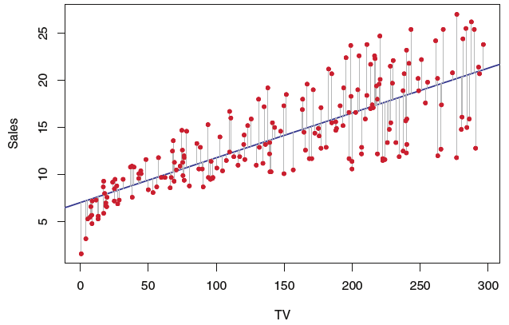]

(James et al. (ISLR), Fig.3.1, s.62)

---
# OLS Tahmini

Satış - Reklam Harcamaları örneği için OLS amaç fonksiyonu: 

.center[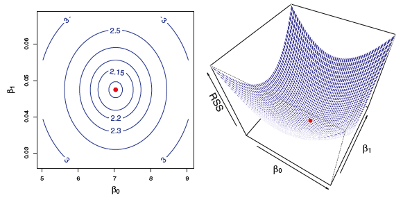]

(ISLR, Fig.3.2, s.63)

---
# Popülasyon (anakütle) vs. Örneklem (sample)

* Popülasyon Regresyon Fonksiyonu (PRF) pratikte bilinmez. 

* Eğitim verileriyle PRF'yi tahmin ederiz. Veriler değiştikçe tahmin edilen 
katsayılar da değişir. 

* Bilinmeyen parametreler: $\beta_0$, $\beta_1$

* OLS tahmincileri: $\hat{\beta}_0$, $\hat{\beta}_1$, rassal değişkenler, veri değiştikçe bunlar da değişir. 

* Pratikte elimizde sadece bir veri seti vardır. Bundan hareketle tahminin doğruluğunu nasıl değerlendirebiliriz? 

---
# PRF vs SRF 

PRF: $Y= 2 + 3X + \epsilon$ (simülasyonla elde edildiği için biliniyor)

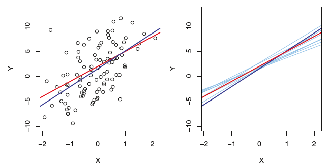

Kırmızı: gerçek ilişki (PRF), siyah: tahmin, sağda: çok sayıda tekrarlı verilerdle tahmin edilen OLS örneklem fonksiyonları. (ISLR, Fig.3.2, s.64)

---
# OLS Tahmincilerinin Cebirsel Özellikleri 

* Kalıntıların toplamı ve ortalaması sıfırdır:
$$\sum_{i=1}^n \hat{e}_i = 0,~~~~~\bar{\hat{e}_i} = 0$$

* Kaıntılarla $x$ arasındaki örneklem kovaryansı sıfırdır:
$$\sum_{i=1}^n x_i\hat{e}_i = 0$$

* $(\bar{x},\bar{y})$ her zaman regresyon doğrusu üzerindedir. 

* Tahmin değerlerinin ortalaması gerçek değerlerin ortalamasına eşittir:
$\bar{y}=\bar{\hat{y}}$

---
# Modelin Açıklama Gücü 

* Her gözlem için: $y_i = \hat{y}_i + \hat{\epsilon}_i$. Bunun her iki tarafındaki terimleri örneklem ortalamalarından farkını aldıktan sonra karelerini alıp toplarsak:

* Toplam Kareler Toplam: (SST: Total Sum of Squares)
$$SST = \sum_{i=1}^n (y_i -\bar{y})^2$$

* Açıklanan Kareler Toplamı: (SSE: Explained Sum of Squares)
$$SSE = \sum_{i=1}^n (\hat{y}_i -\bar{y})^2$$

* Kalıntı Kareleri Toplamı: (SSR: Residual Sum of Squares)
$$SSR = \sum_{i=1}^n \hat{u}_i^2$$

---
# Modelin Açıklama Gücü

* $y$'deki toplam değişkenlik aşağıdaki gibi yazılabilir: 
$$SST = SSE + SSR$$

* Her iki tarafı SST ile bölersek: 
$$1 = \frac{SSE}{SST} + \frac{SSR}{SST}$$

* Belirlilik katsayısı, $0\leq R^2\leq 1$: 
$$R^2 = \frac{SSE}{SST} = 1 - \frac{SSR}{SST}$$

* Yorum: $y$'deki değişkenliğin yaklaşık $100\times R^2$% kadarı $x$ tarafından açıklanabilmektedir.

* Zayıf nokta: Modele yeni değişkenler eklendikçe $R^2$ her zaman artar ya da aynı kalır, hiç bir zaman azalmaz. Model seçiminde kullanılamaz. 

---
# OLS Tahmincilerinin Standart Hataları

* Basit regresyon modelinde $Var(\epsilon)=\sigma^2$ varsayımı altında standart hatalar aşağıdaki formüllerden hareketle hesaplanabilir. 

$$\operatorname{SE}\left(\hat{\beta}_{0}\right)^{2}=\sigma^{2}\left[\frac{1}{n}+\frac{\bar{x}^{2}}{\sum_{i=1}^{n}\left(x_{i}-\bar{x}\right)^{2}}\right]$$

$$\operatorname{SE}\left(\hat{\beta}_{1}\right)^{2}=\frac{\sigma^{2}}{\sum_{i=1}^{n}\left(x_{i}-\bar{x}\right)^{2}}$$
SE = standart hata (standard error)

* Bu standart hatalar hipotez testlerinde ve güven aralıklarının oluşturulmasında kullanılabilir. 

---
# Hipotez Testleri 

* Her zaman PRF ile ilgili: $Y=\beta_0 + \beta_1 X + \epsilon$ 

* Boş hipotez: $X$ ile $Y$ arasında bir ilişki yoktur. 
$$H_0: \beta_1 = 0$$ 

* Alternatif hipotez: $X$ ile $Y$ arasında bir ilişki vardır.  
$$H_a: \beta_1 \neq 0$$


* $H_0$ $t$ testi ile sınanabilir. Boş hipotez altında $t$ test istatistiği: 
$$t = \frac{\hat{\beta}_1-0}{\operatorname{SE}\left(\hat{\beta}_{1}\right)}$$

* $X$ ile $Y$ arasında hiç bir ilişki yoksa (yani boş hipotez doğruysa) $t$ istatistiği $n-2$ serbestlik derecesiyle $t$ dağılımına uyar.

---
# t-testi karar kuralı

* Basit regresyon modelinde boş hipotez $H_0: \beta_1 = 0$ ve alternatif $H_a: \beta_1 \neq 0$ için t testi karar kuralı: 

> Verilmiş bir Tip-I hata olasılığı, $\alpha = Pr(|T|>c_{\alpha/2}~|~H_0)$, için hesaplanan $t$ istatistiğinin mutlak değeri kritik değer $c_{\alpha/2}$'den büyükse boş hipotez reddedilebilir. $$t>c_{\alpha/2}~~ \mbox{ya da}~~ t<-c_{\alpha/2}~~\mbox{ise}~~H_0~~red$$

(Not: Burada $T$, $n-2$ serbestlik derecesine sahip bir $t$ rassal değişkenidir.)

* Tip-I hata olasılığı: $Pr(H_0~~ RED~|~H_0~DOĞRU)$. Bir boş hipotezin doğru olup olmadığı pratikte hiç bir zaman bilinemez. 

* Tip-II hata olasılığı: $Pr(H_0~~ KABUL~|~H_0~YANLIŞ)$. Bu olasılığı pratikte belirleyemeyiz.

---
# p-değeri 

* Her seferinde tablo kritik değerlerine bakmak yerine $\alpha$'yı elimizdeki örneklemden hareketle tahmin etmeye çalışabiliriz. 

* $p$-değeri: Elimizdeki örneklemden hareketle aynı testi yapsak boş hipotezi kabul etmemizle sonuçlanacak en büyük anlamlılık düzeyi, $\alpha$, kaçtır? 

* Örnek: $n-2=65$, hesaplanan $t$ istatistiği $t=1.82$ olsun. 
$$p-değeri=Pr(T>1.82|H_0) + Pr(T<-.82|H_0) = 0.0367 + 0.0367 = 0.0734$$
```{r}
2*pt(1.82, df=65, lower.tail = FALSE)
```

* $H_0$'ın reddi için en düşük anlamlılık düzeyi=7.34%. Bundan daha yüksek tüm $\alpha$ düzeylerinde $H_0$ RED. Örneğin, testi $\alpha=5\%$ düzeyinde yaparsak boş hipotez reddedilemez. $p$-değeri ne kadar küçükse elimizdeki örneklemde boş hipotez aleyhine kanıt o kadar güçlü demektir.

---
# Çoklu Regresyon Modeli 

$$y = \beta_0 + \beta_1 x_1 + \beta_2x_2 \ldots + \beta_p x_p +\epsilon$$
* Pratikte elimizde çok sayıda kestirici değişken olabilir. Bu değişkenleri aynı anda modele ekleyebiliriz. 

* Model parametrelerde doğrusal olduğundan OLS yöntemini uygulayabiliriz. Bir eğitim setinden hareketle kestirim: 
$$\hat{y} = \hat{\beta}_0 + \hat{\beta}_1 x_1 + \hat{\beta}_2 x_2 \ldots + \hat{\beta}_p x_p$$

* Katsayı yorumları: diğer tüm değişkenler sabitken $x_j$'deki bir birim değişime karşılık $y$'de kestirilen değişim ortalama $\hat{\beta}_j$ kadardır, $j=1,2,\ldots,p$.

---
# OLS Tahmini 

.pull-left[
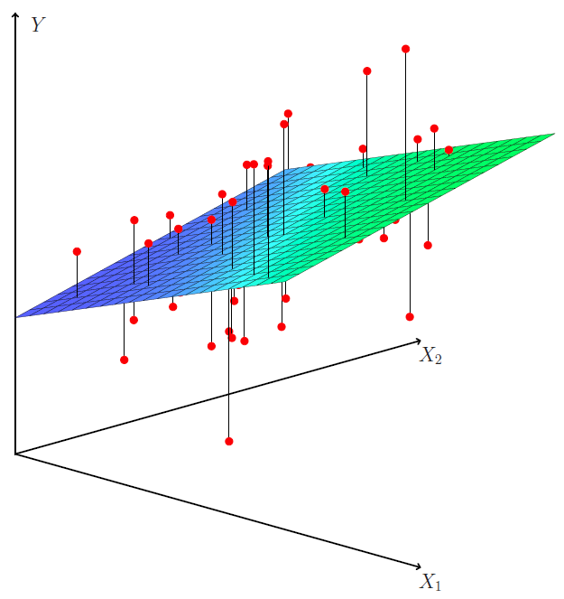
]

.pull-right[
* İki kestirim değişkeninin $X_1,X2$ olduğu durumda OLS tahmin doğrusu bir yüzeye dönüşür. 

* kırmızı noktalar: gözlem noktaları

* OLS bu noktaların yüzeye olan uzaklığının karesini en küçük yapar. 
]

---
# Örnek (Table 3.4, p. 74) 
Çoklu regresyon: $sales = \beta_0 + \beta_1 TV + \beta_2 Radio + \beta_3 Newspaper + \epsilon$


|            | Estimate| Std. Error| t value| Pr(>&#124;t&#124;)|
|:-----------|--------:|----------:|-------:|------------------:|
|(Intercept) |    2.939|      0.312|   9.422|             0.0000|
|TV          |    0.046|      0.001|  32.809|             0.0000|
|radio       |    0.189|      0.009|  21.893|             0.0000|
|newspaper   |   -0.001|      0.006|  -0.177|             0.8599|

Basit regresyon: $sales = \alpha_0 + \alpha_1 Newspaper + \epsilon$

|            | Estimate| Std. Error| t value| Pr(>&#124;t&#124;)|
|:-----------|--------:|----------:|-------:|------------------:|
|(Intercept) |   12.351|      0.621|  19.876|             0.0000|
|newspaper   |    0.055|      0.017|   3.300|             0.0011|

---
# F Testi 

* Modelin bir bütün olarak istatistik bakımından anlamlı olup olmadığı $F$ testi ile sınanabilir. Boş ve alternatif hipotez: 
$$H_0:\beta_1=\beta_2=\ldots=\beta_p=0$$
$$H_a: \mbox{En az bir}~\beta_j\neq 0$$

* F istatistiği 
$$F = \frac{R^2/p}{(1-R^2)/(n-p-1)}\sim~F_{p,n-p-1}$$
$$F = \frac{(SST-SSR)/p}{SSR/(n-p-1)}$$
$$R^2=1- \frac{SSR}{SST}$$

---
# Kategorik X değişkenleri 

* Regresyon modellerinde niteliksel bilgiyi içeren kategorik değişkenleri ekleyebiliriz. 

* İki kategori, cinsiyet = Kadın, Erkek
$$x_{i}=\left\{\begin{array}{ll}
1, & \text { eğer } i . \text { kişi kadın ise } \\
0, & \text { eğer } i . \text { kişi erkek ise. }
\end{array}\right.$$

$$y_{i}=\beta_{0}+\beta_{1} x_{i}+\epsilon_{i}=\left\{\begin{array}{ll}
\beta_{0}+\beta_{1}+\epsilon_{i}, & \text { eğer } i . \text { kişi kadın ise } \\
\beta_{0}+\epsilon_{i}, & \text { eğer } i . \text { kişi erkek ise. }
\end{array}\right.$$


* $\beta_0$: erkek grubu için regresyon kesme noktası (sabit)
* $\beta_{0}+\beta_{1}$: kadın grubu için kesme noktası
* İki kategori için bir kukla değişken eklemek yeterli. 
* İkiden fazla kategorisi olan değişkenler için bir eksiği kadar kukla değişken modele eklenebilir. Örneğin etnik köken değişkeni 3 gruba sahipse, modele 2 kategoriyi temsil eden kukla değişkenin eklenmesi yeterlidir. Dışlanan grup kesme terimi ile temsil edilir (baz grup). 

---
# Etkileşim

* Bazı durumlarda bir değişkenin marjinal etkisi başka bir değişkene bağlı olabilir. 

* Örneğin satış ve reklam harcamaları modelinde radyo ilan harcamaları TV reklamlarının etkisi arttırabilir. 
$$sales = \beta_{0}+\beta_{1}~ TV+\beta_{2}~ Radio + \beta_3~ (TV\times Radio) + \epsilon$$
ya da 
$$sales = \beta_{0}+(\beta_{1}+\beta_3 Radio)~ TV+\beta_{2}~ Radio  + \epsilon$$
Böylece 
$$\frac{\Delta Sales}{\Delta TV}=\beta_{1}+\beta_3 Radio,\quad \frac{\Delta Sales}{\Delta Radio}=\beta_{2}+\beta_3 TV$$

---
# Etkileşim: Örnek 

|              | Estimate| Std. Error| t value| Pr(>&#124;t&#124;)|
|:-------------|--------:|----------:|-------:|------------------:|
|(Intercept)   |   6.7502|     0.2479| 27.2328|             0.0000|
|TV            |   0.0191|     0.0015| 12.6990|             0.0000|
|radio         |   0.0289|     0.0089|  3.2408|             0.0014|
|I(TV * radio) |   0.0011|     0.0001| 20.7266|             0.0000|

* TV, radio: USD cinsinden televizyon ve radyo reklam harcamaları,
* Radyo reklamlarındaki 1000 dolarlık bir artış için satışlarda ortalamada ne kadar değişim tahmin edilmiştir? 
* $\Delta Sales = (0.0289+0.0011TV)\times 1000 = 28.9 + 1.1TV$
* Ortalama TV harcamaları 147. Bunu TV yerine yazarsak ortalamadaki etkiyi 190.6 USD olarak buluruz. 

---
# Doğrusal Olmayan İlişkiler

* Modelin parametrlerde doğrusal olan yapısını bozmadan $y$ ve $x$ değişkenlerinin uygun dönüştürmelerini kullanarak doğrusal olmayan ilişkileri yakalayabiliriz. 

* Pratikte en çok kullanılan dönüştürmeler (doğal) logaritma ve üstel dönüştürmelerdir. 

* Polinom regresyonu: $X$ değişkeninin $X^2$ ve $X^3$ gibi dönüştürmelerini modele ekleyebiliriz. Örneğin karesel model: 
$$Y = \beta_0 + \beta_1 X + \beta_2 X^2 + \epsilon$$
Bu model aslında $X$ değişkeninin kendisiyle etkileşim içinde olduğu anlamına gelir. $X$'in $Y$ üzerindeki etkisi $X$'in değerine bağlıdır. 

* Adım fonksiyonu: $X$'in değerler aralığı parçalara bölünerek kategorik değişkenler oluşturulur.

---
# Doğrusal Olmayan İlişkiler

* Spline ve Smoothing spline: adım fonksiyonu ile polinomların birleştirilmesi ile elde edilir. Uygun parça sayısı ile iyi bir uyum yakalanabilir.

* Lokal regresyon 

* Genelleştirilmiş Toplamsal (Generalized Additive Models-GAMs)

(detaylar için bkz. ISLR ch.7)

---
# Potansiyel Sorunların Teşhisi 

## Doğrusal olmayan ilişki: Kalıntı ve tahmin değerlerinin serpilme çizimi 

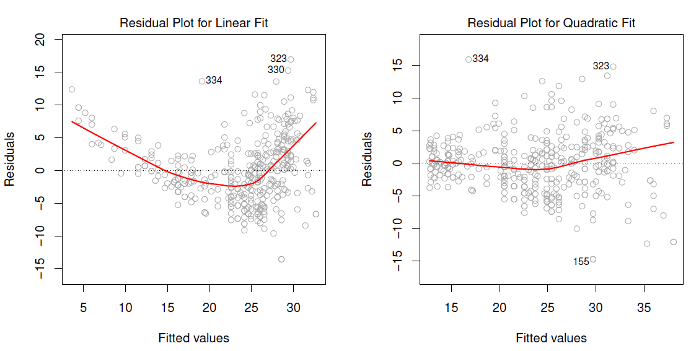

---
# Potansiyel Sorunların Teşhisi 

## Hata teriminde otokorelasyon, $\rho$

.pull-left[
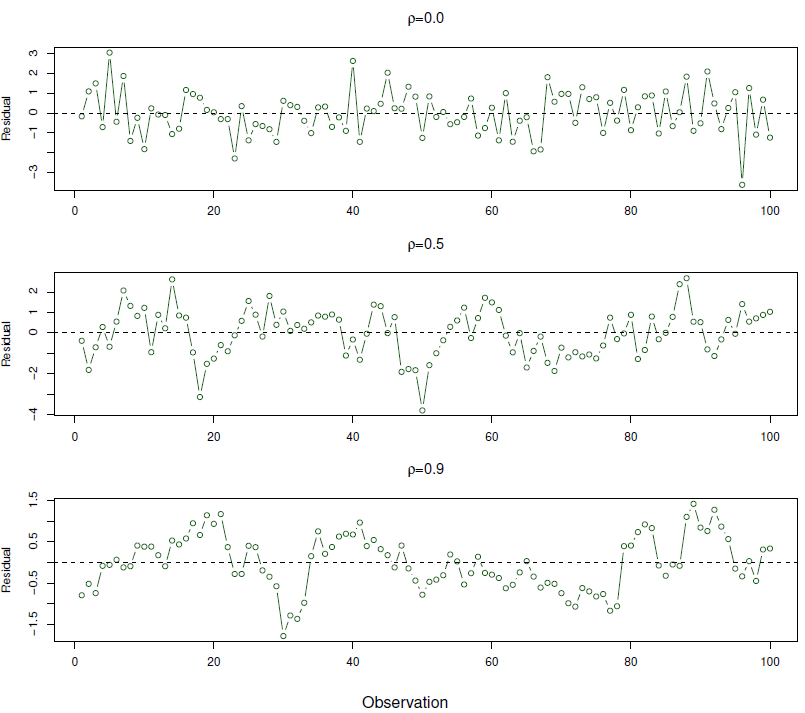
]

.pull-right[
* Özellikle zaman serisi modellerinde ortaya çıkabilir. 
* Otokorelasyon katsayısı = $\rho$
* $\rho=0$ ise otokorelasyon yok. 
* Soldaki grafikte görüldüğü gibi $\rho$ arttıkça kalıntıların zaman serisi çizimi belirgin bir örüntü sergilemeye başlar. Sıfır çevresinde rastgele dağılması beklenirken, otokorelasyon arttıkça pozitif (negatif) değerleri yine pozitif (negatif) değerlerin takip etme olasılığı artar. 
]

---
# Potansiyel Sorunların Teşhisi 

## Sabit olmayan hata varyansı (heteroskedasticity) 
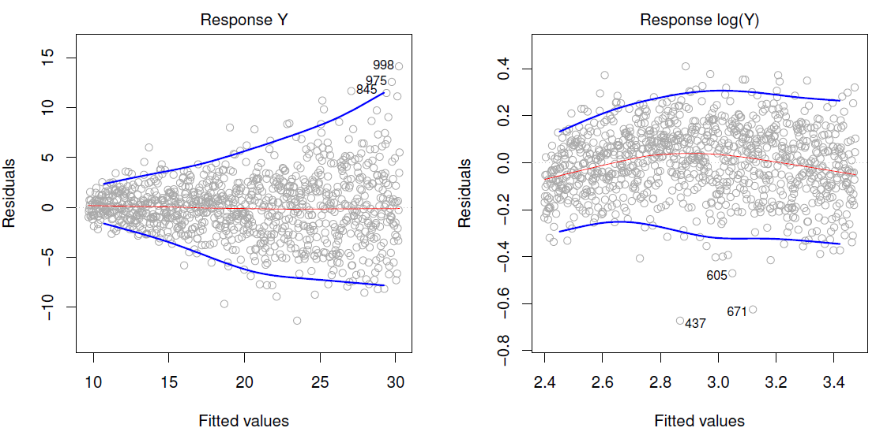

---
# Potansiyel Sorunların Teşhisi 

## Uç değerler (Outliers): Çok büyük ya da küçük $y_i$ değerleri

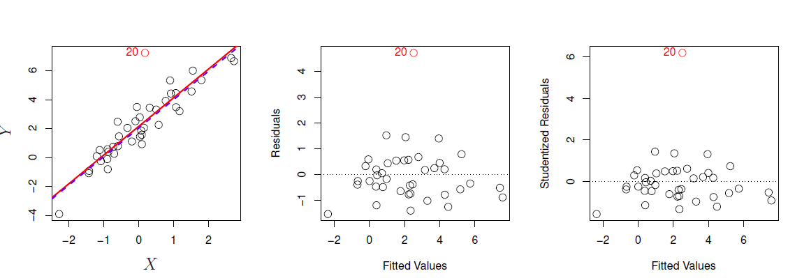
20 numaralı nokta bir uç değer. Kırmızı: Uç değer dahil tahmin. Mavi kesikli: uç değer hariç tahmin. Sonuç üzerindeki etkisi az gibi görünüyor. Ancak standart hataları ve modelin açıklama gücünü önemli ölçüde etkileyebilir. 

---
# Potansiyel Sorunların Teşhisi 

## Yüksek Kaldıraç Noktaları: Çok büyük ya da küçük $x_i$ değerleri

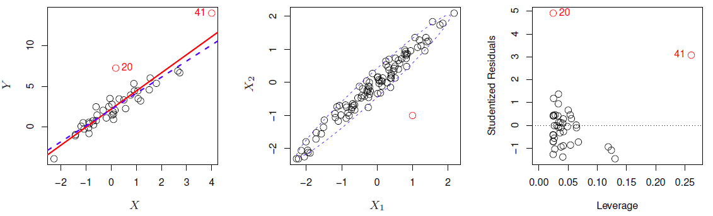
41 numaralı nokta yüksek kaldıraçlı bir gözlem. Bu nokta dışlanarak tahmin yapıldığında (mavi kesikli doğru) sonuçlar önemli ölçüde değişiyor. En sağdaki grafikte kaldıraç (leverage) değerleri ile standardize edilmiş kalıntılar gösterilmektedir (bkz. ISLR, Denklem 3.37, s.98)

---
# Potansiyel Sorunların Teşhisi 

## Çoklu doğrusallık (Collinearity ya da Multicollinearity)

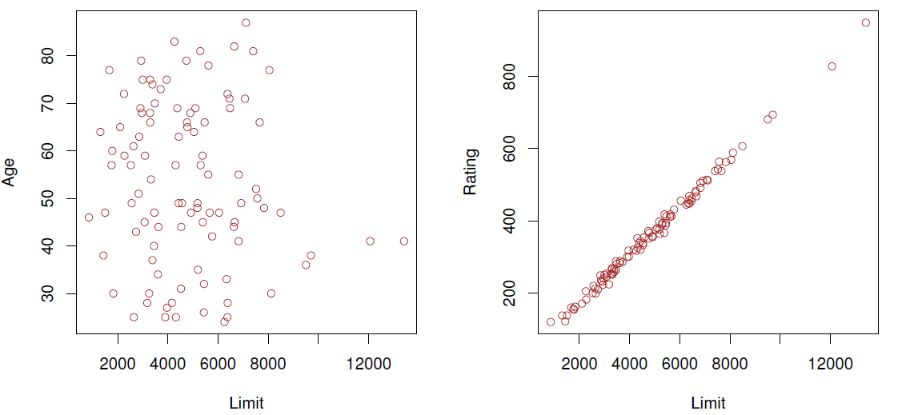

---
# Collinearity

Tam çoklu doğrusallık durumunda OLS tahmincileri tanımsızdır. Ancak yüksek doğrusal ilişkili $X$ değişkenlerinin varlığı da problem yaratabilir. OLS tahmin varyansı ve katsayıların standart hataları yükselir. 

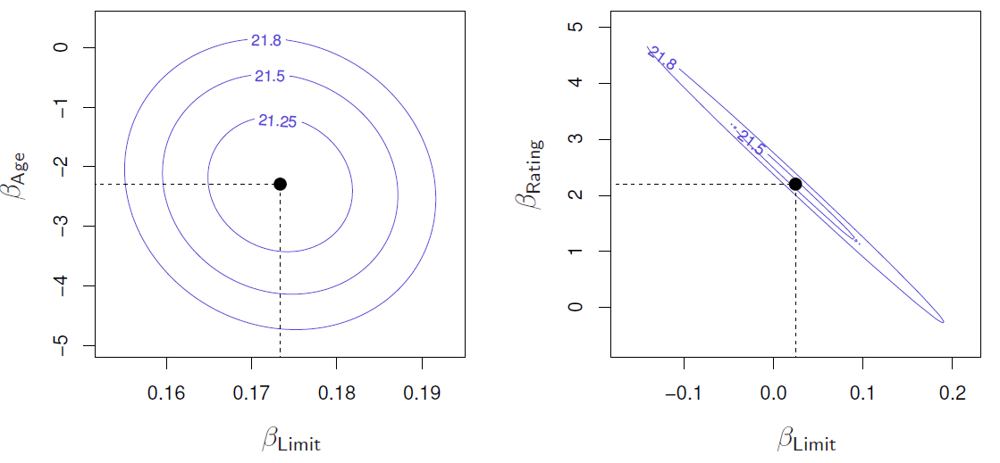

Sol: OLS amaç fonksiyonu kontür çizimi, düşük korelasyonlu $X$ değişkenleri; Sağ: yüksek korelasyonlu $X$ değişkenleri ile OLS. 


