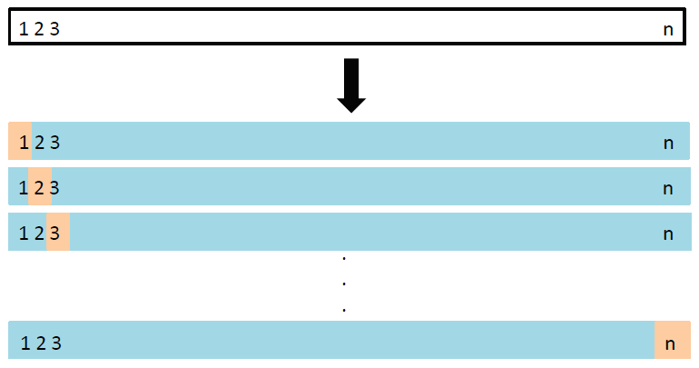

class: my-medium-font

<style type="text/css">
.remark-slide-content {
    font-size: 25px;
    padding: 1em 4em 1em 4em;
}
.my-large-font {
  font-size: 40px;
}
.my-small-font {
  font-size: 20px;
}
.my-medium-font {
  font-size: 30px;
}
</style>


# Konular

- Test Hatasının Tahmini 
- Geçerleme (Validation)
- Çapraz Geçerleme (Cross Validation)
- Biri-Hariç Çapraz Geçerleme 
- $k$-Katlı Çapraz Geçerleme

---
# Eğitim ve Test Hatası
.center[] 

---
# Örnek: Polinom regresyonu
.pull-left[
Örnek olarak aşağıdaki polinom regresyonu düşünelim: 
$$y=\beta_0 + \beta_1 x + \beta_2 x^2 + \ldots + \beta_p x^p +\epsilon$$
(Dataset = AUTO, y=mpg (miles per gallon), x=horsepower)

* En iyi kestirimleri veren (en küçük MSE değerine sahip) $p$ (polinom derecesi) kaçtır?
]
.pull-right[

]

---
# Test Hatası Nasıl Hesaplanır? 
## Geçerleme Yaklaşımı
* Pratikte genellikle elimizde sadece bir veri seti vardır. Modelin kestirim başarısını ölçebileceğimiz ayrı bir test veri seti genellikle yoktur. 
* Bu durumda verileri rassal olarak iki gruba ayırabiliriz: eğitim verisi ve geçerleme (validation, hold-out) verisi 

.center[] 
* Model sadece eğitim verileriyle tahmin edilir. Geçerleme verileri kullanılarak kestirimler oluşturulur ve test hatası hesaplanır. 

---
# Örnek: Polinom regresyonu

.center[]
* Veri seti rassal olarak ikiye bölündü ve her seferinde geçerleme verilerinden hareketle her polinom derecesi için MSE hesaplandı. Solda: tek geçerleme seti
* Sağda: 10 kere tekrarlanmış geçerleme MSE değerleri. Fazla değişkenlik olduğuna dikkat ediniz. 

---
# Geçerleme  yaklaşımı

## Zayıf tarafları
* Veriler rastgele ikiye ayrıldığı için buradan kaynaklı belirsizliği dikkate almamız gerekir. Bunun için süreci tekrar ederek çok sayıda rastgele geçerleme tahminleri yaptığımızda da, önceki grafikte görüldüğü gibi, yüksek değişkenlik gözlemlenmektedir.

* Geçerleme yaklaşımında sadece eğitim verilerinin model tahmininde (eğitiminde) kullanıldığı unutulmamalıdır. Geçerleme veri seti her bir model için (örneğimizde her bir $p$ için) sadece kestirim hatalarının hesaplanmasında kullanılır. Eğitim setinde daha az veri kullanıldığı için modellerin performansı azalır. Sonuçta geçerleme hatası test hatasını olduğundan yüksek tahmin edebilir. 

* Alternatifler
  * Biri-hariç Çapraz Geçerleme (Leave-one-out Cross Validation)
  * $k$-katlı Çapraz Geçerleme ( $k$-fold Cross Validation )
  
---
# Biri-hariç Çapraz Geçerleme 
### LOOCV (Leave-one-out Cross Validation)

 
.pull-left[
* Gözlemlerden sadece biri geçerlemede kullanılır; geriye kalan (n-1) gözlem modelin eğitiminde kullanılır. 
* Bu süreç her seferinde bir gözlem eğitimden dışlanacak şekilde n kere tekrarlanır ve her biri için $MSE_i$ elde edilir.
* Bu $n$ MSE değerinin ortalaması test hata tahminidir: 
$$\mathrm{CV}_{(n)}=\frac{1}{n} \sum_{i=1}^{n} \mathrm{MSE}_{i}$$
]
.pull-right[

]

---
# $k$-Katlı Çapraz Geçerleme
## $k$-Fold Cross Validation
.pull-left[
* Biri-hariç çapraz geçerleme $n$ büyük olduğunda hesaplamada zorluk çıkarabilir. 
* Alternatif olarak gözlemler rassal şekilde $k$ gruba (kat) ayrılabilir. 
* Sırasıyla her kat geçerleme seti olarak kullanılır; geriye kalan gözlemlerle model eğitilir. 
* Sonuçta elimizde $k$ tane MSE değeri vardır. Test hata tahmini bunların ortalamasıdır: 
$$\mathrm{CV}_{(k)}=\frac{1}{k} \sum_{i=1}^{k} \mathrm{MSE}_{i}$$
]
.pull-right[

]

---
# Örnek 


**Solda**: Auto veri seti için (bkz önceki örnek) Biri-hariç Çapraz Geçerleme MSE değerleri, **Sağda**: $k=10$ katlı Çapraz Geçerleme (Kaynak: James et al., ISLR Fig-5.4, p.180)

---
# $k$-Katlı Çapraz Geçerlemede Sapma-Varyans Ödünümü
* $k$-Katlı çapraz geçerleme (ÇG) biri-hariç çapraz geçerlemeye göre hesaplama açısından avantaj sağlar. 
* Ancak asıl önemli avantaj test hatasının biri-hariç çapraz geçerlemeye (LOOCV) göre daha doğru tahmin edilmesidir. 
* Çapraz geçerleme test hatasını fazla tahmin etme eğilimlidir. LOOCV ise test hatasını sapmasız tahmin eder. $k$-katlı ÇG bu ikisinin arasında bir yerdedir. 
* Bu açıdan bakıldığında her seferinde LOOCV'yi tercih etmemiz gerekir. 
* Ancak $k$-katlı çapraz geçerlemenin varyansı biri-hariç ÇG'ye göre daha düşüktür.
* Bunun sebebi LOOCV'de test tahminlerinin birbiriyle çok yüksek ilişkili olmasıdır.

---
# Sınıflandırma Problemlerinde Çapraz Geçerleme

* Çapraz Geçerleme yaklaşımı, çıktı değişkeni $Y$'nin nitel olduğu sınıflandırma problemlerinde de kullanılabilir. 
* Bu durumda, daha önce gördüğümüz gibi, sınıflama hatasını 
$$Err_i = I(y_i\neq \hat{y}_i)$$
olarak tanımlarsak Biri-Hariç Çapraz Geçerleme test hatası aşağıdaki gibi tanımlanabilir: 
$$\mathrm{CV}_{(n)}=\frac{1}{n} \sum_{i=1}^{n} Err_i$$
* Benzer şekilde $k$-Katlı ÇG: 
$$\mathrm{CV}_{(k)}=\frac{1}{k} \sum_{i=1}^{n} Err_i$$

---
# Zaman Serisi Verileri 
* Zaman serisi verileriyle öngörü modellerin örneklem-dışı (out-of-sample) öngörü başarısı değerlendirilirken iki yaklaşım benimsenebilir.
* Geleneksel Yaklaşı ve Çapraz Geçerleme Yaklaşımı
* Zaman serileri genellikle türdeş ve bağımsız (iid) olmaz. Ayrıca verilerdeki kronolojik yapının bozulmaması gerekir. Bu nedenle rassal örneklemeyle çapraz geçerleme yapamayız. 

**Geleneksel Yaklaşım**

```{r traintest2, fig.height=1, echo=FALSE, cache=TRUE} 
train = 1:18
test = 19:24
par(mar=c(0,0,0,0))
plot(0,0,xlim=c(0,26),ylim=c(0,2),xaxt="n",yaxt="n",bty="n",xlab="",ylab="",type="n")
arrows(0,0.5,25,0.5,0.05)
points(train, train*0+0.5, pch=19, col="blue")
points(test,  test*0+0.5,  pch=19, col="red")
text(26,0.5,"  zaman")
text(10,1,"Eğitim Verisi",col="blue")
text(21,1,"Test Verisi",col="red")
```

* Veriler eğitim ve test kısımlarına ayrılır. Test verileriyle öngörü hataları hesaplanır.


---
# Çapraz Geçerleme 

.pull-left[**Zaman Serisi Çapraz Geçerleme**  
```{r cv1, cache=TRUE, echo=FALSE, fig.height=4}
par(mar=c(0,0,0,0))
plot(0,0,xlim=c(0,28),ylim=c(0,1),
       xaxt="n",yaxt="n",bty="n",xlab="",ylab="",type="n")
i <- 1
for(j in 1:10)
{
  test <- (16+j):26
  train <- 1:(15+j)
  arrows(0,1-j/20,27,1-j/20,0.05)
  points(train,rep(1-j/20,length(train)),pch=19,col="blue")
  if(length(test) >= i)
    points(test[i], 1-j/20, pch=19, col="red")
  if(length(test) >= i)
    points(test[-i], rep(1-j/20,length(test)-1), pch=19, col="gray")
  else
    points(test, rep(1-j/20,length(test)), pch=19, col="gray")
}
text(28,.95,"zaman")
```
]
.pull-right[
* Öngörüler Biri-Hariç çapraz geçerlemede olduğu gibi bir test gözleminden hareketle hesaplanır. 
* İzleyen adımda bir önceki test gözlemi eğitim setine eklenir ve model tekrar tahmin edilir. Bu modelden hareketle yeni bir öngörü oluşturulur. 
* Tüm test verileri için aynı işlem yapılır. En sonunda öngörü hatalarının ortalaması hesaplanır. 
]

Detaylar için bkz. Hyndman, R.J., & Athanasopoulos, G. (2019) Forecasting: principles and practice, 3rd edition, OTexts: Melbourne, Australia. 
[https://otexts.com/fpp3/](https://otexts.com/fpp3/)


