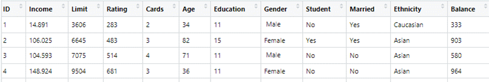
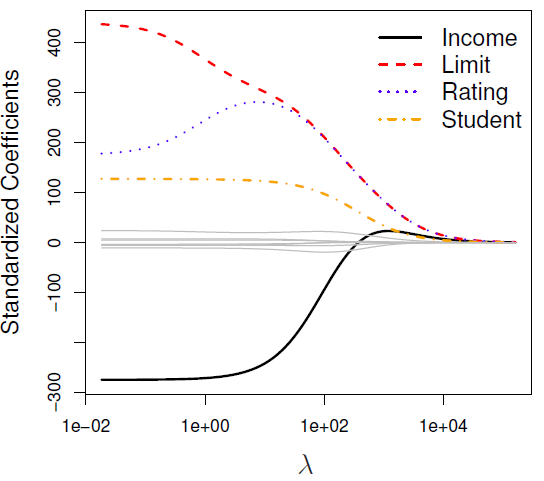
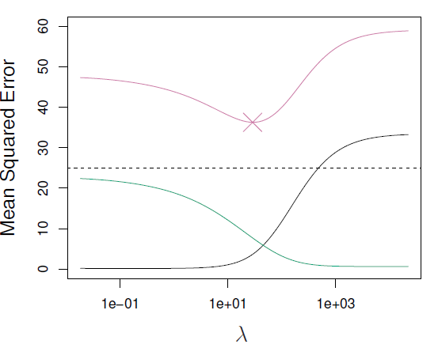
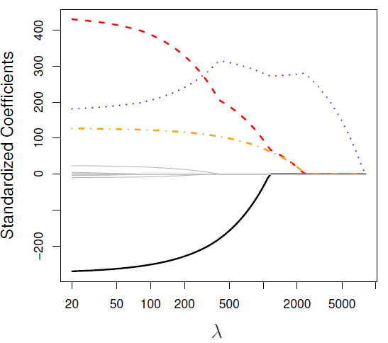
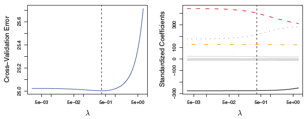

class: my-medium-font

<style type="text/css">
.remark-slide-content {
    font-size: 25px;
    padding: 1em 4em 1em 4em;
}
.my-large-font {
  font-size: 40px;
}
.my-small-font {
  font-size: 20px;
}
.my-medium-font {
  font-size: 30px;
}
</style>


# Konular

- Düzenlileştirme (Regularization)
- Çıkıntı regresyonu (Ridge regression)
- LASSO 
- Elastik Net

---
# Düzenlileştirme (Regularization)

* Sıradan En Küçük Kareler (OLS) yöntemi Gauss-Markov varsayımları altında sapmasız ve en düşük varyanslı (etkin) tahminciler verir. 
* Gözlem sayısının ( $n$ ) değişken sayısından ( $p$ ) çok daha büyük olduğu örtük olarak varsayılır: $n>> p$
* $n = p$ ise OLS tahmini **tam uyum** ile sonuçlanır. 
* $p>n$ ise sonsuz sayıda OLS çözümü vardır (sonsuz varyans). OLS kullanamayız. 
* Düzenlileştirme: model katsayılarını kısıtlayarak (shrinkage) varyansı düşürebilir miyiz?

---
# Tam Uyum: Basit Regresyon 
.pull-left[
$n=21$, $p=1$, $R^2=0.94$
```{r, warning=FALSE, echo=FALSE} 
library(tidyverse)
set.seed(123)
n <- 21 
x <- rnorm(n, mean=10, sd=2) 
u <- rnorm(n, mean=0, sd=2)
y <- 5 + 3*x + u
df1   <- tibble(id=1:n, y, x)
p1 <- df1 %>% ggplot(aes(x=x,y=y)) + 
  geom_point(size = 3) 
reg1 <- lm(y ~ x, data=df1)
p1 + geom_abline(color = "blue", aes(intercept=coef(reg1)[1], slope=coef(reg1)[2])) +
  ylim(c(20,50)) + xlim(c(6,14)) +
  theme_bw()
```
]

.pull-right[
$n=2$, $p=1$, $R^2=1$
```{r, warning=FALSE, echo=FALSE}
df2 <- df1[c(1,5),]
reg2 <- lm(y ~ x, data=df2)
 df2 %>% ggplot(aes(x=x,y=y)) + 
  geom_point(size=3) + 
   geom_abline(color = "blue", aes(intercept=coef(reg2)[1], slope=coef(reg2)[2]))+
   ylim(c(20,50)) + xlim(c(6,14)) + 
   theme_bw()
```
]

---
# Çıkıntı Regresyonu 

OLS amaç fonksiyonu 
$$SSR = \sum_{i=1}^n (y_i -  \beta_0 - \beta_1 x_{i1}-\ldots-\beta_p x_{ip})^2$$
Ridge regresyonu OLS'ye çok benzer ancak amaç fonksiyonuna bir ceza terimi ekler: 
$$SSR_R = \sum_{i=1}^n (y_i -  \beta_0 - \beta_1 x_{i1}-\ldots-\beta_p x_{ip})^2 + \lambda \sum_{j=1}^p \beta_j^2 = SSR + \lambda \sum_{j=1}^p \beta_j^2$$
$\lambda \geq 0$ ayarlama (tuning) parametresi

$\lambda \sum_{j=1}^p \beta_j^2$: küçültme cezası (shrinkage penalty). $\lambda = 0$ ise OLS=Ridge

$\lambda\rightarrow \infty$ ridge katsayıları, $\hat{\beta}_{\lambda}^R$, sıfıra yaklaşır. $\lambda$ değiştikçe katsayı tahminleri değişir.

---
# Örnek 
.center[]
* $p=10$, Çıktı değişkeni = Balance 
* Amaç çıktı değişkenini en iyi kestiren doğrusal modeli kurmak. 
* OLS katsayıları $X$'lerin ölçü birimlerine bağlı olarak değişir. Örneğin $X=Gelir$ TL olarak ölçülmüş olsun. Eğer $Gelir2 = Gelir/1000$ dönüştürmesi ile 1000TL cinsinden yeni bir değişken yaratırsak bunun katsayısı $1000\times \hat{\beta}$ olarak değişir ve sonuçta $X\times \hat{\beta}$ aynı kalır. 
* Ridge regresyonu için ise bu özellik geçerli değildir. Bu nedenle tüm değişkenleri standardize etmek gerekir (Paydada $x_j$'nin örneklem standart sapması yer almaktadır): 
$$\tilde{x}_{i j}=\frac{x_{i j}}{\sqrt{\frac{1}{n} \sum_{i=1}^{n}\left(x_{i j}-\bar{x}_{j}\right)^{2}}}$$

---
# Örnek: Credit data 

.pull-left[
.center[]
]

.pull-right[
* Bu grafik $\lambda$ değiştikçe katsayı tahminlerinin nasıl değiştiğini göstermektedir
* Dikey eksen: standardize edilmiş ridge katsayı tahminleri 
* Yatay eksen: $\lambda$ ayarlama parametresi
* $\lambda=0$: OLS katsayıları
* $\lambda$ büyüdükçe katsayılar küçülmektedir; limitte tüm katsayılar 0 olur. 
]

(ISLR Fig-6.4, p.216)

---
# Ridge regresyonunda sapma-varyans ilişkisi 
.pull-left[
.center[]
]

.pull-right[
* Simülasyon verileri ile edilen grafikte $\lambda$ ile ortalama hata karesi arasındaki ilişki gösteriliyor. 
* MSE (mor) = Sapmakare (siyah) + Varyans (yeşil) + İndirgenemez hata varyansı (kesikli yatay)
* $\lambda=0$ iken sapma çok küçük ancak varyans yüksek. 
* $\lambda\approx 10$ değerine kadar MSE hızlı bir şekilde azalıyor, sapmada da bir artış var ancak çok fazla değil.
* $\lambda = 30$ için MSE en küçük.
]

(ISLR Fig-6.5, p.218)

---
# LASSO 

* Çıkıntı regresyonunun en önemli zaafı tüm değişkenlerin modelde yer almasıdır (katsayıları küçük de olsa). Model katsayıları tam olarak $\beta=0$ olmaz ( $\lambda=\infty$ değilse ). 
* Eğer amacımız değişkenlerin seçimi ise ridge regresyonu uygun olmayabilir. 
* Örneğin Credit veri setinde Balance için kurduğumuz model 10 değişkenin hepsini içerecektir. Ancak bunların içinde bazıları diğerlerinden daha önemli olabilir (income, limit, rating, student). 
* Alternatif: LASSO (Least Absolute Shrinkage and Selection Operator)
* Tıpkı Ridge regresyonu gibi LASSO regresyonu da OLS amaç fonksiyonuna bir ceza terimi ekler: 
$$\sum_{i=1}^{n}\left(y_{i}-\beta_{0}-\sum_{j=1}^{p} \beta_{j} x_{i j}\right)^{2}+\lambda \sum_{j=1}^{p}\left|\beta_{j}\right|=\mathrm{SSR}+\lambda \sum_{j=1}^{p}\left|\beta_{j}\right|$$
* LASSO'nun en önemli farkı bazı değişkenlerin katsayılarını sıfıra eşitleyerek **değişken seçimi** yapabilmesidir.

---
# LASSO Örnek: Credit data 

.pull-left[
.center[]
]
.pull-right[
* $\lambda=0\rightarrow$ OLS
* $\lambda \rightarrow \infty$ tüm katsayılar 0 (null model)
* Ara değerler için bazı katsayılar 0. 
* Bazı değişkenler modelden dışlanıyor. 
]

(ISLR Fig-6.6, p.220)

---
# Ayarlama parametresinin seçimi 

* $\lambda$ ayarlama parametresi çapraz geçerleme (cross validation) ile seçilebilir 
* Önce $\lambda$ için bir kesikli değerler kümesi (grid) belirlenir. 
* Daha sonra her bir $\lambda_j$ değeri için çapraz geçerleme hatası hesaplanır.
* En küçük çapraz geçerleme hatasını veren $\lambda$ değeri seçilir. 
* Son olarak, seçilen $\lambda$ parametresi ile model tahmin edilir. 


---
# Elastik Net 

* [Zou ve Hastie (2005)](https://rss.onlinelibrary.wiley.com/doi/full/10.1111/j.1467-9868.2005.00503.x) ridge ve LASSO regresyonlarını özel durum olarak barındıran bir model önermiştir. 
* Naif elastik net aşağıdaki fonksiyonu en küçük yapacak şekilde katsayıları seçer: 
$$\sum_{i=1}^{n}\left(y_{i}-\beta_{0}-\sum_{j=1}^{p} \beta_{j} x_{i j}\right)^{2}+ \lambda_1  \sum_{j=1}^p \beta_j^2+\lambda_2 \sum_{j=1}^{p}\left|\beta_{j}\right|=\mathrm{SSR}+\lambda_1  \sum_{j=1}^p \beta_j^2+\lambda_2 \sum_{j=1}^{p}\left|\beta_{j}\right|$$
* Naif yaklaşım: iki adımlı tahmin, önce Verilmiş bir $\lambda_2$ değeri için ridge regresyonunu tahmin et; ikinci adıma LASSO uygula. 
* Ancak bu yöntem iki kere küçültme yaptığı için kestirim performansı başarılı değildir. 
* Zou ve Hastie naif yaklaşım yerine alternatif bir tahmin çerçevesi önermiştir. 
