class: my-large-font, inverse, middle, center, clear 
background-image: url("img/orman.jpg")
background-position: center
background-size: cover

## Konular

- Karar ağaçları
- Regresyon ağaçları 
- Sınıflandırma ağaçları 
- Toplulaştırma yöntemleri 
- Bagging 
- Rassal Ormanlar 
- Boosting 

---
# Karar Ağaçları 

* Hem regresyon hem de sınıflandırma problemlerine uygulanabilir.
* Karar ağaçlarında amaç $X$ değişkenlerini basit ve kolayca yorumlanabilir alt bölgelere ayırmaktır. 
* Daha sonra eğitim veri setinde bulunduğu alt bölgeye göre tahminler hesaplanır (ortalama ya da medyan kullanılabilir).
* Alt bölgelerin ayrılmasında uygulanan kurallar bir karar ağacı ile temsil edilebilir.  
* Ancak tek başına karar ağaçları kestirim açısından regresyon ve diğer sınıflandırma yöntemlerine göre daha başarısız. 
* Çözüm: Gruplama teknikleri kullanmak. Çok sayıda ağaç tahmin edilip kestirimden önce bunların birleştirilmesi dayanan bu yöntemlere örnek olarak torbalama (bagging), rassal ormanlar (random forests), takviye (boosting) verilebilir.

---
# Değişken uzayının bölgelere ayrılması 

Regresyon ağacının adımları: 
1. $X$ uzayını oluşturan $(X_1, X_2,\ldots,X_p)$ değişkenlerinin tüm olanaklı değerleri için $J$ birbiriyle örtüşmeyen ve ayrık bölge oluşturulur:
$$(R_1, R_2, \ldots, R_J)$$
1. Herhangi bir $R_j$ bölgesine düşen bir gözlem için çıktı değişkeninin ortalaması alınarak kestirim oluşturulur. Aynı bölgeye düşen gözlemler için aynı kestirim yapılır. 

Bölgelerin şekli nasıl olacaktır? Tahmin edilen modelin yorum kolaylığı açısından $X$ uzayının kutulara ayrılması uygundur. Bunun için aşağıdaki kalıntı kareleri toplamını minimum yapan kutular seçilir. $\hat{y}_{R_{j}}$ $j$ bölgesindeki ortalama olmak üzere:  
$$\sum_{j=1}^{J} \sum_{i \in R_{j}}\left(y_{i}-\hat{y}_{R_{j}}\right)^{2}$$

---
# Bölgelerin oluşturulması 

.pull-left[
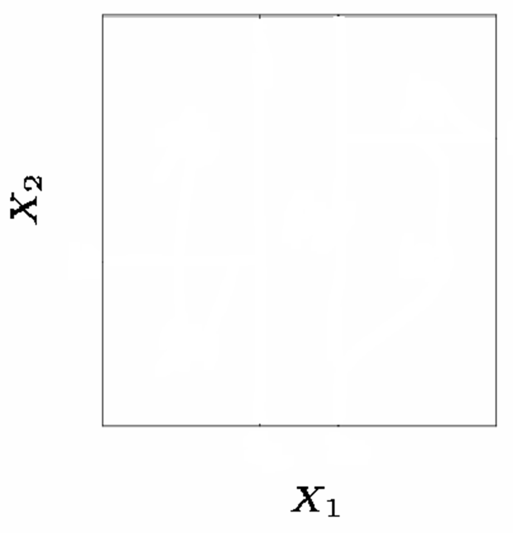
]

.pull-right[
* Basitlik amacıyla elimizde iki değişken olsun $X_1$ ve $X_2$
* Bu $x$ değişkenlerini yinelemeli bir şekilde alt bölgelere ayırabiliriz.
* Bölge sayısı 5 olsun. 
* Bölgelerin sınırlarını belirleyen kesme noktaları optimizasyon probleminin çözümü ile bulunabilir. 
]

---
# Bölgelerin oluşturulması 

.pull-left[
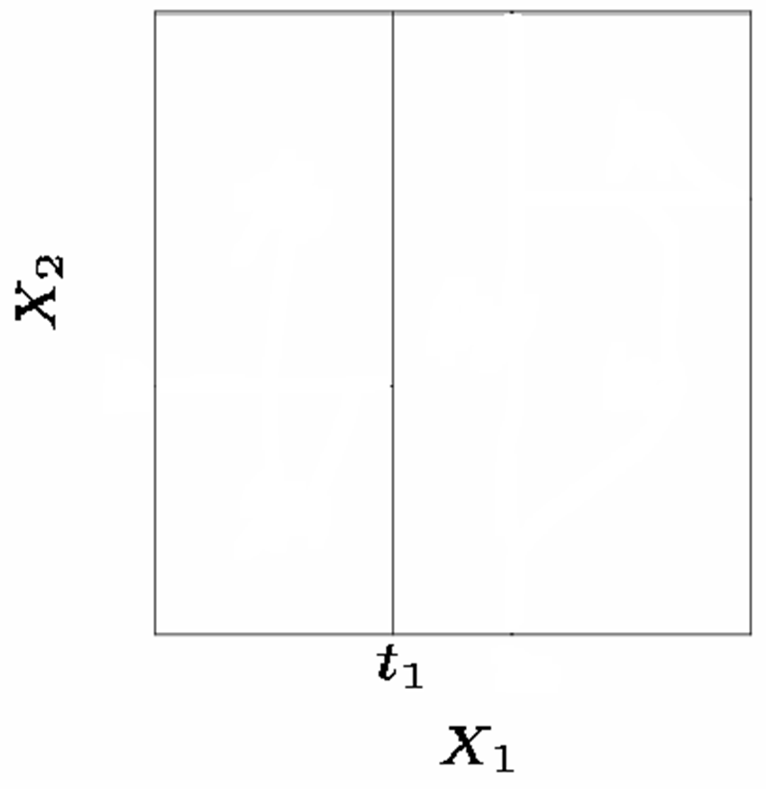
]

.pull-right[
1. Önce $X_1 = t_1$ kesme noktasında verileri iki bölgeye ayırırız.  
]

---
# Bölgelerin oluşturulması 

.pull-left[
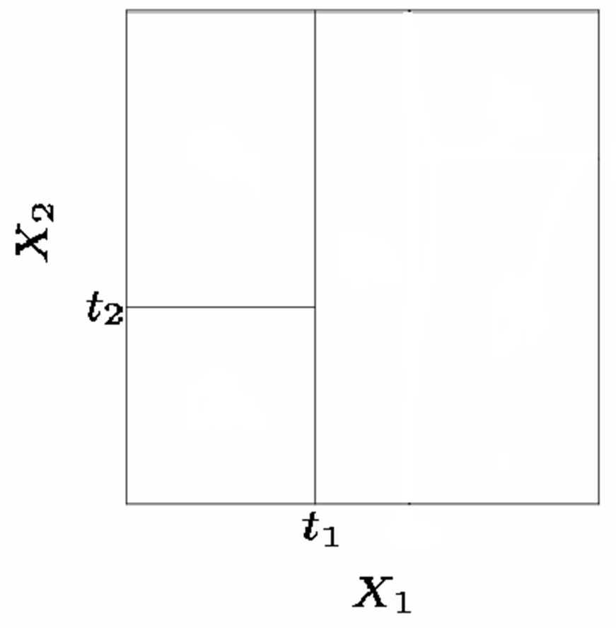
]

.pull-right[
1. Önce $X_1 = t_1$ noktasında verileri ayırırız.
1. Daha sonra,  $X_1<t_1$ ise $X_2=t_2$ noktasından yine ikiye ayırım yaparız. 
]

---
# Bölgelerin oluşturulması 

.pull-left[
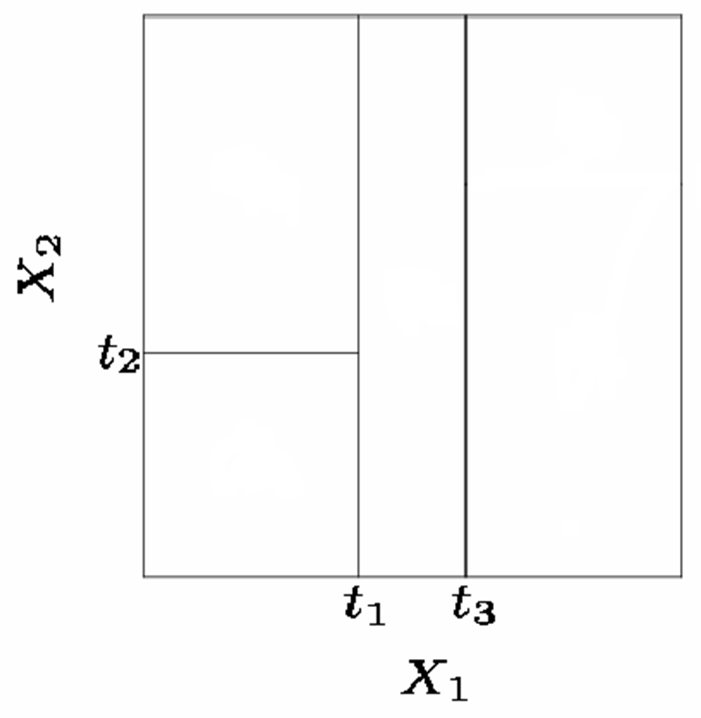
]

.pull-right[
1. Önce $X_1 = t_1$ noktasında verileri ayırırız.
1. Daha sonra,  $X_1<t_1$ ise $X_2=t_2$ noktasından yine ikiye ayırım yaparız.
1. Diğer bölge için: $X_1>t_1$ ise $X_1=t_3$ noktasından ayırım yaparız. 
]

---
# Bölgelerin oluşturulması 

.pull-left[
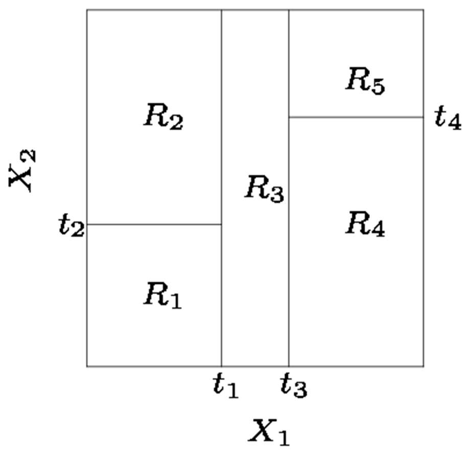
]

.pull-right[
1. Önce $X_1 = t_1$ noktasında verileri ayırırız.
1. Daha sonra,  $X_1<t_1$ ise $X_2=t_2$ noktasından ayırım yaparız.
1. $X_1>t_1$ ise $X_1=t_3$ noktasından ayırım yaparız.
1. $X_1>t_3$ ise $X_2=t_4$ noktasından ayırım yaparız. 
]

---
# Bölgelerin oluşturulması 

.pull-left[

]

.pull-right[

* İç düğüm (node) sayısı: 4
* Son düğüm ya da yapraklar (terminal node or leaves) sayısı: 5 (bölge ortalamaları)
* Düğüm bağlantıları = ağaç dalları (branches)
]

---
# Ağacın yorumlanması 

.pull-left[

]

.pull-right[
* Herhangi bir düğüm noktasında $X_j \leq t_k$ soldak dalı, $X_j>t_k$ ise sağdaki dalı işaret etmektedir. 
* Örneğin, $X_1\leq t_1$ ve $X_2\leq t_2$ ise $R_1$ tahmini yapılır. 
]

---
# Örnek: Data = Hitters 

.pull-left[

]

.pull-right[
* Beyzbol oyuncularının maaşlarını (Salary) kestirmek amacıyla iki değişkenden (Years, Hits) oluşan bir regresyon ağacı 
* Salary değişkeninin doğal logaritması alındı. 
* Modele göre tecrübesi (Years) 4.5 yıldan az olan bir sporcu için log(Salary) tahmini 5.11'dir. * Para birimi cinsinden: $1000\times e^{5.11}=165174\$$
* Ligde 4.5 yıldan fazladır oynayan ve 117.5'den daha az vuruş yapan bir sporcu için maaş tahmini: $1000\times e^{6}=402834\$$
]

---
# Önceki ağacın farklı bir gösterimi  

.pull-left[
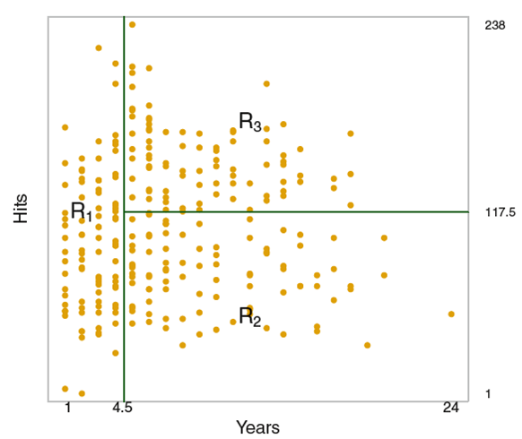
]

.pull-right[
* Bu grafikte verilerin üç bölgeye ayrılması gösterilmektedir. 
* Alt bölgeler aşağıdaki gibi yazılabilir: 
1. $R_1 = \{X| Years<4.5\}$
1. $R_2 = \{X| Years\geq 4.5,~Hits<117.5 \}$
1. $R_3 = \{X| Years\geq 4.5,~Hits\geq 117.5 \}$
]

---
# Önceki ağacın farklı bir gösterimi  

.pull-left[

]

.pull-right[
* Bu grafikte verilerin üç bölgeye ayrılması gösterilmektedir. 
* Alt bölgeler aşağıdaki gibi yazılabilir: 
1. $R_1 = \{X| Years<4.5\}$
1. $R_2 = \{X| Years\geq 4.5,~Hits<117.5 \}$
1. $R_3 = \{X| Years\geq 4.5,~Hits\geq 117.5 \}$

* Yeni bir gözlem çifti için ait olduğu bölgenin maaş ortalaması (kırmızı) ile kestirim yapılır. ]

---
# Ağacın Budanması 

* Bir regresyon ağacı eğitim setinde iyi bir uyum sergilese de test verilerinde başarılı kestirimler vermez. 
* Bunun nedeni aşırı uyumdur (overfitting). Ortaya çıkan ağaç çok büyük olma eğilimndedir. 
* Çözüm: gereksiz dalları (branches) budayarak daha küçük ve daha başarılı kestirim performansına sahip ağaç oluşturmak
* Daha küçük ağaç daha az terminal düğüm noktalarına (yapraklara) sahiptir. 
* Küçük ağaçlar az miktarda sapma içerse de varyansları çok daha düşüktür. 
* Ağacın budanması: 
  1. Büyük bir ağaç ile başla 
  1. Daha sonra çapraz geçerleme ile en başarılı test performansına sahip alt ağacı çe. 
* Ancak olanaklı alt ağaçların sayısı çok fazla olduğundan bu yol takip edilmez.

---
# Ağacın Budanması 

* Olanaklı tüm alt ağaçlar için çapraz geçerleme yapmak yerine $\alpha$ gibi bir ayarlama parametresi ile indekslenmiş ağaçları düşünebiliriz: 
$$\sum_{m=1}^{|T|} \sum_{i: x_{i} \in R_{m}}\left(y_{i}-\hat{y}_{R_{m}}\right)^{2}+\alpha|T|$$
$\alpha$=ayarlama parametresi, $|T|$ terminal düğüm sayısı 

* $\alpha$ parametresi modelin (ağacın) karmaşıklığı ile model uyumu arasındaki ödünümü yakalar. * $\alpha=0$ ise $T$ alt ağacı başlangıçtaki karmaşık ağaca $T_0$ eşit olur. 
* $\alpha$ büyüdükçe ağaç küçülür (son düğüm noktalarının sayısı azalır). 
* $\alpha$ ayarlama parametresi çapraz geçerleme ile seçilebilir. 

---
# Örnek: Data = Hitters 

.pull-left[

]

.pull-right[
* Budanmamış ağaç
* Veri seti rassal olarak ikiye ayrılıyor: eğitim verileri (132 gözlem) ve geçerleme verileri (131 gözlem)
* Farklı $\alpha$ değerleri için 6-katlı çapraz geçerleme ile test hatası tahmin ediliyor
]

---
background-color: #FFFFFF
# Örnek: Data = Hitters 

.pull-left[

]

.pull-right[
* Farklı ağaç büyüklükleri için ($\alpha$) ortalama hata karesi (MSE)
* En düşük çapraz geçerleme MSE değerini veren ağaç büyüklüğü 3 olarak bulunmuştur. (önceki örneğe bakınız) 
* Ağaç büyüdükçe eğitim (training) hatası azalmaya devam ediyor. 
]

---
background-color: #FFFFFF
# Sınıflandırma Ağaçları

* Sınıflandırma ağaçları algoritmik açıdan regresyon ağaçlarına çok benzer. 
* Ancak bu durumda çıktı değişkeni sürekli değil kategoriktir.
* Eğitim setindeki tahminler değişkenlerin bulunduğu bölgede en fazla gözlemlenen gruba göre yapılır.

.pull-left[
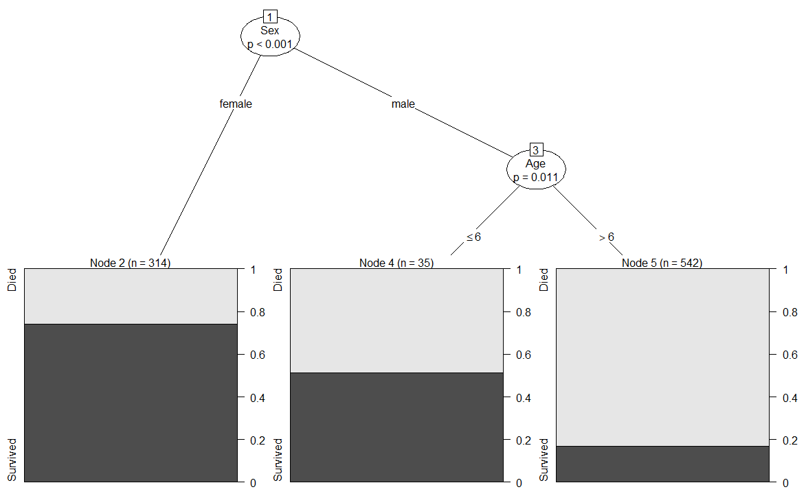
]
.pull-right[
* Örnek sınıflandırma ağacı: Titanic gemi kazasında hayatta kalma 
* Bu karar ağacında sadece cinsiyet (sex) ve yaş (age) kullanılmıştır. (`Survived ~ Age + Sex`)
]

---
background-color: #FFFFFF

# Titanic verileri 

.center[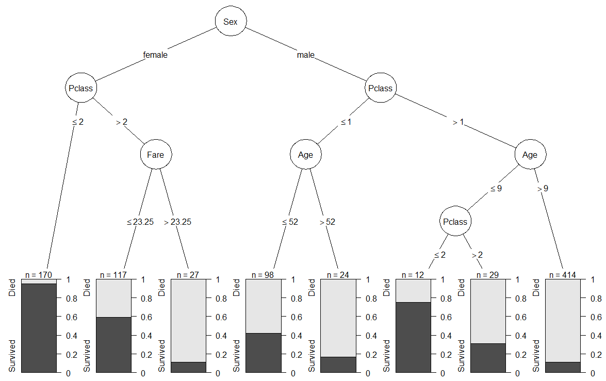]

---
# Sınıflandırma ağaçlarında performans

* Sınıflandırma ağaçlarında bölgelerin ikili ayrımında kalıntı kareleri toplamı (SSR) ölçüt olarak kullanılamaz. 
* SSR yerine *sınıflandırma hata oranı*nı ( $E$ ) kullanabiliriz:
$$E = 1-\max_k(\hat{p}_{mk})$$
$\hat{p}_{mk}$: eğitim setinde $m$ bölgesinde $k$ grubundaki gözlemlerin oranı. 
* Zayıf yanı: $E$ ağaç oluşturmada yeterli duyarlılığa sahip değil. Pratikte iki alternatif tercih edilir.
  1. Gini indeksi ( $G$ )
  1. Entropi ( $D$ )

---
# Sınıflandırma performansı 

.pull-left[
Gini indeksi: 
$$G = \sum_{k=1}^{K}  \hat{p}_{mk}(1-\hat{p}_{mk})$$
]
.pull-right[
* Gini indeksi $K$ sınıftaki toplam değişkenliğin bir ölçüsüdür. 
* Tüm $\hat{p}_{mk}$ değerleri 0'a ya da 1'e yakın olduğunda $G$ küçük bir değer alır. 
* Bu nedenle Gini indeksi bir düğümün saflığının (nude purity) da bir ölçüsüdür. 
]

.pull-left[
Entropi: 
$$D=-\sum_{k=1}^{K} \hat{p}_{mk} \log(\hat{p}_{mk})$$
]

.pull-right[
]
* Entropi ölçütü, Gini indeksinde olduğu gibi, $\hat{p}_{mk}$ 0'a ya da 1'e yakınsa küçük değerler alır.

---
background-color: #FFFFFF

.pull-left[
$p(1-p),~~0<p<1$
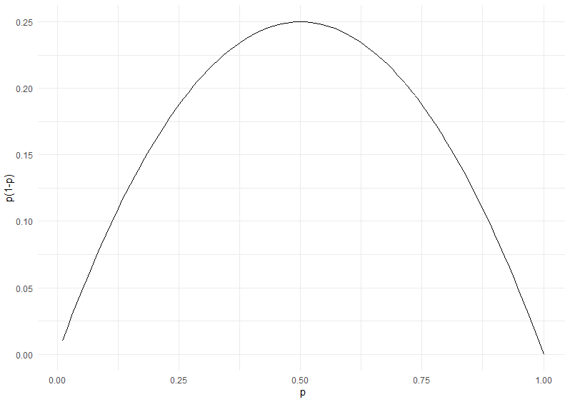
]

.pull-right[
$-p\log(1-p),~~0<p<1$
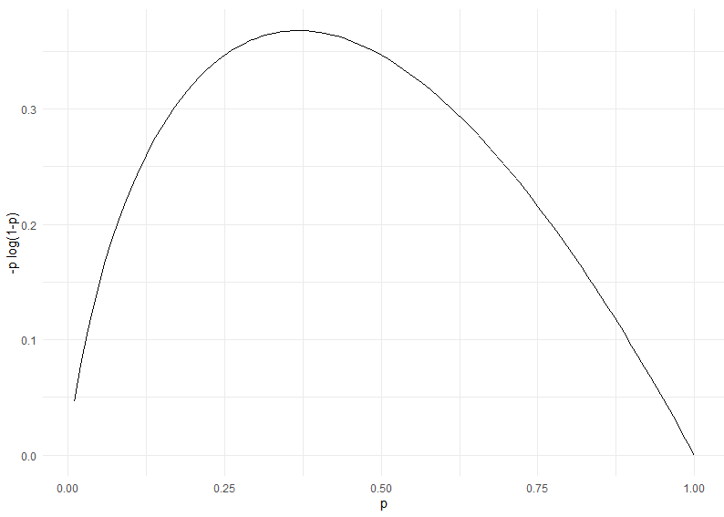
]

---
background-color: #FFFFFF
# Örnek: Data set = Heart Disease
## Budanmamış Ağaç
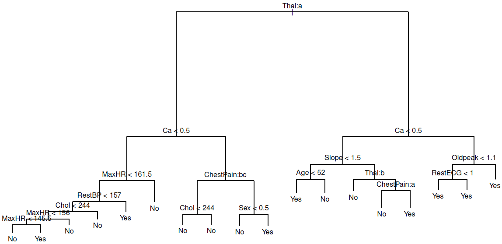

---
background-color: #FFFFFF
# Çapraz geçerleme ile budanmış ağaç
.center[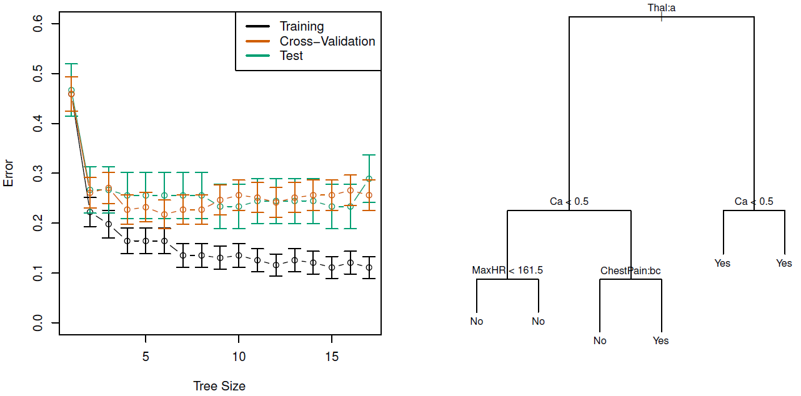]

Thal=thallium test, kategorik değişken (seviyeler = normal, reversible, fixed): Thal:a (normal, sol düğüm), diğer Thal grupları (iki grup) sağ düğüm (bkz. ISLR, p.312)

---
title: blank 
# Ağaçların zayıf ve güçlü yanları
.pull-left[
## Güçlü yanları 
* Yorumlaması ve açıklaması kolaydır. 
* Görsel olarak temsil edilebilir ve uzman olmayanlar bile kolayca anlayabilir. 
* Bazılarına göre ağaçlar insanların karar alma süreçlerini daha iyi temsil edebilir. 
* Nitel (kategorik) değişkenler kukla değişken yaratmaya gerek kalmadan modele eklenebilir. 
]
--
.pull-right[
## Zayıf yanları 
* Diğer regresyon ve sınıflandırma ağaçlarına göre kestirim performansı daha kötüdür. 
* Verilerde ufak bir değişiklik ağaçlarda önemli değişikliklere yol açabilir.
* Örneğin eğitim verilerini rassal olarak ikiye bölüp ayrı ayrı ağaç tahmini yapsak çok farklı sonuçlar elde edebilirz (**yüksek varyans**).  
]
--

**Alternatif**: 
Tek karar ağacı tahmin etmek yerine çok sayıda ağaç oluşturup bunların bileşkesini almak (toplulaştırmak): **Rassal Ormanlar (Random Forests), Bagging, Boosting **

---
# Bagging (**B**ootstrap **Agg**regat**ing**)

* Ağaçların yüksek varyansa sahip olduğunu belirtmiştik. 
* Düşük varyanslı ağaç oluşturmanın bir yolu çok sayıda ağaç oluşturup bunları toplulaştırmaktır. 
* İstatistik derslerimizden hatırlarsak, eğer elimizde birbirinden bağımsız ve türdeş çekilmiş (aynı dağılımdan gelen) ve varyansı $\sigma^2$ olan bir örneklem, $(Z_1, Z_2,\ldots,Z_n)$, varsa, örneklem ortalaması $\bar{Z}$'ın varyansı $\sigma^2/n$ olur. 
* Başka bir deyişle, ortalamayı almak varyansı düşürür. 
* Buna benzer bir yaklaşımı makine öğrenmesi algoritmalarına da uygulayabiliriz. 
* Birbirinden farklı $B$ tane eğitim verisi oluştur ve her biri için kestirim modelini tahmin et: $\hat{f}^1(x), \hat{f}^2(x),\ldots,\hat{f}^B(x)$. 
* Bunların ortalaması 
$$\hat{f}_{avg} =\frac{1}{B} \sum_{b=1}^{B} \hat{f}^b(x)$$
* Pratik zorluk: elimizde sadece bir tane eğitim seti var.

---
# Bagging (**B**ootstrap **Agg**regat**ing**)
.pull-left[
* Farklı eğitim setlerini elimizdeki gözlemlerden hareketle **bootstrap** yardımıyla oluşturabiliriz. 
* Bootstrap Aggregating: Rassal olarak eğitim setinden bir örneklem çekilir ve model eğitilir. $B$ gibi bir sayı için bu tekrarlanır ve ortalama alınır: 
$$\hat{f}_{bag} =\frac{1}{B} \sum_{b=1}^{B} \hat{f}^{*b}(x)$$
* Bu yöntem regresyon ve sınıflandırma ağaçlarına uygulanabilir. Ağaçlara budama yapılmaz. 
]
.pull-right[
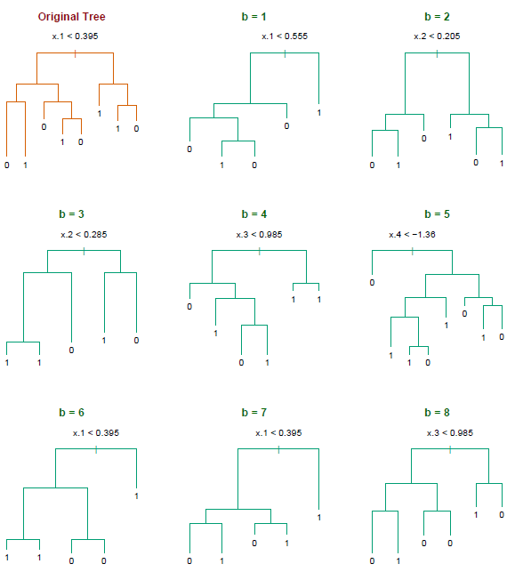 
]

---
# Out-of-bag Hata Tahmini 

* Bagging yönteminde test hatasını nasıl hesaplayabiliriz? 
* Çapraz geçerleme uygulamadan test hatasını tahmin etmek mümkündür. 
* Bootstrap ile ağaçlar oluşturulduğunda verilerin yaklaşık olark 2/3'ü kullanılmış olur. Geriye kalan 1/3 geçerleme seti olarak kullanılabilir. Her bir bootstrap adımında, gözlemlerin modelin eğitiminde kullanılmayan 1/3'lük kısmına **out-of-bag (OOB)** gözlemler denir.
* Bu OOB gözlemlerini test hatasını tahmin etmekte kullanabiliriz. Buna OOB hatası denir. (regresyon için OOB MSE, sınıflandırma için OOB sınıflama hatası)
* Bu yaklaşım büyük $B$ değerleri için Biri-hariç çapraz geçerleme (LOOCV) benzeri sonuç üretir. 
* Bootstrap örneklemleri için hesaplamalar yapılırken OOB hatası da kolayca hesaplanabilir. Ayrıca çapraz geçerleme yapmaya gerek kalmaz. 

---
# Değişken önem ölçüleri 
* Bagging bir ağaç ile kıyaslandığında daha iyi kestirimler sunar. 
* Ancak sonuçta ulaşılan model kolayca yorumlanamaz. Çünkü çok sayıda farklı ağacın bileşkesi olduğu için tek bir ağaçla temsil edilemez. 
* Pratikte bunun sonucu hangi değişkenlerin önemli olduğunun görülememesidir. 

.pull-left[
* Değişken önem ölçüleri (variable importance measures) bu amaçla hesaplanabilir. 
* Regresyon ağaçlarında her adımda bir değşiken için SSR'de meydana gelen azalma kaydedilip tüm $B$ tane ağaç için ortalaması alınabilir. Büyük değerler daha önemli değişkene işaret eder.  
* Sınıflandırma ağaçları için Gini indeksindeki azalmalar kullanılabilir. 
]
.pull-right[
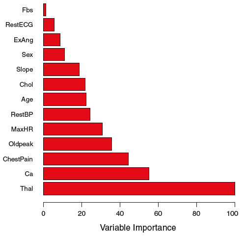 
]

---
# Rassal Ormanlar 

* Bagging yönteminde her adımda ayrı bir ağaç tahmin ediliyordu. Gözlemler farklılaşsa da aynı değişken seti kullanılıyordu. 
* Bu süreçte ağaçlar birbirine benzer olma eğilimindedir. Yani ağaçlar arasında korelasyon yüksektir. Bu da ortalamanın varyansını arttırır. 
* Rassal Ormanlar (Random Forests) benzer adımları takip eder. Ancak, korelasyonu azaltmak ve varyansı düşürmek (*decorrelating*) için ağaçlar oluşturulurken dal ayrımlarında tüm $p$ değişkenleri değil de bunların $m$ gibi bir rassal alt kümesi göz önüne alınır. 
* Her hangi bir ağaçta yeni bir ayırım yapılırken gözönüne alınacak $m\approx \sqrt{p}$ tane $X$ değişkeni rassal olarak belirlenir. Örneğin bir ağaçta $X_1,X_3,X_5$ kullanılırken başka bir ağaçta $X_2,X_4$ kullanılabilir ($p=5$ için). 
* Bagging Rassal Ormanlar'ın özel bir halidir. $m=p$ alındığında bagging elde edilir.

---
# Boosting 

* Boosting (Takviye) yöntemi Bagging ve Rassal Ormanlara benzer şekilde çalışır. 
* Ancak ağaçlar bir önceki ağacın bilgisi göz önüne alınarak ardışık bir şekilde oluşturulur. 
* Boosting yönteminde bootstrap kullanılmaz. 
* İzleyen sayfada algoritma özetlenmiştir. 
* Boosting algoritmasında 3 ayarlama parametresi vardır. 
* $B$ ağaç sayısı. Bagging ve Rassal Ormanlardan farklı olarak büyük $B$ değerleri aşırı uyuma yol açabilir. Uygun değer çapraz geçerleme ile seçilebilir. 
* Küçülme (shrinkage) parametresi $\lambda$ boosting algoritmasının öğrenme hızını kontrol eder. Pratikte 0.01 veya 0.001 gibi değerler kullanılabilir. 
* Ağaçlardaki düğüm sayısı $d$. Pratikte $d=1$ olarak seçilebilir. 

---
class: my-small-font
# Regresyon Ağaçları için Boosting Algoritması 

1. Başlangıç değerlerini $\hat{f}(x)=0$ ve $r_i=y_i$ olarak belirle. 
1. Her $b=1,2,\ldots,B$ için aşağıdaki adımları tekrarla: 
  
  a. Eğitim verilerini kullanarak $d$ ayrıma sahip ( $d+1$ son düğüm sayısı) $\hat{f}^b$ ağacını tahmin et. 
  
  b. Ağacı, oluşturulan yeni ağacın küçültülmüş versiyonunu ( $\lambda$ küçültme parametresi) ekleyerek güncelle: 
  $$\hat{f}(x) \leftarrow \hat{f}(x)+\lambda \hat{f}^{b}(x)$$
  
  c. Kalıntıları güncelle: 
  $$r_{i} \leftarrow r_{i}-\lambda \hat{f}^{b}\left(x_{i}\right)$$
1. Takviyeli (boosted) model: 
$$\hat{f}(x)=\sum_{b=1}^{B} \lambda \hat{f}^{b}(x)$$

