class: my-large-font, inverse, middle, center, clear 

Plan: 

Gözetimli ve gözetimsiz öğrenme

Temel Bileşenler Analizi 

K-Ortalamalar Algoritması ile Kümeleme 

Hiyerarşik Kümeleme

---
# Gözetimsiz Öğrenme

.pull-left[
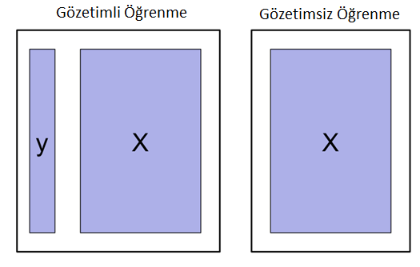
* Şimdiye kadar sadece gözetimli öğrenme yöntemlerini inceledik. Gözetimli öğrenmede çıktı değişkeni $Y$ ve öznitelik matrisi $X$ birlikte gözlemleniyordu. 
]
--
.pull-right[
* Gözetimsiz öğrenmede ise $Y$ çıktısı ya da etiketi yoktur. Sadece $X$ değişkenleri gözlemlenir.

* Elimizde bir çıktı değişkeni olmadığı için amacımız bu değişkenin kestirimlerini oluşturmak değildir. 

* Bunun yerine amaç verilerdeki gizli gruplanmaları ve ilişkileri ortaya çıkarmak ve faydalı bir şekilde görselleştirmektir. 
]

---
# Gözetimsiz Öğrenme 

* Gözetimsiz öğrenme yöntemleri keşifsel veri analizinin (exploratory data analysis - EDA) bir parçası olarak da kullanılabilir. Yaygın olarak kullanılan iki gözetimsiz öğrenme yöntemi: 
1. **Temel Bileşenler Analizi (Principal Components Analysis - PCA)**: çok boyutlu verilerin görselleştirilmesinde faydalı. Boyut küçültme (dimension reduction) ve gözetimli öğrenme yöntemlerinin öncesinde verileri işlemden geçirme amacıyla kullanılabilir (örneğin PCA regresyonu). 
1. **Gruplandırma (Clustering)**: özellikle büyük veri yığınlarında gizlenmiş homojen grupların ortaya çıkarılması. 
  * K-Ortalamalar (K-means) gruplandırma
  * Hiyerarşik gruplandırma (hierarchical clustering)
* Örnek: Bir alışveriş sitesinde müşterilerin kişisel özelliklerine ve alışveriş alışkanlıklarına göre gruplandırılması. 
* Ürünlerin kullanıcı yorumları ve değerlendirmelerine göre gruplandırılması 
* Hastaların genetik özelliklerine göre gruplandırılması.

---
class: my-large-font, inverse, middle, center, clear

Temel Bileşenler Analizi 

---
# Temel Bileşenler Analizi 

* Temel bileşenler  (principal components) nedir? 
--

* Elimizde $(X_1, X_2,\ldots,X_p)$ ile gösterdiğimiz $p$ tane öznitelik olsun. Keşifsel veri analizi amacıyla bu değişkenlerin ikili serpilme grafiklerini (scatter plot) çizmek istediğimizi düşünelim. 

* Elimizde kaç tane grafik olur? 
--

* Cevap = $p(p-1)/2$. Örneğin, $p=10$ ise 45, $p=20$ ise  190!

* Daha pratik bir yol: verilerdeki toplam değişkenliğin önemli bir kısmını içeren iki boyutlu bir temsilini bulabilir miyiz? 

* PCA: verilerdeki bilginin önemli bir kısmını içeren düşük boyutlu bir temsilini bulmak

---
class: clear

Türkiye il verileri 2015 (ilk 10 öznitelik)
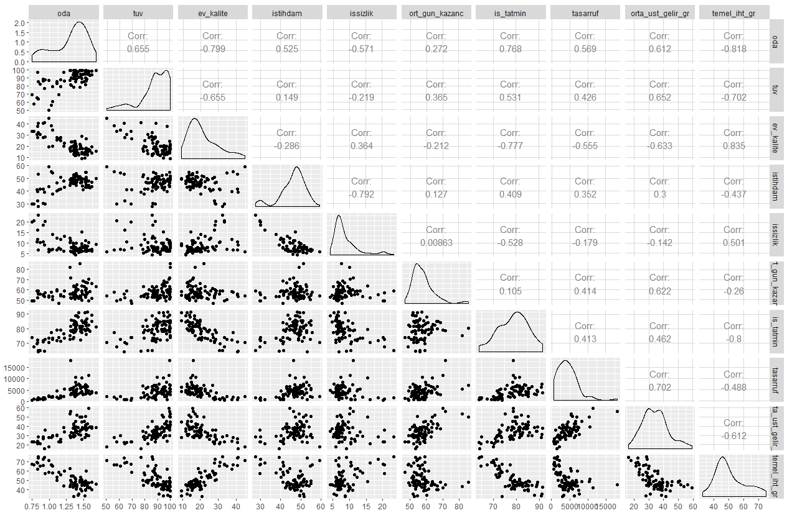

---
# Temel Bileşenlerin Bulunması 

* **Birinci temel bileşen**, $Z_1$, değişkenlerin en yüksek varyansa sahip normalize edilmiş doğrusal bir bileşkesidir: 
$$Z_{1}=\phi_{11} X_{1}+\phi_{21} X_{2}+\ldots+\phi_{p 1} X_{p}$$
Normalize edilmesinden kasıt $\phi$ ağırlıklarının (*factor loadings*) kareler toplamının 1 olmasıdır: 
$$\sum_{j=1}^{p} \phi_{j1}^2 = 1,~~~~\underbrace{\phi_{11},\phi_{21},\ldots,\phi_{p1}}_{\mbox{Birinci bileşenin ağırlıkları}}$$

* Birinci temel bileşenin ağırlık vektörü: 
$$\phi_1 = (\phi_{11},\phi_{21},\ldots,\phi_{p1})^T$$

---
# Temel Bileşenlerin Bulunması 

Verilerin ortalamadan farkları alındıktan sonra, birinci temel bileşen aşağıdaki optimizasyon probleminin çözümüyle bulunabilir: 
$$\max_{\phi_{11}, \ldots, \phi_{p 1}}\left\{\frac{1}{n} \sum_{i=1}^{n}\left(\sum_{j=1}^{p} \phi_{j 1} x_{i j}\right)^{2}\right\} \text { subject to } \sum_{j=1}^{p} \phi_{j 1}^{2}=1$$

.pull-left[
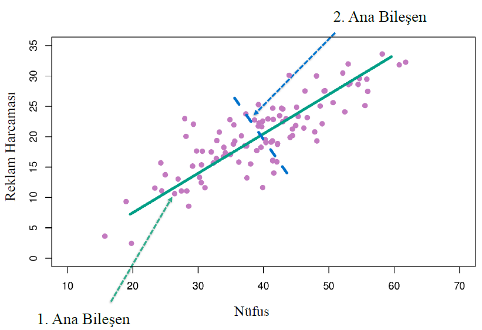
]
.pull-right[
Birinci temel bileşen: verilerin en fazla değişkenlik gösterdiği yön. Bu örnekte $\phi_{11}=0.839$, $\phi_{21} = 0.544$ 

$$z_{i1} = 0.839~ \mbox{Nüfus}_i + 0.544~ \mbox{Reklam H.}_i$$ 
]

---
# Temel Bileşenlerin Bulunması 

.pull-left[

]
.pull-right[
İkinci temel bileşen: birinci temel bileşenle ilişkisiz en yüksek değişkenliğe sahip doğrusal bileşkedir. Örnekte $\phi_{12}=0.544$, $\phi_{22} = -0.839$ 

$$z_{i2} = 0.544~ \mbox{Nüfus}_i - 0.839~ \mbox{Reklam H.}_i$$

* İkinci temel bileşen birinci temel bileşene ortogonaldir (aralarındaki korelasyon sıfır). Grafikten de görüleceği gibi aralarındaki açı 90 derecedir. 
]

Not: Nüfus ve Reklam Harcamalarının ortalamadan farkları alınmıştır.

---
# Açıklanan varyans oranı 

* Temel bileşenler varyansın ne kadarını açıklar? 

* Merkezden farkları alınmış bir veri setinde toplam varyans:
$$\sum_{j=1}^{p} \mbox{Var}(X_j)=\sum_{j=1}^{p} \frac{1}{n} \sum_{i=1}^{n} x_{ij}^2$$

$m$nci temel bileşen tarafından açıklanan varyans 
$$\frac{1}{n} \sum_{i=1}^{n} z_{i m}^{2}=\frac{1}{n} \sum_{i=1}^{n}\left(\sum_{j=1}^{p} \phi_{j m} x_{i j}\right)^{2}$$
Açıklanan Varyans Oranı (Proportion of Variance Explained - PVE)
$$PVE_m=\frac{\sum_{i=1}^{n}\left(\sum_{j=1}^{p} \phi_{j m} x_{i j}\right)^{2}}{\sum_{j=1}^{p} \sum_{i=1}^{n} x_{i j}^{2}}$$

---
# Scree (PVE plot) 
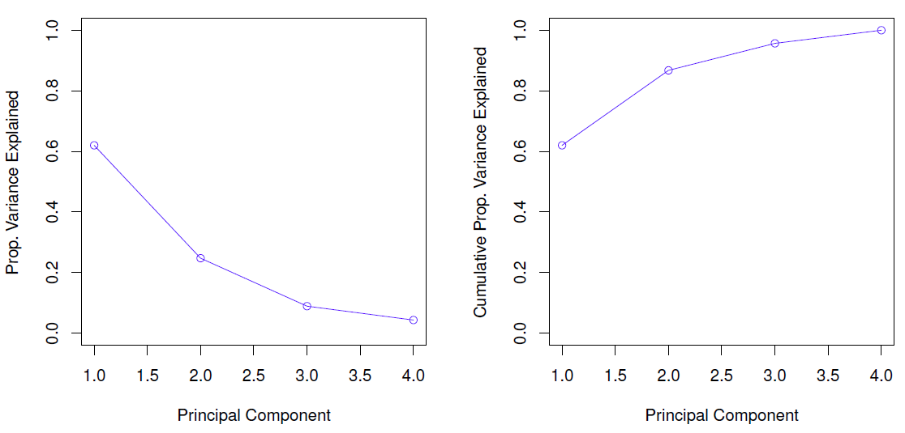
Açıklanan varyans oranlarının toplamı 1'dir. Bu oranların temel bileşenlere göre grafiğine PVE ya da scree grafiği adı verilir. Bu grafikte ilk iki bileşen değişkenliğin %87'sini açıklamaktadır. 

---
# Gruplandırma (Kümeleme) 

* Gruplandırmada (clustering) amaç verilerde kendi içinde homojen gözlemleri barındıran alt grupları ortaya çıkarmaktır. 

* İyi bir gruplandırmada gözlemler grup içinde birbirine benzer. Gruplar arasında ise çok farklıdır. 

* Örnek: Pazar segmentasyonu. Gelir, hane özellikleri, meslek, cinsiyet, vb. değişkenlerden hareketle birbirine benzeyen müşteri gruplarını ortaya çıkarmak.

* Yaygın kullanılan yöntemler 
 * K-Ortalama (K-means) gruplandırma 
 * Hiyerarşik gruplandırma
 
---
class: my-large-font, inverse, middle, center, clear

K-Ortalamalar 

---
# K-Ortalamalar ile Gruplandırma 

* Amaç: bir veri setini birbiriyle örtüşmeyen $K$ gruba ayırmak. 

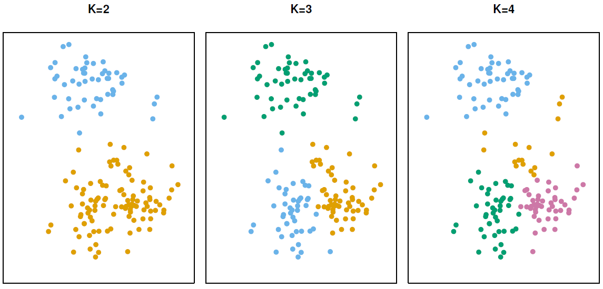

---
# K-Ortalama Gruplandırma 

Her bir gruptaki gözlem indekslerini içeren kümeleri $C_1, C_2,\ldots,C_K$
ile gösterelim. 

Her bir gözlem bir grupta yer alır, yani $C_{1} \cup C_{2} \cup \ldots \cup C_{K}=\{1, \ldots, n\}$

Ayrıca gruplar örtüşmez: $C_{k} \cap C_{k^{\prime}}=\emptyset$, her $k\neq k^{\prime}$ için. 

K-ortalamalar gruplandırması: Grup-içi değişkenliği en küçük yapacak şekilde grupları belirler. Optimizasyon problemi: 
$$\min_{C_{1}, \ldots, C_{K}}\left\{\sum_{k=1}^{K} \frac{1}{\left|C_{k}\right|} \sum_{i, i^{\prime} \in C_{k}} \sum_{j=1}^{p}\left(x_{i j}-x_{i^{\prime} j}\right)^{2}\right\}$$
$\left|C_{k}\right|$ = $k$ grubundaki gözlem sayısı. 

$k$ grubundaki tüm gözlem çiftleri arasındaki uzaklığı en küçük yap.

---
# K-Ortalamalar Algoritması

.pull-left[
Veriler:

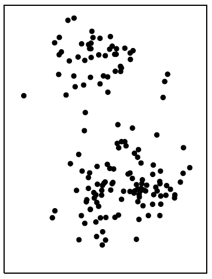 
]
.pull-right[
Algoritma adımları:  

1. Gözlemleri tesadüfi bir şekilde $K$ gruptan birine ata. 

2. İterasyonlar: Yakınsama sağlanıncaya kadar aşağıdaki adımları tekrarla:
 
 2a. Her $K$ grubu için grup merkezini (aritmetik ortalamaları) hesapla. 
 
 2b. Gözlemleri en yakındaki geometrik merkezin bulunduğu gruba ata. 
]

---
# K-Ortalamalar Algoritması

.pull-left[
Adım 1: 

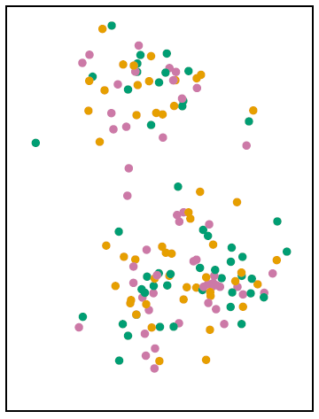 
]
.pull-right[
* Gözlemleri rassal olarak $K$ gruba ata. 
]

---
# K-Ortalamalar Algoritması

.pull-left[
İterasyon 1, Adım 2a: 

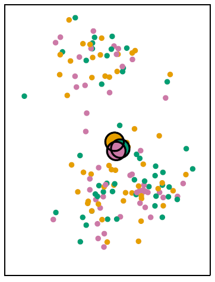 
]
.pull-right[
* Her bir grup için grup merkezlerini hesapla
(grafikte farklı renkte daireler grup merkezleridir)

* Başlangıçta grup ataması tesadüfi yapıldığı için merkezler birbirine çok yakındır. 
]

---
# K-Ortalamalar Algoritması

.pull-left[
İterasyon 1, Adım 2b: 

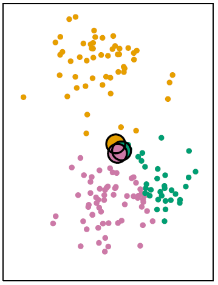 
]
.pull-right[ 
* Her bir gözlemi en yakın olduğu merkezin içinde year aldığı gruba ata. 
]

---
# K-Ortalamalar Algoritması

.pull-left[
İterasyon 2, Adım 2a: 

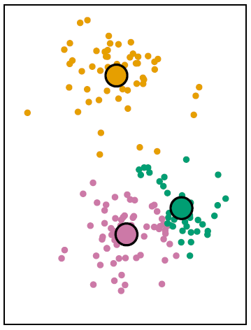 
]
.pull-right[ 
* Yeni grup merkezlerini hesapla. 

* Grup atamalarını tekrarla (Adım 2b)

* Başa dön, yinele. 
]

---
# K-Ortalamalar Algoritması

.pull-left[
Sonuç: 

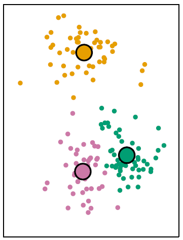 
]
.pull-right[ 
*  K-ortalamalar algoritması 10 adımda sonuca ulaştı. 

* Ancak bu algoritma sadece lokal optimumu bulmaktadır. 

* Ulaşılan sonuç global optimum olmayabilir. 

* Bu nedenle farklı başlangıç grup atamalarıyla adımlar tekrarlanarak karşılaştırılabilir. 
]

---
# K-Ortalamalar Algoritması

.pull-left[ 

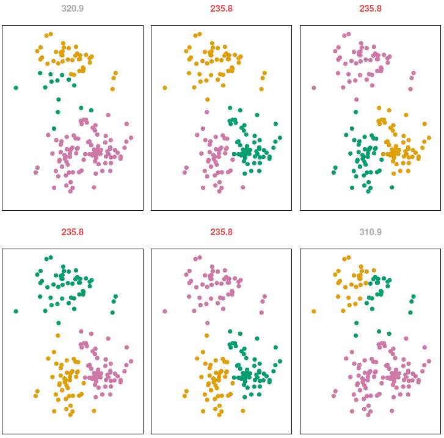 
(ISLR, Fig-10.7, p.390)
]
.pull-right[ 
* Grafikte farklı başlangıç koşulları ile çalıştırılan 6 K-Ortalamalar çözümü gösterilmektedir. 

* Birincisinde minimum değer 320.9, ikincisinde ise 235.8'dir. Bu çözümlerin lokal olduğu unutulmamalıdır.  

* Farklı başlangıç değerleriyle algoritma tekrar çalıştırılarak sonuçlar karşılaştrılmalıdır. 
Buradaki örnekte en iyi çözüm 235.8 amaç fonksiyonu değerini veren çözümdür. (Not: 2-3-4-5 çözümleri renkler farklı olsa da aynıdır.) 
]

---
class: my-large-font, inverse, middle, center, clear

Hiyerarşik Kümeleme

---
# Hiyerarşik Gruplandırma 

* K-ortalamalar algoritmasında grup sayısının bilinmesi gerekir. Verilerde kaç tane grup olduğunu belirlemek şarttır. 

* Ancak $K$'yi bilmiyorsak ya da belirlemek istemiyorsak Hiyerarşik Gruplandırmayı tercih edebiliriz. 

* Hiyerarşik gruplandırmada $K$'nin bilinmesi gerekmez. Ayrıca verilerin nasıl gruplandırıldığını gösteren bir ağaç grafiği (dendrogram) çizilebilir. 

* En yaygın hiyerarşik kümeleme yaklaşımı aşağıdan-yukarı ya da aglomeratif kümelemedir. 

* Bu yaklaşımda ağacın dallarından başlanarak gözlemler kümelenir.

---
# Aşağıdan-Yukarıya (Bottom-Up) Yaklaşım

.pull-left[ 
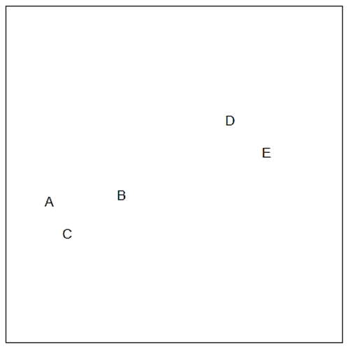 
]
.pull-right[ 
* Kümeleme hiyerarşisi aşağıdan yukarıya doğrudur (yapraklardan dallara doğru) 
]

---
# Aşağıdan-Yukarıya (Bottom-Up) Yaklaşım

.pull-left[ 
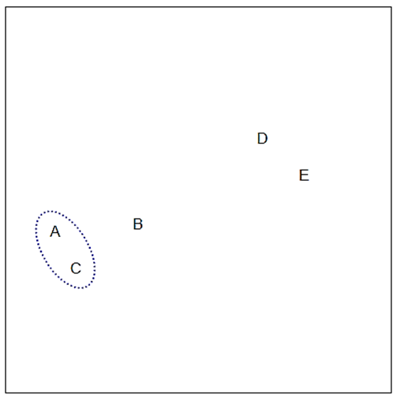 
]
.pull-right[ 
* Kümeleme hiyerarşisi aşağıdan yukarıya doğrudur (yapraklardan dallara doğru) 

* Birbirine yakın olan gözlemler birlikte kümelenir. 
]

---
# Aşağıdan-Yukarıya (Bottom-Up) Yaklaşım

.pull-left[ 
 
]
.pull-right[ 
* Kümeleme hiyerarşisi aşağıdan yukarıya doğrudur (yapraklardan dallara doğru) 

* Birbirine yakın olan gözlemler birlikte kümelenir. 
]

---
# Aşağıdan-Yukarıya (Bottom-Up) Yaklaşım

.pull-left[ 
 
]
.pull-right[ 
* Kümeleme hiyerarşisi aşağıdan yukarıya doğrudur (yapraklardan dallara doğru) 

* Birbirine yakın olan gözlemler birlikte kümelenir.

* Birbirine yakın gruplar da birlikte kümelenir. 
]

---
# Aşağıdan-Yukarıya (Bottom-Up) Yaklaşım

.pull-left[ 
 
]
.pull-right[ 
* Kümeleme hiyerarşisi aşağıdan yukarıya doğrudur (yapraklardan dallara doğru) 

* Birbirine yakın olan gözlemler birlikte kümelenir.

* Birbirine yakın gruplar da birlikte kümelenir.

* En sonunda tüm gözlemleri kapsayan kümeye ulaşılır. 
]

---
# Aşağıdan-Yukarıya (Bottom-Up) Yaklaşım

.pull-left[ 
 
]
.pull-right[ 
*  Dendrogram ters çevrilmiş bir ağaç gibi düşünülebilir. En altta yapraklar (gözlemler) yer almaktadır. 

* Birbirine yakın gözlemler ve gruplar birleştirilerek yukarıya doğru çıkılır. Yukarıya çıktıkça küme sayısı azalmaktadır. 

* Dendrogram'ın yüksekliği iki gözlemin birbirinden ne kadar farklı olduğunu gösterir.

* Grafiğin altlarında birleşen gözlemler göreceli olarak birbirine daha çok benzer. 
]

---
# Örnek

.pull-left[ 
 
]
.pull-right[ 
* Simülasyonla türetilmiş veriler, $n=45$, iki değişken. Grup sayısı, $K=3$, ve gözlemlerin hangi grupta yer aldığı biliniyor (ISLR, p.391). 

* Grup etiketlerinin bilinmediğini varsayalım ve hiyerarşik kümele uygulayarak dendrogramını çizelim.
]

---
# Dendrogram 

.left-column[
* Birbirine yakın gözlemler daha altlarda birleşir. 

* (Sol): gözlemleri temsil eden yapraklar (yeşil)

* (Orta): yatay kesikli çizgi ile kesilirse 2 grup

* (Sağ): 3 grup
]
.right-column[
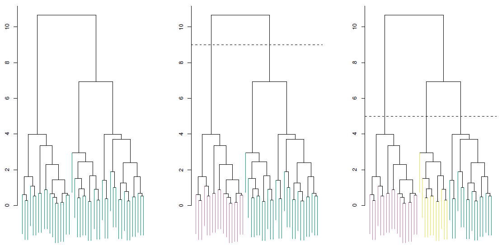
]

---
# Dendrogram Örnek 
.pull-left[ 

]
.pull-right[ 
* (5,7) gözlemleri ile (1,6) gözlemleri birbirine yakın olduğu için altta birleşti. 

* (2,9) birbirine yakın diyebilir miyiz? Sonuçta dendrogramda yakın görünüyorlar. 

* Cevap: Hayır. Serpilme çiziminden de görüldüğü gibi 9 numaralı gözlem oldukça uzakta. 

* Dendrogram üzerinde gözlemlerin benzerliği *yatay eksen* üzerinden değil *dikey eksen* üzerinden yapılır. 

* Grafikte (2,8,5,7) gözlemleri 9 ile aynı yükseklikte birleşiyor, $\approx 1.8$.
]

---
# Hiyerarşik Kümeleme Algoritması

.pull-left[ 
 
]
.pull-right[ 
* Önce bir benzemezlik ölçütü (dissimilarity measure) tanımla (örneğin Öklid uzaklığı)

* Her bir gözlemin kendi grubunu oluşturduğu $n$ küme ile başla. 
]

---
# Hiyerarşik Kümeleme Algoritması

.pull-left[ 
 
]
.pull-right[ 
* Önce bir benzemezlik ölçütü (dissimilarity measure) tanımla (örneğin Öklid uzaklığı)

* Her bir gözlemin kendi grubunu oluşturduğu $n$ küme ile başla.

* Benzemezlik ölçütünü hesapla ve en yakın gözlemleri birleştir, örneğin (5,7). Geriye kalan küme sayısı $n-1$
]

---
# Hiyerarşik Kümeleme Algoritması

.pull-left[ 
 
]
.pull-right[ 
* Önce bir benzemezlik ölçütü (dissimilarity measure) tanımla (örneğin Öklid uzaklığı)

* Her bir gözlemin kendi grubunu oluşturduğu $n$ küme ile başla.

* Benzemezlik ölçütünü hesapla ve en yakın gözlemleri birleştir, örneğin (5,7). Geriye kalan küme sayısı $n-1$

* Sonraki en çok benzeyen kümeleri birleştir (6,1), geriye kalan = $n-2$
]

---
# Hiyerarşik Kümeleme Algoritması

.pull-left[ 
 
]
.pull-right[ 
* Önce bir benzemezlik ölçütü (dissimilarity measure) tanımla (örneğin Öklid uzaklığı)

* Her bir gözlemin kendi grubunu oluşturduğu $n$ küme ile başla.

* Benzemezlik ölçütünü hesapla ve en yakın gözlemleri birleştir, örneğin (5,7). Geriye kalan küme sayısı $n-1$

* Sonraki en çok benzeyen kümeleri birleştir (6,1), geriye kalan = $n-2$

* Tüm gözlemler birleşip tek küme oluncaya kadar devam et. 
]

---
# Hiyerarşik Kümeleme Algoritması

.pull-left[ 
 
]
.pull-right[ 
* (5,7) grubunu (8) grubu ile birleştireceğimiz nereden biliyoruz? Benzemezlik (ya da benzerlik) ölçütünü nasıl tanımlarız? 

* İki grup arasındaki benzemezlik ölçütü *bağlantı* (linkage) kavramı ile tanımlanabilir. 

* Pratikte kullanılan bağlantı tipleri: tam (complete), ortalama (average), tek (single), ve ağırlık merkezi (centroid)

* Kümelemeler bağlantı tipine ve benzerlik ölçütüne göre değişebilir.
] 

---
# Bağlantı (Linkage) Türleri 

1. **Tam Bağlantı** (complete linkage): Kümeler arasındaki en yüksek benzemezliği dikkate alır. 
A ve B kümesindeki gözlemler arasındaki tüm ikili benzemezlik değerleri hesaplanır ve bunların en yüksek olanı kullanılır. 

1. **Tek Bağlantı** (single linkage): Kümeler arasındaki en düşük benzemezliği dikkate alır. A ve B kümesindeki gözlemler arasındaki tüm ikili benzemezlik değerleri hesaplanır ve bunların en düşük olanı kullanılır. 

1. **Ortalama Bağlantı** (average linkage): Kümeler arasındaki ortalama benzemezliği dikkate alır. A ve B kümesindeki gözlemler arasındaki tüm ikili benzemezlik değerleri hesaplanır ve bunların aritmetik ortalaması kullanılır.

1. **Ağırlık Merkezi** (centroid linkage): Kümelerin ağırlık merkezleri arasındaki benzemezliği dikkate alır. Yorumlaması zor kümelemelere yol açtığı için pratikte tercih edilmez.

---
# Bağlantı Türleri 
$\mbox{Ortalama Bağlantı}~~~~~~~~~~~~\mbox{Tam Bağlantı}~~~~~~~~~~~~~~~~~~\mbox{Tek Bağlantı}$
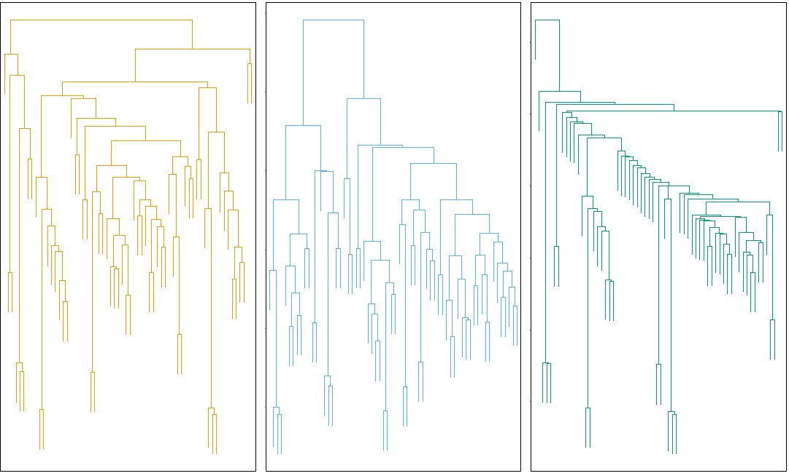 

(Kaynak: ISLR Fig-10.12, p.397)
---
# Benzemezlik Ölçütünün Seçimi

.pull-left[
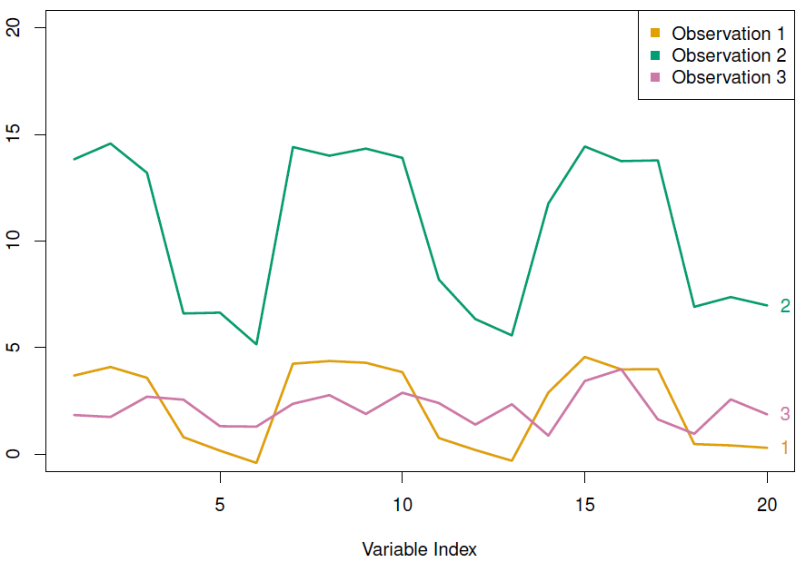
]

.pull-right[
* Benzerlik ölçüsü dendrogramın şeklini etkiler. 
* Gözlemler arasında benzerliğin ölçülmesinde Öklid uzaklık ölçüsü yaygın olarak kullanılır.
* Alternatif olarak Korelasyon bazlı ölçüler de tanımlanabilir.
] 

Yukarıdaki grafikte (Kaynak: ISLR Fig-10.13, p.398) (1) ve (3) numaralı gözlemler birbirine çok yakın (Öklid uzaklığı düşük, yani benzerliği yüksek). Ancak (1) ve (3) arasındaki korelasyon düşük, yani korelasyon-bazlı benzemezlik değeri yüksek. (1) ve (2) numaralı gözlemler ise Öklid uzaklığı yüksek (az benzer) ancak korelasyon-bazlı benzemezlik değeri düşük (çok benzer)  

---
# Özet ve Pratikte Karşılaşılan Sorunlar

* Kümeleme algoritmaları gözetimsiz öğrenmede en önemli araçlardır. 

* Bu algoritmaların uygulamasında çeşitli kararların verilmesi gerekir:
 * Hem K-ortalamalar hem de hiyerarşik kümelemede değişkenlerin ölçü birimleri sonuçları etkileyebilir. Bu nedenle algoritmayı uygulamadan önce standardize etmek (ortalaması 0 standart sapması 1 olacak şekilde) gerekebilir (örnek için bkz. ISLR, s. 398-9)
 
 * Hiyerarşik kümelemede: hangi benzerlik ölçütü (Öklid vs. korelasyon), hangi bağlantı türü (tek, tam, ortalama), hangi noktada dendrogramın kesileceği
 
 * K-Ortalamalar: grup sayısının kaç olduğu. 
 
* Pratikte farklı tercihlerin sonuçları nasıl etkilediğine bakılarak en uygun olanı tercih edilebilir. 

* Sonuçların yorumlanmasında bu kararların etkili olacağı unutulmamalıdır. Sonuçlar mutlak doğru olarak yorumlanmamalıdır. 

